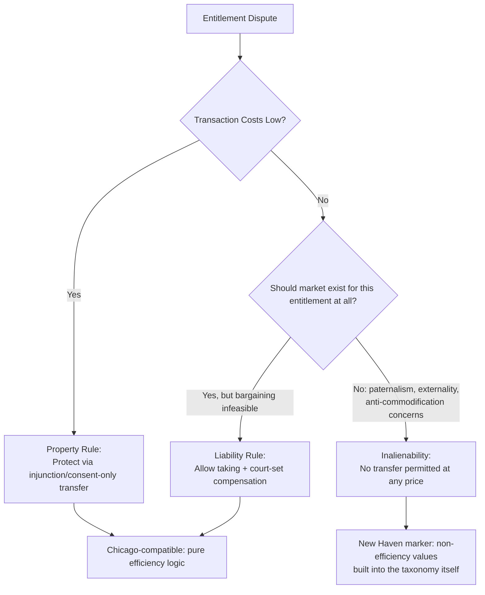

## The New Haven School and Its Critique of Chicago

### Overview

The New Haven School refers to the law and economics tradition centered at Yale Law School, associated principally with Guido Calabresi, that developed contemporaneously with the Chicago School but resisted its narrower efficiency-only normative framework. Where Chicago treats wealth maximization as the organizing criterion for legal analysis, the New Haven approach treats efficiency as one important value among several — including distributive justice, "other justice" considerations, and administrative/institutional cost — that legal rules must simultaneously accommodate. This entry covers the school's origins, core theoretical apparatus, and its systematic critique of Chicago-style efficiency analysis.

### Intellectual Origins and Key Figures

#### Foundational Contributors

**Key Points**

- **Guido Calabresi** — the central figure; his article "Some Thoughts on Risk Distribution and the Law of Torts" (1961) and book *The Costs of Accidents* (1970) predate and parallel Coase's and Posner's early work, developing an independent economic analysis of tort law rooted at Yale
- Calabresi's approach emerged from Yale Law School's broader "law and policy science" tradition (associated earlier with Myres McDougal and Harold Lasswell in international law, from which "New Haven School" as a label originates in legal scholarship more generally, later extended to describe Calabresi's law and economics work specifically)
- **Calabresi and A. Douglas Melamed** — co-authored "Property Rules, Liability Rules, and Inalienability: One View of the Cathedral" (1972), arguably the single most cited law and economics article, which is claimed by and integrated into both Chicago and New Haven traditions, illustrating the porousness of the schools' boundary at the level of specific analytical tools
- Contrast with Chicago's institutional concentration: New Haven law and economics was never as institutionally unified or self-consciously branded as a "school" in the way Chicago was around the University of Chicago Law School and the *Journal of Law and Economics*; it is better understood as a analytically distinct strand within the same discipline

#### Relationship to Chicago: Contemporaneous, Not Derivative

**Key Points**

- Calabresi's tort scholarship developed independently of and roughly contemporaneously with Coase's 1960 "Problem of Social Cost," not as a reactive critique developed after Chicago's rise — this is a common misconception worth correcting
- Both schools share the founding insight that legal rules allocate costs and can be analyzed for their incentive effects, but they diverge sharply on what follows normatively from that analysis
- [Inference] The characterization of Calabresi's work as a unified "school" in explicit opposition to Chicago is, to a significant degree, a retrospective framing constructed by later commentators and casebook editors to organize the field pedagogically, rather than a self-identification Calabresi and contemporaries emphasized at the time

### Core Theoretical Framework

#### The Costs of Accidents: A Multi-Value Framework for Tort Law

Calabresi's *The Costs of Accidents* proposed that accident law should be evaluated according to three simultaneous cost-minimization goals, not efficiency alone:

$$\text{Total Social Cost} = \text{Primary Costs} + \text{Secondary Costs} + \text{Tertiary Costs}$$

**Key Points**

- **Primary costs**: the costs of accidents themselves and the cost of precautions taken to avoid them — this is the category closest to the Chicago-style efficient-deterrence analysis (analogous to the Hand Formula's $B$ vs. $P \times L$ tradeoff)
- **Secondary costs**: the costs associated with *how the loss is distributed* once an accident occurs — who bears the loss, and how well that party can spread or absorb it (risk distribution/insurance function of tort law)
- **Tertiary costs**: the administrative costs of operating the liability system itself (litigation costs, insurance administration, adjudication costs)
- This three-part framework explicitly builds distributive and administrative considerations into the *primary* analytical structure, rather than treating them as secondary concerns to be addressed (if at all) after an efficiency-optimal rule is identified — a structural departure from Chicago's single-criterion approach

#### The Least Cost Avoider Principle

**Key Points**

- Calabresi argued liability should generally be assigned to the "cheapest cost avoider" — the party best positioned to determine, at lowest cost, whether accident-avoidance measures are worth their cost and to act on that determination
- This resembles the Chicago-school efficient-deterrence logic in its incentive structure, but Calabresi explicitly integrated it with secondary-cost (loss-spreading) concerns: even where activity-level or care-level incentives point one direction, risk-distribution considerations (e.g., which party can insure most cheaply, or which party the loss "should" fall on as a matter of fairness/spreading capacity) can justify a different liability rule
- This produces a distinctively New Haven synthesis: incentive-based (efficiency) reasoning is retained but is explicitly weighed against, not simply subordinated to, distributive and risk-spreading reasoning

#### Property Rules, Liability Rules, and Inalienability

The Calabresi-Melamed (1972) framework asks, for any entitlement dispute, two sequential questions: (1) who should get the entitlement, and (2) how should it be protected once assigned.

$$\text{Protection Mechanism} \in \{\text{Property Rule}, \text{Liability Rule}, \text{Inalienability}\}$$

**Key Points**

- **Property rule**: entitlement can only be transferred by voluntary, negotiated exchange at a price set by the parties (e.g., ordinary sale of land) — efficient when transaction costs are low
- **Liability rule**: entitlement can be taken involuntarily if the taker pays an objectively determined (usually court-set) price (e.g., eminent domain compensation, tort damages) — used when transaction costs are high enough to block efficient bargaining
- **Inalienability**: entitlement cannot be transferred at all, even with consent (e.g., prohibition on organ sales in most jurisdictions) — justified not purely by transaction costs but by paternalism, externalities on third parties, or moral/distributive concerns about the terms under which some goods should never be marketized
- The inalienability category is the clearest structural marker of the New Haven approach within this otherwise jointly-claimed framework: it builds in a category of legal protection whose justification cannot be reduced to transaction-cost minimization, explicitly incorporating non-efficiency values (paternalism, anti-commodification norms, distributive concerns about desperate bargains) into the core analytical taxonomy

### The New Haven Critique of Chicago: Point by Point

#### Critique 1: Efficiency Cannot Be the Sole Normative Criterion

**Key Points**

- Calabresi's multi-cost framework structurally rejects Posner's wealth-maximization-as-sufficient-criterion claim: even a rule that minimizes primary (efficiency) costs may be rejected if it performs poorly on secondary (distributive/risk-spreading) or tertiary (administrative) costs
- The critique is not that efficiency is irrelevant — Calabresi's own scholarship is deeply economic and incentive-focused — but that efficiency is one input into a necessarily multi-criteria judgment, and that presenting efficiency as if it resolves legal questions on its own obscures the genuine value trade-offs judges and legislators must make
- This anticipates and parallels later, more overtly philosophical critiques (e.g., Ronald Dworkin's objection that wealth maximization lacks independent moral force absent a prior theory of just entitlements)

#### Critique 2: Risk Distribution and Insurance Function of Law Deserve Independent Weight

**Key Points**

- Chicago-style tort analysis (Posner, Landes) treats the primary function of liability rules as inducing efficient precaution (deterrence); Calabresi's secondary-cost category insists that *loss distribution* is an independent function tort law performs and should be evaluated on its own terms, not merely as a byproduct of the deterrence-optimal rule
- Practically, this supports doctrines like strict liability for manufacturers even where negligence-based deterrence analysis might be indeterminate, on the ground that manufacturers/insurers can spread accident losses across a large customer base more cheaply than individual accident victims can absorb them (a risk-spreading rationale independent of precaution incentives)
- This strand of Calabresi's thought substantially influenced the development of U.S. products liability doctrine and strict liability theory in tort law more broadly

#### Critique 3: The "Cathedral" Framework Admits Non-Efficiency-Based Categories

**Key Points**

- As discussed above, the inalienability category in Calabresi-Melamed is the clearest doctrinal evidence that a jointly-influential framework nonetheless embeds a New Haven-style rejection of the claim that all entitlement-protection questions reduce to transaction-cost economizing
- Later law and economics scholarship (including from economists sympathetic to markets) has engaged extensively with why certain goods (votes, organs, babies, sex) are treated as inalienable despite the efficiency gains a market might generate — a debate substantially shaped by the categories Calabresi and Melamed supplied, even when scholars ultimately favor market solutions

#### Critique 4: Administrative and Institutional Costs Are Underweighted by Pure Efficiency Analysis

**Key Points**

- The tertiary-cost category explicitly forces attention to the real-world costs of operating whatever liability regime is chosen — litigation expense, insurance administration, adjudicative accuracy — which Chicago-school analysis often treats as a secondary refinement rather than a coequal design consideration
- This connects to broader institutional-economics concerns (echoing Coase's own methodological point, frequently under-emphasized in Chicago-school applications, that comparing real-world institutional alternatives, not comparing reality to a frictionless ideal, is the correct mode of analysis)

### Worked Example: Product Liability Under Chicago vs. New Haven Analysis

**Example**

A manufactured product causes occasional, low-probability but severe injuries. Assume the manufacturer could add a safety feature costing $B = \$2$ per unit; the expected accident cost without it is $P \times L = \$1.50$ per unit (so $B > P \times L$, meaning the precaution is not cost-justified under a pure Hand Formula analysis).

- **Chicago-style analysis**: Since $B > P \times L$, a negligence rule finding no liability (because the untaken precaution was not cost-justified) is efficient — the manufacturer should not be induced to add the feature, and consumers bearing the residual $1.50 expected loss (reflected, ideally, in a lower product price) represents the efficient outcome
- **New Haven-style analysis**: Even granting the primary-cost (efficiency) conclusion, Calabresi's framework asks: which party — the manufacturer/insurer or the individual injured consumer — can better absorb and spread the residual $\$1.50$ expected loss (secondary costs)? A manufacturer selling millions of units can spread this cost across its entire customer base via slightly higher prices (effectively private insurance bundled into the product), while an individual injured consumer bears a concentrated, potentially catastrophic loss. Additionally, litigating case-by-case negligence findings imposes higher tertiary (administrative) costs than a strict liability rule with simpler causation-only proof requirements

**Conclusion**: This example illustrates why Calabresi's framework can support **strict liability** even where a pure deterrence-based Hand Formula analysis would counsel a **negligence** (no-liability) rule — the disagreement is not about the primary-cost calculation itself, but about whether primary-cost efficiency should be dispositive once secondary (risk-distribution) and tertiary (administrative) costs are also weighed. [Inference] This stylized numerical example is illustrative of the analytical structure rather than a reproduction of any specific historical case's figures.

### Comparative Table: Chicago vs. New Haven on Tort Law

| Dimension | Chicago School | New Haven School (Calabresi) |
| --- | --- | --- |
| Primary normative criterion | Efficiency / wealth maximization (single criterion) | Minimization of primary + secondary + tertiary costs (multi-criteria) |
| View of deterrence | Central and largely sufficient goal of tort law | One goal among several; must be balanced against loss-spreading |
| View of risk distribution | Secondary; addressed only insofar as it affects incentives (e.g., via insurance markets clearing efficiently) | Independent, coequal goal of the tort system |
| Preferred liability rule (general tendency) | Negligence, calibrated to Hand Formula, where administrable | Often more sympathetic to strict liability where loss-spreading capacity differs sharply between parties |
| Treatment of administrative costs | Considered, but typically as a refinement to the efficiency calculation | Built into the core three-part cost taxonomy as tertiary costs |
| Attitude toward inalienability/non-market values | Skeptical; tends to treat inalienability as a second-best response to transaction costs or externalities | Treats inalienability as sometimes independently justified by paternalism/distributive/anti-commodification concerns |
| Institutional home | University of Chicago Law School, *Journal of Law and Economics* | Yale Law School (Calabresi; no equivalently unified institutional apparatus) |

### Legacy and Influence on Subsequent Scholarship

**Key Points**

- The Calabresi-Melamed property/liability/inalienability taxonomy remains foundational across the entire discipline, taught and applied regardless of a scholar's normative allegiance to Chicago or New Haven priorities — it functions as shared analytical infrastructure rather than a partisan tool
- Calabresi's risk-distribution emphasis substantially shaped the development of U.S. strict products liability doctrine (e.g., the trajectory from *Escola v. Coca-Cola Bottling Co.* through the Restatement (Second) of Torts §402A), giving the New Haven framework durable real-world doctrinal influence comparable in a specific domain to Chicago's broader influence on antitrust
- The multi-value critique anticipates later, independently developed challenges to pure efficiency analysis, including Dworkinian rights-based critique, distributive-justice-focused law and economics (e.g., work applying optimal tax theory to ask whether legal rules or the tax system is the better tool for redistribution — the Kaplow-Shavell double-distortion argument, itself partly a Chicago-adjacent response to this very debate), and behavioral law and economics' rejection of frictionless rational bargaining assumed by pure Coasean analysis
- Calabresi's later judicial career (as a Second Circuit Court of Appeals judge) parallels Posner's, providing another channel through which New Haven-style multi-value economic reasoning entered actual case law, alongside Chicago-style reasoning from judges like Posner and Easterbrook

### Open Debates and Assessment

**Key Points**

- **Is the "school" framing accurate?** Some scholars argue "New Haven School" over-systematizes what was primarily the work of one exceptionally influential scholar (Calabresi) rather than a broad, institutionally coordinated movement comparable to Chicago's — a fair methodological caution when using the label
- **Does multi-criteria analysis provide determinate guidance?** A standing objection to the New Haven approach is that once efficiency is merely "one factor among several," the framework may lack the predictive/normative determinacy that made Chicago-style single-criterion analysis attractive to courts and policymakers seeking administrable rules — critics ask how tertiary and secondary costs should be weighted against primary costs when they conflict
- **Convergence in practice**: contemporary law and economics scholarship, including much modern torts and contracts scholarship, routinely incorporates risk-distribution, administrative cost, and distributive concerns alongside efficiency analysis, suggesting the field has substantially absorbed New Haven's multi-value critique even where it retains Chicago's economic toolkit and price-theoretic methods

### Related Topics

- The Chicago School of law and economics (companion topic; direct point of contrast)
- Calabresi and Melamed's property rules, liability rules, and inalienability framework (deep-dive)
- Strict liability vs. negligence doctrine in tort law
- Optimal risk distribution and insurance theory in accident law
- The Kaplow-Shavell double-distortion argument on redistribution via legal rules vs. taxation
- Behavioral law and economics as a further critique of frictionless Coasean bargaining
- Critical Legal Studies and distributive-justice-based critiques of efficiency analysis
- Products liability doctrine: historical development from *Escola* to modern Restatement approaches
- Guido Calabresi's judicial opinions as a case study in multi-value economic reasoning from the bench
- Public choice theory and institutional cost analysis in regulatory design