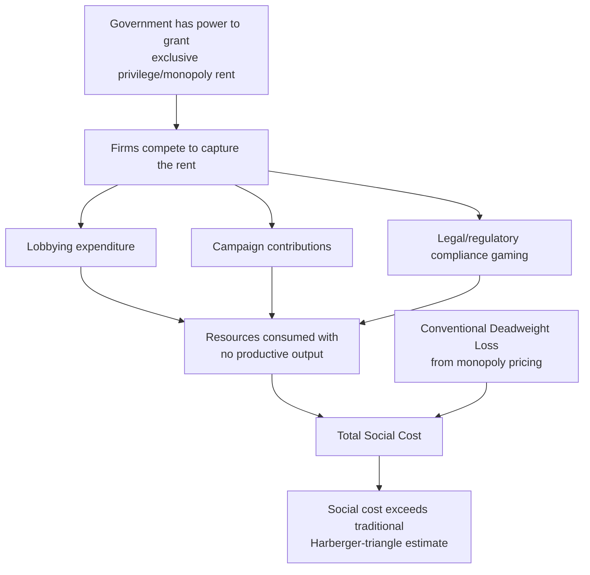

## The Virginia School and Public Choice Foundations

### Overview

The Virginia School refers to the public choice tradition developed principally at the University of Virginia, Virginia Tech, and later George Mason University, associated most closely with James Buchanan and Gordon Tullock. Its foundational move is to apply the same rational-actor, self-interest-based methodology economists use to analyze market behavior to the behavior of voters, politicians, bureaucrats, and judges. Where Chicago-school law and economics primarily analyzes how legal rules affect private behavior, the Virginia School analyzes how self-interested behavior *within government and legal institutions themselves* shapes the content and enforcement of law — extending economic analysis to the supply side of legal and political rules, not just their effects on private conduct.

### Intellectual Origins and Key Figures

#### Foundational Contributors

**Key Points**

- **James M. Buchanan** — awarded the 1986 Nobel Memorial Prize in Economic Sciences "for his development of the contractarian and constitutional bases for the theory of economic and political decision-making"; co-founder with Tullock of the Center for Study of Public Choice (originally at the University of Virginia, later Virginia Tech, then George Mason University)
- **Gordon Tullock** — Buchanan's principal collaborator; developed rent-seeking theory and made foundational contributions to the economic analysis of voting, bureaucracy, and constitutional design
- **Buchanan and Tullock, *The Calculus of Consent* (1962)** — the foundational text of public choice theory, applying economic reasoning to constitutional choice and collective decision-making rules
- Later Virginia School figures at George Mason University (where the Center relocated in 1983) extended the tradition, including scholars working on constitutional political economy, law and economics of regulation, and rent-seeking applications

#### Relationship to Chicago School: Shared Method, Different Object of Analysis

**Key Points**

- Both schools share the rational-choice, self-interest-maximizing behavioral model as their core methodological commitment — this is the substantial overlap that leads some taxonomies to treat Virginia as a branch of the broader "law and economics" movement rather than a fully separate school
- The key distinction: Chicago-school law and economics (especially in its Posnerian form) has often been criticized for implicitly treating *judges and courts* as relatively benevolent, efficiency-seeking (or efficiency-tending) actors — the efficient common law hypothesis presupposes judicial behavior that, whatever its motivation, tends toward efficient outcomes
- The Virginia School's public choice lens instead asks: why would we expect legislators, regulators, or even judges to pursue efficiency or the public interest, rather than their own self-interest (reelection, budget maximization, ideological preference, interest-group capture)? This produces a more consistently skeptical, "government failure"-oriented analysis of *all* lawmaking and regulatory institutions, not just market failures the law might correct

### Core Theoretical Framework

#### Methodological Individualism and the Symmetry Postulate

Public choice theory's foundational methodological claim is that the same model of human behavior — self-interested, rational, responsive to incentives — should be applied symmetrically to actors in both markets and political/governmental settings.

$$\text{If actor behavior} = f(\text{self-interest, incentives}) \text{ in markets} \Rightarrow \text{same} f \text{ should model political actors}$$

**Key Points**

- This directly critiques a common (often implicit) asymmetry in earlier economic and legal scholarship: assuming individuals are self-interested utility-maximizers in market contexts but assuming they become disinterested public servants pursuing the "public interest" once they enter government
- Buchanan termed the resulting research program **"politics without romance"** — analyzing government not as it is idealized to function, but as self-interested actors operating within a particular set of institutional rules and incentive structures would actually be expected to behave
- This methodological symmetry is public choice's most durable contribution to political economy and remains its most widely cited framing device

#### Rent-Seeking Theory

Tullock's foundational contribution (1967, with the term "rent-seeking" itself coined later by Anne Krueger in 1974) analyzes the resources individuals and firms expend competing for artificially created transfers or monopoly privileges from government, rather than producing new value.

$$\text{Social Cost of Monopoly} = \text{Deadweight Loss (Harberger triangle)} + \text{Rent-Seeking Expenditure}$$

**Key Points**

- Traditional (Harberger) welfare analysis of monopoly measured only the deadweight loss triangle from monopoly pricing; Tullock's insight was that resources spent *lobbying for or defending* the monopoly privilege itself (legal fees, lobbying expenditure, campaign contributions) are a pure additional social waste, since rent-seeking expenditures can, in competitive rent-seeking equilibrium, approach the full value of the rent being sought
- This dramatically raises the estimated social cost of regulatory-created monopolies, tariffs, licensing restrictions, and other legally-created transfers, beyond the conventional deadweight-loss measure
- Rent-seeking analysis directly informs legal and economic analysis of occupational licensing, tariff/trade protection, and regulatory barriers to entry — the legal rule creating the rent is analyzed as endogenously produced by the rent-seeking competition itself, not as an exogenously given constraint

#### Constitutional Political Economy

Buchanan's most distinctive contribution is the **two-stage** framework distinguishing constitutional-level rule choice from ordinary in-period political/legal decision-making.

**Key Points**

- **Constitutional stage**: choice of the *rules of the game* (voting rules, separation of powers, constitutional rights, procedural constraints) — Buchanan argued this stage should be analyzed through something like a Rawlsian veil of uncertainty, since individuals choosing basic rules under sufficient uncertainty about their future position have incentive to choose broadly efficient, mutually beneficial rules (echoing but methodologically distinct from Rawls's own contractarian theory, which Buchanan engaged with critically)
- **In-period (post-constitutional) stage**: ordinary legislative and judicial decision-making *within* the chosen constitutional rules — this is where ordinary rent-seeking, interest-group capture, and majoritarian cycling problems (discussed below) become the dominant concern
- This two-stage distinction is why public choice theory has direct application to constitutional law and economics: it provides an economic rationale for *why* constitutional constraints (supermajority requirements, judicial review, federalism, separation of powers) are valuable — they are pre-commitment devices adopted at the constitutional stage precisely to limit the rent-seeking and majoritarian excesses expected at the in-period stage

#### Median Voter Theorem and the Limits of Majoritarian Decision-Making

**Key Points**

- The median voter theorem (formalized by Duncan Black and Anthony Downs, and integrated into the public choice canon) predicts that under majority rule with single-peaked preferences along a single dimension, the median voter's preferred outcome will prevail
- Public choice theory uses this result critically: it implies majoritarian political outcomes reflect the median voter's preference, not necessarily an efficient or welfare-maximizing outcome, and that the result breaks down entirely (producing cycling, path-dependent, or agenda-manipulable outcomes) once more than one policy dimension is at issue — a result associated with the Arrow Impossibility Theorem and later work by Richard McKelvey on the instability of multidimensional majority-rule equilibria
- This underpins a broader public choice skepticism toward treating "democratic outcomes" or "legislative intent" as a coherent, efficiency-tracking signal that courts (in statutory interpretation) or economists (in evaluating regulation) can straightforwardly rely upon

#### Bureaucracy and Regulatory Capture

**Key Points**

- William Niskanen's budget-maximizing bureaucrat model (a close intellectual companion to Virginia School public choice, though Niskanen worked substantially at Chicago and later the Cato Institute) posits that bureaucratic agencies, lacking a profit motive, instead maximize discretionary budget as their objective function, leading to systematic overprovision of government services relative to the efficient level
- George Stigler's economic theory of regulation (1971) — though Stigler is canonically a Chicago-school figure — is frequently integrated into the Virginia School canon because it applies the identical public-choice logic to regulatory agencies: regulation is often *supplied* in response to the demand of the regulated industry itself (regulatory capture), rather than imposed against industry interest to correct market failure
- This produces a distinctive public-choice research agenda within law and economics: analyzing *why* particular regulatory or statutory schemes were enacted (interest-group demand and capture) as a complement to, or substitute for, analyzing whether they are efficient

### Application to Legal and Constitutional Analysis

#### Legislation as the Product of Interest-Group Competition

**Key Points**

- Public choice reframes statutes not as expressions of a coherent "public interest" that courts should try to discern and effectuate (the traditional legal-process view of legislative intent), but as negotiated outputs of interest-group competition for legislatively-created rents
- This has direct implications for statutory interpretation theory: if statutes are interest-group bargains, textualism (strict adherence to enacted text, associated with Justice Antonin Scalia and, in law and economics scholarship, with Frank Easterbrook) can be defended on public-choice grounds — courts should not try to reconstruct a mythical unified "legislative purpose" behind what was actually a specific, often narrow, negotiated compromise among competing factions
- Easterbrook's 1983 article "Statutes' Domains" is a direct application of Virginia School-style public choice reasoning to statutory interpretation methodology, arguing courts should interpret statutes narrowly, confined to the specific deal actually struck, rather than extending them to unaddressed situations based on inferred purposes

#### Constitutional Constraints as Rent-Seeking Limitation Devices

**Key Points**

- Separation of powers, bicameralism, and supermajority requirements are analyzed in public choice terms as costly-to-overcome procedural hurdles that raise the transaction cost of enacting narrow, rent-seeking-driven legislation, thereby favoring only legislation with sufficiently broad-based support to survive the higher hurdle
- Judicial review is similarly reframed: rather than (or in addition to) a countermajoritarian device protecting individual rights on moral grounds, it can be analyzed as a mechanism enforcing constitutional-stage pre-commitments against in-period rent-seeking, self-dealing, or majoritarian excess
- This provides an economic-institutional (rather than purely normative/rights-based) justification for constitutional constraints that is distinct from, though complementary to, standard constitutional theory

#### Law and Economics of Legislatures and Administrative Agencies

**Key Points**

- Virginia School-influenced law and economics analyzes administrative agencies as arenas of ongoing interest-group competition (echoed in "capture theory" applications across environmental, financial, and health regulation scholarship), predicting that agency rulemaking will systematically favor concentrated, well-organized interests (regulated industry) over diffuse, poorly-organized interests (general consumers/taxpayers) — a distributional prediction traceable to Mancur Olson's *The Logic of Collective Action* (1965), a closely related but distinct contribution to the same broader research program
- This yields testable predictions about which regulatory regimes are likely to be "captured" (concentrated-benefit, diffuse-cost regulations, e.g., occupational licensing, agricultural price supports, import quotas) versus which are more resistant to capture (diffuse-benefit, concentrated-cost regulations facing organized opposition)

### Worked Example: Occupational Licensing as Rent-Seeking

**Example**

A state legislature considers a licensing requirement for a service occupation (e.g., interior designers, hair braiders, or florists in various documented U.S. state cases). Incumbent practitioners have concentrated interests (a licensing barrier raises their incomes by restricting entry) and are well-organized (professional associations); consumers bear diffuse costs (marginally higher prices, reduced choice) and are poorly organized to oppose the measure.

$$\text{Net Social Effect} = \underbrace{-\text{Deadweight loss from restricted entry}}_{\text{Harberger triangle}} - \underbrace{\text{Lobbying/compliance expenditure}}_{\text{Tullock rent-seeking cost}} + \underbrace{\text{Any genuine quality/safety benefit}}_{\text{claimed public-interest justification}}$$

**Conclusion**: Public choice analysis predicts licensing will be enacted and persist even where the claimed public-interest justification (consumer protection/quality assurance) is weak, because the political economy favors the concentrated beneficiary (incumbents) over the diffuse cost-bearer (consumers), independent of the measure's net efficiency. [Inference] Empirical labor economics research on occupational licensing (e.g., work associated with Morris Kleiner) has generally found licensing's measured effects on service quality/safety are often small relative to its measured effects on practitioner wages and reduced entry, which is broadly consistent with, though not dispositive proof of, the rent-seeking account — genuine quality-improvement justifications are not thereby proven absent in every licensing scheme, and this remains an active empirical research area.

### Comparative Table: Chicago vs. Virginia School Emphasis

| Dimension | Chicago School | Virginia School (Public Choice) |
| --- | --- | --- |
| Primary object of analysis | Effect of legal rules on private market behavior | Behavior of political/legal actors themselves in producing rules |
| View of judges/courts | Generally analyzed as tending toward efficient outcomes (efficient common law hypothesis) | More skeptical; judges are self-interested actors operating within institutional constraints, not presumptively efficiency-seeking |
| View of legislation | Often treated as potentially correcting market failure, evaluated for efficiency | Analyzed as the product of interest-group competition and rent-seeking, independent of stated public-interest rationale |
| View of regulation | Skeptical of intervention on efficiency/cost-benefit grounds (Chicago antitrust) | Skeptical of intervention on public-choice/capture grounds (regulation serves regulated interests) |
| Key analytical tool | Price theory applied to private behavior (Coase Theorem, efficient breach, Hand Formula) | Rational choice applied to voters, legislators, bureaucrats (median voter theorem, rent-seeking, budget-maximizing bureaucracy) |
| Constitutional theory contribution | Limited; efficiency analysis mostly applied to ordinary legal doctrine | Central contribution; constitutional political economy and two-stage (constitutional/in-period) framework |
| Key figures | Coase, Posner, Becker, Stigler | Buchanan, Tullock, Niskanen (closely associated), Olson (closely associated) |
| Institutional home | University of Chicago | University of Virginia → Virginia Tech → George Mason University |

### Critiques and Open Debates

**Key Points**

- **Overgeneralized cynicism objection**: critics argue public choice's uniform assumption of self-interested behavior in government understates the role of genuine ideological commitment, professional norms, and public-spiritedness among legislators, bureaucrats, and judges, and risks a self-fulfilling cynicism about democratic institutions
- **Empirical testability challenges**: rent-seeking and capture theories generate broadly plausible predictions but are often difficult to test rigorously against competing (genuine public-interest) explanations for the same observed regulation, since both theories can often be fit to the same policy outcome after the fact
- **Normative tension within the tradition itself**: Buchanan's constitutional political economy has a genuinely normative, contractarian dimension (identifying rules that would be unanimously or near-unanimously agreed to behind a veil of uncertainty) that sits somewhat uneasily alongside the purely positive, cynical-prediction strand of rent-seeking and capture theory — the school contains both a normative contractarian project and a descriptive government-failure project, and the relationship between them is debated even among sympathetic scholars
- **Convergence with Chicago in practice**: in contemporary law and economics scholarship, Virginia-style public choice reasoning and Chicago-style efficiency analysis are frequently deployed together (e.g., in regulatory and antitrust scholarship analyzing both whether a rule is efficient and why it was politically enacted), such that the sharp school-based taxonomy is more useful pedagogically than as a description of how most contemporary scholars self-identify

### Related Topics

- The Chicago School of law and economics (companion topic; shared rational-choice method, differing object of analysis)
- Rent-seeking theory and the economics of regulatory capture
- Mancur Olson's *The Logic of Collective Action* and interest-group theory
- Constitutional political economy and the economic analysis of constitutional design
- Statutory interpretation theory: textualism and public-choice justifications (Easterbrook, Scalia)
- The median voter theorem and the Arrow Impossibility Theorem in social choice theory
- Niskanen's budget-maximizing bureaucrat model and the economics of administrative agencies
- Occupational licensing and the empirical economics of entry barriers
- Network effects and technology market regulation (cross-reference: public-choice analysis of platform regulation and regulatory capture in digital markets)
- Behavioral public choice: integrating bounded rationality into models of voter and legislator behavior