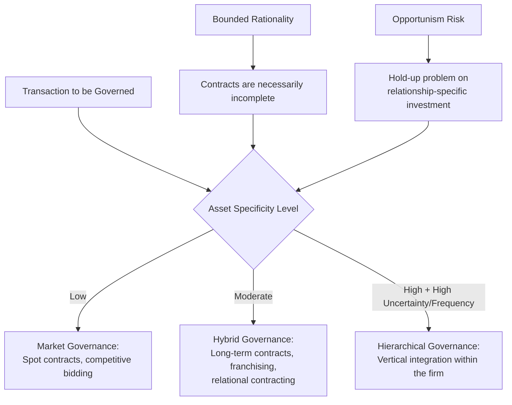

## Institutional and Neo-Institutional Law and Economics

### Overview

Institutional and neo-institutional law and economics form a tradition that treats institutions themselves — firms, property regimes, contracts, courts, informal norms — as objects of economic analysis rather than as a fixed backdrop against which frictionless market transactions occur. Where Chicago-school analysis often reasons from an idealized zero-transaction-cost baseline, institutional economics insists that transaction costs, bounded rationality, and the comparative performance of real (never perfect) institutional alternatives must sit at the center of legal-economic analysis. This entry covers the "old" institutionalist background, Coase's foundational transaction-cost contribution, Williamson's transaction cost economics, and Ostrom's commons governance work, together with their applications to legal doctrine.

### Intellectual Origins and Key Figures

#### Old Institutional Economics: The Precursor Tradition

**Key Points**

- **Thorstein Veblen, John R. Commons, Wesley Mitchell** — early 20th-century American institutionalists who rejected neoclassical economics' abstraction from law, custom, and power relations, arguing that economic behavior cannot be understood apart from the legal and institutional rules that structure it
- **John R. Commons** in particular is directly relevant to law and economics: his *Legal Foundations of Capitalism* (1924) argued that property and contract law do not merely regulate a pre-existing market economy but *constitute* it — transactions are inherently legal-economic events, not purely economic ones later regulated by law
- "Old" institutionalism was largely eclipsed by the formal, mathematically rigorous neoclassical synthesis by mid-century and did not directly found the modern law and economics discipline; its influence on "new" institutional economics is more a shared sensibility (institutions matter, power and history matter) than a direct methodological lineage

#### New Institutional Economics: The Modern Synthesis

**Key Points**

- **Ronald Coase** — "The Nature of the Firm" (1937) is the founding document of new institutional economics, asking why firms exist at all if markets are efficient coordination mechanisms; his answer (the cost of using the price mechanism — search, negotiation, contracting costs) is the direct ancestor of transaction cost economics
- **Oliver Williamson** — awarded the 2009 Nobel Memorial Prize in Economic Sciences (shared with Elinor Ostrom) for his analysis of economic governance, especially the boundaries of the firm; developed transaction cost economics (TCE) into a systematic comparative-institutional framework
- **Douglass North** — awarded the 1993 Nobel Memorial Prize in Economic Sciences for incorporating institutional analysis into economic history, arguing that differential institutional quality (secure property rights, contract enforcement, political constraints on rulers) explains long-run divergence in national economic development
- **Elinor Ostrom** — awarded the 2009 Nobel Memorial Prize in Economic Sciences (the first woman to receive it) for her empirical and theoretical work on the governance of common-pool resources, challenging the presumption that commons problems require either privatization or state control

### Core Theoretical Framework

#### Transaction Cost Economics (Williamson)

Williamson's TCE asks: given that transactions can be organized either through markets (spot contracting), hybrid arrangements (long-term contracts, franchising, joint ventures), or hierarchies (vertical integration within a firm), what determines which governance structure will be chosen for a given transaction?

$$\text{Governance Choice} = g(\text{Asset Specificity}, \text{Uncertainty}, \text{Frequency})$$

**Key Points**

- **Asset specificity**: the degree to which an investment is specialized to a particular transaction/counterparty and loses value in alternative uses (site specificity, physical asset specificity, human asset specificity, dedicated assets) — this is the central variable in Williamson's framework
- **Bounded rationality**: parties are intendedly rational but limited in their capacity to foresee and contract for every future contingency, which is why contracts are necessarily incomplete (directly echoing Grossman-Hart-Moore incomplete contract theory, developed partly in dialogue with Williamson's work)
- **Opportunism**: parties may behave strategically/self-interestedly with guile, exploiting gaps or ambiguities in incomplete contracts — this is the behavioral assumption that makes governance structure choice consequential (without opportunism risk, incomplete contracts would pose little problem)
- The core prediction: **high asset specificity + high uncertainty + high frequency → vertical integration (hierarchy)** is favored over market contracting, because the "hold-up problem" (a counterparty exploiting sunk, relationship-specific investment to extract better terms ex post) becomes severe enough that internalizing the transaction within a single firm economizes on the cost of protecting against opportunism

#### The Hold-Up Problem and Relationship-Specific Investment

**Key Points**

- Consider a supplier who makes a relationship-specific investment (e.g., a factory built adjacent to a single buyer's plant) to serve a particular buyer. Once the investment is sunk, the buyer has bargaining leverage to demand renegotiated (lower) terms, knowing the supplier's investment has little value in alternative uses
- Anticipating this **hold-up risk** ex ante, the supplier may underinvest relative to the efficient level, or the parties may choose vertical integration (merging into a single firm) specifically to eliminate the separate-ownership incentive for opportunistic renegotiation
- This directly informs law and economics analysis of contract remedies (why courts might enforce specific performance or expectation damages to protect relationship-specific investment), the economic analysis of franchise law, and antitrust treatment of vertical mergers (which TCE analysis suggests are frequently efficiency-motivated responses to asset specificity, not merely anticompetitive foreclosure strategies — a point of substantial overlap with Chicago-school skepticism of aggressive vertical merger enforcement)

#### The Theory of the Firm and the Boundaries of the Firm

**Key Points**

- Coase's original 1937 question — why does the firm exist as an alternative to a web of market contracts? — is answered by Williamson's TCE as: firms exist because internal hierarchical governance economizes on the transaction costs (contracting, monitoring, adaptation costs) of organizing certain classes of transactions relative to repeated market contracting
- This directly informs legal doctrine on the firm's boundaries: corporate law's default rules on employee versus independent contractor classification, franchise regulation, and joint venture governance can all be analyzed through the lens of which transaction-cost-minimizing governance structure the parties are approximating
- Grossman-Hart-Moore's property-rights theory of the firm (1986, 1990) provides a complementary, more formal answer emphasizing that firm boundaries are determined by the efficient allocation of *residual control rights* over non-contractible assets, given contract incompleteness — a formalization that both builds on and partially reframes Williamson's more verbal/comparative-institutional approach

#### Elinor Ostrom and the Governance of the Commons

Garrett Hardin's "Tragedy of the Commons" (1968) argued that common-pool resources (fisheries, grazing land, irrigation systems) are inevitably overexploited absent either privatization or centralized state regulation, since individual users lack incentive to conserve a resource they do not exclusively own.

**Key Points**

- Ostrom's empirical fieldwork (*Governing the Commons*, 1990) documented numerous long-enduring, self-governed common-pool resource institutions (irrigation communities, fisheries, forests) that avoided the predicted tragedy without either full privatization or top-down state control, contradicting Hardin's binary framing
- Ostrom identified a set of design principles associated with successful self-governing commons institutions: clearly defined boundaries (who is a legitimate user), congruence between rules and local conditions, collective-choice arrangements allowing users to modify rules, monitoring (often by the users themselves), graduated sanctions for rule violations, low-cost conflict resolution mechanisms, and (for larger commons) nested governance across multiple levels
- This directly challenges a common simplification in both Chicago-school property theory (Demsetz's emphasis on privatization as the primary institutional response to resource externalities) and pure public-choice skepticism of collective action, by empirically demonstrating a credible **third institutional path** — polycentric, community-based governance — that legal scholars now draw on when analyzing environmental law, natural resource management, and even digital commons (open-source software governance, internet governance) as institutional design problems

#### Douglass North: Institutions, Path Dependence, and Economic Development

**Key Points**

- North defined institutions as "the rules of the game" — formal rules (constitutions, laws, property rights) and informal constraints (norms, conventions, codes of conduct) that structure human interaction, distinguished from *organizations* (firms, unions, political parties) which are the players operating within those rules
- North's institutional theory of economic development argues that secure property rights and credible contract enforcement (i.e., the state's credible commitment not to expropriate) are necessary preconditions for long-run investment and growth, providing a law-and-development research agenda distinct from purely macroeconomic growth theory
- The concept of **path dependence** — historically contingent institutional choices constrain and shape subsequent institutional evolution, even when the original rationale for a rule has disappeared — is a distinctively institutionalist contribution that complicates the Chicago-school efficient-common-law-evolution hypothesis, since path-dependent lock-in can preserve inefficient legal rules or property regimes well beyond their justification

### Worked Example: Vertical Integration and the Hold-Up Problem in Contract Design

**Example**

An automobile manufacturer requires a highly specialized component that only one supplier can efficiently produce, requiring the supplier to build custom tooling usable only for this buyer's specifications (high asset specificity).

Two governance options:

1. **Long-term contract** (market/hybrid governance): the parties sign a multi-year supply agreement specifying price and quantity terms. Problem: the contract cannot foresee every future contingency (demand fluctuations, input cost shocks, quality disputes), and once the supplier's tooling investment is sunk, the manufacturer has an incentive to threaten contract renegotiation or switching suppliers (despite high switching costs to itself) to extract better terms — the classic hold-up scenario
2. **Vertical integration** (hierarchical governance): the manufacturer acquires the supplier, internalizing the transaction. This eliminates the separate-ownership incentive for opportunistic renegotiation (both parties' profits are now unified under common ownership), but introduces internal bureaucratic costs, weaker high-powered market incentives for the now-internal supplier division, and potential loss of specialized supplier expertise/competition

**Conclusion**: Transaction cost economics predicts the manufacturer will choose vertical integration precisely when the hold-up risk from asset specificity (multiplied by uncertainty and transaction frequency) exceeds the bureaucratic/incentive costs of internal organization — this is a comparative institutional judgment, not a search for a frictionless ideal, consistent with TCE's core methodological commitment to comparing real (imperfect) governance alternatives against one another rather than against a hypothetical zero-transaction-cost benchmark. [Inference] The specific threshold at which integration becomes preferable to long-term contracting is highly fact-specific and industry-dependent; TCE provides the analytical variables (asset specificity, uncertainty, frequency) rather than a universal numerical rule.

### Comparative Table: Institutional Economics vs. Chicago School Emphasis

| Dimension | Chicago School | Institutional / Neo-Institutional Economics |
| --- | --- | --- |
| Baseline analytical starting point | Often reasons from a (hypothetical) zero-transaction-cost benchmark, then asks how real-world costs modify the result | Treats positive transaction costs, bounded rationality, and incomplete contracts as the central, unavoidable starting point |
| Unit of analysis | Individual legal rules and their incentive effects on private behavior | Governance structures and institutions themselves (firms, commons regimes, property systems) as the object of comparative analysis |
| View of the firm | Often treated as a unitary rational actor (a "black box" responding to incentives) | The firm's existence and boundaries are themselves the central puzzle to be explained (Coase, Williamson, Grossman-Hart-Moore) |
| Treatment of property rights | Emphasizes privatization/clear property rights as the primary solution to externalities (Demsetz) | Recognizes privatization as one of several possible institutional solutions; commons governance can be a viable, empirically documented alternative (Ostrom) |
| Method | Primarily deductive/formal price-theoretic modeling | Substantial empirical/comparative institutional and historical analysis alongside formal modeling |
| View of legal/institutional evolution | Efficient common law hypothesis: legal rules tend toward efficiency via litigation selection | Path dependence: historical institutional choices can lock in inefficient arrangements independent of current efficiency |
| Key figures | Coase (as later interpreted), Posner, Becker, Stigler | Coase (original "Nature of the Firm"), Williamson, North, Ostrom, Commons |

### Applications to Legal Doctrine

#### Contract Law: Relational Contracts and Incompleteness

**Key Points**

- Institutional economics' emphasis on bounded rationality and unavoidable contract incompleteness directly informs "relational contract theory" (associated with Ian Macneil, working in dialogue with though not identical to Williamson's TCE), which argues long-term contracts are best understood as evolving relationships governed partly by informal norms and trust, not merely as discrete, fully-specified legal documents — this has influenced contract doctrine's treatment of good faith, course of dealing, and implied terms
- Courts' willingness to fill contractual gaps using default rules, custom, and reasonableness standards can be understood as a judicial response to the unavoidable incompleteness that institutional (rather than Chicago-style complete-contracting) theory identifies as intrinsic to real contracting

#### Corporate Law: The Firm as a Nexus of Contracts vs. a Governance Structure

**Key Points**

- The "nexus of contracts" theory of the firm (associated with Jensen and Meckling's 1976 agency-cost analysis, closely related to but distinct from Williamson's TCE) treats the corporation as a set of explicit and implicit contracts among various stakeholders (shareholders, managers, creditors, employees), directly shaping corporate law's default-rule approach to fiduciary duties and governance
- Williamson's more explicitly TCE-based account instead emphasizes the firm as a distinct *governance structure* offering unique adaptive and dispute-resolution capacities (internal hierarchy, fiat, low-powered incentives) not available through market contracting — a subtly different emphasis with implications for how corporate law scholars analyze the appropriate scope of mandatory versus default corporate law rules

#### Environmental and Natural Resource Law: Beyond Privatization vs. Regulation

**Key Points**

- Ostrom's commons governance research directly informs environmental law scholarship analyzing fisheries management, water rights, and forest governance, providing a legal-institutional design framework (her design principles) as an alternative to the traditional privatize-or-regulate dichotomy that dominated earlier law and economics treatment of environmental externalities
- This has practical application in contemporary legal debates over digital commons governance (open-source licensing structures, Wikipedia-style collaborative governance, blockchain-based DAOs — cross-referencing this chapter's earlier blockchain topic) where Ostrom-style polycentric governance design principles are increasingly invoked as an analytical framework

### Critiques and Open Debates

**Key Points**

- **Indeterminacy critique**: TCE's comparative-governance framework, while analytically rich, is sometimes criticized as providing a flexible ex post explanatory vocabulary (any observed governance structure can be rationalized as the transaction-cost-minimizing choice) rather than a framework generating sharp, falsifiable ex ante predictions — a concern paralleling critiques leveled at the efficient common law hypothesis
- **Relationship to Chicago School**: institutional economics is sometimes presented as a rival to Chicago-school law and economics, but the relationship is more accurately one of a foundational contributor (Coase) whose full analytical apparatus (the necessity of comparing real, costly institutional alternatives) is arguably under-utilized in more stylized Chicago-school applications that reason from near-zero-transaction-cost baselines — some contemporary institutional economists argue their tradition represents Coase's more complete legacy, in tension with, not merely complementary to, the mainstream Chicago-school reading of "the Coase Theorem"
- **Empirical measurement challenges**: key TCE variables (asset specificity, uncertainty) and Ostrom's design principles are richly theorized but can be difficult to operationalize with the precision needed for rigorous econometric testing across large samples, leading much institutional economics scholarship toward case-study and comparative-historical methods rather than large-sample quantitative testing

### Related Topics

- The Chicago School of law and economics (companion/contrast topic; differing baseline transaction-cost assumptions)
- Coase's "The Nature of the Firm" (1937) and "The Problem of Social Cost" (1960) as dual foundations
- Grossman-Hart-Moore incomplete contracts and property-rights theory of the firm
- Elinor Ostrom's design principles for commons governance and their application to digital/blockchain commons
- Douglass North's institutional theory of long-run economic development and path dependence
- Relational contract theory (Ian Macneil) and its influence on contract doctrine
- Agency costs and the nexus-of-contracts theory of the corporation (Jensen and Meckling)
- Vertical integration and antitrust analysis of vertical mergers
- The Virginia School and public choice foundations (cross-reference: institutional analysis of political/legal actors as a parallel research program)
- Blockchain, smart contracts, and economic analysis (cross-reference: transaction cost and incomplete contract framework applied to decentralized governance)