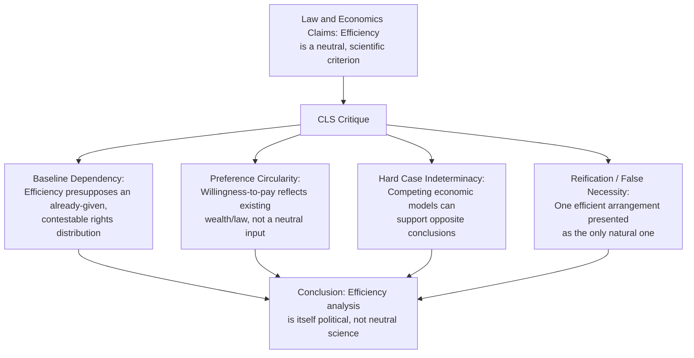

## Critical Legal Studies Critique of Economic Analysis

### Overview

Critical Legal Studies (CLS) is a legal-theoretical movement that emerged in American law schools in the late 1970s, associated with scholars at Harvard, Wisconsin, and elsewhere, that challenges the claim of legal liberalism generally — and law and economics specifically — that law can be a neutral, determinate, apolitical mechanism for resolving social conflict. Where Chicago-school and other law and economics scholarship treats efficiency as a scientifically-grounded, value-neutral criterion for evaluating legal rules, CLS argues that this apparent neutrality masks contestable political and distributive choices, and that legal doctrine (including economic analysis of law) is fundamentally indeterminate and ideologically inflected. This entry covers CLS's intellectual origins, its core critique of economic analysis of law, and the principal responses from law and economics scholars.

### Intellectual Origins and Key Figures

#### Foundational Contributors and Movement Origins

**Key Points**

- CLS emerged from the Conference on Critical Legal Studies, founded in 1977, bringing together scholars dissatisfied with mainstream legal liberalism and its academic expression in legal process theory and (increasingly, by the late 1970s) law and economics
- **Duncan Kennedy** (Harvard) — a founding and defining figure; his work on the "fundamental contradiction" (the tension between individual self-reliance and reliance on others/community as competing, unresolvable values embedded throughout private law doctrine) and on legal indeterminacy is central to the movement's theoretical apparatus
- **Roberto Mangabeira Unger** (Harvard) — developed CLS's broader jurisprudential and social-theoretic ambitions, particularly in *The Critical Legal Studies Movement* (1983), situating the legal critique within a larger project of institutional reimagination
- **Mark Kelman** — authored *A Guide to Critical Legal Studies* (1987), providing one of the more systematic and accessible articulations of CLS methodology, including a sustained direct engagement with and critique of law and economics
- CLS drew intellectually on **Legal Realism** (the early 20th-century movement, associated with figures like Karl Llewellyn and Jerome Frank, that first challenged formalist claims that judicial decisions are mechanically derived from legal rules) as a direct ancestor, extending Realist skepticism about doctrinal determinacy into a more systematically political and theoretically ambitious critique

#### CLS as a Direct Response to the Rise of Law and Economics

**Key Points**

- CLS emerged and developed largely contemporaneously with the Chicago School's ascendance in American legal academia (Posner's *Economic Analysis of Law* was published in 1973; CLS's founding conference followed in 1977), and much of CLS's most sustained doctrinal critique work directly targets law and economics as the dominant rival paradigm claiming scientific objectivity for legal analysis
- [Inference] The degree to which CLS should be characterized primarily as an anti-law-and-economics movement, versus a broader critique of legal liberalism of which law and economics was simply the most prominent contemporary target, is itself debated among intellectual historians of the movement; CLS scholars also extensively critiqued legal process theory, rights discourse, and formalism more generally

### Core Theoretical Claims

#### The Indeterminacy Thesis

CLS's central jurisprudential claim is that legal doctrine, across virtually all fields, is **indeterminate** — existing legal materials (precedent, statutory text, accepted interpretive methods) do not by themselves logically compel any particular outcome in contested cases, because doctrine is built from mutually contradictory principles that can be marshaled to support opposing results.

**Key Points**

- This directly targets a background assumption often implicit in law and economics scholarship: that economic analysis can supply the determinate, principled answer that traditional doctrinal reasoning fails to provide — CLS argues this substitutes one contestable (economic) indeterminacy for another (doctrinal) indeterminacy, rather than genuinely resolving it
- Duncan Kennedy's "fundamental contradiction" argument holds that private law doctrine is pervasively structured by an unresolved tension between individualist values (freedom of contract, security of expectations, self-reliance) and altruist/communitarian values (fairness, protection of the vulnerable, reliance on relationships) — and that legal rules cannot be derived from economic efficiency analysis alone because the underlying value conflict economic analysis is meant to resolve is not actually resolved by that analysis, merely obscured by its technical vocabulary
- CLS scholars applied this method extensively to contract law doctrine (Kennedy's own early work on contract formation and unconscionability doctrine is a key example), showing how doctrinal categories (offer/acceptance, consideration, duress) can be, and historically have been, deployed to reach opposite results depending on which underlying value (individualist or altruist) a court implicitly privileges

#### The Critique of Efficiency as a Neutral Criterion

**Key Points**

- CLS scholars (most systematically Mark Kelman) argue that "efficiency," as deployed in law and economics scholarship, is not the value-neutral, scientifically-derived criterion it purports to be, but instead smuggles in substantive political and distributive choices at multiple analytically hidden points
- **Baseline dependency**: efficiency analysis (e.g., the Coase Theorem's claim that entitlement assignment doesn't affect efficiency absent transaction costs) presupposes an already-given initial distribution of legal entitlements; but that initial distribution is itself a legal-political choice, not a fact given prior to law — efficiency analysis can evaluate how to reach an efficient allocation given a starting point but has comparatively little to say about which starting point (initial rights distribution) is *just*, and CLS argues law and economics scholarship frequently obscures this by treating the existing distribution as a natural baseline rather than a contestable choice
- **Preference-taking versus preference-shaping**: efficiency analysis takes individual preferences (reflected in willingness to pay) as exogenously given inputs to be satisfied at least cost; CLS scholars argue this ignores how legal rules themselves shape and construct the preferences people report — willingness to pay for a good is partly a function of existing wealth distribution and existing legal entitlements, producing a circularity: law and economics uses preferences (shaped by existing law and wealth) to evaluate what the law should be
- **The "hard cases" objection**: efficiency analysis often converges on relatively clear predictions in easy, low-stakes doctrinal areas but becomes highly indeterminate and manipulable in genuinely contested "hard cases" precisely because plausible economic models can be constructed to support multiple different assumptions about transaction costs, information, and behavioral response — CLS argues this replicates, rather than escapes, the indeterminacy problem it claims to solve

#### Wealth Maximization and the Is/Ought Problem

**Key Points**

- CLS scholars extend the philosophical critique also made by Ronald Dworkin (though Dworkin is not a CLS figure) against Posner's wealth-maximization norm: willingness-to-pay-based wealth maximization has no independent ethical justification because it is parasitic on a prior (unjustified, and question-begging) allocation of wealth and entitlements — a dollar's "vote" in the willingness-to-pay calculus is worth vastly more to a wealthy party than a poor one, so efficiency analysis systematically privileges the preferences of those already advantaged by the existing distribution
- CLS scholars further argue that the *positive* claim (the common law tends toward efficiency) and the *normative* claim (law should pursue efficiency) are frequently blurred together in law and economics scholarship in a way that lets the descriptive-sounding "science" of efficiency analysis smuggle in what is actually an unstated, contestable normative commitment — this echoes but sharpens the critique the New Haven School raised from within the economic tradition itself

#### Reification and False Necessity

**Key Points**

- Roberto Unger's broader jurisprudential project (extending beyond the specific critique of economic analysis) argues that existing legal and economic arrangements are frequently presented as natural, inevitable, or dictated by economic logic ("false necessity"), when they are in fact historically contingent and could be reorganized in numerous alternative ways consistent with similar or even superior economic performance
- Applied to law and economics specifically: when economic analysis concludes that a particular doctrinal rule (e.g., employment at-will, specific contract default rules, property rule vs. liability rule protection) is "efficient," CLS scholars argue this analysis often implicitly assumes away alternative institutional arrangements that could achieve comparable efficiency while embodying different distributive or power outcomes — presenting one efficient arrangement among several as *the* efficient (and therefore natural/correct) one

### Worked Example: Applying the Fundamental Contradiction to a Contract Doctrine Dispute

**Example**

Consider a dispute over whether a contract should be enforced despite one party's claim of unequal bargaining power or economic duress at formation (e.g., a take-it-or-leave-it standard-form contract signed under significant economic pressure).

- **Chicago-style economic analysis**: would typically ask whether enforcing the contract as written promotes efficient risk allocation and preserves the predictability that supports welfare-enhancing exchange generally; absent classic duress (physical threat) or fraud, standard-form contracts are usually treated as efficient (lower transaction costs than individualized negotiation) and enforced, with unconscionability doctrine reserved for narrow, extreme cases
- **CLS-style analysis**: would argue this economic framing already presupposes the individualist value (freedom of contract, security of bargained-for expectations) as the default, without acknowledging that the altruist/communitarian value (protecting a vulnerable party's substantive fairness interest) is an equally available, equally "legal" starting point that would generate the opposite conclusion (non-enforcement) with equal doctrinal legitimacy — and that the choice of the individualist default is not compelled by economic logic itself but reflects a background political preference for market-oriented outcomes that the efficiency vocabulary merely dresses up in technical language

**Conclusion**: This example illustrates the core CLS methodological move: rather than arguing the Chicago-style economic conclusion is *factually wrong* on its own terms, CLS argues the terms themselves (which value — individualist or altruist — supplies the default baseline) cannot be settled by economic analysis and are prior, irreducibly political choices that economic reasoning obscures rather than resolves. [Inference] Whether this critique fully succeeds in showing efficiency analysis is *merely* political rather than genuinely truth-tracking in some domains, or whether it shows only that efficiency analysis requires supplementation with an independently justified distributive baseline (a much weaker and more widely accepted claim, embraced even by some law and economics scholars), remains a live point of disagreement in the jurisprudential literature.

### Comparative Table: Law and Economics vs. Critical Legal Studies

| Dimension | Law and Economics (Chicago-style) | Critical Legal Studies |
| --- | --- | --- |
| View of legal doctrine | Doctrine can be systematically explained and evaluated using efficiency criteria | Doctrine is fundamentally indeterminate, built from contradictory principles |
| View of "neutral" analysis | Efficiency is a scientifically-grounded, largely value-neutral evaluative tool | Claimed neutrality is illusory; efficiency analysis smuggles in contestable political/distributive choices |
| Source of legal outcomes | Rational application of economic logic to social problems | Judicial and doctrinal choices among competing, equally available value commitments (individualism vs. altruism) |
| Relationship to existing wealth/power distribution | Generally treated as an appropriate starting baseline for efficiency analysis | Treated as itself a contestable, historically contingent, and often illegitimate baseline requiring independent justification |
| View of legal reform | Identify and implement the efficient rule | Expose false necessity; broaden the perceived range of genuinely available institutional alternatives |
| Methodological stance | Primarily formal/deductive economic modeling | Primarily interpretive, doctrinal, and ideology-critique methodology |
| Key figures | Coase, Posner, Becker, Stigler | Duncan Kennedy, Roberto Unger, Mark Kelman |

### Responses from Law and Economics Scholars

#### The "Efficiency Requires a Baseline" Concession

**Key Points**

- Some law and economics scholars have partially conceded the baseline-dependency point (that efficiency analysis cannot by itself justify the initial entitlement distribution it takes as given) while arguing this is a known and manageable limitation rather than a fatal flaw — efficiency analysis, on this view, answers a well-defined, useful question (how to minimize the cost of reaching a given social objective) without needing to answer the separate question of what the just initial distribution should be
- This response substantially converges with the New Haven School's earlier internal critique (efficiency as one input among several, not a complete normative theory), suggesting CLS's baseline critique and Calabresi's earlier multi-value framework identify structurally similar limitations in pure wealth-maximization theory, despite arising from very different intellectual traditions and different ultimate normative conclusions

#### The Determinacy Defense

**Key Points**

- Law and economics scholars have responded to the indeterminacy thesis by arguing that even if economic models can be constructed to support multiple conclusions in principle, well-specified models with empirically testable assumptions (about transaction costs, elasticities, actual behavioral responses) generate more determinate, falsifiable predictions than open-ended doctrinal reasoning from competing "values" — shifting the debate toward whether CLS's indeterminacy critique proves *too much* (arguably rendering all systematic normative or empirical analysis of law equally indeterminate, including CLS's own proposed alternatives)
- Critics of CLS (including some sympathetic to distributive concerns) have argued the movement's own constructive proposals were comparatively underdeveloped relative to its extensive deconstructive/critical work, a criticism CLS scholars themselves have partially acknowledged as the movement's polemical energy was directed primarily at critique rather than the construction of an alternative systematic methodology

#### Reception and Institutional Trajectory

**Key Points**

- CLS's direct institutional influence within mainstream American legal academia peaked in the 1980s and diminished somewhat by the 1990s, though its critique substantially shaped, and was partly absorbed and transformed by, subsequent movements including Critical Race Theory (which applied related indeterminacy and power-critique methods with an explicit focus on racial subordination), feminist legal theory, and Law and Political Economy (LPE) — a more recent (2010s onward) academic network that revives CLS-adjacent skepticism of neutral economic efficiency analysis, explicitly in the context of critiquing the Chicago-school antitrust and regulatory consensus (connecting directly to the Neo-Brandeisian antitrust movement discussed in this chapter's Chicago School entry)
- [Inference] The precise causal and intellectual lineage connecting CLS directly to the contemporary LPE movement, versus LPE representing an independently-motivated revival of similar themes in response to different (financial-crisis-era and platform-economy-era) concerns, is a matter of ongoing debate among legal historians, though most LPE scholars themselves acknowledge CLS as an important intellectual antecedent

### Related Topics

- The Chicago School of law and economics (companion/primary target topic)
- The New Haven School's internal (economics-based) critique of pure wealth maximization
- Legal Realism as CLS's direct intellectual ancestor
- Critical Race Theory and its extension of CLS's indeterminacy and power-critique methodology
- Feminist legal theory's engagement with and critique of law and economics
- Law and Political Economy (LPE) as a contemporary revival of CLS-adjacent themes
- Ronald Dworkin's philosophical critique of wealth maximization as a normative theory of law
- Distributive justice and the double-distortion argument (Kaplow-Shavell) as an alternative economics-internal response to distributive critiques
- Neo-Brandeisian antitrust and its relationship to earlier structuralist/power-based critiques of Chicago-school efficiency analysis
- The sociology and politics of legal academia: institutional histories of competing law school intellectual movements