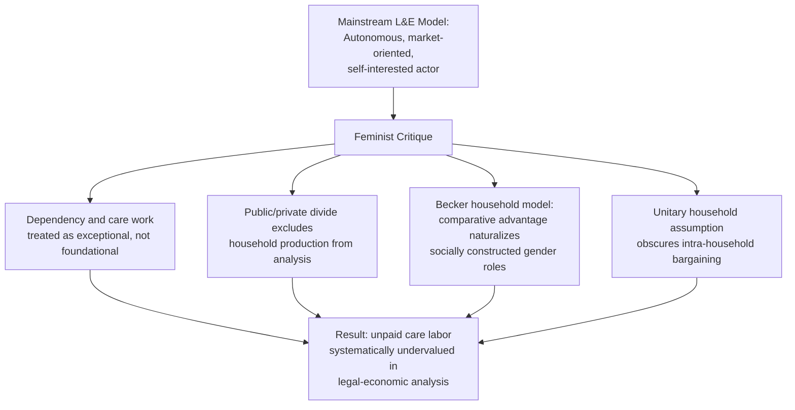

## Feminist and Distributive Critiques of Law and Economics

### Overview

Feminist and distributive critiques of law and economics form a related but analytically distinct family of challenges to mainstream (particularly Chicago-school) efficiency analysis. Feminist legal economists argue that the discipline's core categories and assumptions — the rational, autonomous, market-oriented actor; the sharp public/private divide separating "the market" from "the household"; and the bracketing of unpaid care work from economic analysis — systematically obscure gendered patterns of dependency, unpaid labor, and vulnerability. Distributive critiques, developed partly from within economics itself, challenge the discipline's tendency to treat efficiency and distribution as separable questions, arguing that legal rules cannot in fact be evaluated for efficiency independent of their distributive consequences. This entry covers both critiques, their key contributors, and the principal law and economics responses.

### Intellectual Origins and Key Figures

#### Feminist Legal Economics

**Key Points**

- Feminist legal economics developed substantially from the 1980s onward, drawing on both feminist legal theory (itself partly emerging alongside Critical Legal Studies) and feminist economics as a distinct subfield of economics (associated with the International Association for Feminist Economics, founded 1992, and the journal *Feminist Economics*)
- **Robin West** — a leading legal scholar whose work (e.g., critiquing both Posnerian law and economics and Critical Legal Studies from a feminist vantage point) argues mainstream legal theory's foundational assumption of the separate, autonomous individual fails to capture experiences of connection, dependency, and vulnerability that are disproportionately gendered in their social distribution and legal treatment
- **Martha Fineman** — developed "vulnerability theory," arguing that law's foundational unit should be the vulnerable (rather than autonomous, self-sufficient) subject, with direct implications for how family law, dependency, and caretaking are (and should be) treated in legal-economic analysis
- Feminist economists more broadly (e.g., Marilyn Waring's influential *If Women Counted*, 1988) critiqued national income accounting (GDP) itself for systematically excluding unpaid domestic and care labor from measured economic output, a foundational methodological critique that feminist legal economists extended to law and economics' reliance on market-price-based valuation

#### Distributive Critiques Within and Adjacent to Economics

**Key Points**

- The distributive critique has a long lineage but was given its most influential modern law-and-economics-internal formulation by **Louis Kaplow and Steven Shavell** in *Fairness versus Welfare* (2002) and related work — though notably, Kaplow and Shavell's own conclusion (discussed below) is a defense of efficiency-focused legal rules combined with tax-based redistribution, making their contribution simultaneously a sharpening and a partial rebuttal of the distributive critique
- Duncan Kennedy (also central to CLS) contributed influential distributive critique specifically targeting the claim that private law rules (as opposed to the tax-and-transfer system) are an inappropriate or inefficient vehicle for redistribution — his and others' work analyzing "the distributive impact of legal rules" () pushed back against the idea that private law doctrine is or should be indifferent to distributive consequence
- Earlier distributive concerns are also traceable to the New Haven School's insistence (via Calabresi) that efficiency (primary costs) cannot be evaluated in isolation from loss/risk distribution (secondary costs), providing an economics-internal precedent for treating distribution as inseparable from an adequate efficiency analysis

### Core Theoretical Claims: Feminist Critique

#### The Rational Autonomous Actor and Gendered Dependency

Mainstream law and economics models individuals as autonomous, self-interested, arms-length bargainers freely entering and exiting market transactions. Feminist scholars argue this model implicitly reflects a historically male-coded social position and obscures relationships of care and dependency.

**Key Points**

- Human beings are, for substantial portions of life (infancy, illness, old age, disability), inevitably dependent on others' unpaid caretaking labor — a fact feminist scholars argue is treated by mainstream law and economics as an exception or externality to be addressed at the margins (e.g., in family law as a specialized doctrinal area) rather than as a foundational feature of human economic life that should inform the discipline's core behavioral assumptions
- Because caretaking labor has historically been performed disproportionately by women, and largely outside formal labor markets, models built on market-price-based valuation (willingness to pay, opportunity cost measured by forgone wages) systematically undervalue or entirely exclude this labor's contribution to social welfare
- Fineman's vulnerability theory reframes the foundational legal subject: rather than starting from an autonomous rational actor whose dependency needs are exceptional problems for family law to solve, she argues law should recognize universal, inevitable vulnerability as the baseline condition all legal-economic analysis must accommodate, with implications extending well beyond family law into labor law, social welfare policy, and tort law's treatment of injury and disability

#### The Public/Private Divide

**Key Points**

- Feminist legal theory has long critiqued the law's traditional sharp separation between the "public" sphere (market, state, subject to legal and economic regulation) and the "private" sphere (family, household, historically treated as beyond the law's or economic analysis's proper reach)
- Applied to law and economics specifically: this divide means unpaid household production, childcare, and caretaking — despite constituting enormous real economic value and involving substantial (if non-market) allocation of scarce time and resources — are largely invisible to standard economic analysis of law, which analyzes market transactions and legally-cognizable disputes but has comparatively little to say about the household's internal (non-market, often non-legally-enforceable) allocation of labor
- Family law's traditional relative marginalization within the broader law and economics literature (compared to contracts, torts, property, and corporate law) is itself cited by feminist scholars as evidence of this systemic blind spot — [Inference] though later law and economics scholarship, including work by economists such as Gary Becker on the economics of the family and marriage, did substantially extend economic analysis into this domain, a development feminist economists have both engaged with and significantly criticized for its own gendered assumptions, discussed below

#### Critique of Becker's Economics of the Family

Gary Becker's *A Treatise on the Family* (1981) extended Chicago-school economic analysis directly into household behavior, modeling marriage, fertility, and household division of labor as outcomes of rational utility-maximizing choice, including a comparative-advantage-based explanation for gendered specialization (one spouse specializing in market work, the other in household production).

**Key Points**

- Feminist economists have extensively critiqued Becker's comparative-advantage account of gendered household specialization as naturalizing what is, in significant part, a socially and legally constructed outcome — pre-existing labor market discrimination against women, unequal legal treatment of household labor, and social norms around caretaking responsibility all shape the very "comparative advantages" Becker's model treats as exogenously given inputs
- Becker's household model has also been critiqued for its "altruistic head of household" assumption (treating the household as a unitary decision-making unit with pooled, harmoniously-allocated resources), which feminist economists argue obscures potential intra-household bargaining, unequal resource allocation, and even domestic conflict — later "collective household models" in economics (associated with Pierre-André Chiappori and others) partially responded to this critique by modeling households as sites of bargaining among distinct individuals with potentially divergent preferences, rather than as a single unified utility-maximizing unit
- This critique connects directly to family law and economics: legal rules governing divorce, alimony, and marital property division have real distributive effects on the (often unequal) bargaining power and economic vulnerability created within marriages by gendered specialization patterns that economic analysis of family law must, feminist scholars argue, take seriously rather than treat as efficient equilibrium outcomes requiring no legal correction

### Core Theoretical Claims: Distributive Critique

#### The Separability Objection

Mainstream law and economics (especially in its Chicago-school form) often treats efficiency and distribution as **separable** questions: legal rules should be chosen to maximize efficiency (the size of the total social pie), while distributive concerns (how the pie is divided) should be addressed separately, primarily through the tax-and-transfer system rather than through the choice of legal rules themselves.

**Key Points**

- The distributive critique challenges this separability claim on several grounds: legal rules inevitably have distributive consequences (who bears accident costs, who receives contract damages, whose property rights are protected by injunction versus damages), and choosing a rule "for efficiency reasons" while ignoring these consequences is not distributively neutral — it is a choice to let distributive effects fall wherever the efficient rule happens to place them, which is itself a substantive distributive decision requiring justification, not an avoidance of the distributive question
- Duncan Kennedy and others have argued that if courts and legislators actually cared about distributive outcomes (as most people, including most economists, plausibly do to some degree), then confining redistribution exclusively to the tax system while purporting to select legal rules on pure efficiency grounds is analytically incoherent, since it artificially walls off one major distributively-consequential domain (private law) from distributive considerations the political system otherwise cares about

#### The Kaplow-Shavell "Double Distortion" Response

Kaplow and Shavell's *Fairness versus Welfare* provides the most influential and rigorous formal *defense* of the separability approach, making it essential to include alongside the critique it responds to.

**Key Points**

- Their core formal argument: redistributing through legal rules (e.g., choosing an inefficient tort rule because it happens to favor lower-income accident victims) produces **two distortions** — the efficiency loss from deviating from the efficient legal rule, *plus* whatever labor-supply/behavioral distortion the tax-and-transfer system would independently produce if used for the same redistributive purpose — whereas redistributing purely through the income tax system produces only the second distortion
- Formally, if $L(y)$ represents legal rules and $T(y)$ represents the tax system (where $y$ is income), Kaplow and Shavell show that for any redistributive legal rule achieving a given redistributive outcome, an equivalent or superior redistributive outcome can typically be achieved by combining the *efficient* legal rule with an adjusted tax schedule, avoiding the additional efficiency loss from the distorted legal rule
- **Conclusion of the double-distortion argument**: legal rules should generally be chosen purely for efficiency, with essentially all redistribution left to the income tax and transfer system — this is a sophisticated economics-internal argument *for* the separability the distributive critique challenges, not a mere assertion, and engaging with it seriously is necessary for any adequate presentation of the distributive critique debate

#### Responses to Kaplow-Shavell from Distributive Critics

**Key Points**

- **Political economy objection**: the double-distortion argument assumes the tax-and-transfer system is actually available and will actually be used to offset the distributive effects of "purely efficient" legal rules; if political constraints (public choice-style considerations, discussed in this chapter's Virginia School entry) make adequate tax-based redistribution unlikely or infeasible in practice, then insisting legal rules ignore distribution while assuming a compensating tax adjustment that will not actually occur produces a real-world distributive result inferior to what a distribution-sensitive legal rule would have achieved
- **Non-monetary and non-marginal harms objection**: the double-distortion framework is most persuasive for redistribution measured in fungible monetary terms; critics argue it is less clearly applicable to legal contexts involving dignitary harms, bodily integrity, or non-fungible losses (central to much of tort and family law) where the tax system's monetary redistribution is not a genuine substitute for the specific legal protection at issue
- **Incidence and information objections**: legal rules can sometimes identify and target the specific parties involved in a specific harmful interaction with more precision than a blunt, ex ante income-based tax schedule, suggesting some efficiency-vs-distribution tradeoffs may not be as cleanly separable via the tax system as the formal model assumes, particularly where the tax system cannot observe or condition on the specific facts (comparative fault, specific vulnerability) that a tailored legal rule could
- [Inference] The double-distortion argument's practical policy force depends heavily on empirical and political assumptions (actual responsiveness and political feasibility of tax policy) that are contested rather than resolved by the formal model itself; this remains an active area of debate in optimal-tax and law-and-economics scholarship rather than a fully settled question

### Worked Example: Family Law and the Valuation of Unpaid Caretaking Labor

**Example**

Consider a divorce case in which one spouse specialized in household/caretaking labor for fifteen years while the other built market-based human capital and earning capacity. At divorce, the marital property regime must determine how to value and divide accumulated assets and (in some jurisdictions) whether to award alimony/spousal support.

- **Pure market-valuation approach**: if the legal system values only formally titled assets and market-earned income, the caretaking spouse's contribution — despite having enabled the other spouse's market-earning capacity by absorbing household labor — receives no direct legal recognition, and that spouse exits the marriage with substantially diminished future earning capacity and no compensating asset
- **Feminist/distributive-informed approach**: many jurisdictions' modern marital property and alimony doctrines (e.g., treating enhanced earning capacity or professional licenses acquired during marriage as a maritally-shared asset in some U.S. states, or rehabilitative alimony designed to offset the caretaking spouse's diminished market re-entry prospects) can be understood as a legal response precisely to the concern that pure market valuation systematically undercompensates unpaid, gendered household labor

**Conclusion**: This example illustrates how feminist and distributive critiques translate into concrete doctrinal recommendations: family law rules that explicitly account for non-market contributions and their gendered distribution are defended as a necessary correction to a baseline market-valuation approach that would otherwise treat caretaking labor as economically invisible — a position in some tension with, though not entirely irreconcilable with, the Kaplow-Shavell view that such distributive correction is better handled through the general tax-and-transfer system than through case-by-case family law doctrine. [Inference] Which institutional venue (family law doctrine vs. broader social/tax policy, e.g., subsidized childcare or caregiver tax credits) is empirically more effective at addressing this distributive concern is a matter of ongoing policy debate rather than a settled conclusion of either critique.

### Comparative Table: Mainstream L&E, Feminist Critique, and Distributive Critique

| Dimension | Mainstream (Chicago-style) L&E | Feminist Critique | Distributive Critique |
| --- | --- | --- | --- |
| Core behavioral model | Autonomous, self-interested, market-oriented rational actor | Challenges this as obscuring dependency, care, and relational vulnerability | Does not necessarily challenge rational-actor assumption; challenges separability of efficiency and distribution |
| Treatment of unpaid household labor | Largely outside primary analytical focus; addressed via family law as specialized subfield | Central concern; argues systemic undervaluation reflects gendered bias in discipline's core categories | Not a primary focus, though overlaps where family law's distributive effects are gendered |
| View of efficiency/distribution relationship | Generally treated as separable; efficiency for legal rules, redistribution via tax system | Argues the very definition of "efficient" outcomes reflects gendered baseline assumptions (whose preferences/labor count) | Directly challenges separability; argues legal rules cannot avoid distributive consequence regardless of framing |
| Key formal counter-argument engaged | N/A (originates the mainstream position) | Becker's household economics (critiqued directly) | Kaplow-Shavell double-distortion argument (the central rigorous defense of separability) |
| Primary doctrinal application | Contracts, torts, property, corporate law, antitrust | Family law, labor law, disability/care policy, tort law's valuation of injury | Cuts across all private law fields; tort damages, contract remedies, property rule choice |
| Key figures | Posner, Becker, Coase | Robin West, Martha Fineman, feminist economists (Waring et al.) | Duncan Kennedy (distributive strand), Kaplow and Shavell (formal defense of separability) |

### Critiques and Open Debates

**Key Points**

- **Internal tension between the two critiques**: feminist and distributive critiques, while often presented together, are analytically distinct and can pull in different directions — the distributive critique's preferred solution (tax-based redistribution) may not adequately address feminist concerns about the *non-monetary*, relational, and structural dimensions of gendered dependency and care work that resist full translation into income-based redistribution
- **Response from mainstream L&E**: some law and economics scholars have argued that many feminist concerns can be substantially incorporated within an expanded economic framework (e.g., treating household production and care work explicitly as valuable economic output subject to its own price-theoretic analysis, as some feminist economists have themselves attempted, notably in national accounting reform proposals) rather than requiring rejection of economic methodology as such — a response feminist critics of a more foundational bent (e.g., those emphasizing vulnerability theory's rejection of the autonomous-actor starting point itself) find only partially satisfying, since it addresses the *scope* of what counts as economic activity without necessarily addressing the deeper critique of the autonomous rational actor as the discipline's foundational unit
- **Practical legal influence**: unlike the Chicago School's substantial direct doctrinal influence (especially in antitrust) or even CLS's influence on subsequent critical movements, feminist and distributive critiques have had their most concrete doctrinal impact in specific, targeted areas (marital property reform, valuation of caretaking in family law, some tort damages doctrine reforms around valuing traditionally uncompensated household labor in wrongful death/personal injury calculations) rather than a wholesale reorientation of mainstream law and economics methodology, though their influence on the discipline's self-awareness of its own foundational assumptions has been substantial

### Related Topics

- The Chicago School of law and economics (primary target of both critiques)
- The New Haven School's internal (efficiency-is-not-the-only-value) critique as a partial precedent for the distributive critique
- Critical Legal Studies and its indeterminacy/baseline-dependency critique (closely related methodology, distinct emphasis)
- Gary Becker's economics of the family and household bargaining models
- Collective household models (Chiappori) as an economics-internal response to unitary-household critiques
- The Kaplow-Shavell double-distortion argument and optimal tax theory's relationship to legal rule design
- Family law and economics: marital property, alimony, and valuation of non-market contributions
- Feminist economics and critiques of GDP/national income accounting (Marilyn Waring)
- Martha Fineman's vulnerability theory and its application beyond family law
- Law and Political Economy (LPE) as a contemporary movement synthesizing distributive, feminist, and structuralist critiques of mainstream law and economics