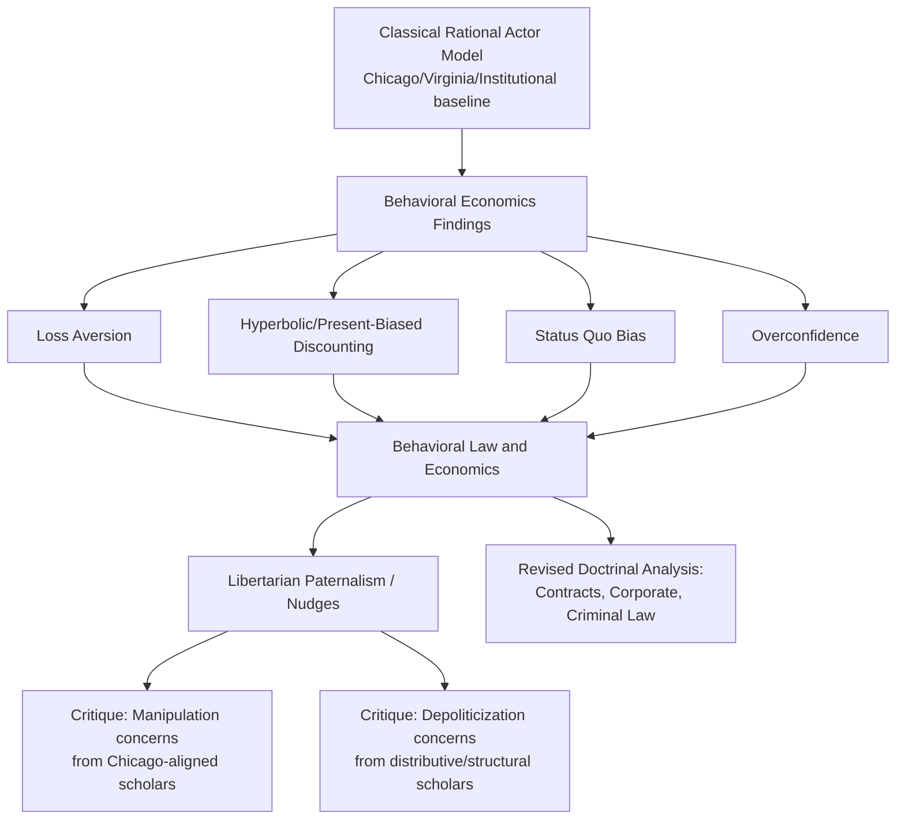

## Contemporary Debates and Future Directions in the Field

### Overview

This entry synthesizes the current frontiers of law and economics scholarship, drawing together threads from the preceding schools of thought (Chicago, New Haven, Virginia, institutional, critical, and feminist/distributive) as they play out in live contemporary debates. Rather than introducing an entirely new school, this topic maps where the field's internal tensions are currently most active: the behavioral revolution's challenge to rational-actor foundations, the antitrust civil war between consumer-welfare and structuralist camps, the integration of empirical and experimental methods, and open questions about how the discipline should evolve to address digital markets, climate change, and inequality.

### The Behavioral Law and Economics Challenge

#### Core Departure from Rational Choice Foundations

Behavioral law and economics applies findings from cognitive psychology and behavioral economics (Kahneman, Tversky, Thaler) to challenge the rational-actor assumption shared by Chicago, Virginia, and much institutional economics alike.

**Key Points**

- Documented systematic deviations from rational choice include loss aversion (losses loom larger than equivalent gains), hyperbolic discounting (present-biased preferences that are dynamically inconsistent), status quo bias, overconfidence, and availability heuristics — each with distinct implications for how legal rules affect actual (rather than idealized) behavior
- **Cass Sunstein, Christine Jolls, and Richard Thaler**'s foundational 1998 article "A Behavioral Approach to Law and Economics" proposed systematically substituting a more empirically accurate model of bounded rationality, bounded willpower, and bounded self-interest for the classical rational-actor model, while retaining much of the economic methodology (cost-benefit reasoning, incentive analysis) otherwise associated with Chicago-style analysis
- This produces a distinctive middle position: behavioral law and economics is methodologically closer to mainstream economic analysis than CLS or feminist critique (it does not reject cost-benefit or incentive-based reasoning), but it directly undermines specific Chicago-school conclusions that depend on rational-actor assumptions (efficient breach theory assuming rational calculation of breach costs, the efficient markets hypothesis underlying much corporate and securities law and economics, and consumer protection doctrine assuming rational risk assessment)

#### Libertarian Paternalism and Nudge Theory

**Key Points**

- Thaler and Sunstein's *Nudge* (2008) proposed "libertarian paternalism": using insights about predictable cognitive biases to design default rules and "choice architecture" that steer people toward welfare-improving choices while preserving formal freedom to opt out — retirement savings auto-enrollment (exploiting status quo bias to increase savings rates) is the paradigmatic example
- This has produced substantial real-world regulatory influence (behaviorally-informed disclosure regimes, default-rule redesign in consumer financial protection, the UK's Behavioural Insights Team and similar units in other governments), representing one of the more concrete policy-translation successes among the schools surveyed in this chapter
- **Critique from multiple directions**: Chicago-school-aligned critics (e.g., some contributions associated with the broader "anti-paternalism" literature) argue nudges are more manipulative and less libertarian than claimed, since asymmetric information about which default serves whose interests gives choice architects significant unaccountable power; critics closer to CLS and distributive traditions argue nudge-based approaches individualize and depoliticize problems (e.g., inadequate retirement savings, poor health choices) that may have deeper structural/distributive causes better addressed through non-behavioral, redistributive, or regulatory tools rather than choice-architecture tweaks

#### Behavioral Analysis Across Doctrinal Areas

**Key Points**

- **Consumer protection and contract law**: behavioral analysis has informed critique of standard-form contract enforcement (rational-actor models assume meaningful reading and comprehension of terms that behavioral research suggests rarely occurs), supporting disclosure-design reform and, more controversially, renewed scrutiny of unconscionability and cooling-off-period doctrines
- **Corporate and securities law**: behavioral finance's challenge to the efficient markets hypothesis (documenting systematic mispricing, herding, and bubble dynamics) has informed debate over mandatory disclosure design, executive compensation regulation (addressing behaviorally-driven managerial overconfidence), and investor protection rules
- **Criminal law**: behavioral critiques of Becker's rational-crime model (emphasizing that offenders often exhibit present bias, poor risk assessment, and situational rather than calculated decision-making) have informed debate over the relative deterrent efficacy of certainty versus severity of punishment, with some behavioral research suggesting increased certainty of detection has larger deterrent effects than increased severity, in tension with the pure expected-cost calculation Becker's original model implies
- [Inference] The magnitude and policy significance of behavioral effects varies substantially across doctrinal contexts and studies; behavioral law and economics is a highly active empirical research program rather than a set of settled, uniformly-replicated findings, and specific behavioral claims should be evaluated on their individual evidentiary merits rather than assumed to generalize automatically across all legal contexts

### The Antitrust Civil War: Consumer Welfare vs. Neo-Brandeisian Structuralism

#### Restating the Contemporary Battle Lines

This debate, introduced in this chapter's Chicago School entry and the earlier network effects topic, has become perhaps the single most visible live controversy in contemporary law and economics, with direct consequences for enforcement policy.

**Key Points**

- **Consumer welfare standard (Chicago-descended)**: antitrust law's sole legitimate goal is protecting consumers from higher prices, reduced output, or reduced quality/innovation resulting from anticompetitive conduct; efficient conduct (even by dominant firms) should not be condemned merely because it disadvantages competitors or concentrates market structure
- **Neo-Brandeisian structuralism**: associated with Lina Khan's influential 2017 student note "Amazon's Antitrust Paradox" and her subsequent tenure as FTC Chair (2021–2025), together with scholars like Tim Wu; argues the consumer welfare standard is systematically blind to harms that do not manifest as higher consumer prices — predatory below-cost pricing enabled by investor capital to achieve platform dominance, labor market monopsony effects, innovation harms from acquiring nascent competitors, and the political/democratic dangers of excessive concentrated economic power (reviving concerns associated with the early 20th-century Brandeisian antitrust tradition that Robert Bork's *The Antitrust Paradox* was explicitly written to displace)
- The debate directly implicates the appropriate theoretical toolkit discussed throughout this chapter: structuralists draw on public-choice-style skepticism of regulatory capture combined with a more Calabresian (New Haven-style) willingness to weigh non-efficiency values (democratic/political concerns about concentrated power) against pure allocative efficiency

#### Empirical and Doctrinal Flashpoints

**Key Points**

- **Platform pricing and predation**: the two-sided market pricing analysis discussed in the network effects entry (efficient below-cost pricing on one side of a platform) is directly contested terrain — structuralists argue some below-cost platform pricing reflects genuinely predatory, VC-subsidized strategies to achieve durable dominance rather than efficient cross-subsidization, a claim requiring case-specific evidence that is often difficult to establish
- **Merger enforcement standards**: the debate has produced concrete policy change, including the U.S. FTC and DOJ's 2023 Merger Guidelines revision, which lowered certain structural presumption thresholds and gave greater weight to potential/nascent competition concerns than prior guidelines influenced more heavily by Chicago-school skepticism of structural presumptions
- **Labor monopsony**: a substantial and growing empirical literature (crossing both camps to some degree) documents labor market concentration effects on wages, providing an empirical basis for antitrust theories of harm (monopsony power suppressing wages) that were historically underemphasized relative to consumer-price-focused analysis — this is one area where the debate has produced convergent empirical interest across otherwise opposed theoretical camps
- [Unverified] The longer-run enforcement and judicial reception of the more structuralist approach (including its litigation track record in major cases) remains actively unfolding, and the field's assessment of its ultimate empirical and legal success is unsettled pending further case outcomes and appellate review

### Empirical and Experimental Turns in Law and Economics

#### The Rise of Empirical Legal Studies

**Key Points**

- Contemporary law and economics has increasingly shifted from purely theoretical/deductive modeling (characteristic of early Chicago-school work) toward econometric and quasi-experimental empirical testing of legal-economic hypotheses, aided by expanded availability of large administrative datasets (court records, regulatory filings, labor market data) and modern causal inference methods (difference-in-differences, regression discontinuity, instrumental variables)
- This empirical turn has generated an evidence base for testing previously largely theoretical claims: the efficient common law hypothesis, the deterrent effects of tort liability and criminal sanctions, the real-world incidence of regulatory costs, and the actual (as opposed to modeled) effects of specific legal reforms (e.g., natural experiments from staggered state-level legal changes in areas like tort reform, minimum wage law, or occupational licensing)
- Empirical legal studies as an organized subfield (with its own dedicated journals and conferences) now sits alongside, and increasingly in dialogue with, the theoretically-oriented schools surveyed throughout this chapter, providing a partial evidentiary check on competing theoretical predictions from Chicago, institutional, public choice, and behavioral camps alike

#### Experimental Economics and Law

**Key Points**

- Laboratory and field experiments (building on experimental economics more broadly, associated with Vernon Smith and others) have been used to directly test predictions central to law and economics: whether the Coase Theorem's bargaining prediction holds in controlled settings with real transaction costs and strategic behavior, how framing and default rules affect actual contracting and property behavior, and how juries and judges actually process information relative to idealized rational-decision-maker models
- [Inference] Experimental results on Coasean bargaining have been mixed — some experiments find bargaining does approach efficient outcomes under favorable conditions (small numbers, clear property rights, repeated interaction), while others document persistent failures to bargain to efficiency even absent formal transaction costs, attributable to strategic behavior, fairness concerns, and bounded rationality — this remains an active empirical research area without full consensus

### Emerging Substantive Frontiers

#### Climate Change and Environmental Law and Economics

**Key Points**

- Climate change presents a distinctive challenge combining classical Pigouvian externality analysis (carbon emissions as a global externality) with genuinely novel features: extremely long time horizons requiring contested discount rate choices (with significant distributive stakes between current and future generations), deep scientific uncertainty about tail-risk climate outcomes, and a global collective-action structure resembling Ostrom-style commons governance problems at planetary scale but without an obvious analog to her documented small-scale community-governance solutions
- Debates over the appropriate social cost of carbon calculation, carbon tax versus cap-and-trade design, and the appropriate legal liability framework for climate-related harm (climate litigation against fossil fuel producers, drawing partly on tort law and economics' causation and damages frameworks) represent an active and rapidly evolving application of law and economics methodology across nearly all the schools surveyed in this chapter
- The discount rate debate specifically illustrates a genuine unresolved theoretical tension: standard Chicago-style efficiency analysis using conventional market discount rates can generate policy conclusions (limited near-term climate mitigation spending) that many economists and ethicists, applying different (lower, more redistributively-informed) discount rate assumptions grounded partly in the distributive critique's concerns about intergenerational equity, find normatively unacceptable

#### Digital Markets, AI, and the Law and Economics Toolkit

**Key Points**

- Beyond the network effects and antitrust debates already covered, emerging questions include how to apply law and economics analysis to algorithmic decision-making (algorithmic pricing collusion without explicit human agreement, raising novel questions for conspiracy doctrine built around human intent), data as a distinctive non-rivalrous but excludable asset complicating traditional property and privacy law and economics frameworks, and AI-generated content's implications for intellectual property's traditional incentive-based justification (the classical law and economics rationale for IP protection — incentivizing costly creation given cheap replication — is complicated when content generation itself becomes dramatically cheaper)
- [Speculation] How thoroughly existing law and economics frameworks (built substantially around 20th-century industrial and information economy assumptions) will need to be revised versus merely extended to address AI-specific legal-economic questions is a genuinely open and actively contested question among scholars, with no settled consensus framework yet established comparable to the maturity of, for example, antitrust's consumer welfare vs. structuralist debate

### Comparative Table: Positioning the Contemporary Debates

| Debate | Primary Tension | Schools/Traditions in Dialogue | Degree of Resolution |
| --- | --- | --- | --- |
| Behavioral vs. rational-actor foundations | Empirical accuracy of the core behavioral model underlying all price-theoretic analysis | Behavioral economics vs. Chicago/Virginia rational-choice tradition | Partially resolved: behavioral insights widely incorporated, but scope/magnitude of effects remains contested |
| Consumer welfare vs. structuralist antitrust | Whether efficiency/price effects are the sole legitimate antitrust concern | Chicago School vs. Neo-Brandeisian (echoing earlier CLS/distributive concerns about power) | Unresolved; live enforcement and judicial battle |
| Efficiency-distribution separability | Whether legal rules should ignore distributive effects in favor of tax-based redistribution | Kaplow-Shavell (mainstream) vs. distributive/feminist critique | Unresolved; both formal argument and political-feasibility objections remain active |
| Theoretical vs. empirical methodology | Weight given to deductive modeling versus econometric/experimental testing | All schools increasingly engage empirical methods | Substantially resolved toward empirical integration as a complement, not replacement, for theory |
| Climate discount rates | Appropriate treatment of intergenerational distributive equity in efficiency calculations | Chicago-style market-rate discounting vs. ethically-informed lower discounting | Unresolved; reflected in ongoing social-cost-of-carbon methodology debates |
| AI and digital markets | Adequacy of existing IP, antitrust, and property frameworks for AI-era conditions | All schools; no dominant paradigm yet established | Largely unresolved; nascent research agenda |

### Worked Example: Behavioral Economics Meets the Consumer Welfare Antitrust Debate

**Example**

Consider a dominant digital platform whose interface design exploits documented behavioral biases (default settings favoring data-sharing, friction-heavy cancellation processes exploiting status quo bias) to retain users, alongside genuinely superior underlying product quality.

- **Pure Chicago-style consumer welfare analysis**: would ask whether measurable consumer harm (higher effective prices, reduced output/quality) results; if the platform remains free and objectively high-quality, behaviorally-exploitative interface design might escape antitrust scrutiny entirely under a narrow price/output-focused framework
- **Behavioral law and economics-informed analysis**: would argue that "revealed preference" (continued platform use) is an unreliable welfare indicator when use is substantially driven by documented cognitive biases the platform has deliberately engineered its interface to exploit, suggesting consumer welfare analysis itself needs behavioral correction, not abandonment
- **Neo-Brandeisian structuralist analysis**: would likely argue this scenario illustrates precisely why a narrow consumer-welfare/price framework is inadequate, and that market structure and design-based harms (dark patterns, attention capture, data extraction) warrant scrutiny independent of any showing of behaviorally-corrected consumer harm

**Conclusion**: This example shows how the contemporary debates surveyed in this entry are not fully independent — behavioral economics' critique of revealed-preference welfare measures directly reinforces certain structuralist antitrust arguments, illustrating a degree of convergence between initially distinct critical traditions (behavioral and Neo-Brandeisian) even though they emerged from different methodological starting points. [Inference] Whether this convergence reflects a genuinely coherent, unified alternative research program or simply parallel but distinct critiques of the same mainstream consumer-welfare baseline is not yet settled in the literature.

### Synthesis: Where the Field Stands

**Key Points**

- No single school commands the near-total dominance the Chicago School held in the 1970s–1990s; the contemporary field is better characterized as a genuinely pluralistic, actively contested space where behavioral, institutional, distributive, and traditional efficiency-based approaches are all actively deployed, often within the same scholar's body of work rather than as rigidly separate camps
- Methodological convergence toward empirical testing has, to some degree, provided a partial common ground across otherwise theoretically opposed traditions — scholars from Chicago-descended and structuralist/behavioral traditions alike increasingly appeal to econometric evidence, even while disagreeing sharply about its normative implications
- The unresolved tensions catalogued in this entry (efficiency vs. distribution separability, consumer welfare vs. structural antitrust harms, appropriate discount rates for intergenerational equity, and how to extend the field's toolkit to AI and digital markets) represent the most active areas for future scholarly contribution, and a student of the field should expect continued evolution rather than settled consensus on any of them

### Related Topics

- The Chicago School of law and economics (primary historical baseline against which contemporary debates are framed)
- Behavioral law and economics: full doctrinal survey across torts, contracts, and criminal law
- Neo-Brandeisian antitrust and the 2023 U.S. Merger Guidelines revision
- The Kaplow-Shavell double-distortion argument and its critics (deep-dive continuation from the distributive critique entry)
- Climate change law and economics: social cost of carbon methodology and intergenerational discount rate debates
- Empirical legal studies methodology: causal inference techniques applied to legal-economic questions
- Algorithmic collusion and antitrust conspiracy doctrine in digital markets
- Labor market monopsony and antitrust: emerging empirical literature
- Network effects and technology market regulation (cross-reference: platform pricing and predation debates)
- Institutional and neo-institutional law and economics (cross-reference: Ostrom-style commons governance applied to climate change at global scale)