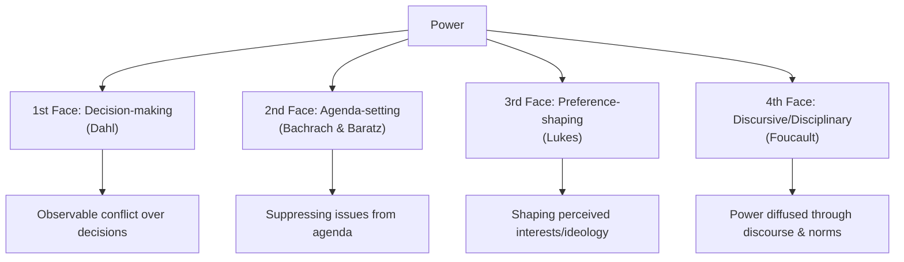
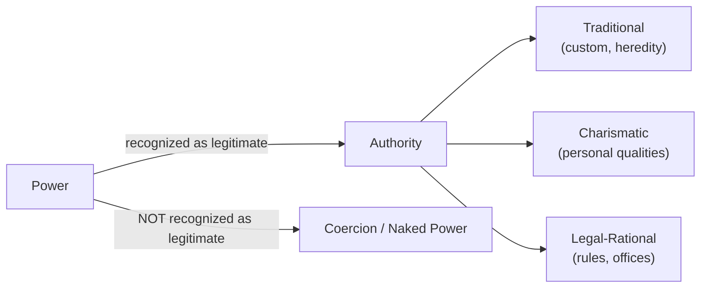

## Defining Politics, Power, and Authority

### Overview

Political science begins by distinguishing three interlocked concepts: politics, power, and authority. These terms are often used interchangeably in everyday language, but analytically they refer to different phenomena. Politics is the *arena and activity*, power is the *capacity*, and authority is the *legitimated form* that power can take. Understanding their relationships and boundaries is foundational to nearly every subfield of the discipline — comparative politics, international relations, political theory, and public administration.

### Defining Politics

**Key Points**

- Politics concerns the processes by which groups make collective decisions, allocate resources, and resolve conflicts over values and interests.
- Harold Lasswell's classic formulation defines politics as the study of **"who gets what, when, how"** — emphasizing distribution and process.
- David Easton defined politics as **"the authoritative allocation of values for a society"**, emphasizing that political outcomes are binding and society-wide.
- Politics is not confined to formal government institutions; it occurs in any setting involving competing interests and the exercise of influence (organizations, families, workplaces) — a view associated with feminist and pluralist scholars who broadened the concept beyond the state.

**Competing Conceptions of Politics**

| Conception | Core Claim | Associated Thinkers |
| --- | --- | --- |
| Politics as governance | Confined to the state, government, and public affairs | Aristotle, traditional institutionalists |
| Politics as power | Any relationship involving control, resistance, or negotiation | Adrian Leftwich |
| Politics as public life | Activity in the public sphere, distinct from the private | Hannah Arendt |
| Politics as compromise and consensus | Conciliation of conflicting interests through discussion, not violence | Bernard Crick |
| Politics as distribution of resources | Allocation of scarce resources under conditions of scarcity | Harold Lasswell |

**Example**

A labor union negotiating wages with management is engaging in politics even though no government institution is directly involved — there is a collective decision, competing interests, and an allocation of resources (wages, working conditions).

### Defining Power

**Key Points**

- Power is the most contested concept in political science; Steven Lukes and W.B. Gallie both describe it as **"essentially contested"** — its very definition is a site of ideological disagreement.
- Max Weber's classic definition: power (*Macht*) is **"the probability that one actor within a social relationship will be in a position to carry out his own will despite resistance."**
- Robert Dahl's behavioral definition: **"A has power over B to the extent that he can get B to do something that B would not otherwise do."** This is the basis of the pluralist "first face" of power.

**The Three (or Four) Faces of Power**

1. **First face (decision-making power)** — Robert Dahl (1957/1961): power observed in overt conflict over decisions; measured by who prevails in observable disputes.
2. **Second face (agenda-setting / non-decision-making)** — Peter Bachrach and Morton Baratz (1962): power exercised by keeping issues off the agenda entirely, preventing grievances from becoming decisions.
3. **Third face (ideological/preference-shaping power)** — Steven Lukes (1974): the "radical" view — power shapes what people want in the first place, manufacturing consent and shaping perceived interests, even absent observable conflict.
4. **Fourth face (disciplinary/discursive power)** — associated with Michel Foucault: power is diffused through discourse, knowledge systems, and institutions rather than held by identifiable agents; it produces subjects and norms rather than simply repressing them.

**Forms and Bases of Power**

- **Coercive power** — reliance on force or threat of force
- **Economic power** — control over material resources
- **Ideological/normative power** — control over ideas, beliefs, values
- **Political power** — specifically tied to control of decision-making institutions

John French and Bertram Raven's typology of social power bases is also widely used in political and organizational analysis: reward power, coercive power, legitimate power, referent power, expert power, and (later added) informational power.

**Example**

A corporation lobbying to prevent a pollution regulation from ever reaching a legislative vote exemplifies the "second face" of power — the exercise of power through exclusion from the agenda rather than through visible confrontation.

### Defining Authority

**Key Points**

- Authority is power that is **regarded as legitimate** by those subject to it — the "right to rule" rather than the mere capacity to compel.
- Not all power is authority: a robber with a gun has power over a victim, but not authority, because the victim does not recognize a right to obedience.
- Authority typically implies a normative obligation to obey, whereas raw power implies only the practical necessity of compliance.

**Weber's Typology of Legitimate Authority**

Max Weber identified three ideal types of legitimate domination (*Herrschaft*):

1. **Traditional authority** — legitimacy rooted in long-standing customs, traditions, and the sanctity of established order (e.g., hereditary monarchy).
2. **Charismatic authority** — legitimacy derived from the extraordinary personal qualities, heroism, or exemplary character attributed to a leader (e.g., revolutionary or religious leaders).
3. **Legal-rational authority** — legitimacy grounded in a system of formal rules, laws, and procedures, with obedience owed to the office rather than the individual (e.g., modern bureaucratic states).

**Authority vs. Power vs. Legitimacy — Comparative Table**

| Concept | Definition | Basis | Example |
| --- | --- | --- | --- |
| Power | Capacity to compel behavior regardless of consent | Force, resources, control | Armed robbery, military occupation |
| Authority | Power accepted as rightful by the governed | Legitimacy, recognized right to command | A judge's ruling, a police officer's lawful order |
| Legitimacy | The broader belief/social consensus validating an authority's right to rule | Procedural correctness, tradition, charisma, performance | A constitution ratified by popular vote |

**Sources of Legitimacy (Beyond Weber)**

- **Input legitimacy** — derived from participatory, democratic procedures (elections, consultation)
- **Output legitimacy** — derived from effective performance and delivery of public goods
- **Procedural legitimacy** — derived from adherence to established rules and constitutional processes

### Relationship Between Politics, Power, and Authority (svg_diagram)

<svg xmlns="http://www.w3.org/2000/svg" viewBox="0 0 720 380">
<text x="360" y="30" text-anchor="middle" font-size="18" font-weight="bold" fill="#1a1a1a">Politics, Power, and Authority (svg_diagram)</text>
<circle cx="260" cy="200" r="150" fill="#a8d5ff" fill-opacity="0.5" stroke="#2266aa" stroke-width="2" />
<text x="150" y="110" font-size="16" font-weight="bold" fill="#0d3d66">Politics</text>
<text x="130" y="130" font-size="11" fill="#0d3d66">Arena of collective</text>
<text x="130" y="145" font-size="11" fill="#0d3d66">decision-making</text>
<circle cx="420" cy="200" r="150" fill="#ffd6a8" fill-opacity="0.5" stroke="#cc7722" stroke-width="2" />
<text x="550" y="110" font-size="16" font-weight="bold" fill="#7a3d0d">Power</text>
<text x="500" y="130" font-size="11" fill="#7a3d0d">Capacity to compel</text>
<text x="500" y="145" font-size="11" fill="#7a3d0d">or influence outcomes</text>
<ellipse cx="340" cy="230" rx="80" ry="60" fill="#c8f0c8" fill-opacity="0.8" stroke="#227722" stroke-width="2" />
<text x="300" y="235" font-size="13" font-weight="bold" fill="#0d4d0d">Authority</text>
<text x="278" y="252" font-size="10" fill="#0d4d0d">(legitimated power</text>
<text x="285" y="266" font-size="10" fill="#0d4d0d">exercised in politics)</text>

<text x="360" y="360" text-anchor="middle" font-size="12" fill="`#333333`">Authority = the overlap where power is exercised within political processes AND accepted as legitimate</text>

</svg>

### Common Misconceptions

- **[Inference]** Students frequently conflate "authority" with "government"; however, authority can exist outside the state (parental authority, religious authority, organizational authority) and government can exercise power without full authority (e.g., an unrecognized regime holding territory by force).
- Power is not inherently negative or coercive; the "third" and "fourth" faces show power operating through consent-manufacturing and discourse, which is more subtle than domination.
- "Legitimate" does not mean "morally good" — a legal-rational authority can enact unjust laws while remaining legitimate in Weber's sociological (not normative) sense.

### Worked Example: Applying the Framework

**Example**

Consider a newly installed military junta that seizes a national government by force.

- It immediately possesses **power** (control over the state's coercive apparatus).
- It does **not** yet possess **authority**, because the population and international community have not accepted its right to rule.
- If the junta later holds elections, drafts a constitution, and gains sustained public compliance without ongoing use of force, it may transition toward **legal-rational authority** — power has become authority through the acquisition of legitimacy.
- Throughout this entire process, the struggle over recognition, resistance, and rule-making is itself **politics**.

### Related Topics

- The State: Definitions, Origins, and Theories of Sovereignty
- Legitimacy and Political Obligation
- Theories of the Social Contract (Hobbes, Locke, Rousseau)
- Elitism vs. Pluralism in Power Structure Analysis
- Michel Foucault's Theory of Power/Knowledge
- Max Weber's Typology of Bureaucracy and Rational-Legal Domination
- Hannah Arendt's Concept of Power vs. Violence
- Ideology and Hegemony (Antonio Gramsci)