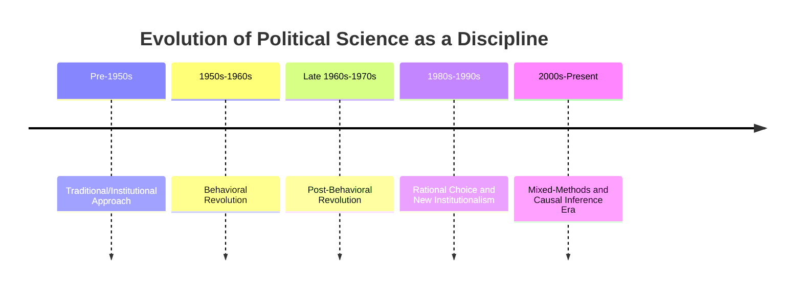
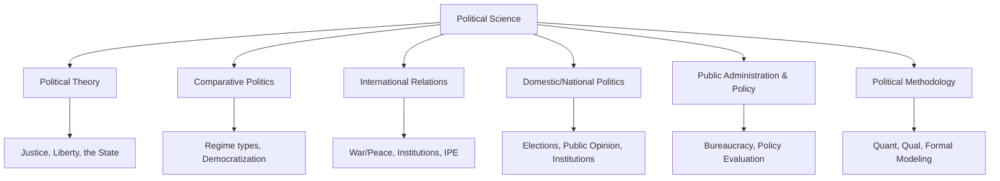

## Political Science as an Academic Discipline

### Overview

Political science is the systematic study of politics, government, and power relations using theoretical and empirical methods. As an academic discipline, it occupies a distinctive position among the social sciences: it draws on history, philosophy, law, sociology, economics, and statistics while maintaining a core focus on the state, governance, and collective decision-making. Its disciplinary identity has evolved considerably since the late 19th century, moving through several methodological "revolutions."

### Disciplinary Definition and Scope

**Key Points**

- Political science is generally defined as the scientific and normative study of political institutions, processes, behavior, and theory.
- The discipline sits at the intersection of empirical inquiry (what *is*) and normative inquiry (what *ought to be*), distinguishing it from purely empirical social sciences.
- It is often described as both a science (systematic, evidence-based) and an art (interpretive, value-laden), a tension that persists in ongoing debates over methodology.

### Historical Development

**Origins**

- Ancient roots trace to Aristotle's *Politics*, which classified regimes and analyzed the polis, and Plato's *Republic*, which theorized justice and ideal governance.
- Modern academic political science emerged in the late 19th century, with Columbia University's School of Political Science (1880) often cited as the first dedicated department in the United States.
- The American Political Science Association (APSA) was founded in 1903, formalizing the discipline's institutional identity in the U.S.

**Methodological Eras**

| Era | Approximate Period | Core Approach |
| --- | --- | --- |
| Traditional/Institutional | Pre-1950s | Legal-formal description of constitutions, institutions, historical narrative |
| Behavioral Revolution | 1950s–1960s | Emphasis on empirical, quantifiable political *behavior* over formal institutions; influenced by psychology and sociology |
| Post-Behavioral Revolution | Late 1960s–1970s | David Easton's call to balance rigor with relevance to real-world problems and normative concerns |
| Rational Choice / New Institutionalism | 1980s–1990s | Formal modeling of individual behavior; renewed attention to institutions as structured incentives |
| Contemporary Pluralism | 2000s–present | Mixed-methods, causal inference, experimental methods, and continued theoretical diversity |

### Core Subfields

**Key Points**

Political science is conventionally organized into four to five major subfields, each with distinct questions, methods, and journals.

1. **Political Theory / Political Philosophy** — normative and analytical study of concepts like justice, liberty, equality, and the state; engages canonical and contemporary texts.
2. **Comparative Politics** — systematic comparison of political systems, institutions, and processes across countries (e.g., democratization, regime types, federalism).
3. **International Relations (IR)** — study of interactions between states and non-state actors, war and peace, international institutions, and global political economy.
4. **American Politics / Domestic Politics** (in the U.S. context) or **National Politics** more broadly — study of a country's own institutions, elections, public opinion, and policymaking.
5. **Public Administration and Public Policy** — study of the implementation, design, and evaluation of government policy and bureaucratic organization.
6. **Political Methodology** — increasingly recognized as a distinct subfield focused on quantitative, qualitative, and formal/mathematical methods of political analysis.

### Methodological Approaches

**Quantitative Methods**

- Statistical analysis of large datasets (e.g., election results, survey data, cross-national indicators)
- Regression modeling, causal inference, experimental and quasi-experimental designs

**Qualitative Methods**

- Case studies, process tracing, comparative-historical analysis
- Interpretive methods including discourse analysis and ethnography

**Formal Methods**

- Game theory and rational choice modeling
- Spatial models of voting and preference aggregation

**Example**

A political scientist studying why democracies rarely go to war with one another (the "Democratic Peace" thesis) might combine large-N statistical analysis of interstate conflict data (quantitative) with detailed case studies of specific crises (qualitative) and game-theoretic models of signaling between democratic leaders (formal).

### Relationship to Adjacent Disciplines

| Discipline | Overlap with Political Science |
| --- | --- |
| Economics | Political economy, public choice theory, rational choice institutionalism |
| Sociology | Social movements, political sociology, class and political behavior |
| Law | Constitutional law, judicial politics, legal theory |
| History | Historical institutionalism, diplomatic and political history |
| Philosophy | Political theory, ethics of governance, theories of justice |
| Psychology | Political psychology, voter behavior, elite decision-making |

### Institutional Structures of the Discipline

**Key Points**

- Professional associations (e.g., APSA in the U.S., IPSA internationally) organize conferences, publish journals, and set disciplinary norms.
- Leading journals include the *American Political Science Review*, *American Journal of Political Science*, *Journal of Politics*, *International Organization*, and *World Politics*, among many field-specific outlets.
- Academic careers typically require a Ph.D., with subfield specialization, and evaluation through peer-reviewed publication, teaching, and (in the U.S. system) tenure review.

### Debates Over Disciplinary Identity

- **Science vs. Interpretation** — [Inference] Ongoing tension between those who model political science on natural-science methods (prediction, falsifiability) and those who emphasize interpretive understanding of meaning-laden political action (associated with hermeneutic and constructivist traditions).
- **"Perestroika" Movement (early 2000s)** — a notable internal reform movement within APSA that criticized the discipline's perceived over-reliance on rational choice and quantitative methods, arguing for greater methodological pluralism.
- **Policy Relevance vs. Scientific Rigor** — recurring debate over whether the discipline should prioritize real-world applicability (as Easton's post-behavioralism urged) or theoretical/methodological sophistication.

### Career Pathways and Applications

- **Academia** — research and teaching positions in universities
- **Government and Public Service** — policy analysis, civil service, diplomacy
- **International Organizations** — UN, World Bank, regional bodies
- **Non-Governmental Organizations (NGOs)** — advocacy, human rights, development work
- **Private Sector** — political risk analysis, consulting, corporate government affairs
- **Journalism and Media** — political commentary and analysis

### Related Topics

- The Behavioral Revolution and Post-Behavioralism in Depth
- Research Methods in Political Science (Quantitative, Qualitative, Mixed)
- Comparative Politics: Approaches and Classifications
- The Scope and Methods of International Relations Theory
- Normative vs. Empirical Political Theory
- Rational Choice Theory and Its Critics
- The Sociology of the Discipline (Perestroika Movement)