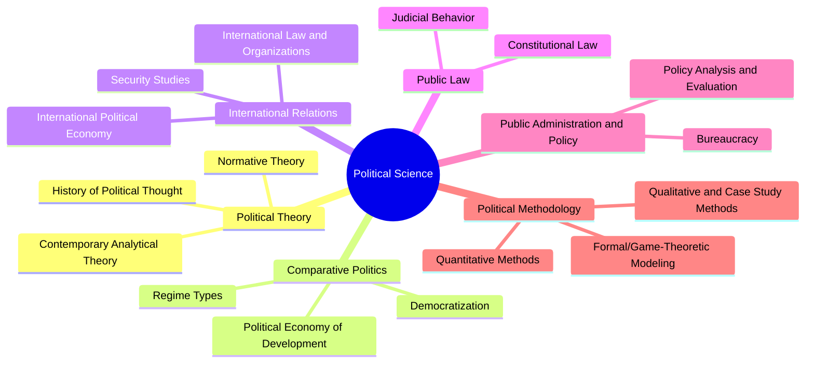
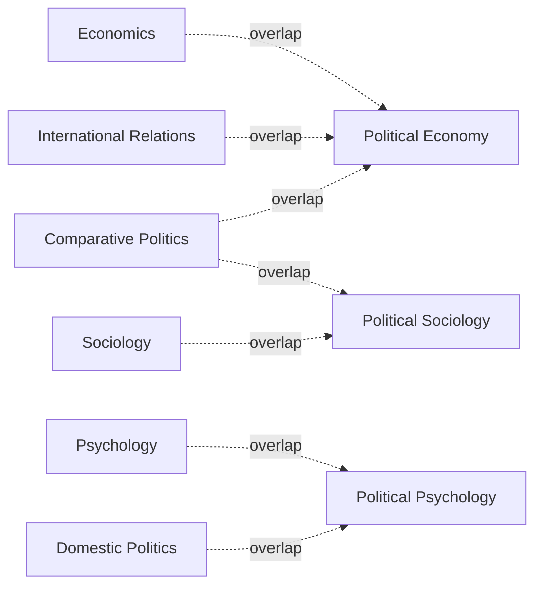

## The Subfields and Scope of Political Science

### Overview

The scope of political science encompasses the full range of phenomena related to power, governance, and collective decision-making, from local institutions to global systems. To manage this breadth, the discipline is organized into recognized subfields, each with characteristic research questions, units of analysis, and methodological traditions. This organization varies somewhat by country and institution but follows broadly consistent lines internationally.

### The Five (or Six) Core Subfields

**Key Points**

Most political science departments and professional associations organize the discipline around the following subfields, though exact labels and boundaries vary by institution and country.

1. **Political Theory (Political Philosophy)**
2. **Comparative Politics**
3. **International Relations**
4. **Public Law / Judicial Politics**
5. **Public Administration and Public Policy**
6. **Political Methodology** (increasingly recognized as distinct)

### 1. Political Theory

**Scope**

- Examines fundamental normative questions: What is justice? What legitimizes political authority? What are the limits of individual liberty?
- Divided into **history of political thought** (studying canonical thinkers such as Plato, Aristotle, Machiavelli, Hobbes, Locke, Rousseau, Marx, Mill) and **contemporary/analytical political theory** (engaging living debates, e.g., John Rawls's theory of justice, communitarian critiques, feminist and critical theory).

**Example**

A political theorist analyzing John Rawls's "veil of ignorance" thought experiment in *A Theory of Justice* is engaging in normative political theory — asking what principles of justice rational agents would choose without knowing their place in society.

### 2. Comparative Politics

**Scope**

- Studies political systems, institutions, and behaviors by comparing across countries or subnational units to identify patterns, causes, and effects.
- Central topics: regime types (democracy, authoritarianism, hybrid regimes), democratization and regime transitions, electoral systems, federalism, political parties, ethnic and identity politics, and comparative political economy.
- Methodologically diverse — ranges from large-N statistical cross-national studies to small-N structured comparisons and single-country case studies used comparatively.

**Example**

A comparativist studying why some post-communist states in Eastern Europe consolidated stable democracies while others slid toward authoritarianism might compare institutional legacies, economic conditions, and civil society strength across a set of matched cases.

### 3. International Relations (IR)

**Scope**

- Studies interactions among states, international institutions, non-state actors (NGOs, multinational corporations, terrorist organizations), and transnational processes.
- Core subareas: security studies (war, deterrence, alliances), international political economy (trade, finance, globalization), international law and organizations, foreign policy analysis, and international ethics.
- Dominated historically by major theoretical paradigms: **realism**, **liberalism/institutionalism**, and **constructivism**, among others.

**Example**

An IR scholar analyzing NATO's expansion after the Cold War might apply realist theory (balance-of-power logic), liberal institutionalist theory (the value of institutionalized cooperation), and constructivist theory (evolving norms and collective identity) as competing explanatory lenses.

### 4. Public Law and Judicial Politics

**Scope**

- Examines constitutions, legal systems, and the political role of courts.
- Topics include constitutional design, judicial review, court behavior and decision-making, and the relationship between law and political power.

### 5. Public Administration and Public Policy

**Scope**

- Public administration focuses on the structure, management, and behavior of bureaucracies and government agencies implementing policy.
- Public policy focuses on the formulation, implementation, and evaluation of specific policies (health, education, environment, welfare).
- Often treated as a distinct professional field (with its own graduate degrees, e.g., MPA/MPP) as well as an academic subfield.

**Example**

A public policy scholar evaluating a national healthcare subsidy program would examine its formulation (why it was adopted), implementation (how effectively agencies delivered it), and outcomes (whether it achieved its stated goals) — the classic policy cycle framework.

### 6. Political Methodology

**Scope**

- A cross-cutting subfield concerned with the tools used across all others: statistical inference, experimental design, causal identification strategies, qualitative comparative methods, and formal/mathematical modeling.
- Has grown into a self-standing subfield with its own society (the Society for Political Methodology) and specialized journals (e.g., *Political Analysis*).

### Comparative Table of Subfields

| Subfield | Primary Unit of Analysis | Representative Question |
| --- | --- | --- |
| Political Theory | Concepts, texts, arguments | What justifies political obligation? |
| Comparative Politics | States/subnational units, compared | Why do some democracies survive and others fail? |
| International Relations | States, international system, non-state actors | What causes war between states? |
| Public Law | Courts, constitutions, legal doctrine | How do judges decide cases with political stakes? |
| Public Administration/Policy | Agencies, programs, policies | Does a given policy achieve its intended outcomes? |
| Political Methodology | Research designs, data, models | How can we establish causal inference from observational data? |

### Boundary Cases and Overlaps

**Key Points**

- **Political economy** cuts across comparative politics, IR, and economics, studying the interaction of political and economic institutions.
- **Political psychology** bridges political behavior research with cognitive and social psychology.
- **Political sociology** overlaps with comparative politics and sociology in studying social movements, class, and political culture.
- [Inference] The boundary between "American/domestic politics" as a separate subfield (common in the U.S.) versus folding it into comparative politics (common internationally, since comparativists studying one's own country is methodologically similar) reflects a largely institutional/national convention rather than a deep theoretical distinction.

### The Scope Question: What Counts as "Political"?

- A recurring definitional debate concerns how far "political" phenomena extend — from formal state institutions to any relationship involving power (see *Defining Politics, Power, and Authority*).
- This affects subfield scope directly: a narrow definition confines comparative politics to formal state institutions, while a broad definition includes informal power structures, social movements, and everyday power relations (e.g., feminist political science's "the personal is political").

### Related Topics

- Defining Politics, Power, and Authority
- Political Science as an Academic Discipline
- Research Methods in Political Science
- Theories of the State and Sovereignty
- Realism, Liberalism, and Constructivism in International Relations
- Comparative Method: Most Similar and Most Different Systems Design
- The Policy Cycle: Formulation, Implementation, Evaluation