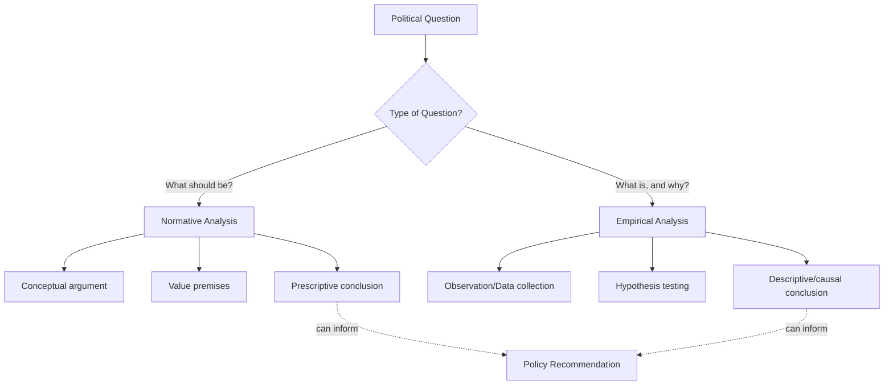

## Normative and Empirical Approaches to Political Analysis

### Overview

Political analysis proceeds along two fundamentally different but interrelated axes: the **normative** (concerned with what *ought to be*) and the **empirical** (concerned with what *is*). This distinction shapes research questions, methods, evidentiary standards, and the kinds of claims political scientists can defensibly make. Understanding the difference — and where the two approaches interact — is essential to reading and producing political science scholarship correctly.

### Defining the Two Approaches

**Key Points**

- **Normative analysis** evaluates political phenomena against standards of value — justice, rights, legitimacy, the good — and asks how political life *should* be organized.
- **Empirical analysis** describes, explains, and predicts political phenomena as they actually occur, using observation, evidence, and systematic methods, and asks how political life actually *is* organized and *why*.
- The distinction parallels the philosophical **is-ought problem** articulated by David Hume — the observation that descriptive premises alone cannot logically entail prescriptive conclusions without an additional value premise (**Hume's Guillotine** or the **naturalistic fallacy** as later elaborated by G.E. Moore).

| Dimension | Normative Approach | Empirical Approach |
| --- | --- | --- |
| Core question | What *should* be the case? | What *is* the case, and why? |
| Standard of evaluation | Values (justice, liberty, equality) | Evidence (data, observation) |
| Typical claims | Prescriptive/evaluative | Descriptive/explanatory |
| Falsifiability | Not directly falsifiable | In principle falsifiable |
| Example subfield | Political theory | Comparative politics, IR (behavioral tradition) |
| Representative question | Is democracy the most just form of government? | Under what conditions do democracies emerge and persist? |

### Normative Political Analysis

**Key Points**

- Rooted in political philosophy, normative analysis constructs and defends arguments about the proper ends and means of political life.
- Central normative concepts include justice, rights, liberty, equality, legitimacy, the common good, and political obligation.
- Methods are argumentative and conceptual rather than data-driven: conceptual analysis, thought experiments, logical derivation from premises, and engagement with the history of political thought.

**Major Normative Frameworks**

1. **Utilitarianism** (Jeremy Bentham, John Stuart Mill) — evaluates political arrangements by their consequences for aggregate welfare or happiness.
2. **Deontological/Rights-based theory** (Immanuel Kant; in politics, Robert Nozick) — evaluates arrangements by adherence to duties, rights, and principles regardless of consequences.
3. **Justice as Fairness** (John Rawls) — derives principles of justice from a hypothetical original position behind a "veil of ignorance."
4. **Communitarianism** (Michael Sandel, Alasdair MacIntyre) — critiques liberal individualism, emphasizing community, tradition, and shared conceptions of the good.
5. **Feminist and Critical Theory** — interrogates how power, gender, race, and class shape (and are obscured by) supposedly neutral political concepts and institutions.

**Example**

The normative question "Should wealth be redistributed through taxation?" cannot be settled by data alone. Rawlsian theory would argue for redistribution that benefits the least advantaged (the "difference principle"), while a Nozickian libertarian framework would argue that redistribution violates individual property rights acquired through just transfer — the disagreement is over *values*, not facts.

### Empirical Political Analysis

**Key Points**

- Empirical analysis aims to produce falsifiable, evidence-based claims about political behavior, institutions, and outcomes.
- Associated historically with the **behavioral revolution** of the 1950s–60s, which pushed the discipline toward hypothesis testing, operationalized variables, and statistical inference modeled partly on the natural sciences.
- Core empirical tasks: description (what happened), explanation (why it happened), and prediction (what will happen under specified conditions).

**Empirical Methods**

- **Quantitative** — statistical analysis of large datasets, regression models, survey research, experiments (lab, field, survey experiments)
- **Qualitative** — case studies, process tracing, comparative-historical analysis, elite interviews, ethnography
- **Formal** — game-theoretic and rational choice models generating testable hypotheses

**Example**

The empirical question "Does proportional representation increase the number of political parties?" can be tested using cross-national electoral data — this is a version of **Duverger's Law**, an empirical proposition linking electoral system design (plurality vs. proportional) to party system fragmentation, testable and falsifiable against real election outcomes.

### The Is-Ought Problem in Practice

**Key Points**

- Hume's observation means that a purely empirical finding (e.g., "democracies rarely fight each other") cannot by itself justify a normative conclusion (e.g., "we ought to promote democracy abroad") without an additional value premise (e.g., "peace is good" or "we ought to prevent war").
- [Inference] In practice, most political science scholarship implicitly or explicitly bridges the two: empirical findings are often marshaled in service of normative arguments, and normative commitments frequently shape which empirical questions are asked in the first place (e.g., feminist scholars empirically investigating gender gaps in political representation because of a prior normative commitment to gender equality).

**Formal Structure of the Is-Ought Gap**

$$P_1: \text{Empirical premise (what is the case)}$$

$$P_2: \text{Value premise (what ought to matter)}$$

$$C: \text{Normative conclusion (what ought to be done)}$$

Without $P_2$, $C$ does not validly follow from $P_1$ alone.

### Where the Two Approaches Interact

| Interaction Type | Description | Example |
| --- | --- | --- |
| Empirically-informed normative theory | Normative arguments incorporate empirical findings about feasibility or consequences | Rawlsian theory adjusted by empirical findings on economic incentive effects |
| Normatively-motivated empirical research | Value commitments motivate the choice of empirical research questions | Studying causes of electoral fraud due to a prior commitment to democratic integrity |
| Policy analysis | Explicitly combines empirical prediction of policy effects with normative criteria for evaluating desirability | Cost-benefit analysis weighted by a normative standard of fairness |

### Methodological Debates

- **Positivism vs. Post-positivism** — [Inference] Positivist approaches (associated with the behavioral tradition) hold that political science should emulate natural-science objectivity; post-positivist and interpretivist critiques (including constructivism and critical theory) argue that political phenomena are meaning-laden and cannot be studied as if from a value-neutral standpoint, blurring the normative/empirical line more than positivists acknowledge.
- **Value-neutrality (Wertfreiheit)** — Max Weber argued social scientists should strive to separate empirical analysis from personal value judgments in their scholarly role, even while acknowledging values inevitably shape which questions researchers choose to study.
- **Post-behavioralism** — David Easton's post-behavioral critique (1969) argued that empirical rigor alone was insufficient; political science needed to remain relevant to normative concerns and real-world crises, partially reintegrating the two approaches after the behavioral revolution had emphasized empirical methods almost exclusively.

### Worked Example: Integrating Both Approaches

**Example**

Research question: *"Should countries adopt compulsory voting?"*

- **Empirical component**: Does compulsory voting increase turnout? Does it change the demographic composition of the electorate? Does it affect policy outcomes? (Testable via cross-national comparison, e.g., Australia vs. similar non-compulsory democracies.)
- **Normative component**: Is compelling citizens to vote a legitimate use of state power, or does it violate individual liberty? Does higher turnout produce a normatively preferable, more representative democracy?
- **Integration**: A complete policy recommendation requires both empirical evidence on effects *and* a normative framework for judging whether those effects are desirable and whether the means (compulsion) are justifiable.

### Related Topics

- Defining Politics, Power, and Authority
- Political Science as an Academic Discipline
- The Subfields and Scope of Political Science
- The Behavioral Revolution and Post-Behavioralism
- Major Theories of Justice (Utilitarianism, Rawlsian Liberalism, Libertarianism)
- Positivism, Interpretivism, and Constructivism in Political Research
- Research Design in Political Science