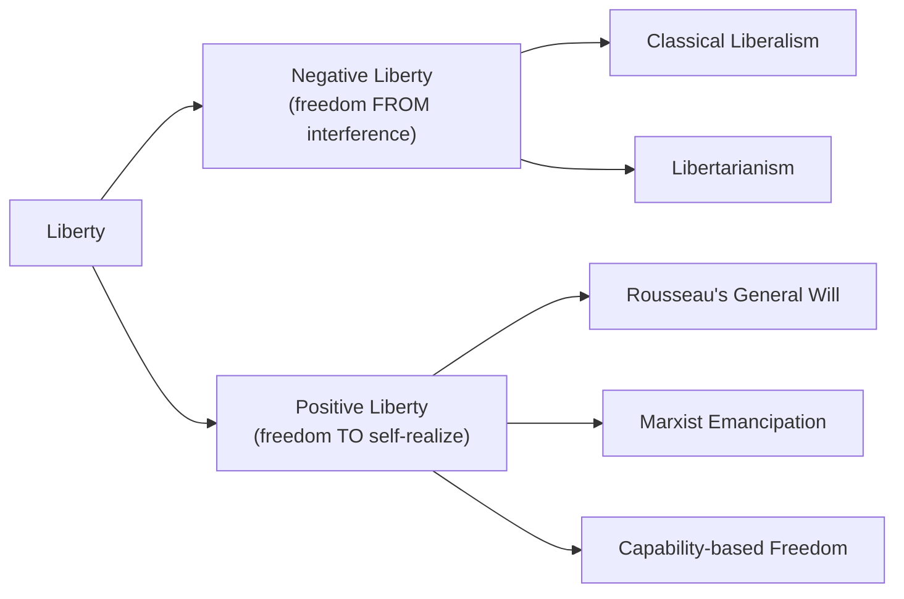
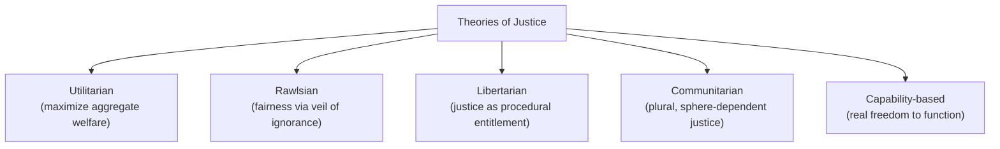
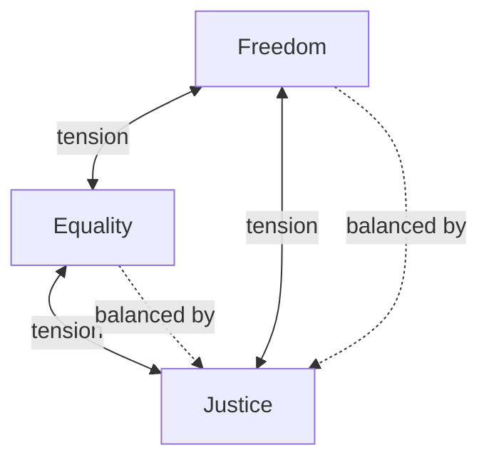

## Core Concepts: Freedom, Equality, and Justice

### Overview

Freedom, equality, and justice are the three most foundational normative concepts in political theory. Nearly every ideological and philosophical tradition in political science defines itself partly through how it interprets and prioritizes these concepts. They are also frequently in tension with one another — expanding one can constrain another — which is why debates over their proper definition and balance drive much of political theory and ideological conflict.

### Freedom (Liberty)

**Key Points**

- Freedom (or liberty) concerns the absence of constraint on individual action and/or the presence of capacities to act and self-govern.
- The most influential analytical distinction is Isaiah Berlin's **"Two Concepts of Liberty"** (1958).

**Berlin's Two Concepts of Liberty**

1. **Negative liberty** — freedom *from* external interference or coercion by others; the absence of obstacles imposed by other agents. Associated with classical liberalism and libertarianism (Hobbes, Locke, Mill, Hayek, Nozick).
2. **Positive liberty** — freedom *to* achieve self-mastery, self-realization, or genuine autonomy; often requires enabling conditions (education, resources, capabilities) rather than mere absence of interference. Associated with Rousseau, Hegelian and Marxist traditions, and some strands of republicanism.

**Additional Conceptions**

- **Republican liberty** (Philip Pettit, Quentin Skinner) — freedom as **non-domination**: the absence not merely of actual interference, but of the *capacity* of another to arbitrarily interfere, even if that capacity is not exercised. Distinct from both Berlin's categories.
- **Capability approach** (Amartya Sen, Martha Nussbaum) — freedom understood as the real opportunity ("capability") to achieve valued functionings (health, education, political participation), not merely formal rights.

**Example**

A citizen living under a benevolent dictator who never actually interferes with their daily choices might have negative liberty (no interference occurring) but lack republican liberty (the dictator retains arbitrary power to interfere at will) — illustrating why Pettit's framework is treated as analytically distinct from Berlin's.

### Equality

**Key Points**

- Equality concerns the degree to which individuals are treated the same, or possess the same status, opportunities, or resources.
- A central analytical question in political theory, following Amartya Sen's influential framing, is **"equality of what?"** — equality can be sought across multiple different dimensions, and these produce different, often conflicting, policy implications.

**Dimensions of Equality**

1. **Formal/legal equality** — equal treatment under the law regardless of status (equal civil and political rights).
2. **Equality of opportunity** — equal starting conditions or access to competition for social positions, regardless of unequal outcomes.
3. **Equality of outcome** — equal (or equalized) final distribution of goods, income, or welfare.
4. **Equality of resources** (Ronald Dworkin) — equal distribution of resources, adjusted for factors within individual control (choice) versus outside it (luck).
5. **Equality of capability** (Sen, Nussbaum) — equal real freedom to achieve valued functionings, rather than equal resources or outcomes per se.

| Dimension | Focus | Key Proponent |
| --- | --- | --- |
| Formal/legal | Equal rights under law | Classical liberalism |
| Opportunity | Equal starting conditions | Meritocratic liberalism |
| Outcome | Equal final distribution | Egalitarian socialism |
| Resources | Equalized resources net of choice | Ronald Dworkin |
| Capability | Equal real freedom to function | Amartya Sen, Martha Nussbaum |

**Example**

Two policies aimed at "equality" can conflict: a strict equality-of-outcome policy (equalizing final income via heavy redistribution) may require overriding the equality-of-opportunity principle that individuals should keep the fruits of their unequal effort or talent — illustrating why "equality" is not a single, uncontested value but a family of related, sometimes competing, principles.

### Justice

**Key Points**

- Justice concerns the fair and proper distribution of benefits, burdens, rights, and punishments within a political community — it is often treated as the overarching value that freedom and equality must be balanced within.
- Political philosophy typically distinguishes **distributive justice** (fair allocation of goods/resources), **procedural justice** (fairness of the process by which outcomes are reached), and **retributive/corrective justice** (fairness in response to wrongdoing).

**Major Theories of Justice**

1. **Utilitarian justice** (Bentham, Mill) — justice consists in whatever arrangement maximizes aggregate welfare or utility.
2. **Rawlsian justice as fairness** (John Rawls, *A Theory of Justice*, 1971) — two principles derived from a hypothetical "original position" behind a "veil of ignorance": (a) equal basic liberties for all, and (b) social/economic inequalities are permissible only if they benefit the least advantaged (**difference principle**) and are attached to positions open to all under fair equality of opportunity.
3. **Libertarian justice** (Robert Nozick, *Anarchy, State, and Utopia*, 1974) — justice is purely procedural: a distribution is just if it arose through just acquisition and just transfer, regardless of the resulting pattern of inequality; redistributive taxation is treated as a rights violation.
4. **Communitarian justice** (Michael Walzer, *Spheres of Justice*) — justice is plural and context-dependent, varying by social sphere (money, education, political power should not be distributed by the same criterion).
5. **Capability-based justice** (Sen, Nussbaum) — justice assessed by whether individuals have genuine capability to achieve valued functionings, not merely formal rights or resources.

### Rawls's Two Principles in Detail

**Key Points**

1. **The Liberty Principle** — each person has an equal right to the most extensive basic liberties compatible with similar liberties for all.
2. **The Difference Principle (with Fair Equality of Opportunity)** — social and economic inequalities are justified only if (a) attached to positions open to all under conditions of fair equality of opportunity, and (b) they work to the greatest benefit of the least advantaged members of society.

- Rawls specifies a **lexical priority**: the liberty principle takes precedence over the difference principle — basic liberties cannot be traded away for economic gains.

**Example**

Under Rawls's framework, a policy permitting income inequality would be just only if the inequality (e.g., higher pay for surgeons) results in incentives that ultimately improve outcomes for the worst-off group (e.g., better healthcare availability) more than a strictly equal distribution would.

### The Interplay and Tensions Among the Three Concepts

**Key Points**

- **Freedom vs. Equality**: Extensive redistribution to achieve equality of outcome may require constraining individual economic liberty (taxation, regulation); conversely, extensive negative liberty (unconstrained markets) tends to generate unequal outcomes over time.
- **Equality vs. Justice**: A perfectly equal distribution may be considered unjust if it ignores differential effort, need, or desert (as communitarian and desert-based theories argue).
- **Freedom vs. Justice**: Libertarian theories treat maximal freedom (non-interference with property) as itself constitutive of justice, while egalitarian theories treat constrained freedom (redistribution) as a requirement of justice.

### Ideological Mapping

| Ideology | Primary Emphasis | Typical View of Freedom | Typical View of Equality |
| --- | --- | --- | --- |
| Classical Liberalism | Negative liberty | Maximal, minimal state interference | Formal/legal equality only |
| Social Democracy | Balanced freedom and equality | Positive liberty via enabling state | Equality of opportunity, moderate outcome equalization |
| Socialism | Equality primary | Positive/collective liberty | Equality of outcome |
| Libertarianism | Negative liberty primary | Minimal state, strong property rights | Formal equality only; rejects redistribution |
| Communitarianism | Justice as socially embedded | Liberty constituted by community membership | Context-dependent, sphere-based equality |

### Worked Example: Applying All Three Concepts

**Example**

Consider a debate over a universal basic income (UBI) policy:

- **Freedom**: Proponents argue UBI enhances *positive* and *republican* liberty by freeing individuals from economic domination (e.g., dependence on an exploitative employer); critics argue redistributive taxation to fund it violates *negative* liberty (property rights).
- **Equality**: UBI advances equality of resources and moves toward equality of outcome; critics note it does not address equality of opportunity issues rooted in education or social capital.
- **Justice**: A Rawlsian would assess UBI by whether it benefits the least advantaged (likely favorable under the difference principle); a Nozickian libertarian would assess it as an unjust taking regardless of its distributive effects.

### Related Topics

- Normative and Empirical Approaches to Political Analysis
- Major Ideologies: Liberalism, Conservatism, Socialism
- Theories of the State and Sovereignty
- Democratic Theory and Models of Democracy
- Human Rights: Philosophical Foundations
- Amartya Sen's Capability Approach in Depth
- Distributive Justice and Welfare Economics