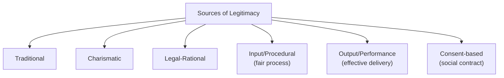
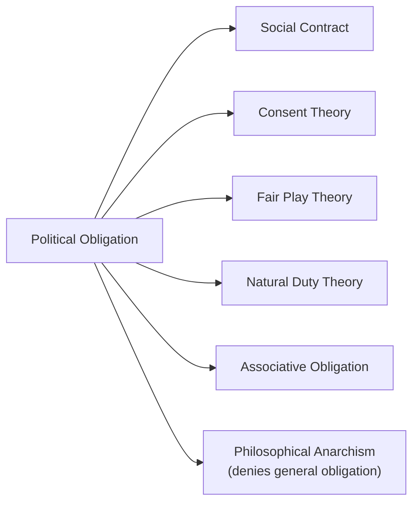

## Legitimacy and Political Obligation

### Overview

Legitimacy and political obligation address a shared foundational question: why should citizens obey the state at all? **Legitimacy** concerns the grounds on which political authority can rightfully claim obedience, while **political obligation** concerns whether, and why, individual citizens have a genuine moral duty to obey. The two concepts are closely linked but analytically distinct — legitimacy is a property of the authority/regime, while obligation is a property of the citizen's relationship to it.

### Defining Legitimacy

**Key Points**

- Legitimacy refers to the rightfulness of a claim to political authority — the quality that transforms mere power into authority (see *Defining Politics, Power, and Authority*).
- Political science distinguishes **normative legitimacy** (whether a regime *really is* justified according to some philosophical standard) from **sociological/empirical legitimacy** (whether a regime *is believed* to be justified by those subject to it, regardless of philosophical merit).
- Max Weber's sociological approach treats legitimacy as a belief held by the governed, independent of whether that belief is philosophically well-founded — this is the origin of his three-fold typology (traditional, charismatic, legal-rational).

| Type | Normative Legitimacy | Sociological/Empirical Legitimacy |
| --- | --- | --- |
| Focus | Is the authority *actually* justified? | Is the authority *believed* to be justified? |
| Discipline | Political philosophy | Political sociology, behavioral political science |
| Method | Philosophical argument | Surveys, public opinion, observed compliance |
| Example question | Does majority rule generate morally binding authority? | Do citizens report trusting/accepting government institutions? |

### Sources of Legitimacy

**Key Points**

Legitimacy can derive from multiple, potentially overlapping sources:

1. **Traditional** — legitimacy from long-standing custom and historical continuity (Weber)
2. **Charismatic** — legitimacy from extraordinary personal qualities of a leader (Weber)
3. **Legal-rational** — legitimacy from adherence to formally enacted rules and procedures (Weber)
4. **Procedural/input legitimacy** — legitimacy from fair, participatory decision-making processes (elections, consultation, deliberation)
5. **Performance/output legitimacy** — legitimacy from effective delivery of public goods, security, and welfare
6. **Consent-based legitimacy** — legitimacy from the actual or hypothetical agreement of the governed (social contract tradition)

**Example**

A government that wins power through free elections (procedural legitimacy) but then fails catastrophically to deliver basic services (low output legitimacy) may experience an erosion of overall legitimacy over time — illustrating that legitimacy is not derived from a single source and can be contested even when one dimension is satisfied.

### Defining Political Obligation

**Key Points**

- Political obligation is the question of whether citizens have a **moral** (not merely legal or prudential) duty to obey the laws and institutions of their state.
- It is distinct from mere *compliance* (obeying out of fear of punishment or habit) — political obligation asks whether there is a genuine moral reason to obey, independent of self-interest.
- The **"problem of political obligation"** is a central puzzle in political philosophy: it is surprisingly difficult to construct an argument that generates a *general* obligation to obey (binding on all citizens, to all laws, all the time).

### Major Theories of Political Obligation

**1. Social Contract Theory**

- **Thomas Hobbes** (*Leviathan*, 1651) — individuals in the "state of nature" face a "war of all against all"; they consent (even if tacitly, out of necessity) to an absolute sovereign in exchange for security, generating near-total obligation to obey.
- **John Locke** (*Two Treatises of Government*, 1689) — individuals possess natural rights (life, liberty, property) even in the state of nature; government is legitimate only by consent and exists to protect these rights; obligation is conditional and forfeited if government violates its trust (grounding a right of revolution).
- **Jean-Jacques Rousseau** (*The Social Contract*, 1762) — legitimate authority arises from the **General Will**; obligation stems from participation in a self-governing political community, not obedience to an external sovereign.

**2. Consent Theory**

- Obligation arises from an individual's actual agreement (express or tacit) to be governed.
- **Problem**: Few citizens ever explicitly consent; "tacit consent" arguments (e.g., continued residence implies consent, per Locke) are widely criticized as too weak to generate genuine obligation (famously critiqued by David Hume).

**3. Fair Play / Fairness Theory**

- Associated with H.L.A. Hart and John Rawls's early work: obligation arises from benefiting from a mutually beneficial cooperative scheme (e.g., public goods); those who accept benefits without doing their part are "free-riding."
- **Problem**: Critics (notably Robert Nozick) argue that merely *receiving* benefits one did not request cannot generate obligation.

**4. Natural Duty Theory**

- Obligation derives not from voluntary acts (consent, fair play) but from a general natural duty to support and comply with just institutions, independent of one's personal relationship to them (associated with a strand of Rawlsian theory).

**5. Associative/Communitarian Obligation**

- Obligation arises from membership in a political community, analogous to obligations of family or friendship — not chosen, but constitutive of one's identity (associated with communitarian theorists like Michael Walzer and Ronald Dworkin's "associative obligations").

**6. Philosophical Anarchism**

- Associated with Robert Paul Wolff (*In Defense of Anarchism*, 1970) and A. John Simmons — the position that no satisfactory general justification for political obligation exists; individuals retain full autonomy and no state has a valid claim to their obedience as a matter of moral necessity (though this need not entail active resistance to the state).

| Theory | Basis of Obligation | Major Weakness |
| --- | --- | --- |
| Social Contract | Hypothetical/actual agreement | Contract is often fictional/counterfactual |
| Consent | Actual individual consent | Most citizens never explicitly consent |
| Fair Play | Benefiting from cooperative scheme | Unrequested benefits may not bind |
| Natural Duty | General duty to support just institutions | Does not explain obligation to *one's own* particular state |
| Associative | Communal membership | Risks conflating obligation with mere belonging |
| Philosophical Anarchism | N/A — denies general obligation exists | Leaves practical relationship to law unresolved |

### Legitimacy vs. Political Obligation: Key Distinctions

| Aspect | Legitimacy | Political Obligation |
| --- | --- | --- |
| Subject | The state/authority | The individual citizen |
| Core question | Does this authority have the right to rule? | Do I have a duty to obey this authority? |
| Can exist independently? | A state can be legitimate even if some citizens lack full personal obligation (e.g., conscientious objectors) | An individual might feel obligated to a regime others consider illegitimate |
| Relationship | Legitimacy is typically necessary but [Inference] not sufficient on its own to generate obligation in every philosophical framework — most theories require an additional link (consent, benefit, fair play) connecting a legitimate authority to a *particular* citizen's duty | Obligation typically presupposes some degree of legitimacy, though philosophical anarchists deny the inference holds even then |

### The Problem of Particularity

**Key Points**

- A major challenge across nearly all theories of political obligation is the **"particularity requirement"**: an adequate theory must explain not just why individuals should obey *some* just state, but why they are obligated to obey **their own** particular state specifically.
- [Inference] This is widely regarded by political philosophers (notably A. John Simmons) as one of the most difficult unresolved problems in the literature, since most general arguments (e.g., "obey just institutions") do not by themselves single out any one state as the object of a citizen's obligation.

### Legitimacy Crises and Erosion

**Key Points**

- A **legitimacy crisis** occurs when a significant portion of the governed withdraw their belief in a regime's right to rule, even absent a change in the formal legal-constitutional order.
- Common triggers: perceived corruption, electoral fraud, economic mismanagement (output legitimacy failure), violation of constitutional norms, or loss of charismatic authority following a leader's death or discrediting.
- Legitimacy crises are central to theories of **regime transition** and **revolution** in comparative politics.

**Example**

The collapse of Eastern Bloc communist regimes in 1989 is often analyzed as a legitimacy crisis in which decades of eroding output legitimacy (economic stagnation) combined with the withdrawal of external enforcement (Soviet backing) led to rapid loss of perceived right to rule, despite unchanged formal constitutional structures until the collapse itself.

### Worked Example: Applying the Framework

**Example**

Consider a citizen who disagrees with a specific law (e.g., a tax increase) passed by a democratically elected government.

- **Legitimacy question**: Was the law enacted through a procedurally legitimate process (fair elections, constitutional procedure)? If so, the *regime's* legitimacy to enact laws generally is intact.
- **Obligation question**: Does this particular citizen have a moral duty to obey *this specific law*, even though they disagree with it? A consent theorist would look for evidence of the citizen's agreement to the electoral system; a fair-play theorist would ask whether the citizen benefits from other public goods the tax system funds; a philosophical anarchist would deny any automatic duty exists regardless of the law's legitimate origin.

### Related Topics

- Defining Politics, Power, and Authority
- Theories of the Social Contract (Hobbes, Locke, Rousseau)
- Theories of the State and Sovereignty
- Core Concepts: Freedom, Equality, and Justice
- Democratic Theory and Models of Democracy
- Civil Disobedience and the Right to Resist
- Regime Transitions and Theories of Revolution