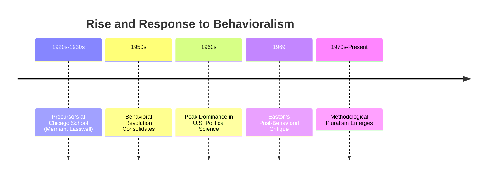
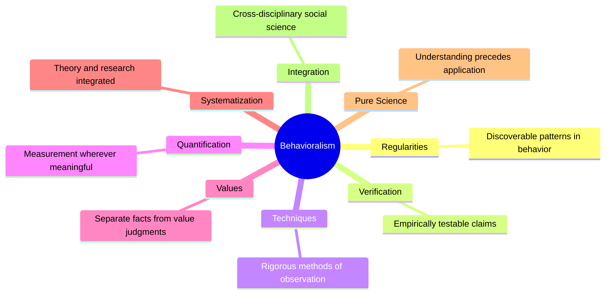
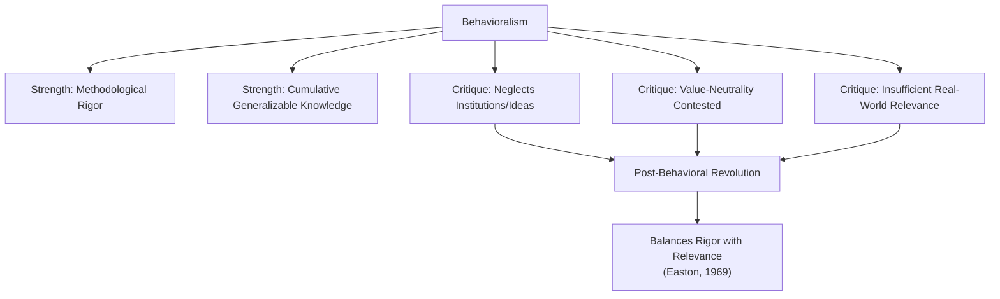

## Behavioralism and the Scientific Study of Politics

### Overview

Behavioralism (also called the behavioral approach or behavioralism) was a major methodological movement in political science, dominant roughly from the 1950s through the 1960s, that sought to transform the discipline into a rigorous empirical science modeled on the natural sciences. It shifted the field's focus from formal-legal institutions to the actual **behavior** of political actors — voters, legislators, interest groups — and insisted on systematic, quantifiable, hypothesis-driven research. Its legacy fundamentally reshaped how political science is practiced, even as it provoked significant methodological backlash.

### Historical Context and Origins

**Key Points**

- Behavioralism emerged as a reaction against the earlier **traditional/institutional approach**, which dominated political science through the early 20th century and focused on formal description of constitutions, laws, and government structures, often through historical or legalistic narrative rather than systematic empirical testing.
- Influenced heavily by advances in psychology (behaviorism, associated with figures like B.F. Skinner), sociology (structural-functionalism, survey research), and statistics.
- Key institutional centers included the University of Chicago (Charles Merriam, Harold Lasswell in the interwar period, considered important precursors) and later the University of Michigan (home of the American National Election Studies).
- David Easton is widely credited with articulating and systematizing behavioralism's core tenets as a self-conscious movement in the 1950s–60s.

### Core Tenets of Behavioralism

David Easton articulated a set of core intellectual commitments, often summarized as the "eight foundations" of behavioralism:

1. **Regularities** — political behavior displays discoverable uniformities that can be expressed as generalizations or theories.
2. **Verification** — the validity of generalizations must be testable, in principle, against relevant behavior.
3. **Techniques** — research methods and tools of observation must be rigorously selected and justified.
4. **Quantification** — measurement and quantification are valued wherever meaningful and possible.
5. **Values** — ethical evaluation and empirical explanation involve two distinct kinds of propositions that should be kept analytically separate.
6. **Systematization** — research should be systematic, with theory and research mutually informing each other.
7. **Pure science** — understanding and explaining political behavior logically (though not necessarily chronologically) precedes application to practical problems.
8. **Integration** — political science should be integrated with other social sciences, given the interconnectedness of social behavior.

### Methodological Shift: From Institutions to Behavior

| Dimension | Traditional/Institutional Approach | Behavioral Approach |
| --- | --- | --- |
| Unit of analysis | Formal institutions (constitutions, legislatures) | Individual and group behavior (voters, legislators, elites) |
| Primary method | Historical/legal description, normative argument | Statistical analysis, survey research, quantification |
| Goal | Descriptive and evaluative understanding | Explanation and prediction via testable hypotheses |
| Data source | Legal texts, historical records | Surveys, roll-call votes, aggregate behavioral data |
| Underlying assumption | Institutions shape political outcomes directly | Individual/group behavior, shaped by psychological and social factors, is the fundamental unit driving political outcomes |

**Example**

Where a traditional institutionalist might study "the U.S. Congress" by analyzing its constitutional powers and formal legislative procedures, a behavioralist would instead study **how individual legislators actually vote** — using roll-call data to identify behavioral patterns, ideological dimensions, and the influence of constituency pressures, testing hypotheses about what drives legislative behavior.

### Key Substantive Contributions

- **Voting behavior research** — landmark studies such as *The American Voter* (Campbell, Converse, Miller, and Stokes, 1960) used survey data to develop the influential **"funnel of causality"** and party identification models of voting behavior.
- **Elite and pluralist studies** — Robert Dahl's *Who Governs?* (1961) applied behavioral methods to study decision-making power empirically in New Haven, Connecticut, grounding the pluralist theory of democracy in observed behavior (the "first face" of power).
- **Political culture research** — Gabriel Almond and Sidney Verba's *The Civic Culture* (1963) used cross-national survey data to compare political attitudes and their relationship to democratic stability.
- **Systems theory** — David Easton's own systems model of political life (inputs, conversion process, outputs, feedback) provided a behaviorally-oriented theoretical framework for analyzing political systems generically.

### Strengths of the Behavioral Approach

**Key Points**

- Introduced methodological rigor: hypothesis testing, operationalized variables, replicable procedures.
- Enabled cumulative, generalizable knowledge rather than isolated case descriptions.
- Opened political science to interdisciplinary tools from statistics, psychology, and sociology.
- Provided the methodological foundation for much of modern empirical political science, including contemporary survey research, experimental political science, and quantitative comparative politics.

### Criticisms and the Post-Behavioral Response

**Key Points**

- **Narrow scope** — critics argued behavioralism's focus on observable, quantifiable behavior neglected important but harder-to-measure phenomena (institutions, ideas, historical context, power's "second" and "third" faces).
- **Value-neutrality critique** — the claim that research could be strictly separated from normative values was contested; critics argued that choice of research questions and interpretive frameworks inevitably reflect value commitments.
- **Irrelevance to practical problems** — behavioralism was criticized for prioritizing methodological sophistication over engagement with pressing real-world political crises (civil rights movement, Vietnam War, urban unrest of the 1960s).
- **David Easton's own post-behavioral critique (1969)**, delivered in his APSA presidential address **"The New Revolution in Political Science,"** argued the discipline needed a **"post-behavioral revolution"** to balance empirical rigor ("relevance") with engagement with pressing social and normative problems, without abandoning behavioral rigor entirely.

### Legacy: Post-Behavioralism and Beyond

**Key Points**

- Post-behavioralism did not reject behavioral methods but sought to reintegrate normative concern and institutional/historical context alongside empirical rigor.
- The subsequent **rational choice/new institutionalist** wave (1980s–90s) partly re-centered institutions, but analyzed them through formal, behaviorally-grounded models of individual incentives rather than a return to purely descriptive institutionalism.
- Contemporary political science reflects a **methodologically pluralist settlement**: quantitative behavioral methods remain dominant in American politics and much of comparative politics, while qualitative, interpretive, and normative theoretical approaches retain significant standing, particularly in political theory and constructivist IR.
- [Inference] The "Perestroika" movement within APSA in the early 2000s can be read as a later echo of the post-behavioral critique, again pushing back against perceived over-reliance on quantitative/formal methods in favor of methodological pluralism.

### Worked Example: Behavioral vs. Institutional Analysis of the Same Question

**Example**

Research question: *"Why did a particular piece of civil rights legislation pass in a given year?"*

- **Traditional/institutional approach**: Examine the formal legislative process — committee structure, constitutional requirements for passage, the text of the law itself, and the historical narrative of its enactment.
- **Behavioral approach**: Analyze roll-call voting data to identify which legislator characteristics (party, constituency demographics, ideology scores) predicted support; survey public opinion data to assess mass attitudes and their influence on legislator behavior; model legislative behavior as a function of measurable variables.
- **Post-behavioral synthesis**: Combine behavioral data analysis with attention to institutional context (committee gatekeeping, procedural rules) and normative stakes (the moral urgency of civil rights), reflecting Easton's call to balance rigor and relevance.

### Related Topics

- Political Science as an Academic Discipline
- Normative and Empirical Approaches to Political Analysis
- The Subfields and Scope of Political Science
- Robert Dahl and Pluralist Theory
- David Easton's Systems Theory of Politics
- Rational Choice Theory and New Institutionalism
- Research Methods in Political Science (Quantitative, Qualitative, Mixed)