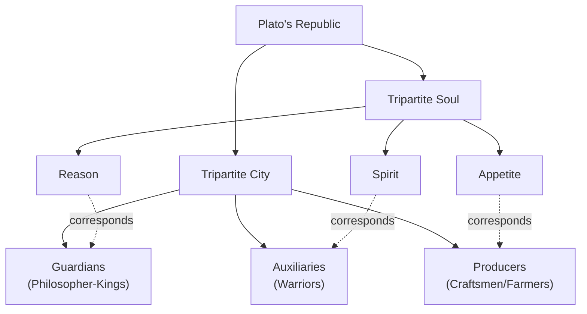
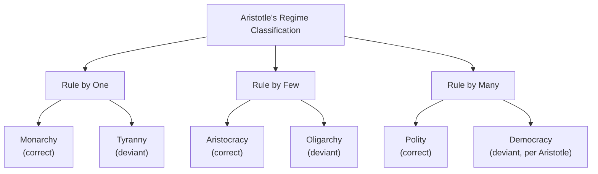

## Political Thought in Ancient Greece

### Overview

Ancient Greek political thought (roughly 8th–4th century BCE) established the conceptual vocabulary and foundational questions of Western political philosophy: the nature of justice, the best form of government, the relationship between the individual and the community, and the purpose of political life itself. It emerged from the unique institutional context of the Greek **polis** (city-state) and reached its most systematic expression in the works of Plato and Aristotle, though it also encompassed earlier philosophers, sophists, and historians.

### The Polis as Political Context

**Key Points**

- The **polis** was a small, self-governing city-state, the fundamental political unit of ancient Greece — Athens, Sparta, Thebes, Corinth, and hundreds of others.
- Aristotle characterized the human being as a **"zoon politikon"** — a "political animal" — arguing that humans are by nature suited to live in a polis, and that a person outside political community is either a beast or a god.
- Greek political thought was thus fundamentally **communitarian and civic**: political life was not viewed as external to human flourishing but as constitutive of it (the *eudaimonia*, or "flourishing/good life," of the citizen).
- Citizenship was exclusive — restricted to free adult males, excluding women, slaves, and resident foreigners (*metics*) — a limitation that shaped, and is often criticized in light of, the scope of Greek political theorizing.

### Pre-Socratic and Sophist Contributions

**Key Points**

- Before Socrates, Greek political thinking existed largely in practical and legal form (e.g., the reforms of **Solon** in Athens, c. 594 BCE, addressing debt bondage and expanding political participation) rather than systematic philosophy.
- The **Sophists** (5th century BCE) were itinerant teachers who introduced influential — and controversial — ideas:
  - **Protagoras** — associated with moral and epistemic relativism ("man is the measure of all things"), implying that justice and law are conventional (*nomos*) rather than natural (*physis*).
  - The **nomos/physis debate** — a central Sophist-era controversy over whether justice and political norms are products of human convention/agreement (*nomos*) or reflect an objective natural order (*physis*). This debate structures much of subsequent Greek political philosophy, particularly Plato's response.
  - Some Sophists (as represented in Plato's dialogues, e.g., Thrasymachus in the *Republic*) argued that justice is merely **"the advantage of the stronger"** — an early articulation of a power-based, skeptical view of justice that Plato's *Republic* is substantially structured to refute.

### Socrates

**Key Points**

- Socrates (c. 470–399 BCE) left no writings; his political thought is known primarily through Plato's dialogues.
- Central method: the **Socratic method (elenchus)** — systematic questioning to expose contradictions in interlocutors' beliefs, used to pursue definitions of key ethical/political concepts (justice, piety, courage).
- Political significance: Socrates was tried and executed by Athens for **impiety and corrupting the youth** (399 BCE) — an event that profoundly shaped Plato's skepticism toward Athenian democracy, as depicted in the *Apology* and *Crito*.
- In the *Crito*, Socrates is depicted arguing (via a form of implicit social contract reasoning) that he has an obligation to accept the polis's laws and his sentence, even though he considers the verdict unjust — an early and influential treatment of political obligation.

### Plato

**Key Points**

- Plato (c. 428–348 BCE), a student of Socrates, founded the **Academy** in Athens and authored the *Republic*, the *Statesman*, and the *Laws*, among other dialogues.
- The *Republic* addresses the central question **"What is justice?"** and constructs an ideal city (*kallipolis*) as an analogy to the just soul.

**The Tripartite Soul and the Tripartite City**

| Element of Soul | Corresponding Class | Virtue |
| --- | --- | --- |
| Reason (*logistikon*) | Guardians/Philosopher-Kings | Wisdom |
| Spirit (*thymoeides*) | Auxiliaries (warriors) | Courage |
| Appetite (*epithymetikon*) | Producers (craftsmen, farmers) | Moderation |

- **Justice**, for Plato, consists in each part of the soul/class performing its proper function without interference in the others — a harmony-based rather than distributive conception of justice, distinct from later egalitarian or procedural theories.
- Plato advocated rule by **philosopher-kings** — those who have grasped the **Theory of Forms**, particularly the Form of the Good, through rigorous philosophical education, are uniquely qualified to rule justly.
- Plato was deeply critical of Athenian **democracy**, associating it with rule by the uninformed many, susceptibility to demagoguery, and a slide toward tyranny (the *Republic*'s account of regime degeneration).

**Plato's Cycle of Regime Degeneration** (*Republic*, Book VIII)

Aristocracy (rule of the best) → Timocracy (rule of honor-seekers) → Oligarchy (rule of the wealthy) → Democracy (rule of the many, prone to license) → Tyranny (rule of one, by force)

### Aristotle

**Key Points**

- Aristotle (384–322 BCE), Plato's student, founded the **Lyceum** and authored the *Politics* and the *Nicomachean Ethics*, taking a more empirical and comparative approach than Plato.
- Rejected Plato's Theory of Forms as a guide to politics; instead relied on **empirical classification** — the *Politics* reportedly drew on a comparative survey of 158 Greek constitutions (largely lost, except the *Constitution of the Athenians*).

**Aristotle's Six-Fold Classification of Regimes**

Aristotle classified constitutions along two axes: **number of rulers** (one, few, many) and **orientation of rule** (common good vs. self-interest of rulers).

| Number of Rulers | Rule for Common Good (Correct) | Rule for Self-Interest (Deviant) |
| --- | --- | --- |
| One | Monarchy | Tyranny |
| Few | Aristocracy | Oligarchy |
| Many | Polity (*politeia*) | Democracy |

- Note: Aristotle's use of "democracy" here denotes a **deviant** form (rule by the poor majority in their own class interest); his preferred "correct" rule-by-many form is **polity**, a mixed constitution balancing oligarchic and democratic elements.

**Additional Aristotelian Concepts**

- **Teleology** — Aristotle argued the polis exists "by nature" and serves the *telos* (end/purpose) of enabling the good life, echoing his broader teleological metaphysics.
- **The Mixed Constitution (Polity)** — Aristotle favored a moderate, mixed regime blending oligarchic and democratic elements, governed by a large, stable **middle class**, as the most practically stable and just achievable regime — an early argument for what would later influence theories of mixed/balanced government.
- **Distributive justice** — in the *Nicomachean Ethics*, Aristotle developed an early theory of distributive justice based on proportionate merit/desert rather than strict numerical equality, distinguishing it from **corrective justice** (rectifying wrongs between parties).

### Comparing Plato and Aristotle

| Dimension | Plato | Aristotle |
| --- | --- | --- |
| Method | Rationalist, based on Theory of Forms | Empirical, comparative classification |
| Ideal ruler | Philosopher-king(s) with esoteric knowledge | Practically wise citizens sharing rule in a mixed constitution |
| View of democracy | Highly critical; prone to demagoguery/tyranny | Critical of pure democracy, but values broad middle-class participation in a "polity" |
| Basis of justice | Harmony of soul/city; each part performing proper function | Proportionate distribution according to merit; corrective justice for wrongs |
| Best practical regime | The *Republic*'s ideal city (largely utopian); a more practical "second-best" state in the *Laws* | Polity (mixed constitution) as the best achievable regime |

### Historical and Political Thinkers Beyond Plato and Aristotle

- **Thucydides** (c. 460–400 BCE) — historian of the Peloponnesian War; his account (including the famous **Melian Dialogue**, where Athens argues "the strong do what they can and the weak suffer what they must") is often read as an early realist analysis of power politics in international relations.
- **Xenophon** — student of Socrates; wrote on Spartan and Persian political/military organization, contributing comparative institutional analysis.

### Legacy and Influence

**Key Points**

- Greek political thought established enduring conceptual frameworks still used today: regime classification (Aristotle's typology directly informs modern comparative politics' categorization of regime types), the analysis of justice, and debates over the relative merits of democracy, oligarchy, and mixed government.
- [Inference] The nomos/physis debate over conventional versus natural justice anticipates later natural law versus legal positivist debates in political and legal philosophy.
- Aristotle's empirical, classificatory method is often considered a distant ancestor of the modern **comparative politics** subfield.

### Related Topics

- Political Thought in Ancient Rome
- Natural Law Theory in Medieval Political Thought
- Theories of the Social Contract (Hobbes, Locke, Rousseau)
- The Subfields and Scope of Political Science (Comparative Politics origins)
- Core Concepts: Freedom, Equality, and Justice
- Realism in International Relations Theory (Thucydides and the Melian Dialogue)
- Democratic Theory and Models of Democracy