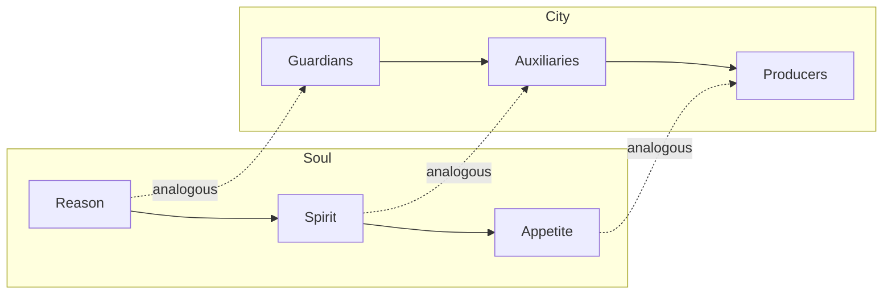
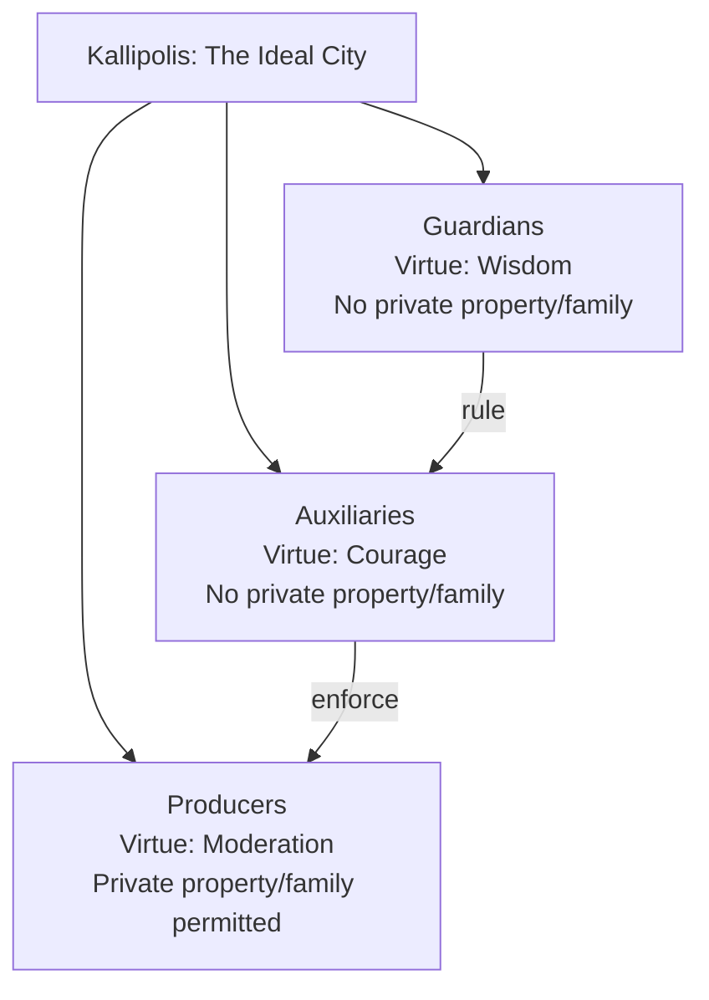

## Plato and the Ideal State

### Overview

Plato's theory of the ideal state, developed most fully in the *Republic* (c. 375 BCE), represents one of the most influential and controversial visions in the history of political philosophy. Building outward from the question "What is justice?", Plato constructs a hypothetical city — the *kallipolis* ("beautiful city") — designed according to philosophical first principles rather than empirical observation of existing regimes. The ideal state is best understood as an analogy: Plato argues that understanding justice in a city (a larger, more visible structure) will illuminate justice in the individual soul (a smaller, harder-to-observe structure).

### The Analogy of City and Soul

**Key Points**

- Plato's central methodological device is the claim that the city is **"the soul writ large"** — the structure of a just city mirrors the structure of a just soul, and analyzing the former clarifies the latter.
- Both city and soul are held to have a **tripartite structure**, and justice in both cases consists in the proper hierarchical ordering and functioning of these three parts.

| Part of Soul | Function | Corresponding Class in City | Function |
| --- | --- | --- | --- |
| Reason (*logistikon*) | Seeks truth, calculates, rules wisely | Guardians/Philosopher-Kings | Govern the city with wisdom |
| Spirit (*thymoeides*) | Courage, honor, indignation | Auxiliaries | Defend the city, enforce guardian decisions |
| Appetite (*epithymetikon*) | Desires for food, wealth, physical pleasure | Producers | Provide material goods (farming, crafts, trade) |

### Plato's Definition of Justice

**Key Points**

- Justice (*dikaiosyne*) is defined not as a set of external rules or a distributive formula, but as an internal **harmony** — each part of the soul (or class in the city) performing its own proper function and not interfering with the functions of the others.
- This is often contrasted with rival definitions Plato addresses and rejects earlier in the *Republic*:
  - **Cephalus/Polemarchus** — justice as speaking truth and paying debts / helping friends and harming enemies (rejected as too simplistic and situational).
  - **Thrasymachus** — justice as "the advantage of the stronger," a proto-realist, power-based account (rejected as self-undermining and as confusing genuine rule with exploitation).
  - **Glaucon's challenge** (the Ring of Gyges thought experiment) — the provocation that people are only just when forced to be, and would act unjustly if they could escape detection; this frames the *Republic*'s central task of proving that justice is intrinsically valuable, not merely instrumentally useful for reputation.

**Example**

Under Plato's definition, a guardian who becomes obsessed with accumulating personal wealth (an appetitive concern properly belonging to the producer class) would exemplify *injustice* in the city — not because a specific law was broken, but because a part of the whole has overstepped its proper role, disrupting the harmony of the system.

### The Tripartite Class Structure

**1. Guardians (Philosopher-Kings)**

- The ruling class, drawn from those who demonstrate the greatest capacity for wisdom through a rigorous, decades-long educational program.
- Must undergo Plato's famous educational curriculum: gymnastics and music/poetry in youth, followed by mathematics, dialectic, and philosophy, culminating (ideally around age 50) in comprehension of the **Theory of Forms**, especially the **Form of the Good**.
- Live under a radically communal lifestyle: no private property, no traditional family structure (children raised communally, spouses shared among the guardian class per Plato's proposals in Book V), removing incentives for self-interested rule.

**2. Auxiliaries**

- The military/enforcement class, embodying the virtue of courage (*andreia*), tasked with defending the city and enforcing the guardians' decisions.
- Selected and trained for spirited, courageous temperament; share the guardians' communal lifestyle to prevent the corruption of self-interest.

**3. Producers**

- The largest class: farmers, craftsmen, merchants, and other economic actors, embodying the virtue of moderation/temperance (*sophrosyne*).
- Permitted private property and family life (unlike the guardians), since their function does not require the same insulation from self-interest.

### The Philosopher-King and the Theory of Forms

**Key Points**

- Plato's most famous and controversial claim: **"until philosophers rule as kings... cities will have no rest from evils"** — political rule should be entrusted exclusively to those who have achieved philosophical knowledge of the Forms.
- The **Theory of Forms** holds that abstract, unchanging Forms (Justice, Beauty, the Good) are more truly real than particular physical instances; only those who grasp these Forms through disciplined philosophical training can rule with genuine knowledge rather than mere opinion (*doxa*).
- The **Allegory of the Cave** (*Republic*, Book VII) illustrates this: prisoners chained in a cave mistake shadows for reality; the philosopher who escapes and sees the sun (the Form of the Good) has an obligation to return and guide others, even though they will resist and disbelieve — an allegory for the philosopher-ruler's duty to govern despite the difficulty of translating abstract truth into political life.

### The "Noble Lie" (*Gennaion Pseudos*)

**Key Points**

- Plato proposes a foundational myth to be taught to all citizens to promote social cohesion and acceptance of the class structure: that citizens are born from the earth with different metals (gold, silver, bronze/iron) mixed into their souls, corresponding to their proper class.
- [Inference] This proposal is one of the most heavily debated elements of the *Republic*, with interpreters divided over whether Plato endorses it as a genuinely justified civic myth for social stability or presents it more ambiguously/critically; it has been a major point of criticism in later receptions of Plato (see below).

### Regime Degeneration (Book VIII)

**Key Points**

Plato describes a cyclical decline of political regimes, each stage corrupting the virtue of the one before it:

1. **Aristocracy** (rule of the best/wisest) — the ideal, just regime
2. **Timocracy** — rule by honor-loving warriors, arising when guardians' discipline weakens and spirited ambition dominates
3. **Oligarchy** — rule by the wealthy, arising when timocratic honor is displaced by love of money
4. **Democracy** — rule by the many, arising from oligarchic inequality provoking revolt; characterized by excessive liberty and lack of order
5. **Tyranny** — rule by one man through force, arising as democratic license collapses into chaos, from which a tyrant emerges promising order

**Example**

Plato's account of the transition from democracy to tyranny — where excessive freedom and the absence of authority create social disorder, prompting citizens to embrace a strongman who promises to restore order — is frequently cited as an early theoretical account of how democratic systems can collapse into authoritarian rule, a theme still invoked in contemporary discussions of democratic backsliding.

### Later Refinements: The *Statesman* and the *Laws*

**Key Points**

- In the *Statesman*, Plato explores the difficulty of applying general laws to particular circumstances, suggesting that a truly wise ruler with perfect knowledge would be superior to fixed laws, but that in the *absence* of such an ideal ruler, rule of law is the safer practical alternative.
- In the *Laws* (Plato's final, longer dialogue), Plato presents a more practically-oriented "second-best" city (Magnesia), governed by a detailed legal code and a mixed constitution, representing a retreat from the *Republic*'s more radical, utopian vision toward institutional realism — [Inference] widely read by scholars as reflecting Plato's own recognition of the practical difficulties in realizing the *Republic*'s ideal city.

### Major Criticisms of Plato's Ideal State

| Criticism | Source/Basis |
| --- | --- |
| Anti-democratic/authoritarian tendencies | Karl Popper (*The Open Society and Its Enemies*, 1945) famously characterized Plato's *Republic* as a blueprint for totalitarianism, given its rigid class hierarchy, censorship of poetry/art, and rule by an unaccountable elite |
| Impracticality/utopianism | The abolition of private property and family for guardians, and the demand for philosopher-rulers, are widely viewed as unrealistic for any actual political community |
| Suppression of individual liberty | The subordination of individual desires to communal/class function conflicts with later liberal emphases on individual rights and autonomy |
| The "Noble Lie" as manipulation | Critics argue the foundational myth amounts to elite-sanctioned deception of the citizenry, in tension with any account of political legitimacy grounded in truth or consent |

- [Inference] Not all scholars accept Popper's totalitarian reading; some interpreters argue the *Republic* is better read as a philosophical thought experiment about the soul and the nature of justice rather than a literal political blueprint intended for implementation — this remains a genuinely contested question in Plato scholarship.

### Legacy and Influence

**Key Points**

- Plato's ideal state established foundational concerns that recur throughout the history of political philosophy: the relationship between knowledge and rightful rule, the tension between individual liberty and social order, and the use of political education to shape virtuous citizens.
- Directly shaped Aristotle's (critical) response in the *Politics*, and continues to inform debates over technocracy, meritocracy, and the proper role of expertise in governance.
- The *Republic*'s critique of democracy remains a frequently cited touchstone in ongoing debates about the strengths and vulnerabilities of democratic systems.

### Related Topics

- Political Thought in Ancient Greece
- Aristotle's Critique of Plato and the Mixed Constitution
- Core Concepts: Freedom, Equality, and Justice
- Democratic Theory and Models of Democracy
- Natural Law Theory in Medieval Political Thought
- Technocracy and Epistocracy in Contemporary Political Theory
- Karl Popper and the Open Society