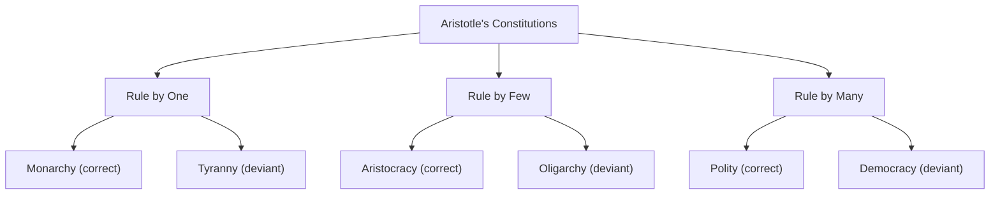

## Aristotle and the Politics of the Polis

### Overview

Aristotle's political philosophy, developed primarily in the *Politics* and complemented by the *Nicomachean Ethics*, represents the most systematic and empirically grounded treatment of the polis in ancient Greek thought. Departing from his teacher Plato's rationalist, top-down design of an ideal city, Aristotle approached politics through comparative observation, teleological reasoning, and practical wisdom (*phronesis*), producing a framework that remains foundational to comparative politics, constitutional theory, and virtue-based political ethics.

### The Polis as a Natural and Teleological Institution

**Key Points**

- Aristotle opens the *Politics* with the claim that the polis exists **"by nature"** — it is the natural culmination of a developmental sequence from household (*oikos*) to village to city-state, each stage arising to satisfy progressively fuller human needs.
- Humans are, by nature, **"zoon politikon"** — political animals — uniquely suited to life in the polis because of their capacity for reasoned speech (*logos*), which allows them to deliberate about justice and the advantageous, not merely to signal pleasure and pain (which even animals can do).
- The polis is **teleologically prior** to the individual and household in the sense that it exists for the sake of the good life (*eudaimonia*), and the whole (the political community) is, for Aristotle, in an important sense prior in nature to its parts, since individuals can only fully realize their nature within it.

**Example**

Aristotle's claim that "he who is unable to live in society, or who has no need because he is sufficient for himself, must be either a beast or a god" illustrates his view that political community is not merely instrumental (useful for survival) but constitutive of full human flourishing — a being entirely outside political life cannot achieve genuine *eudaimonia*.

### Aristotle's Method: Empirical Comparative Analysis

**Key Points**

- Unlike Plato's deductive method grounded in the Theory of Forms, Aristotle's approach in the *Politics* is empirical and comparative — he and his students reportedly compiled a survey of **158 constitutions** of Greek city-states (only the *Constitution of the Athenians* survives largely intact).
- This method treats existing political arrangements as data to be classified, compared, and evaluated against the standard of what best serves the common good — an approach [Inference] often identified by historians of the discipline as an important ancestor of the modern comparative politics subfield.

### Classification of Regimes (Constitutions)

**Key Points**

Aristotle classifies constitutions (*politeiai*) along two intersecting dimensions: **the number who rule** (one, few, many) and **whether rule serves the common good or the rulers' private interest**.

| Number of Rulers | Correct Form (Common Good) | Deviant Form (Self-Interest) |
| --- | --- | --- |
| One | Monarchy (*basileia*) | Tyranny |
| Few | Aristocracy | Oligarchy |
| Many | Polity (*politeia*) | Democracy |

- Correct forms govern with a view to the **common advantage**; deviant forms are "perversions" governing for the private advantage of the ruling group.
- Aristotle's usage of "democracy" as a *deviant* form (rule by the poor majority in their own class interest, disregarding the wealthy) differs sharply from the modern normatively positive usage of the term — his preferred form of popular rule is **polity**.

### The Mixed Constitution and the Middle Class

**Key Points**

- Aristotle's preferred practically achievable regime is **polity**, a mixed constitution that blends oligarchic elements (property qualifications, elite deliberative bodies) with democratic elements (broad citizen participation), avoiding the instability of pure forms.
- Central to this stability is a large, dominant **middle class** — Aristotle argues that a polity with a substantial middle class is less prone to the destabilizing class conflict between rich oligarchs and poor democrats that plagues cities lacking such a buffer.
- This argument is often read as an early theoretical foundation for later theories of **mixed government** and **balance of power** within a constitution (influencing later Roman and early modern constitutional thought).

**Example**

Aristotle's claim that revolutions are most often driven by perceptions of unequal treatment — the poor revolting against oligarchy because they feel excluded, or the wealthy revolting against pure democracy because they feel their property is threatened — anticipates modern comparative-politics theories linking regime instability to socioeconomic inequality and elite/mass conflict.

### Distributive and Corrective Justice

**Key Points**

In the *Nicomachean Ethics* (Book V), Aristotle develops a theory of justice directly relevant to political distribution:

1. **Distributive justice** — the fair allocation of common goods (honors, wealth, offices) according to **proportionate merit** (*axia*), not strict numerical equality; what counts as relevant merit is itself contested between democrats (who emphasize free birth/citizenship) and oligarchs (who emphasize wealth).
2. **Corrective justice** — the rectification of a wrong or unequal exchange between two parties (in either voluntary transactions like contracts or involuntary ones like crimes), aimed at restoring equality between the parties regardless of their respective merit.

$$\text{Distributive Justice: } \frac{\text{Share}_A}{\text{Merit}_A} = \frac{\text{Share}_B}{\text{Merit}_B}$$

### Citizenship and Political Participation

**Key Points**

- Aristotle defines a **citizen** (*polites*) narrowly: one who has the right to participate in deliberative or judicial office — ruling and being ruled in turn.
- This definition explicitly **excludes** women, slaves, laborers/artisans (whose work was seen as incompatible with the leisure required for political deliberation), and resident foreigners — a limitation reflecting and reinforcing the social hierarchies of the Greek polis.
- Aristotle's defense of **natural slavery** (the claim that some individuals are naturally suited to be ruled as slaves due to a purported deficiency in rational capacity) is among the most heavily criticized elements of his political philosophy in modern reception.

### Household Management (*Oikonomia*) and the Polis

**Key Points**

- Book I of the *Politics* analyzes the household as the polis's foundational unit, examining relationships of master-slave, husband-wife, and father-child.
- Aristotle explicitly distinguishes household management (*oikonomia*, the origin of the modern word "economics") from statesmanship (*politike*), arguing that ruling a household (viewed as inherently hierarchical/despotic in the master-slave relationship) is categorically different from ruling free and equal citizens in the polis.

### Revolution and Political Stability

**Key Points**

- Book V of the *Politics* offers a systematic, empirically-informed analysis of the causes of **stasis** (civil strife/revolution), including:
  - Perceived injustice in the distribution of honors or offices
  - Excessive inequality (of either wealth or status) between classes
  - The absence of a substantial middle class to mediate rich-poor conflict
  - Fear, contempt, or disproportionate ambition among elites
- Aristotle's practical recommendations for regime stability include cultivating the middle class, ensuring officeholders are seen as legitimate, and preventing any single individual or faction from acquiring disproportionate power.

### Aristotle vs. Plato: A Direct Comparison

| Dimension | Plato | Aristotle |
| --- | --- | --- |
| Epistemology | Rationalist; Theory of Forms | Empiricist; comparative observation |
| View of private property | Abolished for guardian class | Defended as natural and conducive to virtue (though warns against excessive inequality) |
| View of family | Abolished for guardians (communal) | Defended as a natural, foundational unit of the polis |
| Best regime | The ideal *kallipolis* (largely aspirational) | Polity — a practically achievable mixed constitution |
| Basis of rule | Esoteric philosophical knowledge (philosopher-kings) | Practical wisdom (*phronesis*) shared among a broad citizen body |
| View of "democracy" | Deviant form, prone to tyranny | Deviant form when unmixed, but valued in moderated form as *politeia* |

### Legacy and Influence

**Key Points**

- Aristotle's regime classification directly informs modern comparative politics' typologies of political systems (monarchy, oligarchy, democracy, and their combinations).
- His argument for a stabilizing middle class remains cited in contemporary political science research linking the size and strength of the middle class to democratic stability.
- The distinction between distributive and corrective justice continues to structure debates in political philosophy and jurisprudence.
- [Inference] Aristotle's teleological framework — that political institutions should be evaluated by whether they serve the objective human good — stands as an important historical alternative to later social-contract and purely procedural theories of political legitimacy, which generally do not rely on a substantive theory of human flourishing.

### Related Topics

- Political Thought in Ancient Greece
- Plato and the Ideal State
- Core Concepts: Freedom, Equality, and Justice
- The Subfields and Scope of Political Science (Comparative Politics origins)
- Political Thought in Ancient Rome
- Natural Law Theory in Medieval Political Thought
- Regime Types and Classification in Comparative Politics