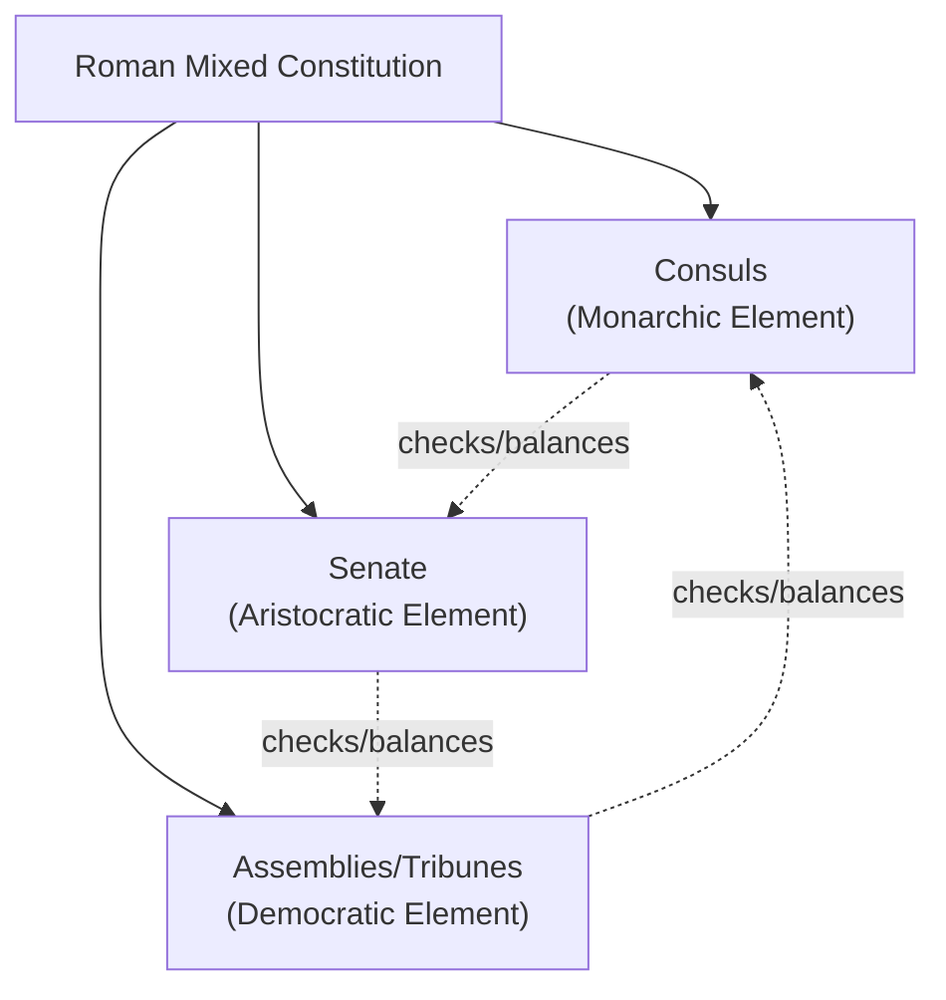
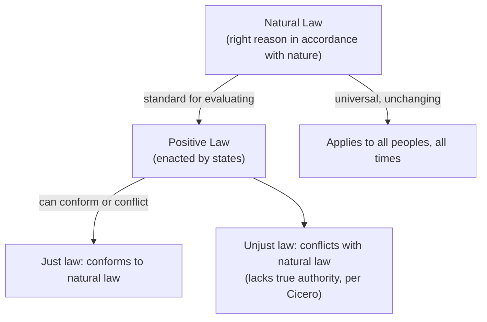

## Roman Republicanism and Cicero

### Overview

Roman political thought, particularly as synthesized by Marcus Tullius Cicero (106–43 BCE), adapted and transformed Greek political philosophy into a distinctly Roman idiom centered on **republicanism**, constitutionalism, mixed government, and natural law. Rome's own constitutional experience — a republic governed through an intricate balance of magistrates, senate, and popular assemblies — provided the practical backdrop for theoretical reflection on liberty, civic virtue, and the rule of law that would profoundly shape later Renaissance civic humanism and Enlightenment constitutionalism.

### The Roman Republic as Institutional Context

**Key Points**

- The Roman Republic (traditionally dated 509–27 BCE) developed a complex constitutional structure combining elements Greek theorists (notably **Polybius**) analyzed as a **mixed constitution**.
- Key institutions: the **Consuls** (dual executive magistrates, an element of monarchy), the **Senate** (an aristocratic deliberative body, an element of aristocracy), and the **Popular Assemblies** and **Tribunes of the Plebs** (representing the people, an element of democracy).
- **Polybius** (c. 200–118 BCE), a Greek historian writing about Rome, argued in his *Histories* that Rome's stability and success derived precisely from this mixed constitutional structure, which combined checks among the three classical elements to prevent the cyclical degeneration Plato had described.

### Polybius's Theory of Anacyclosis

**Key Points**

- Polybius adapted the Greek cyclical theory of regime change (echoing Plato's degeneration cycle) into the concept of **anacyclosis** — a natural cycle through which all "pure" constitutions inevitably degenerate: Monarchy → Tyranny → Aristocracy → Oligarchy → Democracy → Ochlocracy (mob rule) → back to Monarchy.
- Polybius argued Rome's genius was to combine all three legitimate elements simultaneously in a single mixed constitution, thereby interrupting this cycle of decay through internal checks and balances — an idea with substantial influence on later constitutional theorists, including the framers of the U.S. Constitution.

### Cicero: Life and Major Works

**Key Points**

- Marcus Tullius Cicero (106–43 BCE) was a Roman statesman, orator, and philosopher who served as consul (63 BCE) and wrote extensively during periods of political crisis and exile from active politics.
- Major political works: *De Republica* ("On the Republic," modeled on Plato's *Republic* but grounded in Roman constitutional experience) and *De Legibus* ("On the Laws"), alongside ethical works like *De Officiis* ("On Duties").
- Cicero self-consciously synthesized Greek philosophy (particularly Stoicism and elements of Platonic/Aristotelian thought) with Roman civic and legal traditions, aiming to make Greek philosophy practically useful for Roman statesmen.

### Cicero's Definition of the Republic (*Res Publica*)

**Key Points**

- Cicero famously defines the commonwealth (*res publica*, literally "the public thing/affair") as **"the property of the people" (*res populi*)** — but crucially qualifies "the people" not as any random gathering, but as a **"multitude united in agreement about law and community of interest"** (*coetus multitudinis iuris consensu et utilitatis communione sociatus*).
- This definition builds in a normative requirement: a genuine *res publica* requires a shared commitment to justice and law — a tyranny or a state lacking common agreement about justice, for Cicero, is not truly a commonwealth at all, however populous.
- Cicero, following Polybius, endorsed the **mixed constitution** as the best practical form, praising the Roman constitution's balance of consular, senatorial, and popular elements as superior to any pure form (monarchy, aristocracy, or democracy alone), each of which he considered prone to degeneration if unchecked.

### Cicero and Natural Law

**Key Points**

- Cicero's most influential and enduring contribution is his systematic articulation of **natural law theory**, most famously expressed in *De Republica*:

> [Paraphrased, not quoted directly per citation policy] Cicero describes true law as right reason in agreement with nature — universal, unchanging, eternal, applicable to all peoples at all times, not subject to alteration by senate or popular vote, and valid independent of any particular state's positive enactments.

- This natural law is grounded in **universal human reason** (a Stoic-influenced concept), implying that just laws must conform to this higher rational order, and that unjust positive laws (contrary to natural law) lack genuine binding authority — an early and highly influential articulation of the distinction between **natural law and positive law**.
- This framework profoundly influenced later Christian natural law theory (notably Thomas Aquinas), Enlightenment natural rights theory (Locke, the American Founders), and modern human rights discourse, which similarly appeals to universal standards transcending particular legal systems.

### Civic Virtue and the Ideal Statesman

**Key Points**

- Cicero placed strong emphasis on **civic virtue** (particularly *virtus*, encompassing courage, wisdom, and dedication to the common good) as essential to sustaining the republic.
- In *De Officiis*, Cicero develops an influential account of political duties, emphasizing that a statesman's obligations to the community take priority over narrow self-interest, and that genuine honor (*honestum*) and practical advantage (*utile*) are ultimately aligned rather than in true conflict — a position directly opposed to the "justice as the advantage of the stronger" view associated with Thrasymachus and later famously challenged by Machiavelli's separation of political effectiveness from conventional morality.
- Cicero idealized the figure of the **rector rei publicae** ("guardian/helmsman of the republic") — a wise, virtuous statesman whose role is to guide the republic through the exercise of practical wisdom and moral authority rather than domination.

### Cicero on Law and Justice

**Key Points**

- In *De Legibus*, Cicero argues that law is not merely a human convention (echoing the Sophist *nomos* position he explicitly rejects) but is grounded in objective justice accessible to human reason.
- He argues that a state that enacts unjust laws — laws contrary to natural reason — has, strictly speaking, forfeited its claim to true legality, prefiguring later debates in jurisprudence over the relationship between law and morality (the natural law vs. legal positivism debate).

### Comparison: Greek and Roman Republican Thought

| Dimension | Greek Political Thought (Plato/Aristotle) | Roman Republicanism (Polybius/Cicero) |
| --- | --- | --- |
| Primary unit | The polis (city-state) | The res publica (commonwealth/republic) |
| View of mixed government | Aristotle favored a mixed "polity" as most stable | Explicitly central: mixed constitution as the deliberate solution to cyclical decay |
| Basis of law | Plato: philosophical knowledge of the Forms; Aristotle: practical wisdom and empirical classification | Cicero: universal natural law grounded in reason, transcending any single polity |
| Role of virtue | Central to the good life (*eudaimonia*) within the polis | Central to sustaining the *res publica*; civic duty (*officium*) emphasized |
| Legacy focus | City-state, small-scale direct citizen participation | Law, constitutionalism, and civic duty exportable beyond a single city |

### Legacy and Influence

**Key Points**

- Cicero's natural law theory became a crucial bridge between classical philosophy and medieval Christian political thought, directly shaping Thomas Aquinas's synthesis of natural law and Christian theology.
- Cicero's writings were extensively read and cited by Renaissance civic humanists and Enlightenment thinkers, including direct influence on natural rights theorists such as John Locke and on the American founders (several explicitly invoked Cicero in debates over republican government and mixed constitutions).
- The **mixed constitution** theory, transmitted through Polybius and Cicero, substantially influenced the theoretical justification for the separation of powers and checks and balances in later constitutional design, including the U.S. Constitution.
- [Inference] Cicero's insistence that unjust laws lack genuine legal authority remains a recurring reference point in modern debates between natural law theory and legal positivism regarding the relationship between law and morality.

### Related Topics

- Political Thought in Ancient Greece
- Aristotle and the Politics of the Polis
- Natural Law Theory in Medieval Political Thought
- Theories of the Social Contract (Hobbes, Locke, Rousseau)
- Separation of Powers and Checks and Balances
- Civic Humanism in the Renaissance
- Legitimacy and Political Obligation