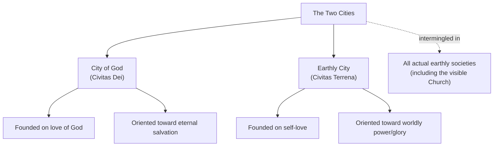
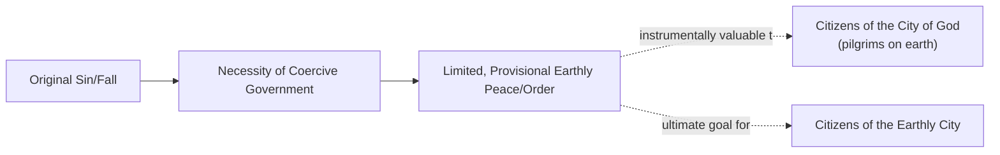

## Augustine and the Two Cities

### Overview

Saint Augustine of Hippo (354–430 CE) developed one of the most influential frameworks in the history of Christian political thought in his monumental work *The City of God* (*De Civitate Dei*, written 413–426 CE in response to the sack of Rome by Alaric's Goths in 410 CE). Augustine's theory of the **Two Cities** — the *City of God* (*Civitas Dei*) and the *Earthly City* (*Civitas Terrena*) — fundamentally reoriented political thought away from the classical assumption that the state exists to cultivate human virtue and flourishing, introducing a distinctly theological and pessimistic account of politics rooted in original sin.

### Historical Context

**Key Points**

- Augustine wrote *The City of God* partly as a direct response to pagan critics who blamed Rome's sack in 410 CE on the empire's recent conversion to Christianity (arguing that abandoning the traditional Roman gods had brought divine punishment).
- The work is also a mature theological synthesis addressing the proper Christian understanding of history, human nature, sin, and political authority in light of the fall of Rome and the broader Christian doctrine of original sin.
- Augustine drew on both Christian scripture and classical philosophy (particularly Neoplatonism and elements of Stoicism), while explicitly rejecting the classical assumption — shared by Plato, Aristotle, and Cicero — that the political community can be the primary vehicle for genuine human virtue and happiness.

### The Two Cities: Core Framework

**Key Points**

- The **City of God** (*Civitas Dei*) is a spiritual, not geographically bounded, community of those oriented toward love of God, ultimately destined for eternal salvation.
- The **Earthly City** (*Civitas Terrena*) is the community of those oriented toward love of self and worldly goods, dominated by the pursuit of temporal power, glory, and material gain.
- Augustine famously characterizes the two cities as founded on two opposing loves: **"the earthly city was created by self-love reaching the point of contempt for God, the heavenly city by the love of God carried as far as contempt of self"** [paraphrased per citation policy — this is a widely cited formulation from Book XIV].
- Crucially, the two cities are **not identical with any actual earthly institution** — the City of God is not simply the visible Church, nor is the Earthly City simply the Roman state; rather, members of both cities are intermingled within all actual human societies, including the Church itself, until a final eschatological separation.

**Example**

Augustine's framework means a devout Christian and a worldly, power-seeking official could both be members of the same visible church congregation or the same political state, yet belong to entirely different "cities" in Augustine's spiritual sense — membership is determined by the orientation of one's love, not by outward institutional affiliation.

### Augustine's View of the State and Political Authority

**Key Points**

- Departing sharply from Aristotle's view that the polis exists "by nature" to enable human flourishing, Augustine holds that political authority and coercive government are **consequences of the Fall and original sin** — necessary remedies for a corrupted human nature, not natural or originally intended institutions.
- Political authority, including the coercive power of the state (including its use of force and punishment), is thus divinely permitted as a **remedy for sin** — restraining human wickedness and maintaining a minimal, provisional order — rather than as a positive vehicle for cultivating the highest human virtue, as in the classical tradition.
- This produces a markedly more pessimistic and instrumental view of the state compared to Aristotle: political community is necessary and can serve limited, genuine goods (peace, order), but it is not the arena in which humans achieve their highest good (which, for Augustine, is only found in God and in the life to come).

### Augustine's Critique of Roman/Pagan Virtue and Justice

**Key Points**

- Augustine famously argues that without true justice — which for him requires right worship of the true God — political communities cannot be genuinely just, however outwardly impressive their achievements.
- He poses the provocative question of what distinguishes a kingdom from a large band of robbers, other than scale and the trappings of legitimacy, if both operate through domination for material gain without true justice — a critique aimed at puncturing Roman civic pride and pagan claims to virtue.
- [Inference] This critique represents a significant challenge to the classical (Ciceronian) definition of the *res publica* as requiring genuine "agreement about law and community of interest" grounded in justice; Augustine's implication is that no purely earthly, pagan political community can fully satisfy this standard, since true justice is impossible without right relationship to God.

### Peace as the Relative Good of the Earthly City

**Key Points**

- Despite his pessimism, Augustine acknowledges that even the Earthly City pursues and can achieve a genuine, if limited and imperfect, good: **temporal peace and order**.
- Book XIX of *The City of God* offers an extended reflection on peace as a universally desired good, present even in disordered or sinful arrangements (even robbers, Augustine notes, desire peace among themselves to more effectively pursue their aims).
- Citizens of the City of God, while ultimately oriented toward eternal peace, are instructed to make appropriate use of temporal, earthly peace during their sojourn in this life — Augustine does not counsel political withdrawal or anarchism, but a qualified, instrumental participation in earthly political order.

### Just War and Augustine's Political Ethics

**Key Points**

- Augustine's broader corpus (including *The City of God* and other writings) is foundational to the Christian **just war tradition**, arguing that war, while an evil consequence of a fallen world, can be conducted justly under specific conditions (legitimate authority, just cause, right intention).
- This reflects Augustine's broader pattern: earthly institutions of coercion (war, punishment, political authority) are not intrinsically good, but can be used rightly or wrongly depending on the intentions and justice with which they are exercised within humanity's fallen condition.

### Comparison with Classical Political Thought

| Dimension | Classical View (Aristotle/Cicero) | Augustinian View |
| --- | --- | --- |
| Origin of the state | Natural, arising to fulfill human flourishing | Consequence of the Fall/original sin; remedial |
| Purpose of politics | Cultivate virtue and the good life (*eudaimonia*) | Restrain sin, maintain limited peace and order |
| Highest human good | Achievable (in part) through political community | Only achievable in the City of God (eternal, not political) |
| View of justice | Achievable, in principle, within a well-ordered polity | True justice impossible without right relationship to God; earthly justice always imperfect |
| Relationship of individual to state | Individual flourishing bound up with the polis | Individual ultimately belongs to a spiritual community transcending any earthly state |

### Legacy and Influence

**Key Points**

- Augustine's Two Cities framework decisively shaped medieval Christian political thought, establishing a durable (if contested) distinction between spiritual and temporal authority that underlies later medieval debates over church-state relations (including conflicts between popes and emperors).
- His pessimistic anthropology (humans as fundamentally corrupted by sin, requiring coercive restraint) profoundly influenced later political theorists, notably contributing to Reformation political thought (Luther, Calvin) and, [Inference] according to many historians of political thought, anticipating aspects of later "realist" skepticism about the perfectibility of political institutions, in contrast to more optimistic classical and later Enlightenment views of political community.
- Augustine's distinction between the two cities was later systematically integrated with Aristotelian natural law reasoning by Thomas Aquinas, who offered a more optimistic synthesis restoring some of the classical confidence in the state's capacity to promote a limited but genuine natural good, alongside the specifically Augustinian emphasis on grace and sin.

### Related Topics

- Political Thought in Ancient Rome
- Roman Republicanism and Cicero
- Natural Law Theory in Medieval Political Thought (Aquinas)
- Legitimacy and Political Obligation
- Just War Theory
- Church and State in Medieval Political Thought
- Core Concepts: Freedom, Equality, and Justice