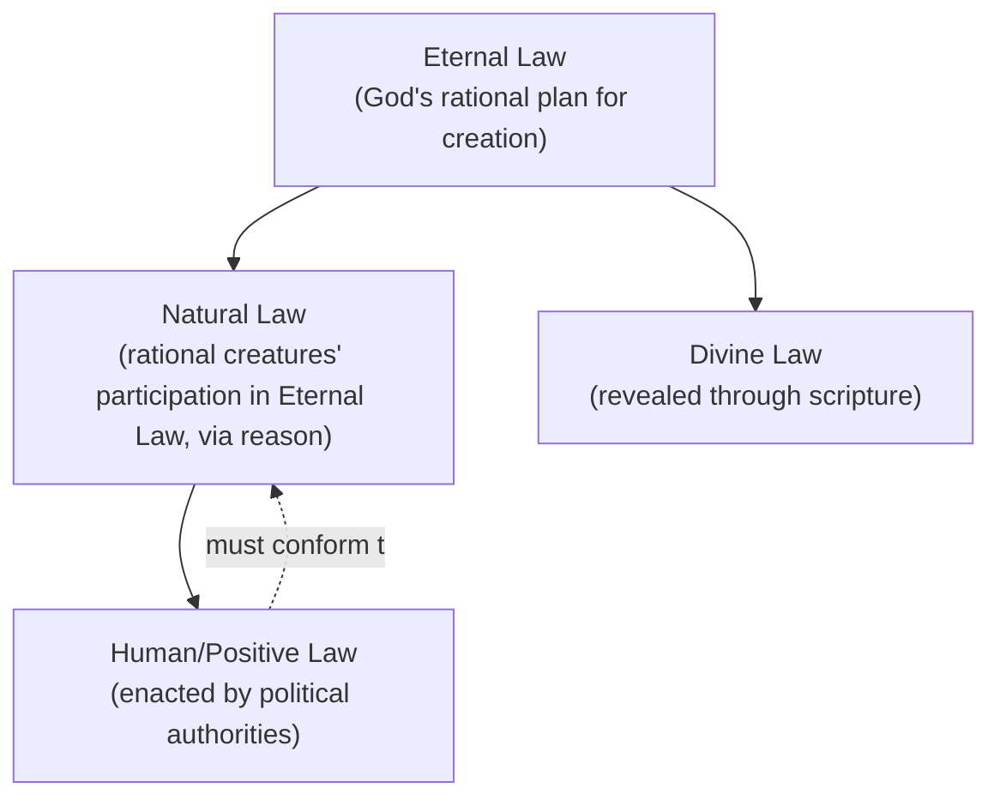
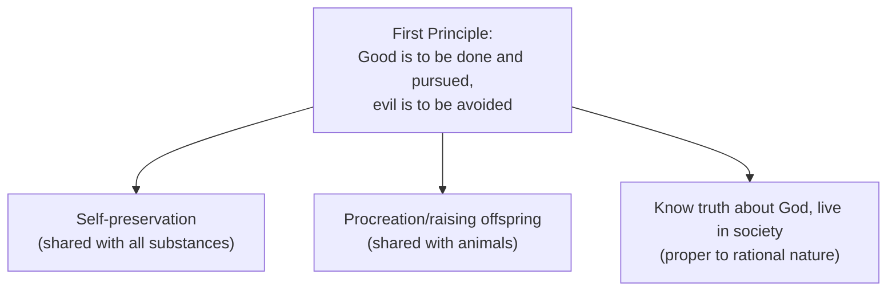
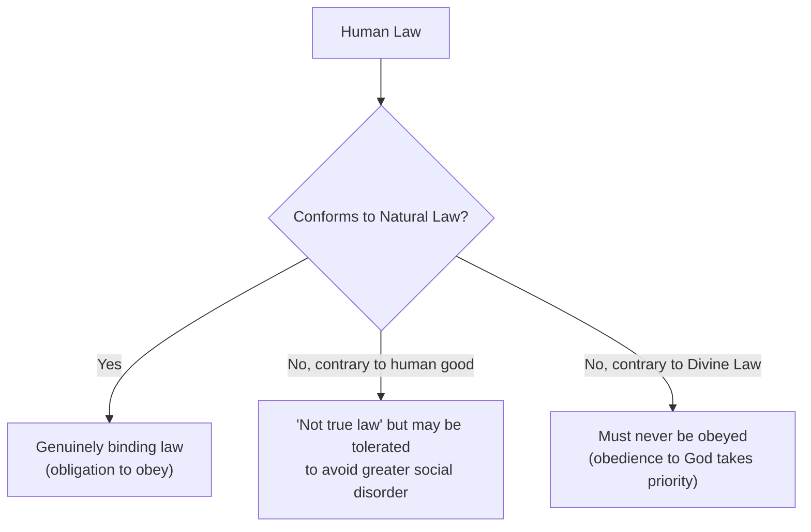

## Thomas Aquinas and Natural Law

### Overview

Thomas Aquinas (1225–1274 CE), the preeminent scholastic theologian and philosopher of the High Middle Ages, produced the most systematic and influential synthesis of Aristotelian philosophy and Christian theology in Western political thought. His treatment of law — especially **natural law** — in the *Summa Theologiae* (particularly the "Treatise on Law," Questions 90–97 of the Prima Secundae) established a framework that remains foundational to natural law jurisprudence, Catholic social and political thought, and broader debates over the relationship between law, morality, and reason.

### Historical and Intellectual Context

**Key Points**

- Aquinas wrote during the 13th-century recovery of Aristotle's works in the Latin West (largely via Arabic and Byzantine transmission), and is credited with the most thorough medieval integration of **Aristotelian philosophy** with **Christian theology**.
- Unlike Augustine's more pessimistic view of the state as primarily a remedy for sin, Aquinas restores a more optimistic, Aristotelian-influenced account of political community as a **natural** and positively good institution, even while retaining core Christian theological commitments (grace, sin, the supernatural end of humanity).
- Aquinas's political thought is embedded within a broader theological system; his treatment of law is one part of a comprehensive account of human action, virtue, and the ultimate end (*telos*) of human life in union with God.

### Aquinas's Fourfold Typology of Law

**Key Points**

Aquinas systematically distinguishes four types of law, ordered hierarchically:

1. **Eternal Law (*Lex Aeterna*)** — God's rational plan governing the entire universe; the total providential ordering of all creation toward its proper ends. All other forms of law derive from and participate in eternal law.
2. **Natural Law (*Lex Naturalis*)** — the rational creature's (humanity's) participation in the eternal law, discoverable through unaided human reason, without need of divine revelation.
3. **Human/Positive Law (*Lex Humana*)** — specific laws enacted by human political communities and authorities, which must be derived from and consistent with natural law to be genuinely binding.
4. **Divine Law (*Lex Divina*)** — law revealed directly by God through scripture (e.g., the Old and New Testaments), addressing matters (particularly humanity's supernatural end) that natural reason alone cannot fully discern.

### Aquinas's Definition of Law

**Key Points**

- Aquinas defines law generally as **"an ordinance of reason for the common good, made by him who has care of the community, and promulgated"** [paraphrased per citation policy — this is Aquinas's classic fourfold definition from *Summa Theologiae* I-II, Q.90].
- This definition contains four essential elements, each of which Aquinas argues is necessary for a genuine law:
  1. **An ordinance of reason** — law must be rational, not arbitrary will
  2. **Directed to the common good** — law must serve the community's shared good, not merely private/sectional interest
  3. **Made by proper authority** — enacted by whoever has legitimate care of the community
  4. **Promulgated** — made known to those bound by it

| Element | Function | Failure Mode if Absent |
| --- | --- | --- |
| Ordinance of reason | Grounds law in rational justification, not mere will | Arbitrary command, not true law |
| Common good | Orients law toward the community's shared benefit | Law serving only private interest of rulers |
| Proper authority | Ensures law is made by one entitled to bind the community | Usurped or illegitimate authority |
| Promulgation | Ensures those bound by the law can know and follow it | Secret or unknown "law" cannot rightly bind |

### The Content of Natural Law: First Principles

**Key Points**

- Aquinas grounds natural law in a foundational first principle of practical reason: **"good is to be done and pursued, and evil is to be avoided"** [paraphrased] — the most basic self-evident precept from which all other natural law precepts are derived.
- From this, Aquinas derives more specific precepts corresponding to the natural human inclinations (*inclinationes naturales*) that humans share with all substances, with animals, and uniquely as rational beings:
  1. **Inclination shared with all substances** — self-preservation (preserving one's own being)
  2. **Inclination shared with animals** — procreation and the raising of offspring
  3. **Inclination proper to rational nature** — to know the truth about God and to live in society

**Example**

From the natural inclination toward social life, Aquinas derives natural-law precepts against actions that undermine social cooperation (such as lying, theft, or unjust harm to others) — these are not arbitrary rules but rational conclusions drawn from humanity's inherent social nature as understood through practical reason.

### Human Law and Its Relationship to Natural Law

**Key Points**

- Aquinas holds that human/positive law derives its binding force from natural law in two distinct ways:
  1. **By conclusion (*per modum conclusionis*)** — a direct logical derivation, similar to a demonstrative conclusion from premises (e.g., "do not murder" follows directly from the natural law precept against unjustly harming others).
  2. **By determination (*per modum determinationis*)** — natural law establishes a general principle, but human legislators must exercise practical judgment to specify particular applications (e.g., natural law requires just punishment for wrongdoing, but the specific penalty for a given crime is a matter of human legal determination, not directly derivable from natural law alone).

**The Question of Unjust Law**

- Aquinas's most politically significant and debated claim: **an unjust law, understood as a law that violates natural law (or is made without proper authority, contrary to the common good, or disproportionately burdensome), is "not law but a corruption/perversion of law"** (*lex corrupta*, sometimes rendered "not law but a species of violence") [paraphrased].
- However, Aquinas's position on **civil disobedience** is more nuanced than a simple license to disobey any unjust law: he distinguishes laws unjust because they are contrary to human good (which may still, in some cases, be tolerated to avoid greater social disorder or scandal) from laws that are unjust because they command something contrary to the **divine law** (which must never be obeyed, since obedience to God takes precedence over obedience to any human authority).

### Political Authority and the Common Good

**Key Points**

- Following Aristotle, Aquinas holds that political community and government are **natural** institutions, necessary and positively good for enabling human flourishing (not merely, as for Augustine, a remedy for sin) — though Aquinas retains the Augustinian/Christian view that coercive government is also *especially* necessary given humanity's fallen, sinful condition.
- Legitimate political authority exists to direct the community toward the **common good** (*bonum commune*), which Aquinas holds is a genuinely higher good than the private good of any individual, though not opposed to individual flourishing.
- Aquinas favors, in line with the classical tradition (Aristotle, Cicero), a **mixed constitution** combining monarchic, aristocratic, and democratic elements as the practically best form of government, believing this combination best secures both effective rule and broad participation/consent.

### Comparing Aquinas to Augustine and Aristotle

| Dimension | Augustine | Aristotle | Aquinas |
| --- | --- | --- | --- |
| Origin of political authority | Consequence of the Fall/sin; remedial | Natural, for human flourishing | Natural (per Aristotle), and also necessary given sin (per Augustine) — synthesizes both |
| View of the state's purpose | Restrain sin, maintain limited peace | Cultivate virtue and the good life | Direct the community to the common good, a genuine (though not the highest, supernatural) good |
| Basis of law | Divine will and providence primarily | Practical wisdom (*phronesis*), empirical observation | Reason's participation in eternal law (natural law), integrating faith and reason |
| Best regime | Not a central concern; earthly peace is provisional | Polity (mixed constitution) | Mixed constitution (monarchy, aristocracy, democracy combined) |

### Legacy and Influence

**Key Points**

- Aquinas's natural law theory became the official framework of Catholic social and political teaching and remains foundational to natural law jurisprudence.
- His theory profoundly shaped later Scholastic political thought, the Spanish School of Salamanca's early development of international law and rights theory (Francisco de Vitoria, Francisco Suárez), and — transmitted through various channels — influenced Enlightenment natural rights theorists, including aspects of Locke's natural law framework.
- The natural law tradition Aquinas systematized remains a central reference point in ongoing jurisprudential debates between **natural law theory** and **legal positivism** (the latter, associated with thinkers like John Austin and H.L.A. Hart, denies that a law's validity depends on its moral content) regarding whether unjust laws are genuinely law at all.
- [Inference] Aquinas's distinction between natural law derivation "by conclusion" versus "by determination" is often cited by contemporary natural law theorists (e.g., John Finnis) as offering a sophisticated middle path between rigid natural law determinism and pure legal positivism, since it grants human legislators genuine discretion within a framework still ultimately grounded in objective moral reasoning.

### Related Topics

- Augustine and the Two Cities
- Roman Republicanism and Cicero
- Aristotle and the Politics of the Polis
- Theories of the Social Contract (Hobbes, Locke, Rousseau)
- Legitimacy and Political Obligation
- Natural Law vs. Legal Positivism in Jurisprudence
- Civil Disobedience and the Right to Resist