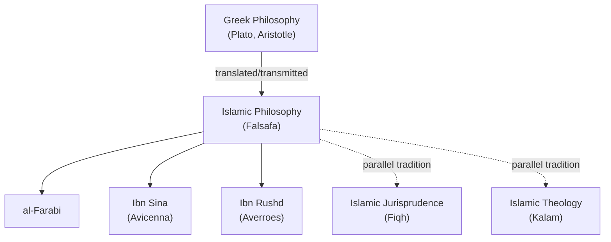
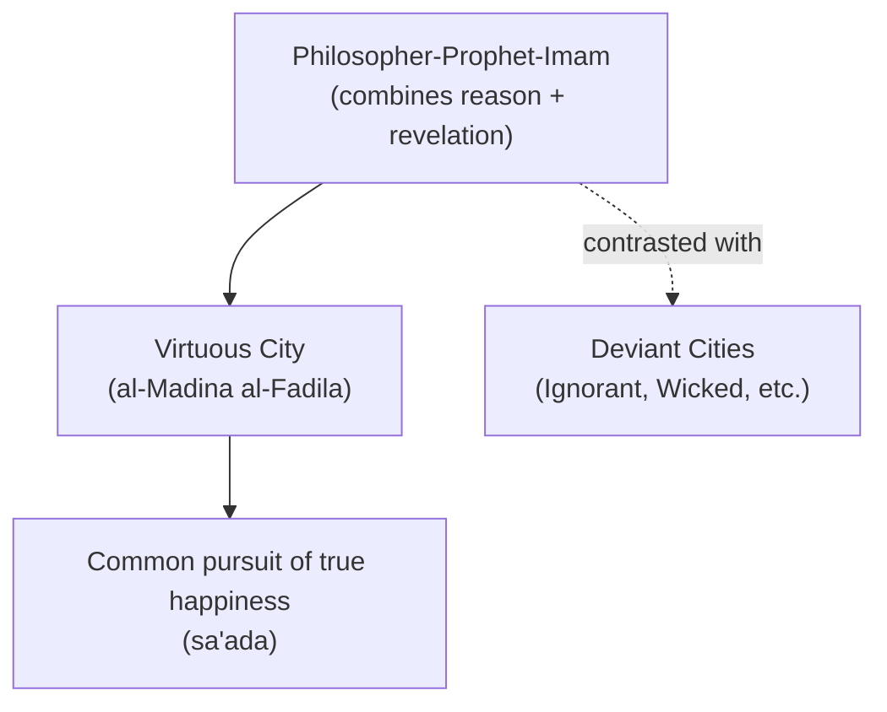

## Islamic Political Philosophy

### Overview

Islamic political philosophy (*falsafa siyasiyya*) developed during the medieval Islamic Golden Age (roughly 8th–15th centuries CE) as a rich tradition synthesizing Qur'anic revelation, Islamic jurisprudence (*fiqh*), and inherited Greek philosophy — particularly Platonic and Aristotelian political thought, transmitted through translation movements centered in Baghdad and elsewhere. It produced distinctive theories of prophetic-philosophical leadership, the relationship between reason and revelation, and models of the ideal political community, while running alongside — and in productive tension with — parallel traditions of Islamic jurisprudence and theology addressing governance.

### Historical and Intellectual Context

**Key Points**

- Islamic political philosophy emerged from the large-scale translation of Greek philosophical texts (especially Plato and Aristotle) into Arabic, largely during the **Abbasid Caliphate**'s translation movement (8th–10th centuries CE, centered on the "House of Wisdom" in Baghdad).
- This philosophical tradition (*falsafa*) developed alongside, and in dialogue with, two other major intellectual currents addressing governance in Islamic civilization:
  - **Islamic jurisprudence (*fiqh*)** — the legal-theological tradition deriving practical governance rules from the Qur'an, Hadith, and juristic reasoning (*ijtihad*)
  - **Islamic theology (*kalam*)** — dialectical theology addressing questions of divine attributes, free will, and the legitimacy of political authority (e.g., debates over the Caliphate between Sunni and Shia traditions)
- The three major philosophers most associated with systematic Islamic political philosophy are **al-Farabi**, **Ibn Sina (Avicenna)**, and **Ibn Rushd (Averroes)**, each engaging substantially with Platonic and Aristotelian political ideas.

### Al-Farabi and the Virtuous City

**Key Points**

- **Abu Nasr al-Farabi** (c. 872–950 CE), often called "the Second Teacher" (after Aristotle, "the First Teacher"), is considered the founder of systematic Islamic political philosophy, most notably in his work *Al-Madina al-Fadila* ("The Virtuous City" / "The Perfect State").
- Al-Farabi adapted Plato's philosopher-king (from the *Republic*) into an explicitly Islamic framework: the ideal ruler is a **philosopher-prophet-imam** who combines philosophical wisdom (achieved through rational demonstration) with prophetic capacity (the ability to receive and communicate truth through revelation and symbolic/imaginative language accessible to the masses).
- The **Virtuous City** (*al-Madina al-Fadila*) is organized, analogous to Plato's *Republic*, as a hierarchical political community whose members cooperate toward the common pursuit of true happiness (*sa'ada*), under the guidance of this philosopher-prophet ruler.
- Al-Farabi also classified **deviant cities**, paralleling and adapting Plato's regime-degeneration typology, including the "ignorant city" (pursuing false goods like wealth or pleasure), the "wicked city" (knowing the truth but rejecting it), and others — cities that fail to orient their members toward genuine happiness.

**Example**

Al-Farabi's synthesis addresses a distinctly Islamic philosophical problem largely absent from Plato's original framework: how can the philosopher's abstract rational knowledge be made accessible and authoritative for the general population? His answer — that the philosopher-prophet communicates philosophical truths through symbolic and imaginative language suited to popular understanding, while retaining full rational comprehension privately — reconciles the elitism of Platonic philosophy with the universalist, revelation-based authority claimed by Islamic prophecy.

### Ibn Sina (Avicenna) on Prophecy and Political Order

**Key Points**

- **Ibn Sina** (980–1037 CE), primarily renowned as a philosopher and physician, extended al-Farabi's framework, particularly regarding the necessity of prophecy for political order.
- Ibn Sina argued that humans, as inherently social and interdependent beings requiring cooperation (echoing Aristotelian premises), need law and political authority to regulate their interactions; since most people cannot achieve philosophical understanding of the good directly, a **prophetic lawgiver** is metaphysically necessary to translate rational truths into accessible law and religious practice that can guide the community.
- This positions prophecy not as a departure from philosophical necessity but as its natural completion — political order requires the prophet-legislator's capacity to communicate through revelation and law what philosophers grasp through demonstration alone.

### Ibn Rushd (Averroes) and the Reconciliation of Philosophy and Religion

**Key Points**

- **Ibn Rushd** (1126–1198 CE), based in Cordoba (al-Andalus), is best known for his extensive commentaries on Aristotle and his direct engagement with Plato's *Republic* in his *Commentary on Plato's Republic* (notable partly because Aristotle's own *Politics* was not available to him in Arabic translation).
- Ibn Rushd's *Decisive Treatise* (*Fasl al-Maqal*) argues systematically that philosophy and religious law (*Shari'a*) cannot ultimately conflict, since both are avenues to truth; where apparent conflicts arise between philosophical demonstration and literal scriptural text, the text should be interpreted allegorically/metaphorically to accord with demonstrated philosophical truth.
- In his commentary on the *Republic*, Ibn Rushd analyzed contemporary Muslim regimes (including critique of existing Almohad governance) through the lens of Plato's regime typology, applying Greek political categories to specifically Islamic political circumstances — including reflections on the proper role of women and critique of forms of governance he associated with tyranny or oligarchy.

### Parallel Tradition: Islamic Jurisprudence and the Caliphate

**Key Points**

- Running alongside the *falsafa* tradition, Islamic **jurisprudential and theological** thought developed its own distinct approach to political authority, centered on the institution of the **Caliphate** (*Khilafa*) — the office of the successor to the Prophet Muhammad as leader of the Muslim community (*Umma*).
- Major juristic theorists, notably **al-Mawardi** (972–1058 CE) in his *al-Ahkam al-Sultaniyya* ("The Ordinances of Government"), systematized the legal qualifications, duties, and processes for selecting a legitimate Caliph, grounding political legitimacy in adherence to Islamic law (*Shari'a*) and the consensus/consultation (*shura*, *ijma*) of the community, rather than in the philosophical framework of al-Farabi and Ibn Sina.
- The **Sunni–Shia split** over the legitimate succession to Muhammad represents a foundational and enduring political-theological division: Sunni tradition generally emphasizes consensus/community selection of qualified leaders, while Shia tradition holds that legitimate leadership (the Imamate) belongs by divine designation to Muhammad's family line through Ali.

| Tradition | Primary Authority Source | Key Thinkers | Central Concern |
| --- | --- | --- | --- |
| Falsafa (Philosophy) | Reason, adapted Greek philosophy | al-Farabi, Ibn Sina, Ibn Rushd | Relationship of philosophical wisdom to prophetic/political authority |
| Fiqh (Jurisprudence) | Qur'an, Hadith, juristic reasoning | al-Mawardi, later jurists | Legal qualifications and duties of legitimate rulers (Caliphs) |
| Kalam (Theology) | Revelation, dialectical theological argument | Various Sunni and Shia theologians | Theological basis and legitimacy of the Caliphate/Imamate |

### Ibn Khaldun and the Sociology of Political Power

**Key Points**

- **Ibn Khaldun** (1332–1406 CE), though writing somewhat later and often treated as a distinct, transitional figure, made a highly influential contribution with his *Muqaddimah* ("Introduction" to his universal history).
- Ibn Khaldun developed the concept of **'asabiyyah** (social cohesion/group solidarity) as the driving force behind the rise and fall of political dynasties — strong tribal or group solidarity enables a group to conquer and establish political rule, but this cohesion tends to erode over generations amid the comforts of settled, urban power, leading to eventual dynastic decline and replacement by a new group with stronger *'asabiyyah*.
- [Inference] Ibn Khaldun's cyclical, sociologically-grounded theory of political rise and decline is widely regarded by historians of political thought as a remarkably early and empirically-oriented contribution to what would later be recognized as historical sociology and comparative political analysis, distinct from both the *falsafa* and *fiqh* traditions in its explicitly empirical, non-normative method.

### Comparison with Greek and Christian Medieval Political Thought

| Dimension | Islamic Falsafa (al-Farabi, Ibn Sina) | Christian Scholasticism (Aquinas) |
| --- | --- | --- |
| Relation of reason and revelation | Philosophy and prophecy as complementary paths to the same truth; prophet-philosopher as ideal ruler | Faith and reason distinct but harmonious; natural law accessible to reason, divine law through revelation |
| Model ruler | Philosopher-prophet-imam (Platonic philosopher-king reworked) | No single philosopher-ruler ideal; mixed constitution favored |
| Primary classical source | Plato's *Republic* (more influential than Aristotle's *Politics*, initially unavailable in Arabic) | Aristotle's *Politics* (fully available and extensively commented upon) |
| Purpose of political community | Guide members toward true happiness (*sa'ada*), a philosophically-inflected end | Direct community toward the common good (*bonum commune*) |

### Legacy and Influence

**Key Points**

- Islamic political philosophy preserved, transmitted, and substantially developed Greek political ideas during a period when much of this material was largely inaccessible in the Latin West, later reaching medieval European scholars (including Aquinas) partly through Arabic commentaries and translations.
- The *falsafa* tradition's attempt to reconcile philosophical reason with revealed religious authority parallels — and partly influenced, through channels of transmission — analogous efforts in medieval Jewish philosophy (notably Maimonides) and Christian scholasticism.
- Ibn Khaldun's *'asabiyyah* framework continues to be cited in contemporary political science and sociology as an early theory of group cohesion, state formation, and dynastic/regime cycles.
- [Inference] Contemporary scholarship on Islamic political thought and political Islam (including debates over the compatibility of Islamic governance with modern constitutionalism and democracy) frequently engages with this classical tradition — particularly the jurisprudential Caliphate theory and the Sunni-Shia division — as a historical reference point, though modern Islamist and reformist movements draw on this legacy in substantially varied and contested ways.

### Related Topics

- Political Thought in Ancient Greece
- Plato and the Ideal State
- Thomas Aquinas and Natural Law
- Augustine and the Two Cities
- Natural Law Theory in Medieval Political Thought
- Comparative Politics: Regime Types and State Formation
- Political Islam and Contemporary Islamist Movements