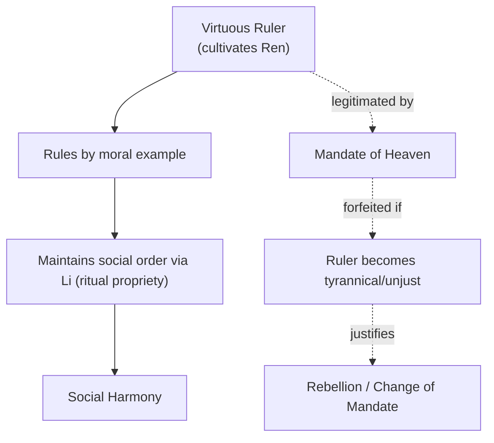
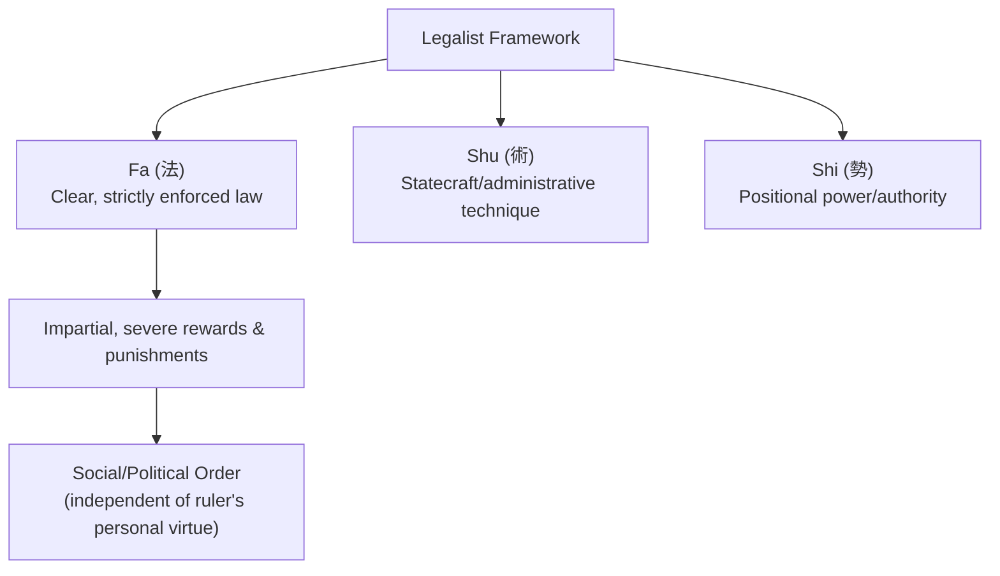
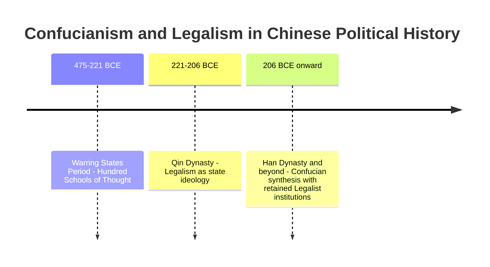

## Confucian and Legalist Political Thought

### Overview

Confucianism and Legalism represent two of the most influential and directly opposed schools of Chinese political philosophy to emerge during the **Warring States period** (475–221 BCE), a time of intense political fragmentation and competition among rival states that gave rise to the broader intellectual flourishing known as the "Hundred Schools of Thought." Where Confucianism grounds good government in moral virtue, ritual propriety, and benevolent leadership, Legalism grounds it in strict law, institutional structure, and calculated incentives — a foundational tension that shaped Chinese statecraft for over two millennia.

### Historical Context

**Key Points**

- The Warring States period was marked by continuous conflict among competing Chinese states following the decline of centralized Zhou dynasty authority, creating urgent practical demand for effective theories of governance, statecraft, and social order.
- This period produced the **"Hundred Schools of Thought"** — a flourishing of competing philosophical traditions (Confucianism, Legalism, Daoism, Mohism, and others) each offering distinct diagnoses of social disorder and prescriptions for restoring stable, effective rule.
- Confucianism and Legalism emerged as the two most politically consequential schools, offering fundamentally opposed answers to the question of how rulers should secure social order and good government.

### Confucianism: Core Principles

**Key Points**

- Founded on the teachings of **Confucius** (Kongzi, 551–479 BCE), recorded primarily in the *Analects* (*Lunyu*), and substantially developed by later thinkers, especially **Mencius** (Mengzi, c. 372–289 BCE) and **Xunzi** (c. 310–235 BCE).
- Confucian political thought holds that good government flows from the **moral virtue** of rulers and the cultivation of proper social relationships, rather than primarily from formal law or coercive institutions.

**Key Confucian Concepts**

1. **Ren (仁, benevolence/humaneness)** — the central Confucian virtue: empathetic concern for others, considered the foundation of all genuinely good conduct, including political rule.
2. **Li (禮, ritual propriety)** — the system of proper ritual, ceremony, and social norms that maintains social harmony by guiding individuals in appropriate conduct according to their role and relationship to others.
3. **The Rectification of Names (Zhengming, 正名)** — Confucius's doctrine that social and political order depends on individuals and roles genuinely conforming to their proper names/titles (a ruler must actually rule as a true ruler should, a father as a true father should); disorder arises when reality diverges from the proper meaning of social roles.
4. **The Mandate of Heaven (Tianming, 天命)** — the belief that legitimate rule is granted by Heaven contingent on the ruler's virtue and just governance; a ruler who becomes tyrannical or unjust forfeits this mandate, providing (unlike most contemporary Legalist thought) a theoretical justification for rebellion against unjust rulers.
5. **Government by Virtue and Example** — Confucius held that a ruler who cultivates personal virtue and governs by moral example, rather than by coercive law and punishment, will naturally win the genuine, willing compliance of the people (in contrast to mere fearful obedience to law).

**Mencius and Xunzi: Divergent Views of Human Nature**

- **Mencius** argued human nature is fundamentally **good** — humans possess innate moral sprouts (compassion, shame, deference, and a sense of right and wrong) that, properly cultivated through education and virtuous environment, naturally develop into full moral virtue; this optimistic anthropology reinforces Confucian confidence in rule by moral example.
- **Xunzi**, by contrast, argued human nature is fundamentally **inclined toward selfish desire** and disorder if left unchecked, meaning that ritual (*li*) and deliberate moral education/cultivation are necessary to actively transform human nature toward goodness — a notably more pessimistic anthropology within the Confucian tradition, and one that [Inference] some scholars argue helped bridge Confucian and Legalist thought, since Xunzi's most famous student, Han Feizi, became the preeminent Legalist theorist.

### Legalism: Core Principles

**Key Points**

- Legalism (*Fajia*, "School of Law") developed as a direct rival to Confucianism, most systematically articulated by **Han Feizi** (c. 280–233 BCE) in the text bearing his name, building on earlier Legalist statesmen including **Shang Yang** (whose reforms in the state of Qin are historically significant) and **Shen Buhai**.
- Legalism rejects the Confucian premise that good government depends on rulers' moral virtue, arguing instead that **effective governance requires strict, clearly codified law, impartially and severely enforced, regardless of the ruler's personal moral character**.

**Key Legalist Concepts**

1. **Fa (法, law)** — clear, publicly promulgated, uniformly and strictly enforced law, applied impartially regardless of social status, as the primary instrument of political control.
2. **Shu (術, statecraft/technique)** — the methods and administrative techniques by which a ruler manages officials, maintains control, and prevents ministers from usurping power (associated particularly with Shen Buhai) — including deliberate concealment of the ruler's intentions to prevent manipulation by subordinates.
3. **Shi (勢, positional power/authority)** — the idea that a ruler's effective power derives primarily from occupying a position of authority backed by law and institutional structure, not from personal virtue or charisma — even a mediocre ruler can govern effectively if backed by proper institutional position and strict law.
4. **Strict Rewards and Punishments** — Legalism advocates clear, consistently and impartially applied systems of reward and severe punishment as the primary mechanism for shaping behavior, on the assumption that most people respond predictably to incentives rather than moral exhortation.

**Example**

Where a Confucian ruler seeks to prevent crime by cultivating virtue in the populace through moral education and ritual, so that people refrain from wrongdoing out of internalized shame, a Legalist ruler instead relies on clearly codified laws with severe, consistently enforced punishments, so that people refrain from wrongdoing out of calculated fear of consequences — reflecting the two schools' fundamentally different assumptions about human motivation.

### Direct Comparison: Confucianism vs. Legalism

| Dimension | Confucianism | Legalism |
| --- | --- | --- |
| View of human nature | Mencius: inherently good; Xunzi: inclined to disorder, but improvable through cultivation | Fundamentally self-interested, responsive primarily to incentives |
| Basis of good government | Ruler's personal virtue and moral example | Codified law, strict and impartial enforcement |
| Role of ritual/tradition | Central — *li* maintains harmony and proper social relationships | Largely dismissed as inefficient or irrelevant to effective control |
| Mechanism of compliance | Internalized moral shame and willing emulation of virtuous ruler | External fear of clear, severe, consistently applied punishment |
| View of social hierarchy | Hierarchical but relational, grounded in mutual (if unequal) obligations (ruler-subject, father-son) | Hierarchical and instrumental, grounded in institutional position and law |
| Legitimacy of rebellion | Justified if ruler forfeits the Mandate of Heaven through tyranny | Generally not theorized as legitimate; order maintained through law's deterrent force |

### Historical Application and Legacy

**Key Points**

- Legalism was decisively and successfully applied by the state of **Qin**, whose Legalist-informed reforms (associated with Shang Yang) contributed substantially to Qin's military and administrative efficiency, ultimately enabling Qin to conquer rival states and unify China under the **Qin dynasty** (221–206 BCE) — the first centralized Chinese empire.
- However, the Qin dynasty's harsh Legalist governance proved politically unsustainable and collapsed rapidly (within about 15 years), leading subsequent dynasties (beginning with the Han dynasty) to adopt a durable historical synthesis: **Confucianism as the dominant public ideology and basis of the imperial examination system**, while retaining significant **Legalist administrative and legal institutions** in actual governmental practice — a pattern [Inference] historians often summarize as "Confucian in appearance, Legalist in substance" (*yang ru yin fa*), reflecting the practical, enduring influence of both traditions on subsequent Chinese statecraft.
- Confucianism became the basis of the **imperial civil service examination system**, which for centuries selected government officials based on mastery of Confucian classical texts, profoundly shaping Chinese political culture, meritocratic ideals, and elite education.

### Comparative Note: Confucianism, Legalism, and Western Political Thought

**Key Points**

- [Inference] Confucianism's emphasis on rule by virtuous example and cultivated moral character shows notable structural parallels to Aristotle's virtue-centered political philosophy, though Confucianism grounds this more explicitly in hierarchical familial relationships (filial piety) extended metaphorically to political rule, whereas Aristotle grounds virtue in the citizen's rational participation in the polis.
- [Inference] Legalism's emphasis on impartial, codified law applied uniformly regardless of the ruler's personal character bears some structural resemblance to later Western legal-rational authority (Weber's typology) and to the rule-of-law tradition, though it emerged from entirely independent philosophical and historical roots, and Legalism notably lacks the concern for individual rights or constitutional limits on the ruler characteristic of later Western constitutionalism.

### Related Topics

- Political Thought in Ancient Greece
- Aristotle and the Politics of the Polis
- Legitimacy and Political Obligation (Mandate of Heaven compared to Western legitimacy theories)
- Core Concepts: Freedom, Equality, and Justice
- Comparative Politics: State Formation and Regime Types
- Rule of Law: Theoretical Foundations
- Political Thought in Ancient Rome