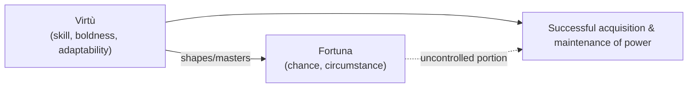
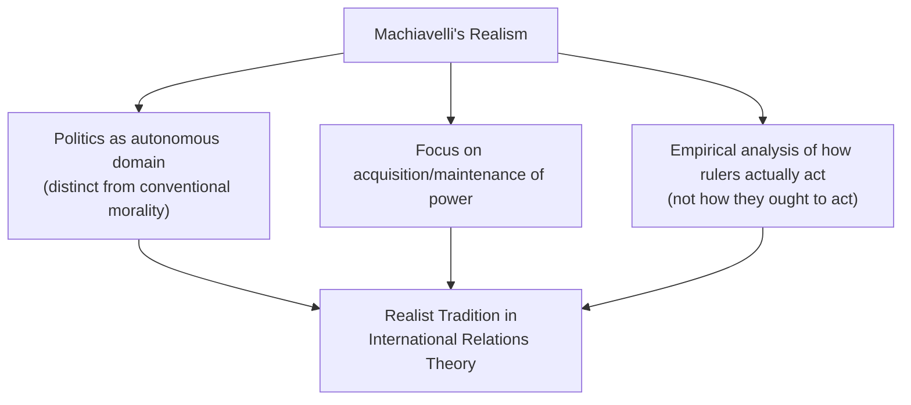

## Machiavelli and Political Realism

### Overview

Niccolò Machiavelli (1469–1527), the Florentine statesman, diplomat, and political theorist, is widely regarded as inaugurating a decisive break with the classical and medieval political traditions by treating politics as an autonomous domain governed by its own practical logic, separate from conventional morality and religious ethics. His two major works — *The Prince* (*Il Principe*, written 1513, published posthumously 1532) and the *Discourses on Livy* (*Discorsi*, c. 1517) — established foundational concepts for what would later be termed **political realism**, profoundly influencing subsequent state theory, diplomacy, and international relations.

### Historical Context

**Key Points**

- Machiavelli wrote during a period of intense political fragmentation and foreign invasion in Italy (the Italian Wars, beginning 1494), witnessing the instability of Florentine and other Italian city-states amid competition from more consolidated foreign powers (France, Spain, the Holy Roman Empire).
- He served as a senior diplomat and administrator for the Florentine Republic (1498–1512) before being removed from office, imprisoned, and tortured following the return of the Medici family to power — he wrote *The Prince* partly in this context, reportedly hoping to secure favor with the restored Medici rulers.
- This direct, practical experience of statecraft, diplomacy, and Italy's political vulnerability substantially shaped Machiavelli's empirically-grounded, unsentimental approach to political analysis.

### The Prince: Core Arguments

**Key Points**

- *The Prince* is a practical manual of statecraft addressed to rulers (particularly new rulers who have recently acquired power), offering advice on how to **acquire, maintain, and effectively exercise political power**.
- Machiavelli's most fundamental methodological departure from classical and Christian political philosophy: he evaluates political action by its **practical effectiveness in achieving and maintaining power**, rather than by its conformity to conventional moral or religious virtue.

**Virtù and Fortuna**

- **Virtù** — in Machiavelli's distinctive usage, this does not mean conventional moral virtue (as in the classical/Christian tradition) but rather a ruler's skill, decisiveness, boldness, adaptability, and capacity to shape political circumstances through effective action.
- **Fortuna** — the unpredictable, often hostile element of chance and circumstance in political affairs; Machiavelli famously likens *fortuna* to a raging river or (in a frequently cited passage) to a woman who favors the bold — a ruler with sufficient *virtù* can master and shape a significant portion of fortune, though never eliminate its role entirely.

**The Separation of Politics from Conventional Morality**

- Machiavelli's most controversial and historically significant claim: a ruler must be willing to act against conventional morality — to deceive, break promises, or use cruelty — when political necessity requires it, since strict adherence to conventional virtue can lead to a ruler's ruin in a world where others are not similarly constrained.
- **"It is better to be feared than loved, if one cannot be both"** [paraphrased per citation policy] — reflecting Machiavelli's argument that fear is a more reliable and durable basis for political control than love, since love depends on others' goodwill (which can evaporate), while fear depends on the ruler's own capacity to punish.
- Machiavelli advises rulers to appear virtuous (merciful, honest, religious) while retaining the practical flexibility to act otherwise when circumstances demand — the appearance of virtue, not its substance, is what matters for maintaining public support.

**Example**

Machiavelli's discussion of Cesare Borgia's use of a brutal lieutenant (Remirro de Orco) to pacify a newly conquered territory, followed by Borgia's public execution of that same lieutenant to distance himself from the cruelty while retaining its benefits (a pacified province) and gaining a reputation for justice, is Machiavelli's paradigmatic illustration of calculated, effective use of cruelty and appearance-management in statecraft.

### Machiavelli's Typology and Advice on Principalities

**Key Points**

Machiavelli systematically analyzes different types of principalities (hereditary, new, mixed, ecclesiastical) and the distinct challenges each poses, along with corresponding advice:

- **New principalities** are inherently more difficult to secure than hereditary ones, since they lack established habits of obedience among the population.
- Machiavelli emphasizes the importance of a ruler possessing his own **military forces** (rather than relying on mercenaries, which he considered unreliable and dangerous) as foundational to secure rule.
- He advises rulers to avoid being hated (even if not loved) and particularly to avoid seizing the property or women of subjects, which he identifies as especially likely to generate lasting hatred and rebellion.

### The Discourses on Livy: Machiavelli's Republicanism

**Key Points**

- In marked contrast to *The Prince*'s focus on principalities, the *Discourses on Livy* (a commentary on the early history of the Roman Republic by the historian Livy) reveals Machiavelli's genuine preference for **republican government** as generally superior to principality for achieving lasting greatness, liberty, and stability.
- Machiavelli argues that well-ordered republics — through institutionalized conflict between the classes (the plebeians and the patrician/senatorial elite), similar to Polybius's mixed-constitution analysis of Rome — channel social tension productively into laws and institutions that preserve liberty, rather than allowing it to fester into destructive factional conflict.
- He emphasizes the importance of civic virtue (*virtù* applied to the citizenry as a whole, not just individual rulers), robust institutions, and a strong military composed of citizen-soldiers (rather than mercenaries) for a republic's long-term survival and expansion.
- [Inference] The apparent tension between *The Prince*'s seemingly amoral advice to autocratic rulers and the *Discourses*' clear republican sympathies has generated extensive scholarly debate — some interpreters (e.g., in the tradition of civic humanist and republican readings, notably associated with historian J.G.A. Pocock) argue Machiavelli viewed strong, even ruthless, princely rule as a necessary but temporary tool for unifying and stabilizing a fragmented political order (such as Italy) as a precondition for eventually establishing durable republican institutions.

### Machiavellianism and Political Realism

**Key Points**

- The term **"Machiavellian"** entered common usage (often pejoratively) to describe cunning, deceptive, or amoral political conduct — though many scholars argue this popular usage substantially oversimplifies or distorts Machiavelli's more nuanced and context-sensitive analysis.
- Machiavelli is widely regarded as a foundational figure in the tradition of **political realism** — the view that political actors (and, later, states in international relations) act primarily according to calculations of power and self-interest rather than moral or ideological commitments, and that effective political analysis must proceed from this premise rather than from how political actors ought ideally to behave.
- [Inference] This realist orientation substantially anticipates and directly influences the **realist school of international relations theory** (associated with later thinkers such as Hans Morgenthau and E.H. Carr), which similarly emphasizes power, national interest, and skepticism toward purely moralistic or idealistic approaches to interstate relations.

### Comparison with Classical and Christian Political Thought

| Dimension | Classical Tradition (Plato/Aristotle/Cicero) | Christian Tradition (Augustine/Aquinas) | Machiavelli |
| --- | --- | --- | --- |
| Relationship of politics to ethics | Politics should cultivate virtue/the common good | Politics constrained by natural law/divine law | Politics has its own autonomous logic, separate from conventional ethics |
| Standard for evaluating rulers | Wisdom, justice, virtue | Conformity to natural and divine law | Effectiveness in acquiring/maintaining power |
| View of human nature | Rational, social, capable of virtue (esp. Aristotle) | Fallen, sinful, in need of grace/law | Largely self-interested, fickle, prone to ingratitude |
| Best regime | Mixed constitution / rule by the wise | Mixed constitution under natural/divine law | Well-ordered republic (per *Discourses*), though principality treated pragmatically in *The Prince* |

### Legacy and Influence

**Key Points**

- Machiavelli's separation of political effectiveness from conventional morality is widely regarded as marking a foundational moment in the emergence of modern, secular political science — treating politics as an empirical domain to be analyzed on its own terms rather than derived from theology or moral philosophy.
- His republican analysis in the *Discourses* substantially influenced the later tradition of **civic republicanism**, including significant influence on Renaissance and early modern republican thought and, through various channels, on the political thought of the American Founders regarding mixed government, the value of civic virtue, and the dangers of corruption.
- Machiavelli's realist premises regarding power, self-interest, and the limits of purely moral or idealistic political analysis remain foundational reference points in contemporary international relations realism and broader political science skepticism toward purely normative approaches to power politics.

### Related Topics

- Roman Republicanism and Cicero
- Thomas Aquinas and Natural Law
- Realism in International Relations Theory
- Theories of the Social Contract (Hobbes, Locke, Rousseau)
- Civic Humanism and Republicanism
- Legitimacy and Political Obligation
- Behavioralism and the Scientific Study of Politics