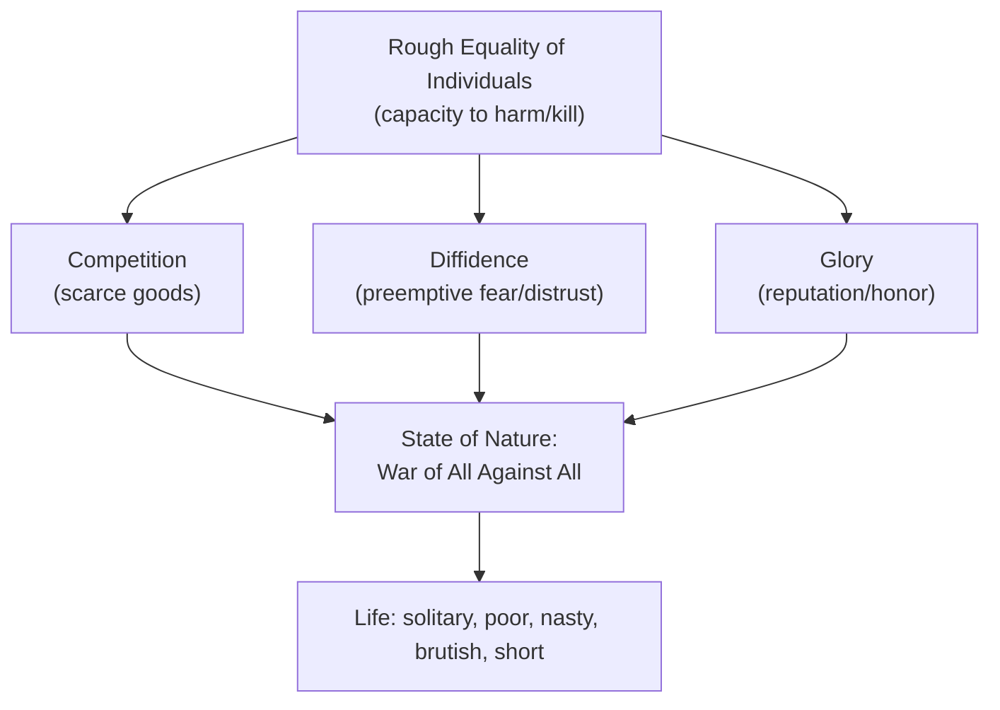
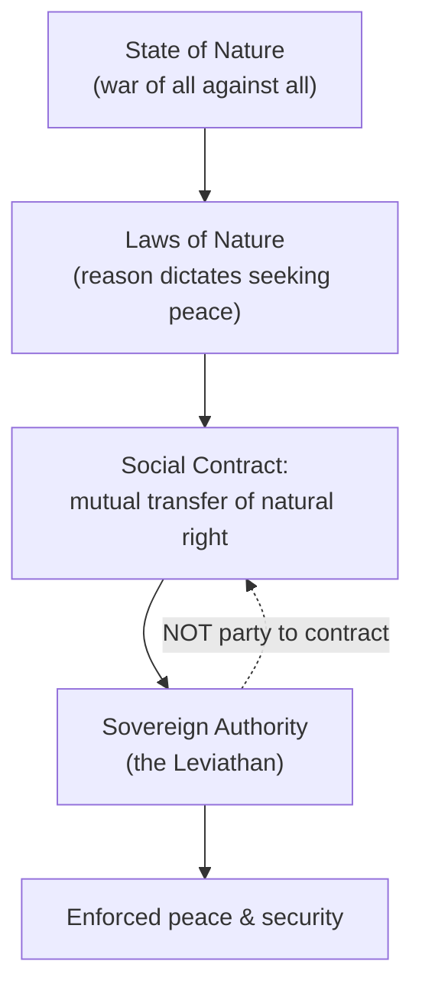

## Thomas Hobbes and the Social Contract

### Overview

Thomas Hobbes (1588–1679) developed one of the most influential and rigorously systematic theories in the history of political philosophy, presented most fully in *Leviathan* (1651). Writing against the backdrop of the English Civil War, Hobbes constructed a materialist, geometrically-inspired argument for absolute sovereign authority, grounded in a hypothetical **state of nature** and a **social contract** among self-interested individuals. Hobbes is widely regarded as the founding figure of modern social contract theory and a foundational influence on political realism, though his conclusions differ sharply from those of later contract theorists like Locke and Rousseau.

### Historical Context

**Key Points**

- Hobbes wrote during and immediately after the **English Civil War** (1642–1651), a period of profound political instability, violence, and the execution of King Charles I (1649) — an experience of social breakdown that profoundly shaped his pessimistic assessment of human nature and his prioritization of order and security above nearly all other political goods.
- Hobbes was influenced by the mechanistic, materialist science of his era (echoing Galileo, among others), aiming to construct political philosophy with something approaching the rigor and certainty of geometric demonstration, deriving political conclusions systematically from premises about human psychology and physics.

### The State of Nature

**Key Points**

- Hobbes's argument begins with a **hypothetical thought experiment**: what would human life be like in the absence of any political authority or enforceable common power — the "state of nature"?
- Hobbes derives this condition from premises about human psychology: humans are roughly equal in their capacity to kill or harm one another (even the weakest can kill the strongest through cunning or alliance), are driven by competing desires for scarce goods, glory, and self-preservation, and lack any common power to keep them in awe and enforce agreements.
- From these premises, Hobbes concludes that the state of nature would inevitably be a **"war of every man against every man"** (*bellum omnium contra omnes*), characterized by three principal causes of conflict: **competition** (fighting over scarce resources), **diffidence** (fighting preemptively out of fear/distrust of others), and **glory** (fighting for reputation and honor).
- In this state, Hobbes argues, there can be no industry, agriculture, navigation, knowledge, or society, because the constant threat of violent death precludes any of these — famously summarized in his description of life in the state of nature as **"solitary, poor, nasty, brutish, and short"** [paraphrased per citation policy].

### Natural Right and Natural Law

**Key Points**

- Hobbes distinguishes sharply between **natural right (*jus naturale*)** and **natural law (*lex naturalis*)**:
  - **Natural right** — the fundamental liberty each individual possesses in the state of nature to use their own power for self-preservation, by any means they judge necessary, including against others.
  - **Natural law** — a general rule discovered by reason, forbidding a person from doing what is destructive of their own life and requiring them to seek peace when it can be reasonably obtained, and to defend themselves by all means when it cannot.
- Hobbes derives a series of specific **laws of nature** from this general principle, most importantly the **second law of nature**: that individuals should be willing to **lay down their unlimited natural right** to all things and be contented with as much liberty against others as they would allow others against themselves, provided others do the same — this is the rational foundation of the social contract.

### The Social Contract and the Leviathan

**Key Points**

- To escape the state of nature, Hobbes argues rational individuals collectively agree to a **social contract**: each person mutually transfers (or authorizes) their individual right of self-governance to a single sovereign authority (whether an individual monarch or an assembly), on the condition that all others do likewise.
- Crucially, for Hobbes, this contract is made **among the individual subjects themselves**, not between the subjects and the sovereign — the sovereign is not a party to the contract and therefore cannot be considered to have broken any agreement, which is central to Hobbes's argument for the sovereign's near-absolute and effectively unaccountable authority.
- The resulting entity is the **Leviathan** — Hobbes's metaphor (drawn from the biblical sea monster) for the artificial, all-powerful commonwealth/state created by this covenant, famously depicted in the frontispiece of his book as a giant sovereign figure composed of the bodies of the many individual subjects who compose it.

### Absolute Sovereignty

**Key Points**

- Hobbes argues that for the social contract to actually secure peace, the resulting sovereign authority must be **absolute, indivisible, and essentially unlimited** — a sovereign whose power is checked or divided (e.g., through separation of powers, or subjection to positive law) would be too weak to prevent a relapse into the state of nature.
- The sovereign holds the exclusive right to make and enforce law, adjudicate disputes, control the military, and even determine religious doctrine within the commonwealth — Hobbes explicitly subordinates ecclesiastical authority to the civil sovereign to prevent the destabilizing conflicts between religious and political authority he witnessed during the Civil War.
- Notably, since subjects (not the sovereign) are the parties to the contract, **subjects cannot legitimately claim the sovereign has broken a promise to them** and thereby justify rebellion — Hobbes is famously hostile to any general right of revolution, viewing it as a recipe for a return to the catastrophic state of nature.
- **The one crucial exception**: Hobbes argues that since the entire purpose of the contract is self-preservation, an individual retains the right to resist the sovereign if the sovereign directly threatens their own life (e.g., ordering their execution) — self-preservation is a natural right that cannot be fully alienated even by the social contract.

| Feature | Hobbes's Sovereign |
| --- | --- |
| Source of authority | Mutual covenant among subjects (not with the sovereign) |
| Limits on power | None, except the impossibility of commanding subjects to actively harm themselves |
| Division of powers | Rejected — power must be unified/absolute to be effective |
| Right of rebellion | Generally denied, except in direct self-defense of one's own life |
| Religious authority | Subordinated to civil sovereign authority |

### Hobbes's Method and Materialist Psychology

**Key Points**

- Hobbes grounds his political theory in a broader materialist metaphysics and mechanistic psychology: human thought, desire, and aversion are, for Hobbes, ultimately physical processes (motion), and human behavior can in principle be explained and predicted through this mechanistic framework, similar to physical bodies in motion.
- This method reflects Hobbes's broader ambition to place political philosophy on a scientific, quasi-geometric foundation — deriving political conclusions with logical necessity from clearly defined premises about human nature, rather than from tradition, revelation, or classical authority.

### Comparison with Classical and Medieval Political Thought

| Dimension | Classical/Medieval Tradition | Hobbes |
| --- | --- | --- |
| Origin of political community | Natural (Aristotle) or remedial for sin (Augustine)/natural + remedial (Aquinas) | Artificial construct, created deliberately through rational agreement |
| Human nature | Naturally social/political (Aristotle); corrupted by sin but capable of virtue (Aquinas) | Fundamentally self-interested, driven by competition, fear, and desire for glory |
| Basis of legitimate authority | Natural law, divine law, virtue, common good | Individual consent transferred to an absolute sovereign for security |
| Purpose of the state | Cultivate virtue and the good life | Secure peace and prevent return to the state of nature |
| View of rebellion | Aquinas: justified against unjust law contrary to divine law | Generally rejected, except in direct self-defense |

### Legacy and Influence

**Key Points**

- Hobbes is widely regarded as the founding figure of modern **social contract theory**, establishing the basic conceptual apparatus (state of nature, natural rights, social contract, sovereign authority) that later contract theorists (Locke, Rousseau) would adopt and substantially transform toward more limited and participatory conclusions.
- Hobbes's materialist, self-interest-based model of human psychology significantly influenced the later development of **rational choice theory** in political science, which similarly models political actors as rational agents pursuing their own interests under specified constraints.
- His emphasis on the necessity of a single, effective sovereign authority for maintaining order continues to inform realist and statist strands of political theory, and his account of the state of nature remains a standard reference point in analyses of state failure, anarchy, and security dilemmas in both domestic and international politics.
- [Inference] Hobbes's argument that the international system itself resembles a state of nature among sovereign states (since no overarching authority exists above states) is often cited as a direct conceptual forerunner of the **anarchy** assumption central to realist international relations theory.

### Related Topics

- Machiavelli and Political Realism
- John Locke and Natural Rights
- Jean-Jacques Rousseau and the General Will
- Legitimacy and Political Obligation
- Core Concepts: Freedom, Equality, and Justice
- Rational Choice Theory and New Institutionalism
- Realism in International Relations Theory