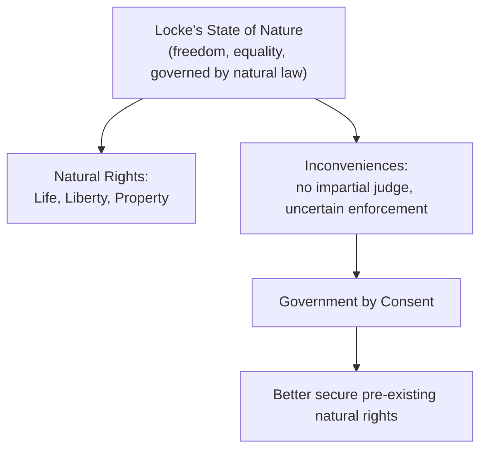
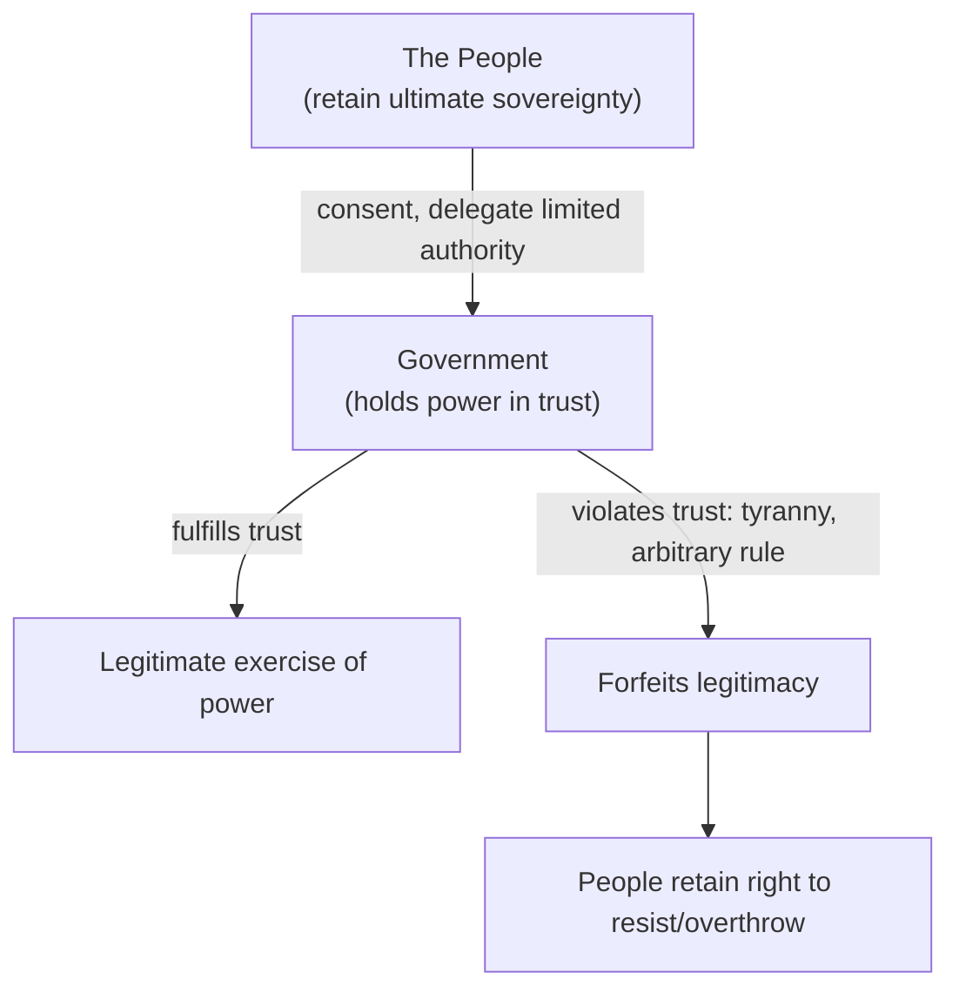

## John Locke and Liberal Constitutionalism

### Overview

John Locke (1632–1704) is widely regarded as the founding figure of modern **liberal political philosophy** and constitutionalism. His *Two Treatises of Government* (1689) — particularly the *Second Treatise* — constructed an influential alternative to Hobbesian absolutism, grounding legitimate government in natural rights, limited consent, and constitutional constraints on power. Locke's framework profoundly shaped subsequent liberal-democratic constitutionalism, including direct influence on the American Declaration of Independence and constitutional design.

### Historical Context

**Key Points**

- Locke wrote the *Two Treatises of Government* against the backdrop of England's political upheavals, most directly associated with the **Glorious Revolution** of 1688–89, which deposed King James II and established constitutional constraints on monarchical power — though scholars debate whether Locke composed the work partly beforehand as a more general defense of resistance against absolutist rule.
- The *First Treatise* is a detailed refutation of Sir Robert Filmer's *Patriarcha*, which had defended the divine right of kings through an argument from patriarchal authority traced to Adam; the *Second Treatise* presents Locke's constructive alternative theory of government.

### The State of Nature: Locke vs. Hobbes

**Key Points**

- Locke's state of nature differs fundamentally from Hobbes's: rather than a state of pure war, Locke describes it as a state of **perfect freedom and equality**, governed by a discoverable **law of nature** (accessible through reason) that obliges individuals not to harm one another's life, liberty, health, or possessions.
- Locke holds that individuals possess **natural rights** — to life, liberty, and property — even prior to and independent of any political community or government; these rights are not granted by the state but are inherent and pre-political.
- The state of nature is not necessarily peaceful in practice, however: Locke acknowledges "inconveniences" arise because, absent a common judge, individuals must personally enforce the law of nature and judge their own disputes, leading to potential bias, escalation, and insecurity — this practical difficulty, not Hobbesian total war, is Locke's primary justification for government.

| Dimension | Hobbes's State of Nature | Locke's State of Nature |
| --- | --- | --- |
| Character | War of all against all | Freedom and equality, governed by natural law |
| Natural rights | Unlimited right to all things | Rights to life, liberty, and property, bounded by natural law |
| Primary problem | Violent chaos, no security | "Inconveniences" — lack of impartial judge/enforcement |
| Motivation for government | Escape from total war | Better secure pre-existing natural rights |

### Natural Rights and the Labor Theory of Property

**Key Points**

- Locke's theory of property is among his most influential and distinctive contributions: he argues that individuals acquire private property rights in previously unowned natural resources by **mixing their labor** with them — transforming common resources into legitimate individual possessions.
- This **labor theory of property** is subject to two Lockean provisos: (1) individuals may only appropriate as much as they can use without spoilage/waste, and (2) they must leave "enough and as good" in common for others — though Locke argues the introduction of money (a durable, non-perishable store of value agreed upon by tacit consent) effectively removes the spoilage limitation, enabling more extensive accumulation.
- [Inference] Locke's property theory has been read by various later interpreters in substantially different ways — as a foundation for robust private property rights and market economies (influential in classical liberalism and libertarianism), and, by critics such as C.B. Macpherson, as an early ideological justification for capitalist accumulation and inequality; this remains a genuinely contested area of Locke scholarship.

### Government by Consent

**Key Points**

- For Locke, legitimate political authority arises only through the **consent of the governed** — individuals voluntarily leave the state of nature and form a political community by mutual agreement, primarily to establish an impartial common authority capable of better protecting their natural rights (especially property, broadly construed to include life, liberty, and estate).
- Locke distinguishes **express consent** (explicit agreement to join a political society) from **tacit consent** (implied agreement, for instance through accepting the benefits of living within a state's territory and enjoying its protections) — though the adequacy of tacit consent to generate genuine political obligation has been a subject of extensive philosophical debate (see *Legitimacy and Political Obligation*).
- Crucially, unlike Hobbes, Locke holds that the social contract is between the people and creates a **trust** with the government — government is granted limited, delegated authority for specific purposes (protecting natural rights) and remains accountable to the people who created it.

### Limited Government and the Right of Revolution

**Key Points**

- Because government exists as a trust to protect natural rights, Locke argues that a government which systematically violates this trust — acting arbitrarily, seizing property without consent, or otherwise undermining the very rights it was created to protect — **forfeits its legitimacy**, and the people retain the right to resist and ultimately overthrow such a government.
- This directly and sharply contrasts with Hobbes's near-total rejection of a general right of rebellion: for Locke, the right of revolution is a natural safeguard against tyranny, since ultimate sovereignty always remains with the people, who merely delegate limited authority to government.
- Locke's theory thus supports fundamentally **limited government** — power constrained by the purposes for which it was established (protection of natural rights), rather than the Hobbesian model of unlimited, unaccountable sovereign authority.

### Separation of Powers

**Key Points**

- Locke advocates a **separation of governmental powers**, distinguishing primarily between:
  1. **Legislative power** — the supreme power to make laws, which Locke considers the most fundamental branch, since it directs how force may be used
  2. **Executive power** — the power to enforce laws and administer government on an ongoing basis
  3. **Federative power** — the power to conduct foreign policy, war, and international relations (a category less prominent in later constitutional design, which typically folds this into executive power)
- Locke's insistence that legislative power should be exercised by a body distinct from those who execute the laws (to prevent the same persons from making convenient exceptions for themselves) substantially influenced later, more fully developed theories of separation of powers, notably Montesquieu's tripartite division (legislative, executive, judicial), which in turn directly shaped the U.S. Constitution's structure.

### Toleration

**Key Points**

- In *A Letter Concerning Toleration* (1689), Locke argues for religious toleration and the separation of church and state, contending that civil government's proper purpose is limited to protecting civil interests (life, liberty, property) and does not extend to enforcing religious belief, which concerns the individual conscience and cannot legitimately be compelled by force.
- [Inference] Locke's toleration argument contained notable limits by modern standards — he explicitly excluded atheists (whose oaths he considered unreliable, since not backed by fear of divine judgment) and, in some formulations, Catholics (due to perceived political allegiance to a foreign sovereign, the Pope) from the scope of toleration, reflecting the specific religious-political anxieties of his era rather than a fully universal principle.

### Comparison: Locke vs. Hobbes

| Dimension | Hobbes | Locke |
| --- | --- | --- |
| State of nature | War of all against all | Relatively peaceful, governed by natural law |
| Natural rights | Unlimited right to all things, surrendered entirely | Life, liberty, property — never fully surrendered |
| Sovereign power | Absolute, indivisible, unaccountable | Limited, divided, accountable to the people |
| Contract structure | Among subjects; sovereign not a party | Between people and government; government held in trust |
| Right of rebellion | Denied (except self-defense) | Affirmed against tyrannical government |
| Legacy | Foundational for political realism, statism | Foundational for liberal constitutionalism, limited government |

### Legacy and Influence

**Key Points**

- Locke's theory of natural rights, government by consent, and the right of revolution directly and explicitly influenced the American **Declaration of Independence** (1776), whose language on "life, liberty, and the pursuit of happiness" and government deriving "just powers from the consent of the governed" closely echoes Lockean concepts.
- His arguments for limited government and separation of powers substantially shaped the constitutional design of liberal-democratic states, including the U.S. Constitution's structure of divided governmental authority.
- Locke is widely regarded as the philosophical founder of **classical liberalism**, establishing the intellectual foundations for subsequent liberal constitutionalism, limited government, private property rights, and the modern human/natural rights tradition.
- His labor theory of property and account of toleration remain frequently cited (and contested) reference points in contemporary debates over economic justice, religious liberty, and the proper scope and limits of state authority.

### Related Topics

- Thomas Hobbes and the Social Contract
- Jean-Jacques Rousseau and the General Will
- Core Concepts: Freedom, Equality, and Justice
- Legitimacy and Political Obligation
- Separation of Powers and Checks and Balances
- Thomas Aquinas and Natural Law
- Montesquieu and the Theory of Separated Powers