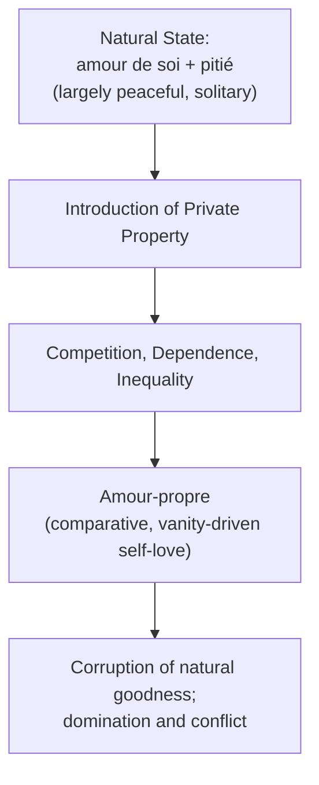
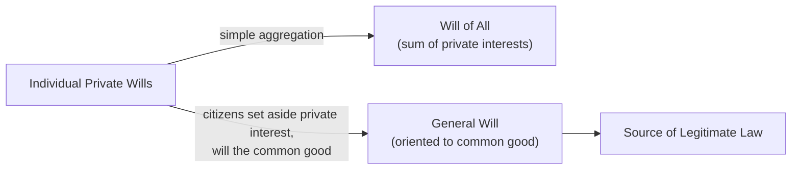
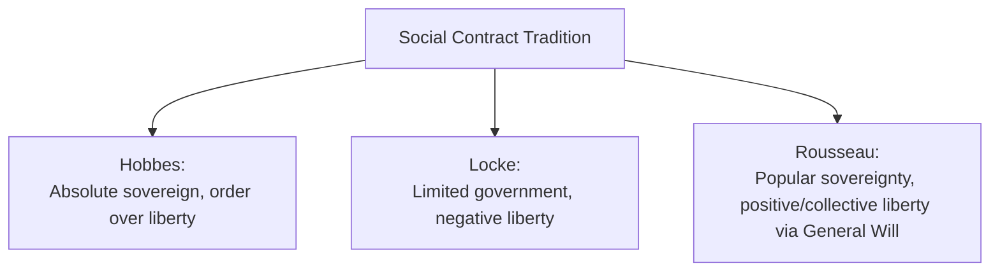

## Jean-Jacques Rousseau and the General Will

### Overview

Jean-Jacques Rousseau (1712–1778) developed one of the most distinctive and influential — and most contested — theories of political legitimacy in the Enlightenment tradition. His *Discourse on Inequality* (1755) and *The Social Contract* (*Du Contrat Social*, 1762) reconceived the social contract tradition around the concept of the **General Will** (*volonté générale*), offering a theory of collective self-governance and popular sovereignty that diverged sharply from both Hobbesian absolutism and Lockean liberal individualism, and that would profoundly influence democratic theory, republicanism, and revolutionary political movements.

### Historical Context

**Key Points**

- Rousseau wrote as part of the broader French Enlightenment, in critical dialogue with earlier social contract theorists (Hobbes, Locke) and with the emerging commercial, unequal societies of 18th-century Europe.
- His work is marked by a distinctive ambivalence toward the "progress" celebrated by many Enlightenment contemporaries — Rousseau's *Discourse on the Sciences and Arts* (1750) and *Discourse on Inequality* argue that civilizational development, private property, and social artifice had corrupted a more natural, purer human condition.

### The State of Nature and the Origins of Inequality

**Key Points**

- Rousseau's state of nature, developed most fully in the *Discourse on Inequality*, differs markedly from both Hobbes's and Locke's: he depicts natural humans (in a pure, pre-social condition) as solitary, largely peaceful, and guided by two basic natural sentiments — **self-preservation (*amour de soi*)** and natural **compassion/pity (*pitié*)** for the suffering of others — rather than by rational calculation or systematic conflict.
- Rousseau argues that **inequality is not natural but the product of social development**, tracing a historical narrative in which the introduction of private property (Rousseau's famous claim that the first person who fenced off land and declared "this is mine" was the true founder of civil society) generated escalating competition, dependence, and inequality.
- This process corrupts *amour de soi* (healthy self-love/self-preservation) into ***amour-propre*** — a comparative, competitive self-love dependent on the opinion and esteem of others, which Rousseau identifies as the psychological root of vanity, domination, and social conflict in developed societies.

### The Social Contract: Rousseau's Solution

**Key Points**

- Rousseau's central political problem in *The Social Contract* is famously stated: to find a form of association that will defend the person and property of each member with the collective force of all, while still leaving each individual **"as free as before"** [paraphrased] — reconciling political authority with genuine individual freedom.
- His solution: individuals do not surrender their freedom to a separate sovereign (as in Hobbes) or merely delegate limited authority to a government (as in Locke), but instead **each individual surrenders themselves entirely and equally to the whole community**, becoming both author and subject of the laws that govern them — a radical form of collective self-legislation.

### The General Will (*Volonté Générale*)

**Key Points**

- The **General Will** is Rousseau's central and most distinctive — and most philosophically contested — concept: the collective will of the political community oriented toward the genuine **common good**, as distinct from the mere sum of individual private interests.
- Rousseau explicitly distinguishes the General Will from the **"Will of All" (*volonté de tous*)** — the latter is simply the aggregate of particular, private interests (what each individual happens to want), which can be self-interested, factional, and divisive; the General Will, by contrast, is what the community wills when its members set aside narrow self-interest and will what is genuinely good for the community as a whole.
- The General Will is held to be **infallible** in the sense that it is, by definition, always directed at the common good — though Rousseau acknowledges that a particular vote or decision can fail to correctly identify or express the true General Will if citizens are insufficiently informed, corrupted by faction, or swayed by narrow private interests.

| Concept | Definition | Orientation |
| --- | --- | --- |
| Will of All (*volonté de tous*) | Simple sum/aggregate of individual private wills | Private interest; may be factional or divisive |
| General Will (*volonté générale*) | The community's collective will aimed at the common good | Common good; requires citizens to think as members of the whole, not as private individuals |

**"Forced to Be Free"**

- Rousseau's most controversial formulation: an individual who refuses to obey the General Will may be **"forced to be free"** [paraphrased] — since, for Rousseau, true freedom consists not in doing whatever one privately wants, but in obeying self-legislated law that expresses the community's genuine common good; compelling adherence to the General Will is, on this view, actually enforcing the individual's own deeper, rational will as a member of the community, not merely external coercion.
- [Inference] This concept has generated extensive and enduring controversy: critics (including, notably, later liberal theorists and 20th-century thinkers like Isaiah Berlin, whose analysis of "positive liberty" partly targets this Rousseauian move) argue it risks providing philosophical cover for authoritarian collectivism in the name of a supposedly "true" popular will, while defenders argue it reflects a coherent and defensible republican conception of freedom as democratic self-governance rather than mere non-interference.

### Popular Sovereignty and Direct Democracy

**Key Points**

- Rousseau holds that sovereignty — the authority to make law expressing the General Will — is **inalienable and indivisible**, residing permanently and exclusively in the collective body of citizens; it cannot be legitimately transferred, delegated, or represented by others.
- This leads Rousseau to a strong preference for **direct democracy** and deep skepticism toward representative government: he argues that sovereignty cannot be represented, since the General Will, being the will of the people themselves, cannot genuinely be exercised by delegates acting on the people's behalf — famously asserting that the English, who believed themselves free because they elected representatives, were free only during the moment of election and enslaved the rest of the time [paraphrased].
- Rousseau explicitly recognized this model of direct citizen legislation was practically feasible primarily in small, relatively homogeneous states (citing ancient city-states and his native Geneva as models), raising significant practical questions about its applicability to large, modern nation-states.

### The Legislator and Civil Religion

**Key Points**

- Rousseau introduces the figure of the **Legislator** — an extraordinary, quasi-superhuman founding figure who designs a political community's foundational laws and institutions, shaping the character of a people so that they are capable of correctly willing the General Will; the Legislator, notably, holds no ongoing political power and merely proposes a foundational constitutional framework.
- Rousseau also advocates a **civil religion** — a minimal set of shared civic beliefs and sentiments (e.g., belief in a benevolent, providential deity, the sanctity of the social contract, and the wrongness of religious intolerance) intended to bind citizens together and support their commitment to the laws and community, distinct from and subordinate to any particular sectarian religious doctrine.

### Comparison: Hobbes, Locke, and Rousseau

| Dimension | Hobbes | Locke | Rousseau |
| --- | --- | --- | --- |
| State of nature | War of all against all | Peaceful, governed by natural law | Solitary but largely peaceful; corrupted by social development |
| Contract structure | Among subjects; sovereign not a party | Between people and government (trust) | Each individual surrenders to the whole community |
| Locus of sovereignty | Transferred to absolute sovereign | Remains with the people; delegated, limited government | Remains permanently, inalienably with the people (General Will) |
| Preferred government | Absolute monarchy/sovereign | Limited, representative constitutional government | Direct democracy (in small states); deep skepticism of representation |
| Freedom | Natural right largely surrendered for security | Natural rights retained; freedom as non-interference (negative liberty) | Freedom as obedience to self-legislated law (positive/collective liberty) |

### Legacy and Influence

**Key Points**

- Rousseau's theory of popular sovereignty and the General Will substantially influenced the **French Revolution**, providing key conceptual vocabulary (popular sovereignty, the general will, civic virtue) invoked by revolutionary leaders, though [Inference] historians and political theorists continue to debate the extent to which Rousseau's ideas directly caused, versus were selectively invoked to justify, various phases of the Revolution, including its more radical and authoritarian episodes.
- His critique of inequality and private property influenced later socialist and communitarian political thought, while his emphasis on collective self-legislation and positive liberty substantially shaped subsequent republican and participatory democratic theory.
- Isaiah Berlin's influential distinction between negative and positive liberty (see *Core Concepts: Freedom, Equality, and Justice*) directly engages with and partly critiques the Rousseauian conception of freedom as obedience to the General Will, making Rousseau a central reference point in ongoing debates over the proper definition of political liberty.
- Rousseau's skepticism toward representative government and his preference for direct democratic participation continue to inform contemporary debates over deliberative democracy, civic participation, and the limits of representative institutions in large modern states.

### Related Topics

- Thomas Hobbes and the Social Contract
- John Locke and Liberal Constitutionalism
- Core Concepts: Freedom, Equality, and Justice
- Democratic Theory and Models of Democracy
- Legitimacy and Political Obligation
- Civic Humanism and Republicanism
- The French Revolution and Its Political Thought