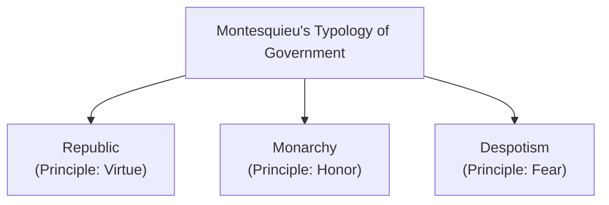
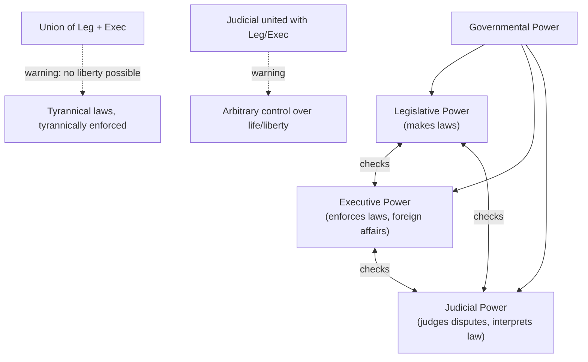

## Montesquieu and the Separation of Powers

### Overview

Charles-Louis de Secondat, Baron de Montesquieu (1689–1755), was a French Enlightenment political philosopher whose masterwork, *The Spirit of the Laws* (*De l'Esprit des Lois*, 1748), developed one of the most influential theories of institutional design in the history of political science: the **separation of powers**. Combining comparative empirical analysis of political systems with normative constitutional theory, Montesquieu's work profoundly shaped modern constitutionalism, most directly influencing the structure of the U.S. Constitution and subsequent liberal-democratic institutional design worldwide.

### Historical Context and Method

**Key Points**

- Montesquieu wrote *The Spirit of the Laws* as a wide-ranging comparative study of political and legal systems across different societies, climates, and historical periods, aiming to identify the underlying principles ("the spirit") shaping the diversity of laws and governments rather than to prescribe a single universally ideal constitution.
- His method combined **empirical, comparative observation** (drawing on history, travel accounts, and comparative institutional analysis, including influential though [Inference] now widely regarded as significantly idealized or inaccurate observations of the English constitution) with **theoretical classification**, positioning him as an important precursor to modern comparative politics.
- Montesquieu's approach reflects Enlightenment confidence that political and social phenomena, like natural phenomena, are governed by discoverable rational principles and causal relationships (including his well-known, though now largely discredited, theories linking climate to national character and political institutions).

### Montesquieu's Typology of Government

**Key Points**

Montesquieu classifies governments into three types, each associated with a distinct animating principle:

1. **Republic** — where the people (democratic republic) or a portion of the people (aristocratic republic) hold sovereign power; animated by the principle of **virtue** (civic virtue, love of the laws and one's country).
2. **Monarchy** — where a single person governs according to fixed, established laws; animated by the principle of **honor** (the pursuit of distinction, rank, and reputation within a hierarchical social order).
3. **Despotism** — where a single person governs without law, according to arbitrary will and caprice; animated by the principle of **fear**.

| Government Type | Who Rules | Animating Principle | Governed By |
| --- | --- | --- | --- |
| Republic (democratic/aristocratic) | The people, or a portion thereof | Virtue | Established laws + civic virtue |
| Monarchy | One person | Honor | Fixed, established laws |
| Despotism | One person | Fear | Arbitrary will, no fixed law |

### The Separation of Powers: Core Theory

**Key Points**

- Montesquieu's most enduringly influential contribution is his systematic argument for dividing governmental authority among distinct branches to prevent the concentration and abuse of power, famously articulating the principle that **"power should be a check to power"** [paraphrased per citation policy].
- He identifies **three distinct types of governmental power** that should be separated and held by different institutions or bodies:
  1. **Legislative power** — the power to enact, amend, and repeal laws
  2. **Executive power** — the power to enforce laws, conduct foreign affairs, and ensure public security
  3. **Judicial power** — the power to judge disputes, interpret laws, and punish crimes
- Montesquieu's central warning: when legislative and executive power are united in the same person or body, there can be no liberty, since the same body could enact tyrannical laws and then execute them tyrannically; similarly, if judicial power is not separated from legislative and executive power, the judge could become a legislator or an oppressor, since judgment would be joined to the force of law-making and law-enforcing.

**Example**

Montesquieu's warning that uniting legislative and executive power invites tyranny is illustrated by his analysis of a monarch who could both enact oppressive taxation laws and personally direct their enforcement without any check — compared to a system where a separate legislative body must first debate and pass such measures, and a distinct executive (bound by law) must implement them, creating institutional friction that constrains arbitrary action.

### Montesquieu's Reading of the English Constitution

**Key Points**

- Montesquieu's separation-of-powers theory was substantially inspired by his (celebrated, though [Inference] historically contested by later scholars as somewhat idealized) analysis of the English constitutional system following the Glorious Revolution of 1688, which he presented as an exemplary model combining a monarchic executive, a bicameral legislature (Lords and Commons, representing aristocratic and popular elements), and an independent judiciary.
- [Inference] Historians of political thought generally note that Montesquieu's portrait of England somewhat overstated the degree of actual separation and independence between these branches in 18th-century English practice (for instance, the fusion of executive and legislative personnel characteristic of parliamentary systems), but his idealized model proved enormously influential as a normative template regardless of its precise empirical accuracy.

### Checks and Balances

**Key Points**

- Beyond simple separation, Montesquieu emphasized that the divided branches should possess **mutual checking powers** over one another — not complete isolation, but interlocking authority that allows each branch to restrain the others' potential overreach (for example, an executive veto over legislation, or legislative oversight of executive action).
- This concept of **checks and balances** — distinct from, though closely related to, pure separation of powers — became a central design principle for subsequent constitutional systems, ensuring that no single branch could act entirely independently of the others' influence and oversight.

### Comparison with Locke's Separation of Powers

| Dimension | Locke | Montesquieu |
| --- | --- | --- |
| Number of powers identified | Three: legislative, executive, federative | Three: legislative, executive, judicial |
| Judicial power | Not treated as a fully distinct branch | Explicitly identified as a separate, independent branch |
| Foreign affairs power | Distinct "federative" power | Generally subsumed within executive power |
| Empirical grounding | Primarily theoretical/normative argument | Explicitly comparative, drawing on empirical analysis of the English constitution |
| Influence on later design | Influenced general concept of divided power | More directly and specifically shaped the tripartite (legislative/executive/judicial) model adopted in most modern constitutions |

### Legacy and Influence

**Key Points**

- Montesquieu's tripartite separation of powers (legislative, executive, judicial) directly and explicitly influenced the framers of the **U.S. Constitution** — Montesquieu is among the most frequently cited authorities in the *Federalist Papers*, particularly in James Madison's arguments (notably Federalist No. 47) defending the Constitution's structural separation of powers.
- His model became the dominant template for subsequent liberal-democratic constitutional design worldwide, distinguishing between **presidential systems** (which tend toward stricter separation, following Montesquieu's model more closely, as in the United States) and **parliamentary systems** (which involve greater fusion of legislative and executive personnel, in some tension with strict Montesquieuian separation, though typically retaining an independent judiciary).
- Montesquieu's broader comparative method — analyzing how political institutions interact with social, historical, and environmental context — is widely regarded as an important precursor to the modern **comparative politics** subfield's emphasis on systematic cross-national institutional analysis.
- [Inference] Contemporary comparative-institutional scholarship on presidentialism versus parliamentarism, and on the relative merits of concentrated versus divided political power, continues to engage directly with the theoretical framework Montesquieu established, even as his more speculative claims (such as climate theory) have been largely set aside.

### Related Topics

- John Locke and Liberal Constitutionalism
- Jean-Jacques Rousseau and the General Will
- Roman Republicanism and Cicero (mixed constitution precursor)
- The Subfields and Scope of Political Science (comparative politics origins)
- Legitimacy and Political Obligation
- Presidential vs. Parliamentary Systems in Comparative Politics
- The U.S. Constitution and the Federalist Papers