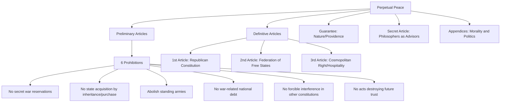

## Kant and Perpetual Peace

### Overview

Immanuel Kant's *Perpetual Peace: A Philosophical Sketch* (*Zum ewigen Frieden*, 1795) is a foundational text in international political theory, proposing a framework for eliminating war through republican governance, international federation, and cosmopolitan law. Written late in Kant's career, it extends his moral philosophy—particularly the categorical imperative—into the domain of international relations, arguing that peace is not merely a desirable outcome but a rational and moral obligation for states.

The essay is structured as a mock peace treaty, divided into **Preliminary Articles** (prohibitions designed to prevent conditions for future war) and **Definitive Articles** (positive conditions required for a lasting peace), followed by supplementary sections and appendices addressing the relationship between morality and politics.

### Historical and Philosophical Context

Kant wrote in the aftermath of the Treaty of Basel (1795), which ended hostilities between Prussia and Revolutionary France. The Enlightenment context is essential: Kant inherits and transforms ideas from Hugo Grotius, Samuel Pufendorf, and especially Jean-Jacques Rousseau's critique of the Abbé de Saint-Pierre's earlier peace project. Kant explicitly positions his work as a response to skepticism about the feasibility of lasting peace, aiming to ground the project in reason rather than mere sentiment or utopian hope.

**Key Points**

- Published in 1795, revised in 1796 with an added "Secret Article"
- Structured explicitly as a legal treaty document, using diplomatic/juridical language ironically and seriously at once
- Grounded in Kant's broader critical philosophy, particularly practical reason and the categorical imperative
- Influenced the design of the League of Nations and later the United Nations

### The Preliminary Articles

These six articles specify actions states must **not** take, framed as immediate prohibitions rather than long-term ideals.

1. No treaty of peace shall be held valid if made with a secret reservation for future war.
2. No independent state may be acquired by another through inheritance, exchange, purchase, or gift.
3. Standing armies (*miles perpetuus*) shall be gradually abolished.
4. No national debt shall be contracted in connection with the foreign affairs of the state.
5. No state shall forcibly interfere with the constitution or government of another state.
6. No state at war with another shall permit hostilities that would make mutual confidence impossible in a future peace (e.g., assassination, poisoning, breach of surrender terms, incitement to treason).

These articles are divided by Kant into two categories: **leges strictae** (laws valid immediately and without exception, such as articles 1, 5, and 6) and **leges latae** (laws permitting gradual implementation, such as articles 2, 3, and 4), reflecting a realist acknowledgment that ideal conditions cannot be imposed instantaneously.

### The Definitive Articles

The three Definitive Articles form the positive architecture of Kant's peace project, each addressing a distinct level of political relationship.

#### First Definitive Article: Republicanism

> "The civil constitution of every state shall be republican."

Kant's republicanism rests on three principles:

- Freedom of members of society as human beings
- Dependence of all upon a single common legislation as subjects
- Equality of all as citizens

Crucially, Kant distinguishes **republicanism** (a form of government based on separation of executive and legislative power) from **democracy** (a form of sovereignty), and he regards pure democracy as prone to despotism absent this separation. Republics are favored because a decision to go to war requires the consent of citizens who would bear its costs, creating an institutional check absent in autocracies.

**Example**

A monarch declaring war risks little personally (Kant notes he loses none of his "feasts, hunts, pleasure palaces"), whereas citizens in a republic must weigh the material and mortal costs of war upon themselves, producing a structural disincentive—an early formulation of what modern scholars call the **Democratic Peace Theory**.

#### Second Definitive Article: Federalism of Free States

> "The right of nations shall be based on a federation of free states."

Kant rejects two alternatives:

- A single "universal monarchy" or world state (*civitas gentium*), which he fears would degenerate into "soulless despotism"
- A mere balance-of-power system among sovereign states, which he views as inherently unstable

Instead, he proposes a voluntary **pacific federation** (*foedus pacificum*)—distinct from a peace treaty (*pactum pacis*), which only ends one war, whereas the federation aims to end war as such, without requiring states to surrender sovereignty to a supranational authority.

**[Inference]** Scholars debate whether Kant's federation is best read as a loose confederation of republics or as a step toward a more binding international legal order; Kant's own text is ambiguous and arguably intentionally so, given his simultaneous rejection of both world government and pure anarchy.

#### Third Definitive Article: Cosmopolitan Right

> "Cosmopolitan right shall be limited to conditions of universal hospitality."

This article introduces **cosmopolitan law** (*ius cosmopoliticum*) as a third category of right, alongside domestic (civil) right and international right. It is deliberately modest: it grants foreigners the right to visit and offer to engage in commerce without being treated with hostility, but explicitly does **not** grant a right of settlement (*ius incolatus*), which would require a separate contract. Kant grounds this in the finite, spherical shape of the earth, which forces all peoples into unavoidable proximity and mutual relation.

**Key Points**

- Hospitality ≠ immigration right; it is a right of temporary presence and peaceful interaction
- Kant explicitly condemns European colonial practices in Africa, the Americas, and Asia as violations of this principle
- Anticipates later international human rights and refugee law discourse, though narrower in scope

### Structural Diagram of the Argument

### The Guarantee of Perpetual Peace

Kant argues that "Nature" (or Providence, used interchangeably as a regulative rather than constitutive concept) guarantees the eventual realization of perpetual peace through three mechanisms:

- Nature disperses peoples across the earth via war, forcing eventual settlement and legal ordering
- Nature drives peoples into lawful relations through the very conflicts war creates
- Commercial spirit (*Handelsgeist*) is incompatible with war, as trade interests incline states toward peace even absent moral motivation

**[Inference]** This "guarantee" is often read not as an empirical prediction but as a regulative idea that licenses political actors to act *as if* peace is achievable, providing rational hope without deterministic certainty—consistent with Kant's broader treatment of teleology in the *Critique of Judgment*.

### Morality and Politics: The Appendices

Kant addresses the apparent tension between political expediency and moral principle through two maxims:

- **"Fiat justitia, pereat mundus"** ("Let justice be done, though the world perish")—reframed by Kant not as literal destruction but as the principle that political maxims must never contradict the demands of right
- The distinction between the **moral politician** (who adapts principles of statecraft to coexist with morality) and the **political moralist** (who fashions morality to suit the advantage of the statesman)

He also introduces the **"transcendental formula of public right"**: an action is unjust if its maxim, if publicly declared, would necessarily provoke resistance defeating its own purpose—a publicity test for the legitimacy of political maxims.

$$\text{Maxim } M \text{ is unjust} \iff \neg(\text{Publicizing } M \Rightarrow \text{Compatibility with its own success})$$

### Comparative Position in Political Theory

| Feature | Kant | Hobbes | Grotius/Vattel (Classical Int'l Law) | Rousseau (via Saint-Pierre critique) |
| --- | --- | --- | --- | --- |
| State of nature (int'l) | Lawless, must be exited | Permanent war of all against all | Regulated by natural/customary law | Anarchic but not necessarily war-prone |
| Solution to war | Federation of republics + cosmopolitan right | Leviathan/world sovereign (rejected by Kant) | Balance of power + legal norms | Skeptical; peace requires revolutionary change |
| World government | Explicitly rejected | Implied logical endpoint | Not addressed systematically | Rejected as impractical under existing sovereigns |
| Basis of obligation | Practical reason/moral duty | Self-interest/fear of death | Natural law/custom | Popular sovereignty/general will |

### Legacy and Institutional Influence

Kant's framework is widely cited as an intellectual precursor to:

- The **League of Nations** (1920) and **United Nations** (1945), particularly the ideal of collective security through a federation of states
- **Democratic Peace Theory** in contemporary International Relations (Michael Doyle's work explicitly engages Kant's three articles as three "legs" of liberal peace)
- **Cosmopolitan democracy** theories (e.g., David Held) extending cosmopolitan right toward global governance institutions
- Debates on **humanitarian intervention**, which test the tension between Kant's non-interference principle (Preliminary Article 5) and cosmopolitan obligations

**[Unverified]** The precise causal influence of Kant's text on the specific institutional design choices of the UN Charter (as opposed to broader Enlightenment internationalism generally) is a matter of historiographical interpretation rather than settled documentary fact.

### Common Critiques

- **Realist critique**: Peace guaranteed by "Nature" is seen as insufficiently grounded in material power dynamics; critics (e.g., E.H. Carr) argue Kant underestimates the persistence of interest-based conflict
- **Republican exclusivity**: Critics question whether Kant's republican requirement effectively excludes non-Western or non-liberal polities from the peace project, raising concerns about Eurocentrism
- **Cosmopolitan right's thinness**: Feminist and postcolonial theorists argue the hospitality right is too minimal to address structural global inequality
- **Democratic Peace Theory's empirical contestation**: While frequently cited as vindicating Kant, some IR scholars dispute the strength and causal mechanism of the correlation between democracies and reduced interstate war

### Related Topics

- Hobbes's *Leviathan* and the state of nature in international relations
- Rousseau's critique of the Abbé de Saint-Pierre's peace project
- Democratic Peace Theory (Michael Doyle, Bruce Russett)
- The League of Nations and Woodrow Wilson's Fourteen Points
- Cosmopolitanism and global justice theory (David Held, Martha Nussbaum)
- Kant's categorical imperative and its application to political philosophy
- Just War Theory and its relation to Kantian non-interference
- The United Nations Charter and collective security architecture