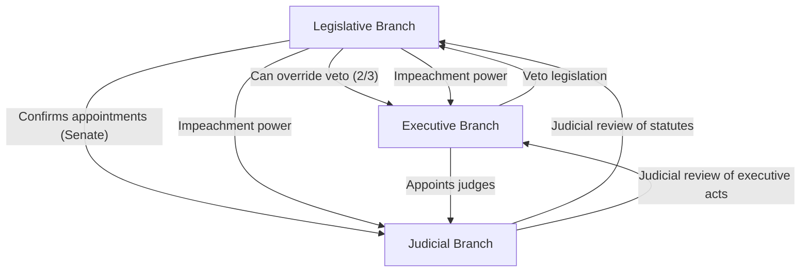

## The Federalist Papers and Constitutional Design

### Overview

*The Federalist Papers* comprise 85 essays written between October 1787 and May 1788 by Alexander Hamilton, James Madison, and John Jay under the shared pseudonym **"Publius"**, urging ratification of the proposed United States Constitution by the New York state convention. Beyond their immediate polemical purpose, the essays constitute one of the most systematic works of constitutional design theory in the Enlightenment tradition, addressing the architecture of federalism, separation of powers, representation, and institutional checks against tyranny and factional excess.

**Key Points**

- 85 essays total: Hamilton wrote approximately 51, Madison approximately 29, Jay approximately 5 (with some disputed authorship, especially Nos. 49–58, 62–63)
- Jay's contribution was limited due to illness; he authored Nos. 2–5 and 64
- First published serially in New York newspapers, later compiled into bound volumes
- Written in direct response to Anti-Federalist opposition, particularly essays like "Brutus" and "Cato"

### Historical Context

The essays emerged from the crisis of the **Articles of Confederation** (1781–1789), which Federalists argued produced a dangerously weak central government incapable of raising revenue, regulating commerce, or maintaining order (exemplified by **Shays' Rebellion**, 1786–87). The Constitutional Convention of 1787 produced a proposed replacement requiring ratification by nine of thirteen states—a process contested fiercely in populous, politically divided New York, motivating Hamilton's initiative to organize the essay campaign.

### Core Problem: Faction and the "Mischiefs" of Popular Government

**Federalist No. 10** (Madison) is the most frequently cited essay, addressing how a republic can control the "violence of faction" without suppressing liberty. Madison defines faction as:

> A group of citizens, whether a majority or minority, united by a common impulse of passion or interest adverse to the rights of other citizens or the permanent and aggregate interests of the community.

Madison rejects removing the *causes* of faction (impossible without destroying liberty itself, or imposing uniform opinion) in favor of controlling its *effects* through institutional design.

**Key Points**

- Causes of faction are "sown in the nature of man," particularly unequal distribution of property
- A **pure democracy** cannot cure the mischiefs of faction because there is no mechanism to check majority faction
- A **republic** (representative government) can, through two mechanisms:
  1. Delegation to a chosen body of citizens whose wisdom may refine public views
  2. Extending the sphere of the republic to encompass a greater variety of interests, making it harder for a majority faction to form and act in concert

This argument directly inverted the classical republican assumption (traceable to Montesquieu) that republics must be small to remain virtuous and cohesive—Madison instead argues a large, extended republic is *more* stable.

### Separation of Powers and Checks and Balances

**Federalist No. 47–51** (primarily Madison, drawing on Montesquieu's *The Spirit of the Laws*) elaborate the structural design preventing concentration of power.

#### Federalist No. 51: Ambition Counteracting Ambition

The central design principle:

> "Ambition must be made to counteract ambition... If men were angels, no government would be necessary."

Madison argues each branch must have:

- The constitutional means to resist encroachment by other branches
- The personal motives (self-interest) to actually exercise those means

**Example**

The presidential veto (Article I, Section 7) gives the executive a constitutional tool against legislative encroachment; Senate confirmation of judicial and executive appointments gives the legislature a check on executive power; judicial review (though not explicit in the Constitution's text, later established in *Marbury v. Madison*, 1803) provides a check on both.

### Structural Diagram: Checks and Balances

### Federalism: Divided Sovereignty

**Federalist No. 39** (Madison) defends the Constitution's hybrid character, neither purely national nor purely federal (confederal), but a composite:

| Dimension | National Character | Federal Character |
| --- | --- | --- |
| Ratification | By the people | By states as sovereign entities |
| Source of authority | People directly | States as constituent units |
| Operation of government | Directly on individuals | (mixed—not purely on states as units) |
| Extent of powers | Limited to enumerated powers | Reserved powers remain with states |
| Amendment process | Not by national majority alone | Requires supermajority of states |

**Federalist No. 45** further argues federal powers are "few and defined," while state powers remain "numerous and indefinite"—a claim substantially complicated by later constitutional development (the Commerce Clause, the Fourteenth Amendment, and New Deal-era jurisprudence expanded federal authority considerably beyond this original framing).

**[Inference]** Whether the founders' framework of dual sovereignty was intended as a stable equilibrium or as a transitional compromise remains debated among constitutional historians, given the deliberate ambiguity in several Federalist essays regarding the ultimate locus of sovereignty.

### Institutional Design: The Three Branches

#### The Legislature (Federalist No. 52–66)

- **Bicameralism** justified in No. 62–63: the Senate serves as a check on the "fickleness and passion" of the popularly-elected House, providing stability, wisdom, and protection against transient majorities
- House apportioned by population, elected by direct popular vote (biennially)
- Senate originally elected by state legislatures (later changed by the 17th Amendment, 1913—altering the federal balance Publius described)

#### The Executive (Federalist No. 67–77)

Hamilton's essays defend a **unitary executive** against Anti-Federalist fears of monarchical restoration.

**Federalist No. 70** argues for "energy in the executive" as essential to good government:

> "Energy in the executive is a leading character in the definition of good government... A feeble executive implies a feeble execution of the government."

Key defended features:

- Single executive (unity) rather than a plural council, for accountability and decisive action
- Four-year term with eligibility for re-election
- Qualified veto power
- Electoral College as an indirect selection mechanism intended to filter popular passion through deliberative electors (No. 68)

#### The Judiciary (Federalist No. 78–83)

**Federalist No. 78** (Hamilton) is foundational to American judicial review theory, describing the judiciary as the **"least dangerous branch"** since it controls neither the sword (military/enforcement, held by the executive) nor the purse (appropriations, held by the legislature), possessing only judgment.

Hamilton argues the Constitution's status as supreme law requires courts to prioritize it over conflicting ordinary statutes:

> Courts must regard the Constitution as fundamental law, and where a legislative act conflicts with the Constitution, the Constitution must govern.

This essay is frequently cited (though not without controversy) as anticipating the doctrine formally established in *Marbury v. Madison*.

**Key Points**

- Life tenure ("during good behavior") justified as securing judicial independence from political pressure
- Judiciary framed as protector of individual rights against potential legislative overreach
- No explicit textual grant of judicial review in the Constitution itself—its authority derives substantially from this interpretive tradition

### Comparative Table: Major Essays by Topic

| Essay No. | Author | Core Topic |
| --- | --- | --- |
| No. 10 | Madison | Faction and the extended republic |
| No. 14 | Madison | Republic vs. democracy; feasibility of scale |
| No. 39 | Madison | Federal vs. national character of government |
| No. 47 | Madison | Separation of powers (Montesquieu) |
| No. 48 | Madison | Insufficiency of parchment barriers alone |
| No. 51 | Madison | Checks and balances; ambition counteracting ambition |
| No. 68 | Hamilton | The Electoral College |
| No. 70 | Hamilton | Energy in the unitary executive |
| No. 78 | Hamilton | Judicial review; the "least dangerous branch" |
| No. 84 | Hamilton | Argument against a Bill of Rights (as unnecessary/dangerous) |

### The Bill of Rights Debate

**Federalist No. 84** is notable for Hamilton's argument *against* a Bill of Rights, on the grounds that:

- Enumerating specific rights implies government possesses powers not explicitly denied, dangerously implying broader authority than intended
- The Constitution itself, limited to enumerated powers, already functions as a bill of rights by structurally restraining government

This position was ultimately overridden politically; the first ten amendments (Bill of Rights) were ratified in 1791 to satisfy Anti-Federalist and moderate concerns, illustrating a case where *The Federalist*'s argument did not prevail despite ratification success overall.

### Reception and Anti-Federalist Counterarguments

The essays responded directly to Anti-Federalist writers, particularly:

- **"Brutus"** (likely Robert Yates): warned an extended republic could not sustain the civic virtue and shared interest necessary for legitimate representation, inverting Madison's No. 10 logic
- **"Cato"** (likely George Clinton): warned of executive power drifting toward monarchy
- **"Federal Farmer"**: emphasized the necessity of a Bill of Rights and concerns about representation adequacy in a large republic

**[Inference]** Contemporary constitutional scholarship increasingly treats the Anti-Federalist critique as an essential counter-tradition for understanding the Constitution's compromises, rather than simply a defeated position, since several Anti-Federalist concerns (excessive centralization, inadequate rights protections) shaped subsequent amendments and doctrine.

### Legacy in Constitutional Interpretation

*The Federalist Papers* hold significant, though contested, authority in American constitutional jurisprudence:

- Frequently cited by the Supreme Court, including in landmark cases addressing federalism, separation of powers, and executive authority
- Central to **originalist** interpretive methodology, which treats the essays as evidence of the "original understanding" of constitutional provisions
- Critiqued by non-originalist scholars for privileging the views of ratification-era advocates (who had persuasive, not neutral, aims) over the broader deliberative record, including state ratifying convention debates

**[Unverified]** The precise interpretive weight the essays *should* carry relative to other historical sources (Convention notes, ratification debates, contemporaneous dictionaries) remains an active and unresolved methodological dispute within constitutional theory rather than a settled matter of fact.

### Related Topics

- Montesquieu's *The Spirit of the Laws* and the theory of separated powers
- Anti-Federalist thought (Brutus, Cato, Federal Farmer)
- *Marbury v. Madison* and the establishment of judicial review
- The Articles of Confederation and their institutional failures
- Constitutional originalism vs. living constitutionalism
- The Electoral College: design rationale and contemporary critique
- Bicameralism and theories of legislative design
- Federalism in comparative constitutional design (U.S. vs. other federal systems)