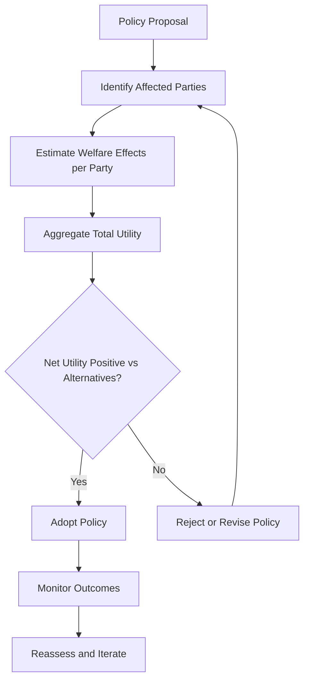

## Utilitarianism and its Political Applications

### Overview

Utilitarianism is a consequentialist ethical and political theory holding that the rightness of actions, laws, or institutions is determined by their contribution to overall welfare or utility, typically formulated as the greatest happiness for the greatest number. Originating with Jeremy Bentham and refined by John Stuart Mill, utilitarianism has exerted profound influence on modern political theory, public policy, welfare economics, and institutional design, while also generating persistent philosophical objections regarding individual rights, distributive justice, and the measurability of welfare.

### Foundational Formulations

#### Bentham's Classical Utilitarianism

Jeremy Bentham's *An Introduction to the Principles of Morals and Legislation* (1789) establishes the **principle of utility** as the foundational criterion of legislation and morality:

> "Nature has placed mankind under the governance of two sovereign masters, pain and pleasure... The principle of utility recognizes this subjection."

Bentham proposed the **hedonic (felicific) calculus**, a quantitative method for measuring pleasure and pain across seven dimensions:

**Key Points**

- Intensity — how strong the pleasure/pain is
- Duration — how long it lasts
- Certainty — probability of occurrence
- Propinquity — nearness in time
- Fecundity — likelihood of producing further similar sensations
- Purity — likelihood of not producing opposite sensations
- Extent — number of persons affected

Bentham's utilitarianism is explicitly **act-based** and treats all pleasures as commensurable and quantitatively comparable, regardless of source or "quality"—a position later challenged by Mill.

#### Mill's Refinement: Qualitative Utilitarianism

John Stuart Mill's *Utilitarianism* (1863) responds to criticisms that Bentham's framework reduces human flourishing to a crude hedonism ("the philosophy of swine"). Mill introduces a distinction between **higher and lower pleasures**:

> "It is better to be a human being dissatisfied than a pig satisfied; better to be Socrates dissatisfied than a fool satisfied."

Mill argues pleasures of intellect, feeling, imagination, and moral sentiment possess a higher *quality* than mere bodily pleasures, and that competent judges—those who have experienced both kinds—will reliably prefer the higher pleasures. This move addresses charges of vulgarity but introduces significant philosophical tension, since ranking pleasures by quality appears to require a standard external to pleasure itself, arguably undermining strict hedonism.

**[Inference]** Whether Mill's qualitative distinction remains genuinely utilitarian or smuggles in a non-hedonistic value theory (e.g., perfectionism about human capacities) is a long-standing interpretive dispute rather than a settled textual matter.

### Act vs. Rule Utilitarianism

A central distinction in later utilitarian theory, developed extensively in 20th-century moral philosophy:

| Type | Decision Criterion | Political Implication |
| --- | --- | --- |
| **Act utilitarianism** | Evaluate each individual action by its direct consequences | Policy should be adjusted case-by-case for maximal welfare outcomes |
| **Rule utilitarianism** | Evaluate rules/policies by the consequences of general adherence to them | Supports stable legal rules and rights even when a specific case might suggest a rule-violating exception |

**Example**

An act utilitarian judge might rule against a defendant's due process rights if doing so produces better aggregate outcomes in a specific case; a rule utilitarian would argue that a general rule protecting due process produces better aggregate outcomes over time, even if occasionally suboptimal in a single case—providing a stronger utilitarian defense of legal predictability and rights.

### Political Applications

#### Welfare Economics and Public Policy

Utilitarian reasoning underlies significant strands of modern **welfare economics**, particularly:

- **Cost-benefit analysis (CBA)**: policy evaluation aggregating costs and benefits across a population, often monetized, to determine net social welfare
- **Pareto efficiency** and **Kaldor-Hicks efficiency**: economic criteria descended partly from utilitarian aggregation logic, though formally distinct (Kaldor-Hicks permits winners to hypothetically, not actually, compensate losers)
- **Quality-Adjusted Life Years (QALYs)** in health policy: an explicitly utilitarian metric used to allocate scarce medical resources by maximizing aggregate health benefit

#### Legislation and Legal Theory

Bentham's utilitarianism directly informed the **codification movement** in law, arguing legal systems should be rationally designed and continuously reformed according to their capacity to maximize social welfare, rather than deference to precedent or natural law tradition. This underpins much of modern **law and economics** scholarship (e.g., Richard Posner), which evaluates legal rules by their efficiency and welfare-maximizing properties.

#### Democratic Theory

Utilitarianism provides one justification for majoritarian democracy: if welfare is aggregated across individuals, and each counts equally, then majority rule can be seen as a practical mechanism for approximating the greatest-happiness outcome. However, this connection is contested, since unconstrained majoritarianism can produce **tyranny of the majority**—a concern Mill himself raised extensively in *On Liberty* (1859), arguing utilitarian grounds actually require robust protections for individual liberty and minority dissent, since long-run social welfare depends on preserving individuality, experimentation, and free expression.

### Structural Diagram: Utilitarian Reasoning Applied to Policy

### Major Critiques and Political Objections

#### The Problem of Distribution

Classical utilitarianism aggregates welfare without inherent concern for its *distribution*. This generates the well-known **utility monster** objection (associated with Robert Nozick): if one individual or group derives disproportionately large utility gains from resources, strict aggregation could justify extreme inequality, since total welfare is maximized regardless of distributive fairness.

#### Rights and the "Separateness of Persons"

John Rawls, in *A Theory of Justice* (1971), offers perhaps the most influential critique from within contemporary political philosophy, arguing utilitarianism fails to respect the **"separateness of persons"**:

> Utilitarianism "does not take seriously the distinction between persons," treating the losses of some as simply offset by the gains of others, in the manner appropriate to a single individual's trade-offs across their own life, but not appropriate across distinct persons.

Rawls's alternative—**justice as fairness**, derived via the original position and veil of ignorance, prioritizing the **difference principle** (inequalities justified only if they benefit the least advantaged)—was explicitly constructed as a non-utilitarian foundation for political liberalism.

#### Measurement and Interpersonal Comparison

Utilitarian aggregation requires comparing utility across individuals, a problem long recognized in economics as the **interpersonal comparison of utility** problem: there is no uncontroversial cardinal scale on which to measure and sum subjective welfare across different people, undermining claims to scientific precision in utilitarian calculation.

**[Inference]** Modern welfare economics has largely responded to this problem by shifting toward preference-satisfaction or revealed-preference models, or by adopting explicitly ordinal (rather than cardinal) frameworks, though this shift arguably changes the philosophical character of the utilitarian calculus rather than resolving the original measurement problem.

#### Rights as Utility-Constraints vs. Side-Constraints

Robert Nozick's *Anarchy, State, and Utopia* (1974) argues rights should function as **side-constraints** on action (inviolable boundaries) rather than as values to be weighed and potentially overridden within a utilitarian calculus—a foundational disagreement between consequentialist and deontological/libertarian political theory.

### Comparative Table: Utilitarianism vs. Rival Frameworks

| Framework | Core Criterion | Key Theorist | Primary Objection to Utilitarianism |
| --- | --- | --- | --- |
| Utilitarianism | Maximize aggregate welfare | Bentham, Mill | — |
| Justice as Fairness | Fair distribution via original position | Rawls | Ignores separateness of persons |
| Libertarianism | Rights as inviolable side-constraints | Nozick | Permits rights violations if utility-maximizing |
| Capabilities Approach | Expand substantive human capabilities | Sen, Nussbaum | Utility metrics obscure real functioning/freedom deficits |
| Communitarianism | Embedded goods of community/tradition | MacIntyre, Sandel | Atomistic, ahistorical view of the individual |

### Contemporary Developments

- **Preference utilitarianism** (associated with R.M. Hare and, in applied ethics, Peter Singer): defines welfare as the satisfaction of informed preferences rather than raw hedonic states, addressing some measurement concerns while raising new questions about adaptive or malformed preferences
- **Effective altruism**: a contemporary movement substantially grounded in utilitarian reasoning, applying cost-effectiveness analysis to charitable giving and global welfare priorities, associated with Peter Singer and William MacAskill
- **Negative utilitarianism**: prioritizes minimizing suffering over maximizing pleasure, with distinct political implications favoring harm-reduction policy frameworks over pure welfare-maximization

### Related Topics

- Bentham's felicific calculus and its critiques
- Mill's *On Liberty* and the harm principle
- Rawls's *A Theory of Justice* and the original position
- Nozick's entitlement theory and libertarian rights theory
- Cost-benefit analysis in public policy design
- The capabilities approach (Amartya Sen, Martha Nussbaum)
- Effective altruism and applied utilitarian ethics
- Interpersonal utility comparison problems in welfare economics