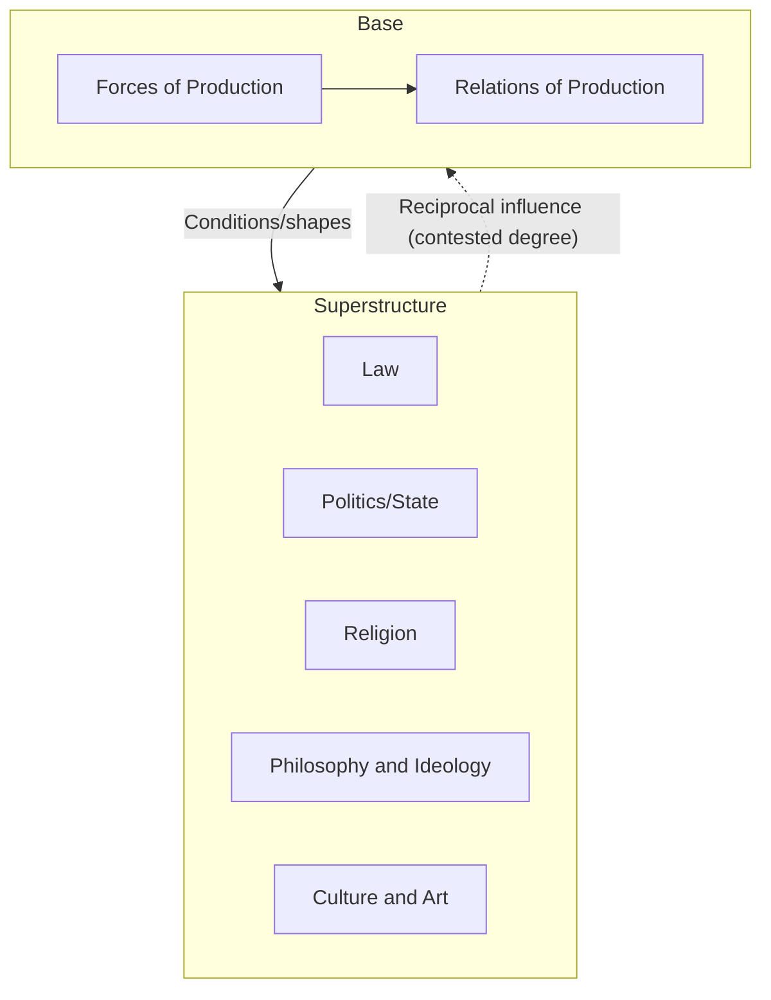

## Marx and Historical Materialism

### Overview

Historical materialism is Karl Marx's theory of social and political development, holding that the material conditions of a society—chiefly its mode of economic production—fundamentally determine its social, political, and intellectual structures. Developed principally with Friedrich Engels, the theory offers a systematic account of historical change driven by class conflict rooted in evolving relations of production, and forms the analytical foundation for Marx's broader critique of capitalism and his political theory of revolution.

### Foundational Statement

Marx's clearest programmatic statement appears in the 1859 Preface to *A Contribution to the Critique of Political Economy*:

> "The mode of production of material life conditions the general process of social, political, and intellectual life. It is not the consciousness of men that determines their existence, but their social existence that determines their consciousness."

This inverts the idealist tradition (particularly Hegel's, from which Marx and Engels emerged) by asserting that material economic conditions are causally primary over ideas, culture, law, and politics, rather than the reverse.

### Base and Superstructure

The theory's core architecture distinguishes two interacting levels of society:

**Key Points**

- **Base (Substructure/Infrastructure)**: the economic foundation, comprising the **forces of production** (technology, labor, resources, means of production) and the **relations of production** (property relations, class structure—who owns and controls productive resources)
- **Superstructure**: the non-economic institutions and ideas arising from and conditioned by the base, including law, politics, religion, philosophy, art, and the state

Marx argues the superstructure generally functions to legitimate and stabilize the base's existing relations of production, though the precise degree of causal determination (strict vs. reciprocal influence) is a matter of significant interpretive debate within Marxist scholarship.

**[Inference]** Engels, in later letters (notably to Joseph Bloch, 1890), clarified that neither he nor Marx intended a crude, one-directional economic determinism, allowing for reciprocal influence of superstructural elements on the base—though how much this softens the theory's original explanatory claims remains contested among Marxist theorists, sometimes termed the "base-superstructure debate."

### Structural Diagram: Base and Superstructure

### Modes of Production and Historical Stages

Historical materialism periodizes history according to successive **modes of production**, each defined by characteristic relations of production and corresponding class antagonisms:

| Mode of Production | Dominant Class Relation | Characteristic Conflict |
| --- | --- | --- |
| Primitive Communism | Communal ownership, minimal class division | Pre-class; largely absent |
| Ancient (Slave) | Slaveholders vs. slaves | Slave revolts, conquest |
| Feudalism | Lords vs. serfs | Peasant uprisings, land relations |
| Capitalism | Bourgeoisie vs. proletariat | Wage labor exploitation, class struggle |
| Socialism (transitional) | Proletarian dictatorship vs. remnants of bourgeoisie | Consolidation of collective ownership |
| Communism (terminal) | Classless, stateless society | None (class conflict resolved) |

Marx presents this sequence primarily through the lens of *Western* European historical development; whether it was intended as a universal, necessary sequence for all societies or a historically specific European pattern remains debated, particularly given Marx's own later, more qualified writings on non-Western societies (e.g., correspondence regarding the Russian *mir* commune).

### Class Struggle as the Engine of History

The opening line of *The Communist Manifesto* (1848, with Engels) declares:

> "The history of all hitherto existing society is the history of class struggles."

Historical change occurs, in Marx's theory, when the **forces of production** develop beyond what existing **relations of production** can accommodate, producing systemic contradiction. This contradiction generates class conflict that ultimately transforms the relations of production, precipitating transition to a new mode of production—a mechanism sometimes summarized as the theory of **dialectical development** applied to material history, distinct from Hegel's idealist dialectic of Spirit.

$$\text{Contradiction} = f(\text{Forces of Production}) - g(\text{Relations of Production})$$

**Example**

Under feudalism, the rise of merchant capital, urban manufacturing, and new productive technologies (forces of production) increasingly conflicted with rigid feudal land-based property relations (relations of production), generating bourgeois revolutionary pressure that ultimately produced capitalist relations of production better suited to the new productive forces.

### Capitalism's Internal Contradictions

Marx's mature economic work, especially *Capital, Volume I* (1867), applies historical materialism to analyze capitalism's specific dynamics and predicted trajectory:

**Key Points**

- **Surplus value**: the value created by labor beyond what is returned to workers as wages, appropriated by capitalists as profit—the mechanism of exploitation specific to capitalism
- **Commodity fetishism**: the tendency for social relations between people (labor relations) to appear instead as relations between things (commodities and their market prices), obscuring the underlying exploitative labor relations
- **Tendency of the rate of profit to fall**: as capitalists substitute machinery (constant capital) for labor (variable capital) to increase productivity, Marx argues the *rate* of profit tends to decline over time, since he holds surplus value derives from labor specifically—a claim with significant internal debate regarding its logical consistency and empirical validity
- **Immiseration and crisis theory**: capitalism's internal contradictions are predicted to generate recurring economic crises of increasing severity, eventually producing conditions for proletarian revolution

**[Inference]** The falling rate of profit thesis remains one of the most contested elements of Marx's economic theory even among sympathetic Marxist economists, with ongoing technical disputes (e.g., the "transformation problem" relating labor values to market prices) that are unresolved within Marxian economics as a field.

### Political Implications: The State and Revolution

Historical materialism frames the **state** as fundamentally an instrument of class rule—an institution of the superstructure serving to protect the interests of the economically dominant class. In *The Communist Manifesto*, Marx and Engels describe the modern state as, in essence, "a committee for managing the common affairs of the whole bourgeoisie."

This analysis grounds Marx's political theory of revolution:

- The proletariat, as the class whose labor generates surplus value under capitalism, is theorized as possessing both the structural position and the collective interest to overthrow bourgeois relations of production
- A transitional phase of **proletarian dictatorship** (control of the state by and for the working class) is theorized as necessary to dismantle bourgeois property relations
- The end state is a **classless, stateless communist society**, in which the state, having no class antagonism left to manage, is expected to "wither away" (a phrase more associated with Engels's later elaboration than Marx's own texts)

### Reception, Application, and Divergent Traditions

Historical materialism generated extensive and often conflicting political applications and interpretive traditions across the 20th century:

| Tradition/Thinker | Key Development |
| --- | --- |
| **Vladimir Lenin** | Vanguard party theory; imperialism as "highest stage of capitalism" |
| **Antonio Gramsci** | Cultural hegemony; superstructure has greater relative autonomy/causal weight than orthodox base-determinism suggests |
| **Louis Althusser** | Structuralist Marxism; "ideological state apparatuses"; rejection of humanist/teleological readings of Marx |
| **G.A. Cohen (Analytical Marxism)** | Functionalist defense of a technologically-driven, relatively strict base-superstructure model |
| **Frankfurt School (Adorno, Horkheimer, Marcuse)** | Critical theory; integration of Marxism with psychoanalysis and cultural critique, skeptical of deterministic economism |
| **World-Systems Theory (Wallerstein)** | Application of class/mode-of-production analysis to a global capitalist world-system rather than individual states |

### Major Critiques

- **Economic determinism critique**: Critics (including some sympathetic theorists like Gramsci) argue orthodox historical materialism understates the causal autonomy of culture, ideology, and political institutions
- **Empirical predictive failure**: The absence of proletarian revolution in advanced capitalist economies (contrary to Marx's expectations) and its occurrence instead in less industrialized societies (Russia, China) poses a significant empirical challenge to the theory's predictive claims
- **Teleological structure**: Critics argue the theory presupposes a determinate historical endpoint (communism) in a manner some regard as unfalsifiable or quasi-metaphysical rather than strictly scientific, despite Marx and Engels's self-presentation as "scientific socialism" in contrast to utopian socialism
- **Class reductionism**: Contemporary theorists (feminist, postcolonial, critical race scholars) have argued that historical materialism's primary focus on economic class relations can marginalize other axes of domination (gender, race, colonialism) not fully reducible to class dynamics, motivating later syntheses (e.g., socialist feminism, intersectional Marxism)

**[Unverified]** Whether these empirical and theoretical difficulties constitute a decisive refutation of historical materialism as an analytical framework, or rather call for revision within a still-viable materialist method, remains an open and actively contested question within political theory and Marxist scholarship rather than a settled conclusion.

### Related Topics

- Hegel's dialectic and Marx's inversion (materialism vs. idealism)
- *The Communist Manifesto*: structure and political program
- Surplus value theory and the labor theory of value
- Gramsci's theory of cultural hegemony
- Lenin's vanguard party and theory of imperialism
- The Frankfurt School and Critical Theory
- World-Systems Theory (Immanuel Wallerstein)
- Analytical Marxism (G.A. Cohen, Jon Elster)