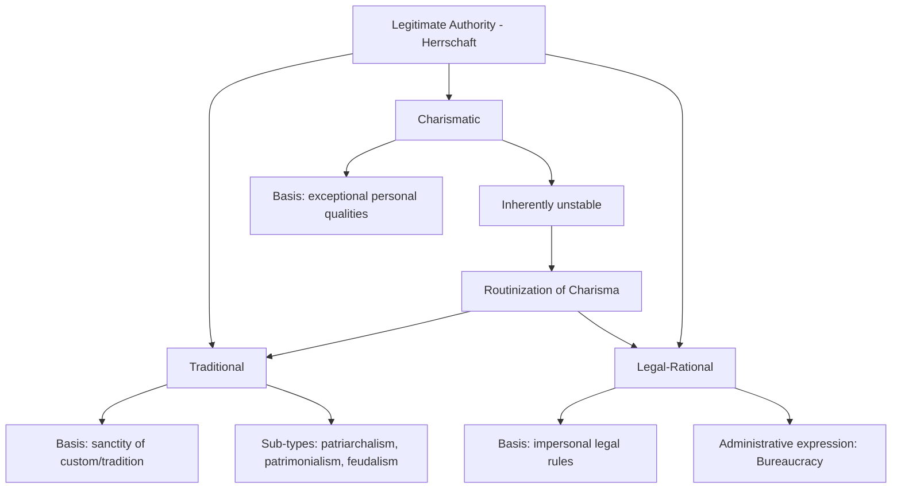

## Max Weber on Power and Authority

### Overview

Max Weber's analysis of power (*Macht*) and authority (*Herrschaft*, often translated as "domination" or "authority") is foundational to modern political sociology, offering a framework for understanding why individuals obey political rule not merely through coercion but through perceived legitimacy. Developed primarily in *Economy and Society* (*Wirtschaft und Gesellschaft*, published posthumously in 1922) and the essay "Politics as a Vocation" (1919), Weber's typology of authority remains one of the most widely used analytical tools in comparative politics, organizational theory, and the sociology of the state.

### Power vs. Authority: A Foundational Distinction

Weber defines **power** (*Macht*) broadly as:

> "The probability that one actor within a social relationship will be in a position to carry out his own will despite resistance, regardless of the basis on which this probability rests."

This definition is deliberately expansive—power can rest on force, wealth, persuasion, or any other resource capable of overcoming resistance. **Authority** (*Herrschaft*), by contrast, is a narrower and analytically more significant concept:

> "The probability that a command with a given specific content will be obeyed by a given group of persons."

**Key Points**

- Authority is distinguished from mere power by the element of **voluntary compliance**—subjects obey not solely from fear or self-interest calculation, but because they regard the command or the commander as legitimate
- Weber's sociology is fundamentally concerned with **legitimacy** (*Legitimität*) as the basis distinguishing stable authority from unstable domination sustained by force alone
- This framework positions Weber as central to the tradition of political sociology examining *why* people obey, rather than only *how* rulers coerce

### The Three Pure Types of Legitimate Authority

Weber's most influential contribution is his tripartite typology (*Idealtypen*, ideal types—analytical constructs, not necessarily found in pure empirical form) of the grounds on which authority can claim legitimacy.

#### 1. Traditional Authority

Legitimacy rests on:

> "An established belief in the sanctity of immemorial traditions and the legitimacy of the status of those exercising authority under them."

**Key Points**

- Rule is legitimated by custom, precedent, and the sanctity of "the way things have always been done"
- The ruler's authority is typically personal, inherited, and bound by traditional constraints rather than codified rules
- Sub-types include **patriarchalism** (household-based authority), **patrimonialism** (extension of household authority to a wider political administration, with officials as personal retainers), and **feudalism** (a more decentralized variant involving reciprocal but unequal obligations)

**Example**

Hereditary monarchy, where a king's right to rule derives from lineage and established custom rather than from popular consent, legal-constitutional procedure, or personal exceptional qualities.

#### 2. Charismatic Authority

Legitimacy rests on:

> "Devotion to the specific and exceptional sanctity, heroism, or exemplary character of an individual person, and of the normative patterns or order revealed or ordained by him."

**Key Points**

- Charisma (from Greek *kharisma*, "gift of grace") denotes an extraordinary quality attributed to a leader by followers, whether religious, political, or military
- Charismatic authority is inherently **unstable and revolutionary**—it exists outside routine, everyday structures, and derives its power from continued demonstration (followers must continue perceiving proof of the leader's exceptional qualities)
- This form of authority faces the acute problem of the **"routinization of charisma"** (*Veralltäglichung des Charisma*): upon the charismatic leader's death or decline, authority must be transformed into a more stable form (typically traditional or legal-rational) to survive, often through hereditary succession or institutionalization into an office

**Example**

Revolutionary or religious founder-leaders (Weber's own examples include prophets and war heroes) command obedience through personal, extraordinary perceived qualities rather than office, tradition, or law; the eventual institutionalization of a movement into a church or bureaucratic party structure exemplifies routinization.

#### 3. Legal-Rational Authority

Legitimacy rests on:

> "A belief in the legality of enacted rules and the right of those elevated to authority under such rules to issue commands."

**Key Points**

- Obedience is owed not to a specific person but to an **impersonal legal order**; officeholders command authority only within the defined scope of their office
- This is the characteristic legitimating basis of the **modern state** and its administrative apparatus, and Weber regards it as historically distinctive to Western rationalization processes
- Legal-rational authority is most fully realized institutionally through **bureaucracy**, which Weber analyzes as its characteristic administrative expression

### Structural Diagram: The Three Types of Authority

### Bureaucracy as the Institutional Form of Legal-Rational Authority

Weber offers an extensive ideal-typical model of **bureaucracy** as the most technically efficient and historically significant organizational form of legal-rational domination, characterized by:

| Bureaucratic Feature | Description |
| --- | --- |
| Fixed jurisdictional areas | Duties and authority defined by explicit rules, not personal discretion |
| Hierarchical office structure | Clear chains of command and supervision |
| Written documentation | Administration based on files and records ("rule by documents") |
| Specialized training | Officials selected and promoted based on technical qualification |
| Full-time employment | Office-holding as a vocation (*Beruf*), typically salaried |
| Separation of office and person | Officials do not own the means of administration; office and private life/property are distinct |
| Rule-governed conduct | Consistent application of abstract rules to particular cases |

Weber famously described this system as an **"iron cage"** (*stahlhartes Gehäuse*, more literally "shell as hard as steel")—a metaphor for how rational bureaucratic and capitalist systems, despite their technical efficiency, can trap individuals within impersonal, dehumanizing structures of rule-bound calculation, displacing older forms of meaning and value-oriented action.

**[Inference]** The "iron cage" metaphor is frequently invoked as a broader civilizational diagnosis of modernity's disenchantment (*Entzauberung*), extending beyond strict bureaucratic analysis into Weber's wider sociology of rationalization; the precise scope Weber intended for the metaphor is debated among translators and interpreters, partly due to translation variance from the original German phrase.

### The State and the Monopoly of Legitimate Violence

Weber's most frequently cited definition of the **state**, from "Politics as a Vocation," is explicitly tied to his authority framework:

> "A state is a human community that (successfully) claims the monopoly of the legitimate use of physical force within a given territory."

**Key Points**

- The definition is *not* about the state's purposes or functions but about its distinctive *means*—organized, legitimate coercion
- Legitimacy is essential: force alone does not constitute statehood in Weber's framework; the claim to legitimacy (however achieved, via any of the three authority types or combinations) is constitutive of stateness
- This definition remains foundational in contemporary political science and international relations, particularly in discussions of "failed states," where the monopoly of legitimate violence is contested or absent

### Politics as Vocation: The Ethics of Political Leadership

In the same essay, Weber distinguishes two ethical orientations relevant to political actors:

- **Ethic of conviction** (*Gesinnungsethik*): acting according to one's values/principles regardless of consequences
- **Ethic of responsibility** (*Verantwortungsethik*): weighing the foreseeable consequences of action and accepting responsibility for outcomes, even at the cost of compromising pure principle

Weber argues genuine political vocation requires holding both in tension, since pure conviction-ethics risks irresponsibility toward real-world consequences, while pure responsibility-ethics risks moral vacancy—an influential framework in debates over political realism, statecraft, and the ethics of using necessarily imperfect means (including violence) for political ends.

### Comparative Table: The Three Authority Types

| Dimension | Traditional | Charismatic | Legal-Rational |
| --- | --- | --- | --- |
| Source of legitimacy | Sanctity of custom | Exceptional personal qualities | Impersonal enacted rules |
| Stability | Stable but resistant to change | Inherently unstable | Highly stable, routinized |
| Succession mechanism | Hereditary/customary | Problematic; requires routinization | Rule-governed (elections, appointment procedures) |
| Administrative apparatus | Personal retainers/household officials | Disciples/followers | Professional bureaucracy |
| Historical association | Pre-modern monarchies, patrimonial states | Revolutionary/religious movements | The modern state |

### Applications in Contemporary Political Science

- **Comparative regime analysis**: Weber's typology remains a standard heuristic for classifying and analyzing political legitimacy claims across historical and contemporary regimes, including hybrid regimes combining multiple authority types (e.g., a legal-rational state headed by a charismatically legitimated leader)
- **Organizational theory**: Weberian bureaucracy theory underlies much of public administration scholarship, including debates on bureaucratic efficiency, red tape, and reform (e.g., New Public Management critiques of rigid Weberian structures)
- **State-building and failed-state analysis**: The monopoly-of-legitimate-violence definition remains central to analyzing state capacity, sovereignty, and the erosion of state authority in conflict and post-conflict settings
- **Populism studies**: Charismatic authority theory is widely applied to contemporary analyses of populist leadership, though scholars debate how directly Weber's ideal type maps onto modern mass-media-driven political charisma

### Major Critiques

- **Ideal types vs. empirical reality**: Critics note that virtually all real political authority combines elements of multiple types, raising questions about the typology's direct empirical applicability versus its value purely as an analytical heuristic
- **Underspecified legitimacy mechanics**: Weber describes *that* subjects perceive authority as legitimate but offers a comparatively thin account of the psychological or ideological mechanisms generating that belief, an area later theorists (e.g., Gramsci on hegemony, or later legitimacy theorists) have sought to develop further
- **Gender and power**: Feminist political theorists have critiqued Weber's framework for its limited attention to power exercised outside formal political/administrative structures, including within households and informal social domains
- **Bureaucracy's normative valence**: Weber's own assessment of bureaucratic rationalization is notably ambivalent—technically efficient yet potentially dehumanizing—and later theorists diverge sharply on whether to read Weber as a defender or critic of bureaucratic modernity

**[Unverified]** Whether Weber ultimately regarded rationalization and bureaucratization as a normatively regrettable, if inevitable, historical trajectory, or maintained a more neutral, purely analytical stance, is a matter of ongoing scholarly interpretation rather than a directly resolvable textual question, given the essayistic and often value-neutral (*wertfrei*) style of his sociological method.

### Related Topics

- Weber's *Economy and Society*: methodology of ideal types
- "Politics as a Vocation": the ethics of conviction vs. responsibility
- Bureaucracy theory and public administration reform
- Gramsci's cultural hegemony as a complement/contrast to Weberian legitimacy
- The Weberian definition of the state in failed-state and state-capacity literature
- Charismatic leadership and populism in comparative politics
- Rationalization and disenchantment (*Entzauberung*) in Weber's broader sociology
- Legitimacy theory in contemporary political philosophy