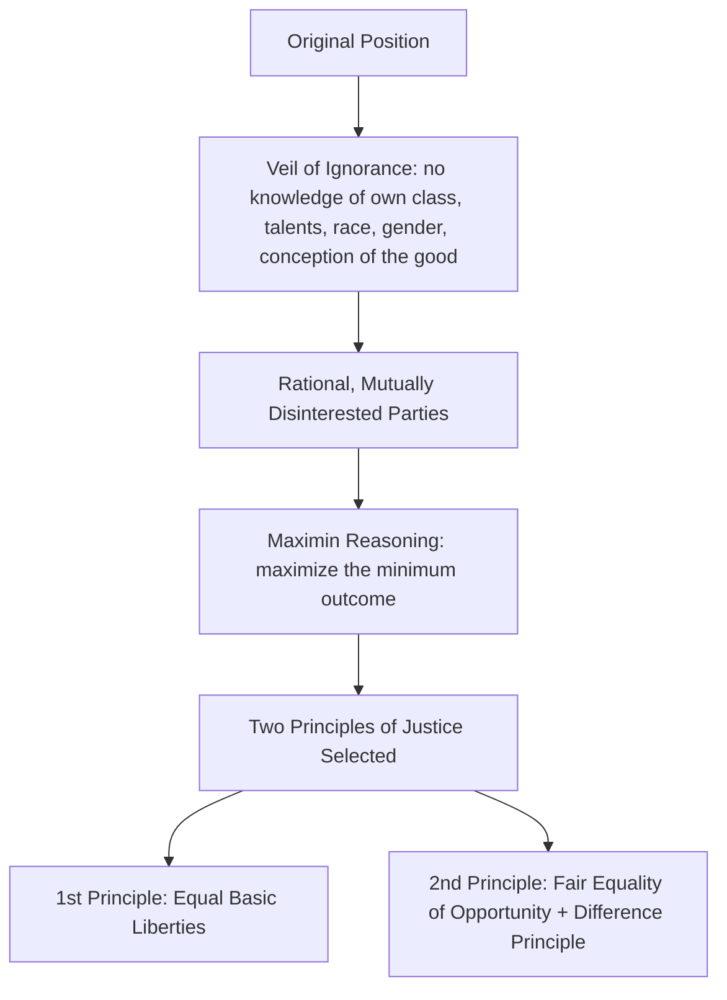

## John Rawls and the Theory of Justice

### Overview

John Rawls's *A Theory of Justice* (1971), later refined in *Political Liberalism* (1993) and *Justice as Fairness: A Restatement* (2001), is widely regarded as the most influential work of Anglo-American political philosophy in the twentieth century. Rawls develops **justice as fairness**, a systematic alternative to utilitarianism, grounding principles of political and economic justice in a hypothetical social contract designed to secure fair terms of cooperation among free and equal citizens.

### The Problem Rawls Addresses

Rawls explicitly positions his project against the dominance of utilitarianism in Anglo-American political philosophy, arguing that classical and average utilitarianism fail to adequately respect the **"separateness of persons"**:

> "Each person possesses an inviolability founded on justice that even the welfare of society as a whole cannot override... the rights secured by justice are not subject to political bargaining or the calculus of social interests."

Rawls seeks principles of justice that would be chosen by free, rational, self-interested individuals under conditions ensuring fairness—reviving and transforming the social contract tradition of Locke, Rousseau, and Kant into a more rigorous, abstract procedural device.

### The Original Position and the Veil of Ignorance

Rawls's central methodological device is the **original position**, a hypothetical choice situation in which representative parties select principles of justice to govern the basic structure of society.

**Key Points**

- Parties in the original position are rational and mutually disinterested, seeking to advance their own interests
- Parties select principles from behind a **veil of ignorance**, which deprives them of knowledge of their own place in society: their class position, natural talents, race, gender, religion, conception of the good, and even which generation they belong to
- Parties retain general knowledge of facts about human society, economics, and psychology, but lack particular knowledge of their own circumstances
- The veil of ignorance is designed to ensure principles are chosen impartially, since no party can tailor principles to favor their own actual (but unknown) position

**Example**

A party in the original position cannot know whether they will be born into wealth or poverty, able-bodied or disabled, a religious majority or minority—forcing rational self-interest to default toward principles that protect even the worst-off position, since the chooser might turn out to occupy it.

Rawls argues that under these conditions, rational parties would adopt a **maximin** decision strategy—maximizing the minimum possible outcome—rather than gambling on principles that might yield higher average welfare at the risk of a severely disadvantaged position, since parties cannot calculate probabilities for their own eventual position and stand to lose enormously if disadvantaged.

### Structural Diagram: The Original Position

### The Two Principles of Justice

Rawls's substantive conclusion consists of two principles, ordered by **lexical (serial) priority**—meaning the first principle must be fully satisfied before the second is applied, and within the second, fair equality of opportunity takes priority over the difference principle.

#### First Principle: Equal Basic Liberties

> "Each person has the same indefeasible claim to a fully adequate scheme of equal basic liberties, which scheme is compatible with the same scheme of liberties for all."

This covers political liberty (voting, holding office), freedom of speech and assembly, liberty of conscience, freedom of the person, the right to hold personal property, and freedom from arbitrary arrest—the classical liberal package of civil and political rights. Notably, this list does **not** include an unrestricted right to private ownership of the means of production or unlimited freedom of contract, distinguishing Rawls's liberalism from libertarian formulations.

#### Second Principle: Fair Equality of Opportunity and the Difference Principle

> "Social and economic inequalities are to satisfy two conditions: first, they must be attached to offices and positions open to all under conditions of fair equality of opportunity; and second, they must be to the greatest benefit of the least advantaged members of society."

**Key Points**

- **Fair equality of opportunity**: formal equal access to positions is insufficient; genuinely fair equality requires that persons with similar talents and motivation have similar life chances regardless of their initial social class
- **The difference principle**: social and economic inequalities are justified *only* if they work to the maximum benefit of the least-advantaged group in society—inequality is not inherently unjust, but must be structured to improve the position of the worst-off, not merely permitted to exist

**Example**

A tax policy permitting higher earnings for entrepreneurs is just, under the difference principle, only if the resulting economic activity (investment, job creation, tax revenue funding social programs) makes the least-advantaged members of society better off than they would be under stricter equality—not merely if it increases aggregate or average wealth.

### Reflective Equilibrium

Rawls's methodology does not treat the original position as a strict deductive proof but employs **reflective equilibrium**: a process of mutual adjustment between abstract principles and considered moral judgments about particular cases, until principles and judgments cohere. If a principle derived from the original position yields a conclusion that sharply conflicts with a firmly held considered judgment (e.g., that slavery is unjust), either the principle's formulation or the original position's specification may be revised, in an iterative process toward coherence.

$$\text{Reflective Equilibrium} = \text{Adjust}(\text{Principles} \leftrightarrow \text{Considered Judgments})$$

### The Basic Structure as the Subject of Justice

Rawls specifies that his principles apply to the **basic structure of society**—the major political, social, and economic institutions (the constitution, property system, economic organization, family structure) that distribute fundamental rights, duties, and the benefits of social cooperation—rather than to individual transactions or personal moral conduct directly. This scope specification is significant for distinguishing Rawlsian justice from theories evaluating the justice of individual acts or exchanges in isolation.

### Political Liberalism: The Later Rawls

In *Political Liberalism* (1993), Rawls substantially revises the framework's justificatory ambitions in response to the **fact of reasonable pluralism**—the observation that free societies inevitably contain a plurality of incompatible yet reasonable comprehensive religious, philosophical, and moral doctrines.

**Key Points**

- Rawls shifts from presenting justice as fairness as grounded in a comprehensive moral doctrine to presenting it as a **freestanding political conception**, justifiable independently of any particular comprehensive worldview
- The goal becomes securing an **overlapping consensus**: a state in which citizens holding diverse comprehensive doctrines can each endorse the same political principles of justice from within their own respective worldviews
- Rawls introduces the idea of **public reason**: the norm that political decisions on fundamental constitutional matters should be justifiable using reasons all reasonable citizens could accept, rather than resting on sectarian comprehensive doctrines

**[Inference]** Whether *Political Liberalism* represents a genuine substantive revision of Rawls's earlier position or primarily a shift in justificatory strategy while preserving the same substantive principles is a matter of ongoing scholarly debate, since Rawls himself described the two principles of justice as remaining largely unchanged.

### Comparative Table: Rawls vs. Major Rival Theories

| Theory | Core Criterion | Key Theorist | Contrast with Rawls |
| --- | --- | --- | --- |
| Utilitarianism | Maximize aggregate welfare | Bentham, Mill | Ignores separateness of persons; permits sacrificing the few for aggregate gain |
| Libertarianism | Rights as inviolable side-constraints; minimal state | Nozick | Rejects patterned redistribution (difference principle) as violating self-ownership/entitlement |
| Capabilities Approach | Expand substantive human capabilities/functionings | Sen, Nussbaum | Critiques Rawls's focus on "primary goods" as insufficiently attentive to individual variation in converting goods to capability |
| Communitarianism | Justice embedded in shared community goods/traditions | MacIntyre, Sandel, Walzer | Critiques the "unencumbered self" presupposed by the original position as an incoherent abstraction from social identity |
| Feminist Critique | Justice must extend into the family/private sphere | Susan Moller Okin | Argues Rawls's basic structure inadequately addresses gendered injustice within the family |

### Major Critiques

#### Nozick's Libertarian Critique

Robert Nozick's *Anarchy, State, and Utopia* (1974) argues the difference principle constitutes an unjustified **"patterned"** conception of distributive justice that necessarily requires continuous state interference with voluntary transactions to maintain the pattern, violating individual entitlement and self-ownership rights, regardless of the justice of the transactions producing the eventual (unequal) distribution.

#### Communitarian Critique

Michael Sandel's *Liberalism and the Limits of Justice* (1982) argues the original position presupposes an incoherent **"unencumbered self"**—a subject stripped of the constitutive attachments, communal identities, and conceptions of the good that actually make selfhood and rational choice meaningful, rendering the hypothetical choice scenario philosophically unstable.

#### Capabilities Critique

Amartya Sen and Martha Nussbaum argue Rawls's focus on distributing **primary goods** (rights, liberties, opportunities, income, wealth, and self-respect) is insufficiently sensitive to variation in individuals' capacity to convert those goods into actual functioning and well-being (e.g., a person with a disability may require significantly more primary goods to achieve the same level of capability), advocating instead for direct focus on capabilities and functionings.

#### Feminist Critique

Susan Moller Okin's *Justice, Gender, and the Family* (1989) argues Rawls's treatment of the family as part of the basic structure is underdeveloped, since the original position's parties are implicitly assumed to be heads of households, potentially obscuring gendered injustices occurring *within* families rather than only between them.

**[Unverified]** The extent to which later Rawlsian scholarship has successfully incorporated capability-sensitive or feminist revisions while preserving the core architecture of justice as fairness, versus requiring a more fundamental theoretical departure, remains a genuinely open question within contemporary political philosophy rather than a matter of settled consensus.

### Legacy and Influence

*A Theory of Justice* is widely credited with revitalizing normative political philosophy as a rigorous academic discipline after a mid-20th-century period dominated by ordinary-language analysis and skepticism about the tractability of normative theorizing. Rawls's framework continues to structure debates across distributive justice, constitutional theory, global justice (extended and contested in Rawls's own *The Law of Peoples*, 1999), and health policy, and remains a standard reference point against which subsequent theories of justice—libertarian, communitarian, capability-based, and feminist—are typically defined in contrast.

### Related Topics

- Nozick's *Anarchy, State, and Utopia* and entitlement theory
- Utilitarianism and the "separateness of persons" objection
- The capabilities approach (Sen, Nussbaum)
- Communitarian critiques of liberalism (Sandel, MacIntyre, Walzer)
- Rawls's *Political Liberalism* and public reason
- Feminist critiques of the public/private divide (Okin)
- Rawls's *The Law of Peoples* and theories of global justice
- Social contract theory: from Hobbes and Locke to Rawls