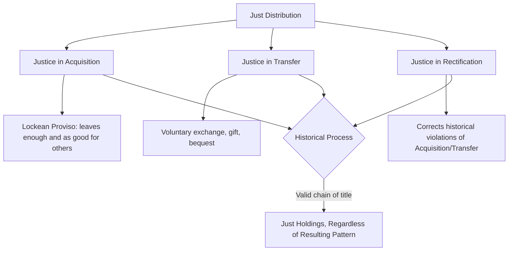

## Robert Nozick and Libertarian Theory

### Overview

Robert Nozick's *Anarchy, State, and Utopia* (1974) is the foundational text of contemporary rights-based (deontological) libertarianism, developed explicitly as a systematic rival to John Rawls's *A Theory of Justice* (1971). Nozick defends the **minimal state**—limited to protection against force, theft, fraud, and contract enforcement—as the most extensive state that can be justified without violating individual rights, while arguing that any more extensive ("more-than-minimal") state necessarily violates the rights of individuals.

### Foundational Premise: Self-Ownership and Rights as Side-Constraints

Nozick opens the book with one of its most quoted lines:

> "Individuals have rights, and there are things no person or group may do to them (without violating their rights)."

**Key Points**

- Rights function as **side-constraints** on action, not as goals to be maximized or weighed against other values in a consequentialist calculus—this directly opposes utilitarian and welfare-maximizing frameworks
- The foundation is a strong doctrine of **self-ownership**: each individual owns their own body, labor, and talents, and by extension has a right to what they produce or legitimately acquire through their labor and voluntary exchange
- Nozick invokes a **Kantian formula**: persons must be treated as ends in themselves, never merely as means; side-constraints operationalize this by prohibiting the sacrifice of one person's rights for another's (or society's) benefit

### The Entitlement Theory of Justice

Nozick's core positive theory of distributive justice—the **entitlement theory**—holds that a distribution of holdings is just if and only if it arose through a just process, regardless of the resulting pattern of inequality. This directly opposes "patterned" or "end-state" theories of justice (including Rawls's difference principle), which evaluate distributions by their conformity to some independent structural criterion (e.g., equality, need, desert).

The theory comprises three principles:

**Key Points**

1. **Principle of Justice in Acquisition**: specifies how unowned resources may be first legitimately appropriated (Nozick draws on and modifies Locke's labor-mixing theory, adding the **Lockean proviso**: acquisition is just only if it leaves "enough and as good" for others, or does not worsen others' situation)
2. **Principle of Justice in Transfer**: specifies how holdings may be legitimately transferred between persons (via voluntary exchange, gift, or bequest, but not force or fraud)
3. **Principle of Rectification**: specifies how to correct violations of the first two principles (historical injustices such as theft, slavery, or fraudulent acquisition), addressing how holdings tainted by past injustice should be corrected

$$\text{Distribution } D \text{ is just} \iff \text{every holding in } D \text{ traces to just acquisition and/or just transfer (or legitimate rectification)}$$

**Example**

If a distribution of wealth arose entirely through individuals' voluntary labor, trade, and gift-giving, with no theft or fraud involved at any point in the causal chain, Nozick holds it is just—*regardless* of how unequal the resulting distribution is, since justice is a historical/procedural property of the process, not a structural property of the outcome pattern.

### Structural Diagram: The Entitlement Theory

### The Wilt Chamberlain Argument

Nozick's most famous illustrative argument targets **patterned** theories of justice (including Rawlsian difference-principle egalitarianism), arguing that any attempt to maintain a favored distributive pattern will require continuous, unjustified interference with people's voluntary choices.

**Example**

Suppose a society begins with a distribution $D_1$ that satisfies any patterned principle of justice (e.g., strict equality). Basketball star Wilt Chamberlain offers to play for a team on the condition that each attending fan voluntarily pays him twenty-five cents extra, clearly marked as going directly to him. A million fans freely choose to pay, making Chamberlain significantly wealthier than others in the resulting distribution $D_2$. Nozick argues:

- $D_2$ arose entirely through free, informed individual choices from a distribution ($D_1$) assumed just
- No one's rights were violated in the transition
- Yet $D_2$ violates the original pattern
- Therefore, maintaining the pattern would require continuous state interference (prohibiting or redistributing these voluntary transactions), violating individual liberty

Nozick concludes: **"Liberty upsets patterns."** Any attempt to sustain a patterned distribution over time necessarily requires ongoing coercive redistribution, since free individuals will constantly make voluntary choices (gifts, trades, unequal labor) that disrupt any fixed pattern.

### The Minimal State: From Anarchy to the "Night-Watchman State"

Part I of *Anarchy, State, and Utopia* addresses **individualist anarchism**, arguing (against anarchist objections) that a minimal state could arise through a morally legitimate process—without violating anyone's rights—via an "invisible hand" explanation, rather than requiring a social contract or majoritarian political action.

**Key Points**

- Nozick argues a **dominant protective association** could emerge naturally in a state of nature as individuals contract with protection agencies for defense of their rights; competition among such agencies could lead to one becoming dominant in a given territory without rights-violation
- This dominant agency, to remain legitimate, must extend protection to "independents" who did not originally join (compensating them for the risk imposed by prohibiting their self-help enforcement), thereby becoming a **de facto minimal state** possessing something like a monopoly on the legitimate use of force
- Crucially, Nozick argues this process justifies **only** a minimal ("night-watchman") state—limited to protecting against force, theft, fraud, and contract enforcement—and that any expansion beyond this minimal function (e.g., a welfare state redistributing wealth) constitutes an unjustified rights violation, since it uses some citizens (via taxation) as means to benefit others

### The Taxation-as-Forced-Labor Argument

Nozick's most provocative claim regarding redistributive taxation:

> "Taxation of earnings from labor is on a par with forced labor."

**Key Points**

- If the state taxes income to fund redistributive programs, it is, in Nozick's framework, effectively conscripting a portion of a person's labor-time for purposes the person may not have chosen, structurally analogous (though not identical in degree) to compelled labor
- This argument grounds Nozick's rejection not only of the difference principle but of most redistributive taxation beyond what is needed to fund minimal protective functions
- **[Inference]** Critics (including several egalitarian liberal theorists) argue this analogy overstates the moral equivalence between taxation within a system of background property rights (themselves partly constituted by state enforcement) and literal compelled labor, since the very right to "pre-tax" income presupposes a legal/property system the state helps constitute—a critique associated with theorists like Liam Murphy and Thomas Nagel in *The Myth of Ownership* (2002)

### Part III: Utopia as a Meta-Framework

The book's less-discussed third section reframes the minimal state not merely as a constraint-satisfying compromise but as a **"framework for utopia"**—a meta-utopian structure within which individuals and voluntary communities can form, compete, and dissolve according to differing visions of the good life, without any single vision being imposed coercively on all.

**[Inference]** This section is sometimes read as softening the individualist, competitive emphasis of Parts I–II by emphasizing voluntary communal experimentation, though the degree to which it meaningfully changes the book's overall normative conclusions (versus functioning as a rhetorical broadening of libertarianism's appeal) remains debated among Nozick scholars.

### Comparative Table: Nozick vs. Rawls

| Dimension | Nozick | Rawls |
| --- | --- | --- |
| Justice framework | Historical/procedural (entitlement) | End-state/patterned (difference principle) |
| Role of rights | Side-constraints (inviolable) | Values weighed within a broader principle structure |
| View of redistribution | Presumptively rights-violating | Required to benefit the least advantaged |
| State scope favored | Minimal (night-watchman) state | Extensive welfare-state institutions |
| Foundational device | State-of-nature/invisible-hand explanation | Original position/veil of ignorance |
| Treatment of talents | Individually owned; fruits belong to the possessor | Natural talents seen as partly "arbitrary from a moral point of view," subject to social use via difference principle |

### Major Critiques

- **The Lockean proviso's indeterminacy**: Critics argue Nozick's own proviso (acquisition must not worsen others' situation) could, if applied rigorously to history, justify far more extensive rectification and redistribution than Nozick's libertarian conclusions suggest, given pervasive historical injustice (conquest, slavery, colonization) tainting most existing property chains
- **G.A. Cohen's self-ownership critique**: In *Self-Ownership, Freedom, and Equality* (1995), Cohen argues that self-ownership does not straightforwardly entail full ownership of external resources or their products, challenging the logical bridge between the self-ownership premise and Nozick's conclusions about legitimate world-ownership
- **Neglect of background justice**: Critics (echoing Rawlsian responses) argue Nozick's procedural focus neglects whether background conditions (unequal starting endowments, historical injustice, unequal bargaining power) render nominally "voluntary" transfers substantively coercive or unfair
- **Underdeveloped rectification principle**: Nozick himself acknowledges the rectification principle is the least developed of the three, and critics note that rigorous historical rectification for accumulated injustices could require exactly the kind of extensive redistributive state action Nozick's framework otherwise rejects

**[Unverified]** Nozick's own later relationship to the arguments of *Anarchy, State, and Utopia* is sometimes characterized as having softened considerably (based on scattered later remarks), but the extent and philosophical significance of any such shift is disputed among scholars and not resolved by a clear, systematic later restatement comparable to the original text.

### Legacy and Influence

*Anarchy, State, and Utopia* remains the central reference point for rights-based libertarian political theory and a standard counterpoint to Rawlsian and utilitarian distributive justice frameworks in political philosophy curricula. Its arguments continue to inform contemporary debates on taxation, property rights, redistribution, and the proper scope of state authority, and it is frequently paired pedagogically with Rawls's *A Theory of Justice* as the two poles structuring much of late-20th-century Anglo-American political philosophy.

### Related Topics

- Rawls's *A Theory of Justice* and the difference principle
- Locke's labor theory of property and the Lockean proviso
- G.A. Cohen's critique of self-ownership (*Self-Ownership, Freedom, and Equality*)
- Utilitarianism and consequentialist critiques of side-constraints
- Historical rectification and reparations debates in political philosophy
- Anarcho-capitalism and individualist anarchist theory
- Taxation ethics and theories of property rights (Murphy and Nagel's *The Myth of Ownership*)
- Libertarian paternalism and contemporary libertarian policy debates