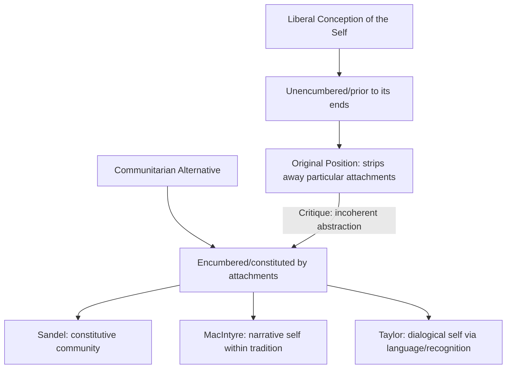

## Communitarian Critiques of Liberalism

### Overview

Communitarianism emerged in the 1980s as a sustained philosophical critique of liberal political theory—particularly the Rawlsian and Nozickian frameworks dominant in Anglo-American political philosophy—arguing that liberalism's foundational conception of the self, its account of rights, and its aspiration to neutrality among conceptions of the good are philosophically incoherent and practically corrosive of the communal bonds necessary for meaningful political and moral life. Key figures include Michael Sandel, Alasdair MacIntyre, Charles Taylor, and Michael Walzer, though the label "communitarian" is one several of these thinkers have contested or only partially accepted.

### The Target: Liberal Political Philosophy circa 1970s–80s

Communitarian critique developed largely in direct response to the Rawlsian revival of liberal contractualism in *A Theory of Justice* (1971), alongside Nozickian libertarianism. Both frameworks, despite their substantive disagreements, share methodological commitments communitarians identify as problematic:

**Key Points**

- **Deontological priority of the right over the good**: liberal theory typically holds that principles of justice can and should be specified independently of, and taking priority over, any particular conception of the good life
- **Abstraction from social identity**: liberal theorizing (especially via devices like Rawls's original position) models rational choosers as abstracted from their particular social attachments, community memberships, and historical circumstances
- **Aspiration to state neutrality**: liberal states are expected to remain neutral among competing conceptions of the good, refraining from using political power to promote any particular vision of virtue or the good life

### Sandel's Critique: The "Unencumbered Self"

Michael Sandel's *Liberalism and the Limits of Justice* (1982) offers the most direct philosophical engagement with Rawls, arguing that the original position presupposes an incoherent conception of the person—the **"unencumbered self"**.

> Rawls's subject is "given prior to its ends," a self capable of standing back from and evaluating all of its particular attachments, values, and community memberships, choosing among them as an independent chooser.

**Key Points**

- Sandel argues this model of selfhood is not merely simplified for analytical purposes but philosophically **incoherent**: some attachments (family, community, religious tradition, national identity) are not merely possessions the self chooses or evaluates from a neutral standpoint, but partly *constitute* the self's very identity
- If certain ends and attachments are constitutive rather than chosen, the Rawlsian device of stripping away all particular knowledge in the original position does not reveal a "true" impartial self but instead produces an artificial, sociologically empty abstraction incapable of the kind of practical reasoning Rawls's theory requires
- Sandel terms his alternative view of selfhood the **"encumbered self"**—a self always already embedded within particular relationships, communities, and traditions that are partly constitutive of, not merely external to, personal identity

**Example**

A person's identity as "a member of this family," "a citizen of this nation," or "an adherent of this religious tradition" is not, on Sandel's account, simply a preference the person could rationally set aside behind a veil of ignorance while remaining fully themselves—these attachments are part of what makes the person who they are, such that imagining a self without them is imagining a different (or no) self entirely.

### MacIntyre's Critique: Narrative, Tradition, and the Loss of Telos

Alasdair MacIntyre's *After Virtue* (1981) offers a broader critique extending beyond Rawls specifically to the entire Enlightenment project of grounding morality in abstract, universal, ahistorical reason, detached from tradition and communal practice.

**Key Points**

- MacIntyre argues modern moral discourse is in a state of **grave disorder**, having inherited fragments of older virtue-ethical vocabularies (from Aristotelian and Christian traditions) severed from the **teleological** framework (a shared conception of the human *telos*, or proper end/purpose) that originally gave those concepts coherence
- He advances a **narrative conception of selfhood**: human lives are intelligible only as embedded within ongoing narratives, situated within communities, traditions, and social roles that provide the very criteria by which a good life can be evaluated
- MacIntyre's account of the **virtues** ties them to **practices** (cooperative human activities with internally defined standards of excellence) and to traditions understood as extended, historically situated arguments about the goods proper to those practices
- Liberalism's aspiration to a tradition-independent, purely rational standpoint is, for MacIntyre, itself illusory—an unacknowledged tradition (liberal individualism) presenting itself falsely as tradition-neutral reason

**[Inference]** MacIntyre's own relationship to the "communitarian" label is contested; he has at various points resisted straightforward classification as a communitarian, given that his Aristotelian-Thomistic commitments and critique of modernity extend well beyond disputes internal to liberal political theory, situating him closer to a broader critique of Enlightenment moral philosophy as such.

### Taylor's Critique: Atomism and the Politics of Recognition

Charles Taylor's essays, particularly "Atomism" (1985) and *Sources of the Self* (1989), critique liberalism's implicit **social atomism**—the assumption that individuals and their capacities for rational agency can be adequately understood independently of the social and linguistic communities that make such capacities possible in the first place.

**Key Points**

- Taylor argues that capacities central to liberal personhood (rational deliberation, moral agency, self-interpretation) are **not** pre-social endowments but are constituted through language and culture, acquired only within a community of interlocutors—drawing on a broadly Hegelian and hermeneutic tradition
- This grounds Taylor's later work on the **politics of recognition** (*Multiculturalism and "The Politics of Recognition,"* 1992), arguing that identity is partly formed dialogically through recognition (or its absence/distortion) by others, giving political and moral weight to demands for the recognition of cultural, linguistic, and group identities—a position with significant influence on multiculturalism debates
- Taylor's critique is notably more moderate than MacIntyre's, often framed as seeking to *supplement* rather than wholly reject liberal political commitments with a richer social ontology

### Walzer's Critique: Spheres of Justice and Social Meaning

Michael Walzer's *Spheres of Justice* (1983) offers a distinct communitarian-adjacent argument against the *universalist* ambitions of theories like Rawls's, proposing instead a theory of **"complex equality"** grounded in the particular social meanings different goods hold within specific communities.

**Key Points**

- Walzer argues distributive justice cannot be adequately specified by a single, universal set of abstract principles (as Rawls attempts), because different social goods (money, political power, honor, education, healthcare) have distinct social meanings that vary across cultures and historical contexts, and justice requires respecting the internal logic proper to each **"sphere"**
- **Complex equality** does not require equal distribution of all goods but requires that dominance in one sphere (e.g., wealth) not be permitted to convert into unearned dominance in a separate sphere (e.g., political power or access to justice)—a form of pluralist, particularist justice theory contrasted with Rawls's more universalist, monistic approach

### Structural Diagram: Communitarian Critique of Liberal Selfhood

### Comparative Table: Liberal vs. Communitarian Positions

| Dimension | Liberalism (Rawls/Kant) | Communitarianism |
| --- | --- | --- |
| Conception of the self | Prior to its ends; capable of standing back from attachments | Constituted by community, tradition, and social roles |
| Priority | Right prior to and independent of the Good | The Good (as understood within tradition/community) informs the Right |
| State neutrality | Aspired to as a core value | Often seen as illusory or corrosive of shared moral life |
| Universalism | Seeks principles valid across communities/traditions | Emphasizes particularity, tradition, and social meaning |
| View of rights | Foundational, individually held, prior to community | Secondary to or derivative of communal goods/practices |

### The Politics of the Critique: Communitarianism as Political Movement

Beyond academic philosophy, "communitarianism" also names a loosely related **political movement** (associated with figures like Amitai Etzioni) emphasizing civic responsibility, social capital, and communal institutions (families, neighborhoods, civic associations) as correctives to perceived excessive individualism in liberal democratic societies, particularly the United States—a related but analytically distinct usage from the philosophical critique of liberal theory discussed above.

**[Inference]** The relationship between the philosophical communitarian critique of liberal metaethics/moral psychology and the more policy-oriented communitarian political movement is often only loosely connected in the secondary literature, and conflating the two risks obscuring important distinctions between metaethical arguments about selfhood and substantive policy arguments about civic institutions.

### Liberal Responses and the Broader Debate

Liberal theorists offered substantial responses to communitarian critiques, generating what is often termed the **liberal-communitarian debate** of the 1980s–90s:

- **Will Kymlicka** (*Liberalism, Community, and Culture*, 1989) argues liberalism, properly understood, is fully compatible with recognizing the value of cultural membership and community, since individual autonomy itself requires a "societal culture" providing meaningful options—attempting a partial synthesis rather than accepting the sharp liberal/communitarian dichotomy
- **Rawls's own response**: In *Political Liberalism* (1993), Rawls arguably incorporates elements responsive to communitarian concerns, particularly by grounding justice as fairness in a **political** (rather than comprehensive metaphysical) conception, acknowledging the fact of reasonable pluralism among comprehensive doctrines—though whether this constitutes a genuine concession to communitarian critique or a distinct methodological move remains debated
- **Critics of communitarianism** (e.g., Susan Moller Okin) have raised concerns that valorizing existing communities and traditions risks entrenching internal injustices (e.g., patriarchal family structures, traditional gender roles) that liberal individual rights frameworks are specifically designed to check

### Major Critiques of Communitarianism Itself

- **The relativism worry**: If justice is fundamentally relative to particular communities' social meanings or traditions (as in Walzer or, arguably, MacIntyre), critics ask what basis remains for cross-cultural moral criticism of unjust communities or traditions (e.g., traditions upholding caste hierarchy or gender subordination)
- **The conservatism worry**: Communitarian emphasis on existing communal attachments and traditions can appear to lack adequate critical resources for challenging entrenched, unjust social arrangements internal to a given community
- **The empirical/philosophical conflation worry**: Critics (including some liberal theorists) argue that even if individuals are, as an empirical/psychological matter, deeply shaped by community and tradition, it does not straightforwardly follow that political principles of justice must themselves be grounded in or relative to those particular communal attachments—the descriptive and normative claims may not be as tightly linked as some communitarian arguments suggest

**[Unverified]** Whether the liberal-communitarian debate reached genuine philosophical resolution or a stable synthesis (as some, like Kymlicka, have argued), versus remaining a persistent, unresolved fault line in contemporary political theory, is itself a matter of disputed scholarly assessment rather than settled consensus.

### Related Topics

- Rawls's *A Theory of Justice* and the original position
- MacIntyre's *After Virtue* and virtue ethics revival
- Taylor's politics of recognition and multiculturalism theory
- Walzer's *Spheres of Justice* and complex equality
- Kymlicka's liberal theory of minority rights and cultural membership
- Aristotelian and Thomistic political philosophy
- Feminist critiques of communitarianism (Susan Moller Okin)
- Civic republicanism as an adjacent tradition to communitarianism