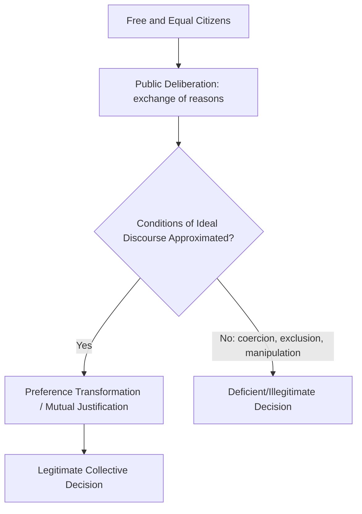

## Deliberative and Participatory Democratic Theory

### Overview

Deliberative and participatory democratic theory constitute two closely related but analytically distinct traditions in contemporary democratic theory, both developed substantially as critiques of **aggregative** or **minimalist** conceptions of democracy—which treat democratic legitimacy as arising primarily from the aggregation of pre-existing individual preferences through voting (associated with Joseph Schumpeter's competitive-elitist model and rational-choice/social-choice theory). Deliberative theory emphasizes reasoned public discourse as the source of democratic legitimacy; participatory theory emphasizes the expansion of direct citizen involvement across social and political domains. The two traditions substantially overlap and are often combined in contemporary institutional design (e.g., deliberative mini-publics).

### The Aggregative Model as Shared Target

Both traditions react against the **aggregative/minimalist** model of democracy, most associated with Joseph Schumpeter's *Capitalism, Socialism and Democracy* (1942), which defines democracy narrowly as:

> "That institutional arrangement for arriving at political decisions in which individuals acquire the power to decide by means of a competitive struggle for the people's vote."

**Key Points**

- On this view, citizens' role is largely limited to periodic voting among competing elites; preferences are treated as fixed, exogenous inputs to be aggregated, not transformed through political engagement
- Social choice theory (particularly Arrow's Impossibility Theorem) further complicates aggregative democracy by showing no voting procedure can consistently satisfy a minimal set of fairness conditions when aggregating three or more options across multiple voters
- Deliberative and participatory theorists argue this model reduces democracy to a thin, procedural mechanism disconnected from deeper ideals of self-government, public reasoning, and citizen agency

### Deliberative Democratic Theory

#### Core Claim

Deliberative democracy holds that political legitimacy derives not merely from the aggregation of votes but from **the process of public reasoning** among free and equal citizens, in which participants offer and respond to reasons, and are ideally willing to have their preferences transformed through the exchange of arguments.

**Key Points**

- Legitimacy is tied to the **quality of the reasoning process** generating a decision, not solely its procedural fairness (equal votes) or its substantive outcome
- Deliberation is expected to promote preference transformation, mutual justification, and outcomes more likely to track considerations of the common good, rather than merely aggregating fixed, self-interested preferences
- The tradition draws substantially on Kantian ideas of public reason and autonomy, and on Habermasian discourse ethics

#### Habermas and Discourse Ethics

Jürgen Habermas provides much of deliberative democracy's philosophical foundation, particularly through his **discourse theory of legitimacy**, articulated in *Between Facts and Norms* (1992).

Habermas's **discourse principle (D)**:

> "Only those norms can claim to be valid that meet (or could meet) with the approval of all affected in their capacity as participants in a practical discourse."

**Key Points**

- Habermas specifies conditions for an **ideal speech situation**: discourse approximating genuine legitimacy requires participants have equal opportunity to speak, are free from coercion or manipulation, and are motivated only by the "forceless force of the better argument"
- Legitimate law, in Habermas's framework, arises from the interplay between the **public sphere** (informal deliberation among citizens, civil society, media) and formal legislative institutions, which should be responsive to and shaped by public deliberation
- Habermas's framework is explicitly **proceduralist**: legitimacy derives from the fairness and inclusiveness of the deliberative process itself, rather than from deliberation reliably converging on a single substantively correct outcome

#### Rawls's Public Reason

Rawls's *Political Liberalism* (1993) contributes a related but distinct strand: the idea of **public reason**, requiring that on fundamental constitutional matters, citizens and officials offer justifications framed in terms other reasonable citizens (regardless of their particular comprehensive doctrines) could accept, rather than resting arguments on sectarian religious or philosophical premises.

**[Inference]** Whether Rawlsian public reason and Habermasian discourse ethics constitute genuinely convergent theories of deliberative legitimacy, or represent distinct programs with different metaethical commitments (Rawls's political liberalism vs. Habermas's more robustly proceduralist/universalist discourse ethics), is a matter of ongoing interpretive debate within democratic theory.

### Structural Diagram: Deliberative Democracy's Legitimacy Chain

### Participatory Democratic Theory

#### Core Claim

Participatory democracy, developed substantially by theorists such as Carole Pateman (*Participation and Democratic Theory*, 1970) and building on earlier roots in Rousseau's theory of the general will, emphasizes expanding meaningful citizen participation not only in formal political institutions but across social domains where power is exercised—notably the **workplace**.

**Key Points**

- Pateman critiques the mid-century "realist" model of democracy (associated with Schumpeter and later elaborated by theorists like Sartori) for its thin, elite-centered account of citizen political capacity, arguing it reflects an unjustifiably pessimistic view of ordinary citizens' capabilities
- Participatory theory emphasizes the **educative function** of participation: engaging in direct decision-making cultivates civic competence, political efficacy, and democratic dispositions among citizens, functioning as a form of political education rather than merely a mechanism for registering pre-formed preferences
- Pateman extends the argument to **industrial democracy**—advocating expanded worker participation in workplace governance and decision-making, on the grounds that democratic habits and competencies developed through participation in one sphere (work) transfer to and strengthen participation in the broader political sphere

#### Rousseauian Roots

Participatory theory draws significantly on Jean-Jacques Rousseau's *The Social Contract* (1762), particularly the concept of the **general will** (*volonté générale*) and Rousseau's insistence that legitimate sovereignty cannot be delegated or represented, requiring direct citizen participation in lawmaking—in explicit contrast to purely representative models of democratic legitimacy.

### Comparative Table: Deliberative vs. Participatory Democracy

| Dimension | Deliberative Democracy | Participatory Democracy |
| --- | --- | --- |
| Primary emphasis | Quality of reasoning and justification | Breadth and depth of citizen involvement |
| Key theorists | Habermas, Rawls, Joshua Cohen, Amy Gutmann | Pateman, C.B. Macpherson, Benjamin Barber |
| Central mechanism | Public discourse, mutual justification | Direct participation across social/political domains |
| Institutional focus | Deliberative forums, public sphere, legislative discourse | Workplace democracy, local assemblies, participatory budgeting |
| Relation to preferences | Preferences transformed through reasoned exchange | Preferences formed/clarified through direct engagement |
| Philosophical roots | Kant, discourse ethics, public reason | Rousseau, general will, direct sovereignty |

### Institutional Applications and "Mini-Publics"

Contemporary democratic innovation has generated concrete institutional forms substantially informed by both traditions, often termed **deliberative mini-publics**:

**Key Points**

- **Citizens' assemblies**: randomly selected (sortition-based) bodies of citizens deliberating on specific policy questions, informed by expert testimony, producing recommendations to legislatures or referenda (e.g., Ireland's Citizens' Assembly on abortion, 2016–2018; various climate assemblies across Europe)
- **Deliberative polling** (developed by James Fishkin): a method combining random sampling with structured small-group deliberation to measure how citizen opinion shifts after informed, balanced discussion, used both as a research method and a policy-input mechanism
- **Participatory budgeting**: originating in Porto Alegre, Brazil (1989), allowing citizens to directly deliberate and vote on the allocation of portions of municipal budgets, now adopted in various forms across many cities globally
- **Sortition** (random selection for political office/bodies, as in ancient Athenian democracy) has seen renewed theoretical interest as a mechanism for realizing deliberative and participatory ideals while avoiding certain distortions of electoral representation (e.g., campaign financing, incumbency advantage)

### Major Critiques

#### Feasibility and Scale

Critics (including some sympathetic to democratic theory generally) argue deliberative and participatory ideals, developed with small-scale or historically limited models (Athenian assembly, town meetings) in mind, face significant **scale problems** when applied to mass, complex, pluralistic modern societies, raising questions about time, resource, and cognitive-bandwidth constraints on meaningful mass deliberation.

#### Power and Inequality in Deliberation

Iris Marion Young (*Inclusion and Democracy*, 2000) and other critical theorists argue that idealized deliberative norms (favoring calm, rational, dispassionate argumentative discourse) can themselves reflect and reinforce culturally specific communicative styles, potentially disadvantaging marginalized groups whose modes of political expression (testimony, rhetoric, greeting, storytelling) may not conform to narrowly rationalist deliberative norms—a critique sometimes summarized as concern that deliberative democracy risks a **new form of exclusion** dressed in procedural neutrality.

#### Preference Transformation Skepticism

Empirical political science, particularly work influenced by social psychology, raises skepticism about whether deliberation reliably produces the preference *transformation* and convergence toward reasoned consensus that deliberative theory anticipates, versus outcomes such as **group polarization** (deliberation pushing groups toward more extreme versions of their initial leanings) or elite capture of ostensibly participatory processes.

**[Inference]** The empirical literature on deliberation's actual effects (moderation vs. polarization, genuine preference change vs. performative consensus) remains mixed and context-dependent, and whether specific institutional designs (e.g., professional facilitation, balanced information provision in deliberative polling) can reliably mitigate polarization risks is an active area of empirical political science research rather than a settled finding.

#### Participatory Democracy's Time/Resource Demands

Critics of participatory democracy note that extensive participatory demands (e.g., regular direct involvement in workplace and political governance) may disproportionately burden citizens with less flexible time (due to caregiving responsibilities, multiple jobs, etc.), potentially reproducing rather than remedying political inequality unless carefully designed with compensatory support (e.g., paid participation, childcare provision).

### Related Topics

- Habermas's discourse ethics and the public sphere
- Rawls's theory of public reason (*Political Liberalism*)
- Rousseau's *The Social Contract* and the general will
- Social choice theory and Arrow's Impossibility Theorem
- Iris Marion Young's critique of deliberative exclusion
- Sortition and citizens' assemblies in democratic innovation
- Carole Pateman's theory of workplace/industrial democracy
- Agonistic democracy (Chantal Mouffe) as a rival critical tradition