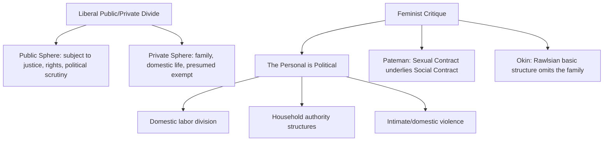

## Feminist and Postcolonial Political Theory

### Overview

Feminist and postcolonial political theory constitute two distinct but frequently intersecting critical traditions that challenge the presumed universality, neutrality, and completeness of mainstream (liberal, contractarian, and Marxist) political theory. Feminist political theory interrogates the gendered assumptions embedded in core political concepts—the public/private divide, citizenship, autonomy, justice—while postcolonial theory interrogates the Eurocentric assumptions embedded in concepts of sovereignty, development, human rights, and political modernity itself, both tracing how ostensibly universal categories have historically encoded particular (male, Western) experiences as the norm.

### Feminist Political Theory

#### The Critique of the Public/Private Divide

A foundational feminist intervention targets the liberal distinction between a **public sphere** (subject to political regulation, rights, and justice) and a **private sphere** (family, domestic life, traditionally exempt from political scrutiny).

**Key Points**

- Carole Pateman's *The Sexual Contract* (1988) argues classical social contract theory (Hobbes, Locke, Rousseau) rests on an unacknowledged **"sexual contract"** preceding and underpinning the social contract—an original subordination of women that the public contract-among-men narrative obscures
- The feminist slogan **"the personal is political"** (associated with 1960s–70s radical feminism, theorized further by thinkers like Catharine MacKinnon) challenges the presumption that domestic and intimate relations (marriage, household labor division, domestic violence) are properly exempt from political and justice-based scrutiny
- Susan Moller Okin's *Justice, Gender, and the Family* (1989) extends this critique directly into Rawlsian theory, arguing Rawls's basic structure inadequately addresses injustice *within* families, since the original position implicitly assumes household heads as its parties

#### Liberal Feminism, Radical Feminism, and Beyond

| Strand | Core Claim | Key Theorists |
| --- | --- | --- |
| **Liberal feminism** | Equal rights and opportunities within existing liberal-democratic institutions | Mary Wollstonecraft (historical precursor), Susan Moller Okin |
| **Radical feminism** | Patriarchy as a systemic structure of domination requiring fundamental social transformation, not mere legal equality | Catharine MacKinnon, Andrea Dworkin |
| **Socialist/Marxist feminism** | Gender oppression intertwined with capitalist class relations; critique of unpaid domestic/reproductive labor | Silvia Federici, Nancy Fraser (in part) |
| **Care ethics** | Centers relationality, dependency, and care as neglected in autonomy-centered liberal theory | Carol Gilligan, Eva Feder Kittay, Joan Tronto |
| **Intersectional feminism** | Gender oppression cannot be analyzed independently of race, class, and other axes of domination | Kimberlé Crenshaw, Patricia Hill Collins |

#### The Ethics and Politics of Care

Care ethics, emerging partly from Carol Gilligan's psychological work (*In a Different Voice*, 1982) and developed politically by theorists like Joan Tronto (*Moral Boundaries*, 1993) and Eva Feder Kittay, critiques mainstream political theory's emphasis on **autonomous, independent rational agents** as the basic unit of analysis, arguing this obscures the pervasive reality of human **dependency** (childhood, illness, disability, old age) and the unequally distributed, often unpaid or undervalued, labor of care that sustains all political communities.

**Key Points**

- Kittay's concept of **"dependency work"** highlights how the liberal citizen-as-independent-rational-chooser model presupposes, without acknowledging, extensive background care labor (historically performed disproportionately by women) that itself requires just political and economic recognition
- Tronto argues care should be reconceived as a **central political value and public responsibility**, not merely a private familial matter, reshaping how democratic societies should allocate and value caregiving labor

#### Intersectionality

Kimberlé Crenshaw's foundational articulation (1989, in the context of critical legal studies, later widely adopted across political theory) argues that analyzing gender oppression or racial oppression as separate, additive categories fails to capture the distinct forms of subordination faced by those situated at the intersection of multiple categories (e.g., Black women), whose experience is not adequately captured by frameworks addressing race or gender in isolation.

$$\text{Experience of Subordination} \neq \text{Gender Oppression} + \text{Racial Oppression (simple addition)}$$

**Key Points**

- Intersectionality has become a widely adopted analytical framework across contemporary feminist, critical race, and broader political theory, informing analysis of how overlapping systems of power (gender, race, class, sexuality, disability, immigration status) interact to produce distinct experiences of political marginalization
- The framework has substantially influenced contemporary debates in identity-conscious policy design, anti-discrimination law, and critiques of "single-axis" political movements

### Structural Diagram: Feminist Critique of the Liberal Public/Private Divide

### Postcolonial Political Theory

#### Core Claims and Origins

Postcolonial theory emerged substantially from literary and cultural studies (Edward Said's *Orientalism*, 1978, is a foundational text) before developing into a distinct strand of political theory examining how colonialism structured—and continues to structure, in ostensibly "post"-colonial conditions—political concepts, institutions, and global relations.

**Key Points**

- **Edward Said's *Orientalism*** analyzes how Western scholarly, literary, and political discourse historically constructed "the Orient" as a static, essentialized, inferior civilizational Other, a discursive process inseparable from and legitimating colonial domination
- Postcolonial theorists argue core political science concepts—**sovereignty, the nation-state, development, modernization, human rights**—are not neutral, universal categories but were substantially shaped by, and continue to bear the imprint of, European colonial history and Eurocentric assumptions presented as universal
- The prefix "post" is contested within the field itself: many theorists emphasize that formal decolonization did not eliminate colonial power structures, but transformed them into ongoing **neocolonial** economic, cultural, and epistemic relations

#### Subaltern Studies and Epistemic Critique

The **Subaltern Studies** collective (originating with South Asian historians including Ranajit Guha) sought to recover the political agency of subordinated groups ("subalterns") systematically excluded from elite-focused colonial and nationalist historiography.

Gayatri Chakravorty Spivak's influential essay **"Can the Subaltern Speak?"** (1988) poses a foundational epistemological challenge:

> Spivak questions whether the subaltern (particularly the doubly marginalized colonized woman) can genuinely "speak" within existing discursive and representational structures, or whether even well-intentioned Western/elite scholarly efforts to "give voice" to the subaltern risk reproducing the very structures of representation and epistemic domination they aim to critique.

**Key Points**

- This raises significant methodological questions for political theory and comparative politics regarding **who speaks for whom**, and whether Western theoretical frameworks (including well-intentioned human rights or development discourse) can adequately represent non-Western political experience without epistemic distortion
- Spivak's concept of **"strategic essentialism"** (a qualified, tactical acceptance of group-identity categories for specific political mobilization purposes, while retaining awareness of their constructed nature) has been influential across postcolonial and feminist political organizing debates

#### Dipesh Chakrabarty and "Provincializing Europe"

Dipesh Chakrabarty's *Provincializing Europe* (2000) argues that historical and political-theoretical narratives of "modernity," "progress," and "development" implicitly position European historical experience as the universal template against which all other societies are measured and found lacking or "not yet" modern—a structure Chakrabarty terms **historicism**.

**Key Points**

- Chakrabarty's project seeks to "provincialize" (relativize, situate as one particular rather than universal) European political and historical categories, without simply rejecting them, instead insisting they be understood as indispensable yet inadequate for capturing non-European political experience
- This has significant implications for how concepts like "the state," "civil society," and "citizenship"—developed within specific European historical trajectories—are applied, often uncritically, to substantially different political and social contexts globally

#### Achille Mbembe and Necropolitics

Achille Mbembe's concept of **necropolitics** (elaborated from Foucault's biopolitics) extends postcolonial critique into an analysis of how contemporary and historical sovereign power operates through the capacity to dictate who may live and who must die, particularly in colonial and postcolonial contexts of occupation, plantation slavery, and contemporary states of exception—a significant contribution to critical theorizations of sovereignty beyond classical Weberian or Schmittian frameworks.

### Comparative Table: Feminist and Postcolonial Theory in Dialogue

| Dimension | Feminist Political Theory | Postcolonial Political Theory |
| --- | --- | --- |
| Primary critique target | Gendered assumptions in liberal political concepts | Eurocentric assumptions in political/historical concepts |
| Key contested divide | Public/private sphere | Colonizer/colonized, West/non-West |
| Central epistemic concern | Whose experience counts as the political "norm" | Whose knowledge/voice is recognized as legitimate |
| Key intersection | Postcolonial feminism (Spivak, Chandra Talpade Mohanty) critiques both mainstream feminism's Western bias and postcolonial theory's gender-blindness |  |

**Postcolonial feminism**, notably articulated by Chandra Talpade Mohanty's essay "Under Western Eyes" (1988), critiques mainstream Western feminism for constructing a homogenized, victimized "Third World Woman" category that erases the diversity, agency, and specific political-historical circumstances of women in the Global South—illustrating the substantial and productive intersection between these two traditions rather than treating them as fully separate.

### Applications in Contemporary Political Science

- **Human rights discourse critique**: Postcolonial theorists question whether contemporary international human rights frameworks, despite universalist aspirations, encode particular Western liberal individualist assumptions that may not adequately translate across diverse political and cultural contexts, without thereby endorsing moral relativism
- **Development studies**: Post-development theorists (influenced by postcolonial critique) challenge the presumed universality and neutrality of "development" as a political-economic goal, arguing it often reproduces colonial-era hierarchies between "developed" and "developing" societies
- **Gender mainstreaming in policy**: Intersectional and care-ethics frameworks have influenced contemporary policy debates on parental leave, care labor valuation/compensation, and anti-discrimination law design
- **Critical International Relations theory**: Both traditions have substantially reshaped IR theory, challenging state-centric, Western-centric assumptions in classical realist and liberal international relations frameworks

### Major Internal and External Critiques

- **Essentialism debates within feminism**: Tension exists between framings emphasizing shared women's experience/standpoint (risking essentialism) and intersectional/poststructuralist critiques emphasizing the constructed, plural, and context-dependent nature of gendered experience
- **Postcolonial theory's abstraction critique**: Some critics (including scholars sympathetic to postcolonial aims) argue certain strands of postcolonial theory, particularly in its more poststructuralist register, can become highly abstract or textually focused in ways that limit direct applicability to concrete political-economic policy analysis
- **Universalism vs. particularism tension**: Both traditions face an internal tension between critiquing false universalism (Western/male norms presented as neutral) while still wanting to make normative claims (about justice, oppression, rights) with some cross-contextual validity—raising the question of how particularist critique avoids collapsing into thoroughgoing relativism
- **Class and materialist critiques**: Marxist and materialist theorists have critiqued some strands of both feminist and postcolonial theory (particularly more culturalist/discursive strands) for insufficient attention to political economy and material class relations underlying gendered and (post)colonial domination

**[Unverified]** The degree to which contemporary feminist and postcolonial political theory have successfully integrated materialist/political-economy analysis with their originally more culturalist or discursive methodological starting points is an active and evolving area of scholarship rather than a settled matter of disciplinary consensus.

### Related Topics

- Pateman's *The Sexual Contract* and critiques of classical contract theory
- Okin's critique of Rawls and the family as basic structure
- Intersectionality theory (Kimberlé Crenshaw, Patricia Hill Collins)
- Said's *Orientalism* and discursive analysis of colonial power
- Subaltern Studies and Spivak's "Can the Subaltern Speak?"
- Chakrabarty's *Provincializing Europe* and critique of historicism
- Mbembe's necropolitics and critical sovereignty theory
- Postcolonial feminism (Chandra Talpade Mohanty) and critiques of Western feminist universalism