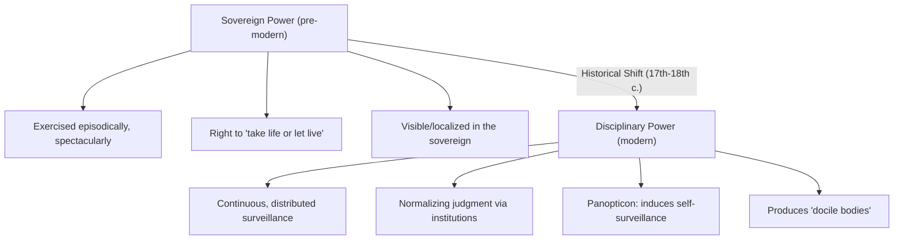

## Foucault and Poststructuralist Power

### Overview

Michel Foucault's analysis of power constitutes one of the most influential and disruptive contributions to late-twentieth-century political theory, fundamentally reconceptualizing power away from a possession held by sovereign authorities and exercised through prohibition, toward a diffuse, productive, and relational phenomenon operating through discourse, knowledge, and the body across the entire social field. Developed across works including *Discipline and Punish* (1975), *The History of Sexuality, Volume 1* (1976), and his later lecture courses at the Collège de France, Foucault's framework has profoundly shaped critical political theory, governance studies, and poststructuralist approaches to the state and subject.

### Departure from Juridical Power

Foucault explicitly positions his analysis against what he terms the **"juridico-discursive"** or **repressive hypothesis** model of power, characteristic of classical political theory (Hobbes, Locke, and much of the liberal and Marxist tradition), which conceives power as:

**Key Points**

- Fundamentally **possessed** by a sovereign or ruling class and exercised **downward** upon subjects
- Primarily **repressive/prohibitive**—operating through law, prohibition, censorship, and negative sanction ("Thou shalt not")
- Centralized, unified, and traceable to a locatable source (the sovereign, the state, the ruling class)

Foucault famously insists: **"Power is not an institution, and not a structure; neither is it a certain strength we are endowed with; it is the name that one attributes to a complex strategical situation in a particular society."** Power, for Foucault, is not something one *has* but something that is *exercised*, constituted through relations rather than possessed as a substance.

### Power as Productive, Not Merely Repressive

Foucault's most significant conceptual innovation is the claim that power is fundamentally **productive** rather than purely repressive:

> "We must cease once and for all to describe the effects of power in negative terms... In fact, power produces; it produces reality; it produces domains of objects and rituals of truth."

**Key Points**

- Power does not simply say "no" to pre-existing desires or subjects; it actively **produces** subjects, knowledge, discourses, and forms of subjectivity themselves
- This reframes the political subject: individuals are not merely repressed by power from an otherwise "free" natural state, but are actively constituted—their very desires, self-understanding, and modes of being—through power relations
- This productive conception underlies Foucault's controversial claim (developed extensively in *The History of Sexuality*) that even sexuality, often assumed to be repressed by power (the "repressive hypothesis"), was historically **produced** through proliferating discourses (medical, psychiatric, pedagogical, confessional) that categorized, named, and incited discourse about sex, rather than simply silencing it

### Power/Knowledge (*Pouvoir/Savoir*)

Foucault argues power and knowledge are inextricably linked, mutually constitutive rather than independent domains where knowledge simply serves or is distorted by external power interests:

> "Power and knowledge directly imply one another... there is no power relation without the correlative constitution of a field of knowledge, nor any knowledge that does not presuppose and constitute at the same time power relations."

**Key Points**

- Regimes of knowledge (medical, psychiatric, criminological, demographic) do not merely neutrally describe pre-existing objects but actively **constitute** the objects and categories of knowledge (e.g., "the delinquent," "the homosexual," "the madman") through classificatory and disciplinary practices
- This challenges the presumption of a neutral, disinterested pursuit of scientific/social knowledge standing apart from power relations, instead positing that specific institutional and disciplinary power relations enable, shape, and are reinforced by corresponding knowledge production

### Disciplinary Power and the Panopticon

*Discipline and Punish* traces a historical shift from **sovereign power** (spectacular, often violent, exercised episodically on the body, exemplified by public execution) to **disciplinary power** (continuous, normalizing, exercised through surveillance and training of docile bodies), associated with the emergence of modern institutions: prisons, schools, hospitals, barracks, and factories.

**Key Points**

- **Disciplinary power** operates through techniques including hierarchical observation, normalizing judgment (evaluation against a statistical or ideal norm), and examination (combining observation and normalizing judgment)
- Foucault uses Jeremy Bentham's architectural design for the **Panopticon**—a prison structure enabling a central observer to potentially watch all inmates without inmates knowing when they are being observed—as a paradigmatic diagram (*dispositif*) of modern disciplinary power
- The Panopticon's genius, for Foucault, lies in inducing **self-surveillance**: inmates internalize the possibility of being watched, disciplining their own behavior even absent an actual observer, producing "docile bodies" through the internalization of normalizing judgment rather than requiring constant external coercive force

**Example**

A student who studies diligently even when no teacher is present, having internalized norms of academic discipline and the constant possibility of evaluation/examination, exemplifies Foucauldian disciplinary power operating through self-regulation rather than direct external coercion—illustrating how disciplinary power is more efficient and pervasive than sovereign power precisely because it does not require constant active enforcement.

### Structural Diagram: From Sovereign to Disciplinary Power

### Biopolitics and Governmentality

Foucault's later work extends disciplinary analysis to the level of populations, introducing two further key concepts central to his political theory.

#### Biopolitics

Foucault contrasts disciplinary power's focus on the individual body with **biopolitics** (*biopouvoir*), power exercised over populations as biological aggregates—managing birth rates, mortality, public health, longevity, and hygiene through statistical and administrative techniques. This marks a shift from the sovereign's right to "take life or let live" toward modern power's characteristic orientation to **"make live and let die"**—optimizing and administering biological life at the population level.

#### Governmentality

Foucault's concept of **governmentality** (*gouvernementalité*, from *gouverner* + *mentalité*) analyzes the historical emergence of "government" as a distinct rationality of rule concerned with the **conduct of conduct**—the ensemble of institutions, procedures, analyses, and tactics through which populations, economies, and individuals are administered, extending beyond the formal apparatus of the state into diffuse practices of self-regulation and management.

**Key Points**

- Governmentality studies (developed extensively by later scholars including Nikolas Rose, Mitchell Dean, and Colin Gordon in the "governmentality studies" tradition) analyze how modern liberal governance operates not primarily through direct coercive state command but through shaping the conditions within which individuals and populations govern themselves
- This framework has been influential in analyzing **neoliberalism** as a governmental rationality that extends market logic and the model of rational, self-interested, self-optimizing economic actors (*homo economicus*) into domains previously governed by other logics (education, health, social welfare, the self)

### Power as Relational and Resistance

Foucault insists power is **relational**, existing only in its exercise between points, not as a substance possessed unilaterally, and that power relations necessarily generate the possibility of **resistance**:

> "Where there is power, there is resistance, and yet, or rather consequently, this resistance is never in a position of exteriority in relation to power."

**Key Points**

- Resistance, for Foucault, is not located outside or prior to power relations (as in some liberatory or Marxist narratives positing an authentic, pre-power self or class awaiting liberation) but exists within and against specific power relations, taking multiple, dispersed, localized forms rather than a single unified revolutionary opposition
- This has significant implications for political strategy, favoring analysis of and resistance to specific, localized power relations (e.g., within psychiatric institutions, prisons, or discourses of sexuality) over grand narratives of total liberation from power as such

### Comparative Table: Foucauldian vs. Classical Conceptions of Power

| Dimension | Classical/Juridical (Hobbes, Marx) | Foucauldian |
| --- | --- | --- |
| Locus of power | Centralized (sovereign, state, ruling class) | Diffuse, capillary, relational |
| Mode of operation | Repressive/prohibitive | Productive/constitutive |
| Relation to knowledge | Knowledge as separate from/distorted by power | Power/knowledge inseparable (*pouvoir/savoir*) |
| Subject formation | Pre-existing subject repressed by power | Subject constituted through power relations |
| Site of analysis | The state, sovereign, ruling class | Institutions, discourse, the body, everyday practices |
| Resistance | Opposition external to power (revolution, rights claims) | Immanent to specific power relations; localized, plural |

### Major Applications in Political Theory

- **Critical security studies**: Foucauldian biopolitics informs analysis of contemporary border control, surveillance, and population management technologies
- **Neoliberalism studies**: Governmentality frameworks are widely applied to analyze how neoliberal governance operates through incentivizing self-management, entrepreneurial subjectivity, and market rationality rather than direct command
- **Gender and queer theory**: Judith Butler's performativity theory and broader queer theory substantially draw on Foucault's account of how discourses (particularly around sexuality) produce, rather than merely repress, categories of identity
- **Postcolonial theory**: Foucauldian power/knowledge analysis has been influential (alongside and sometimes in tension with Said's more literary-discursive approach) in analyzing colonial administrative and epistemic power

### Major Critiques

- **The agency/normativity problem**: Critics (notably from a Habermasian perspective, e.g., Nancy Fraser's early critique) argue Foucault's framework, in emphasizing the pervasiveness and productivity of power, struggles to provide clear normative grounds for *why* particular power relations should be resisted or judged unjust, given the apparent absence of an external normative standpoint outside power relations themselves
- **Determinism/agency tension**: Some critics argue Foucault's emphasis on disciplinary power's productive constitution of subjects risks an overly deterministic account of subjectivity, leaving insufficient conceptual room for genuine individual or collective agency and resistance—though Foucault's own later work on ethics and "technologies of the self" (*The History of Sexuality, Volumes 2–3*) is often read as a partial response to this concern
- **Empirical historical critiques**: Some historians have challenged the empirical accuracy or generalizability of Foucault's specific historical narratives (e.g., regarding the "great confinement" of the mad, or the precise chronology of disciplinary institutions), questioning whether his genealogical method sufficiently withstands close historical scrutiny
- **Absence of political-economic analysis**: Marxist and materialist critics argue Foucauldian analysis, in focusing heavily on discourse, knowledge, and disciplinary technique, can underemphasize capitalist political-economic structures and class relations as significant, relatively autonomous drivers of power relations

**[Unverified]** Whether Foucault's later interest in ethics, "technologies of the self," and practices of freedom constitutes a substantive philosophical correction to earlier charges of normative and agency deficits in his power analysis, or remains in tension with his earlier, more structurally deterministic genealogies, is a matter of ongoing interpretive dispute among Foucault scholars rather than a settled question.

### Related Topics

- Foucault's *Discipline and Punish* and the genealogy of the prison
- *The History of Sexuality* and the repressive hypothesis critique
- Governmentality studies (Nikolas Rose, Mitchell Dean, Colin Gordon)
- Biopolitics and contemporary surveillance/border studies
- Judith Butler's performativity theory and queer theory
- Habermas's critique of poststructuralist normativity
- Neoliberalism as a governmental rationality
- Gramsci's hegemony theory as a comparative account of diffuse power