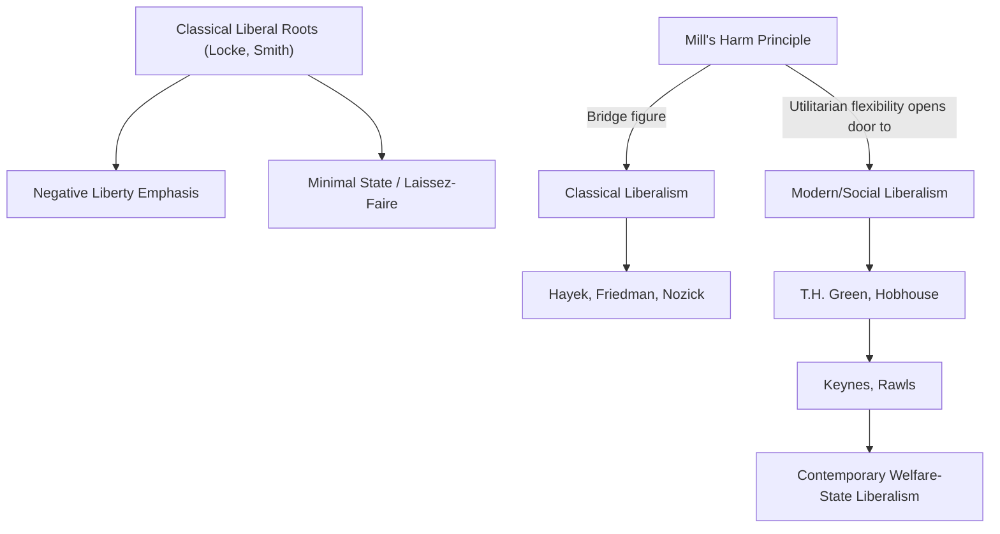

## Classical and Modern Liberalism

### Overview

Liberalism is one of the foundational ideological traditions of modern politics, centered on the primacy of individual liberty, limited government, the rule of law, and (in most variants) some form of equality before the law. The tradition bifurcates historically into **classical liberalism**, emphasizing negative liberty, minimal state intervention, and free markets, and **modern (social/welfare) liberalism**, which retains core liberal commitments to individual rights and democratic government while embracing a more expansive state role in securing substantive freedom and social welfare. Understanding this bifurcation—and the underlying philosophical disputes about the nature of liberty itself—is essential to situating liberalism relative to conservatism, socialism, and libertarianism.

### Foundational Classical Liberal Theory

#### Locke and Natural Rights

John Locke's *Two Treatises of Government* (1689) provides liberalism's foundational statement: individuals possess natural rights to **life, liberty, and property** prior to and independent of government, and legitimate government exists by consent, established to protect these pre-political rights.

**Key Points**

- Government is a **trust**: political authority is delegated by the people for the limited purpose of protecting natural rights, and a government that systematically violates this trust (particularly through arbitrary interference with property) forfeits its legitimacy, justifying resistance
- Locke's **labor theory of property** holds that individuals acquire property rights by "mixing their labor" with unowned natural resources, subject to a proviso that enough and as good must be left for others—later foundational to libertarian property theory (Nozick)
- Locke's framework emphasizes **negative liberty**: freedom as the absence of external interference (particularly government interference) with individual action, rather than the provision of positive capacities or resources

#### Smith and Economic Liberalism

Adam Smith's *The Wealth of Nations* (1776) provides classical liberalism's foundational economic theory, arguing that individuals pursuing their own self-interest within a system of free exchange and competitive markets tend, "as if by an invisible hand," to promote the general economic welfare more effectively than centralized direction.

**Key Points**

- Smith's framework underlies the classical liberal preference for **laissez-faire** economic policy: minimal government interference in markets, free trade, and the protection of private property and contract enforcement as the state's primary economic functions
- Smith's own position is more nuanced than later "laissez-faire" caricatures suggest, including support for public goods provision (infrastructure, education) and recognition of certain market failures—a point of ongoing scholarly discussion regarding the fidelity of later classical liberal and libertarian appropriations of Smith

#### Mill and the Harm Principle

John Stuart Mill's *On Liberty* (1859) provides liberalism's most influential articulation of the proper limits of state and social interference with individual liberty, formulated as the **harm principle**:

> "The only purpose for which power can be rightfully exercised over any member of a civilized community, against his will, is to prevent harm to others. His own good, either physical or moral, is not a sufficient warrant."

**Key Points**

- The harm principle explicitly rejects both **legal paternalism** (interference to protect individuals from self-harm) and **legal moralism** (interference to enforce a particular moral or religious vision), restricting legitimate coercion to harm-prevention
- Mill's defense of liberty rests substantially on **utilitarian** grounds (contrary to Locke's natural-rights framing): liberty of thought, expression, and individuality is defended as instrumentally valuable for discovering truth, fostering social progress, and enabling genuine human flourishing—not merely as an inviolable natural right
- Mill's later work, including *Considerations on Representative Government* (1861) and his qualified sympathies toward cooperative economic arrangements, marks an important bridge toward modern liberalism's more expansive view of legitimate state action

### Structural Diagram: The Liberal Tradition's Bifurcation

### Negative vs. Positive Liberty

Isaiah Berlin's essay **"Two Concepts of Liberty"** (1958) provides the canonical analytical framework distinguishing the two conceptions of freedom underlying the classical/modern liberal divide.

| Concept | Definition | Political Implication |
| --- | --- | --- |
| **Negative liberty** | Freedom *from* external interference/coercion by others | Minimal state; liberty preserved by limiting government action |
| **Positive liberty** | Freedom *to* achieve self-mastery, genuine self-realization, or effective capacity to act | State may need to actively provide resources/conditions enabling genuine freedom |

Berlin himself expressed significant wariness toward positive liberty, warning that its logic could be historically exploited to justify authoritarian claims that a coercive authority "truly" liberates individuals by compelling them toward their "real" or "higher" self-interest—a concern with direct relevance to totalitarian ideological justifications. Modern liberals, while generally aware of this risk, argue a purely negative conception of liberty is insufficient, since formal freedom from interference means little without the substantive resources (education, health, minimum economic security) needed to actually exercise that freedom meaningfully.

### The Emergence of Modern (Social) Liberalism

#### T.H. Green and the New Liberalism

T.H. Green's late-19th-century **British Idealist** liberalism marks a decisive turn, arguing that genuine individual freedom requires not merely the absence of external restraint but the removal of social and economic obstacles preventing individuals from realizing their capacities—laying philosophical groundwork for state intervention (public health, education, labor regulation) as *consistent with*, rather than opposed to, liberal principles of freedom.

**Key Points**

- Green reconceives liberty as encompassing **positive freedom**: the capacity for genuine self-realization, which may require collective/state action to remove impediments (poverty, ignorance, poor health, exploitative working conditions) that purely formal legal freedom does not address
- This "New Liberalism" (associated also with L.T. Hobhouse) provided the philosophical foundation for early-20th-century British welfare reforms and represents the decisive philosophical break enabling liberalism's evolution toward the modern welfare state

#### Keynesian Economic Liberalism

John Maynard Keynes's economic theory, particularly *The General Theory of Employment, Interest and Money* (1936), provided modern liberalism's central economic policy framework: arguing markets do not automatically self-correct toward full employment equilibrium, and that active government fiscal and monetary intervention is necessary and legitimate to manage economic cycles, maintain employment, and secure the material conditions for genuine liberty—directly opposing classical liberal/laissez-faire economic orthodoxy.

#### Rawlsian Liberal Egalitarianism

John Rawls's *A Theory of Justice* (1971) represents modern liberalism's most systematic contemporary philosophical statement, combining liberal commitment to equal basic liberties (first principle) with a substantive, redistributively-oriented conception of social and economic justice (difference principle)—establishing **liberal egalitarianism** as the dominant academic articulation of modern liberalism in contemporary political philosophy.

### Comparative Table: Classical vs. Modern Liberalism

| Dimension | Classical Liberalism | Modern (Social) Liberalism |
| --- | --- | --- |
| Conception of liberty | Primarily negative (freedom from interference) | Negative liberty plus positive/substantive freedom |
| View of the state | Minimal ("night-watchman"); protect rights, enforce contracts | Expansive; active provider of welfare, regulation, public goods |
| Economic policy | Laissez-faire; free markets, minimal regulation | Mixed economy; Keynesian intervention, regulated markets |
| Key theorists | Locke, Smith, (later) Hayek, Friedman | T.H. Green, Hobhouse, Keynes, Rawls |
| View of inequality | Largely acceptable if arising from just processes | A concern requiring redistributive correction |
| Contemporary political affinity | Often associated with economic conservatism/libertarianism in the U.S. context | Often associated with "liberal" as used in contemporary U.S. political discourse |

**[Inference]** The terminological divergence—"liberal" denoting free-market, small-government positions in much of Europe and Latin America, versus denoting welfare-state, socially progressive positions in contemporary U.S. political discourse—reflects this classical/modern historical bifurcation, though the precise mapping of contemporary party positions onto these philosophical categories varies significantly by country and is a matter of ongoing empirical political analysis rather than a fixed doctrinal correspondence.

### 20th-Century Classical Liberal Revival: Hayek and Friedman

Friedrich Hayek's *The Road to Serfdom* (1944) and later work, along with Milton Friedman's *Capitalism and Freedom* (1962), constitute an influential 20th-century revival and defense of classical liberal (often labeled **neoliberal** or, in a distinct usage, **libertarian**) principles against both socialist central planning and the expanding welfare state.

**Key Points**

- Hayek's **knowledge argument** contends that centralized economic planning cannot effectively aggregate the dispersed, local, often tacit knowledge held by individual market participants, which price signals in a free market efficiently coordinate without requiring central direction—a distinct argument from purely moral/rights-based defenses of markets
- Hayek warns that extensive economic planning, even when democratically initiated with benign intent, creates institutional and psychological momentum toward centralized, coercive control incompatible with liberal freedom—the "road to serfdom" thesis
- Friedman's monetarist economics and advocacy for deregulation, school vouchers, and minimal state intervention substantially influenced late-20th-century policy shifts (associated with Thatcherism and Reaganomics), often labeled "neoliberalism" in critical political-economic literature

### Major Critiques of Liberalism (from Adjacent Traditions)

- **Marxist critique**: Liberalism's formal legal equality is argued to mask substantive material inequality generated by capitalist property relations, rendering liberal rights largely formal rather than substantively liberating for the working class
- **Communitarian critique**: As developed by Sandel, MacIntyre, and Taylor, liberalism's presumption of an "unencumbered self" and aspiration to state neutrality among conceptions of the good are challenged as philosophically incoherent and corrosive of communal bonds
- **Feminist critique**: Liberal theory's traditional public/private divide is critiqued (Pateman, Okin) for exempting the family and domestic sphere from justice-based scrutiny, obscuring gendered subordination
- **Conservative critique**: Traditional/Burkean conservatism critiques liberal individualism and rationalism for underestimating the value of inherited tradition, social continuity, and organic community bonds, viewing liberal rationalist social engineering with skepticism

### Related Topics

- Locke's *Two Treatises of Government* and natural rights theory
- Mill's *On Liberty* and the harm principle
- Berlin's "Two Concepts of Liberty" (negative vs. positive freedom)
- Rawls's *A Theory of Justice* and liberal egalitarianism
- Hayek's *The Road to Serfdom* and the knowledge argument against central planning
- Keynesian economics and the mixed-economy welfare state
- Nozick's libertarianism as a rival descendant of classical liberalism
- Neoliberalism as a contested contemporary policy paradigm