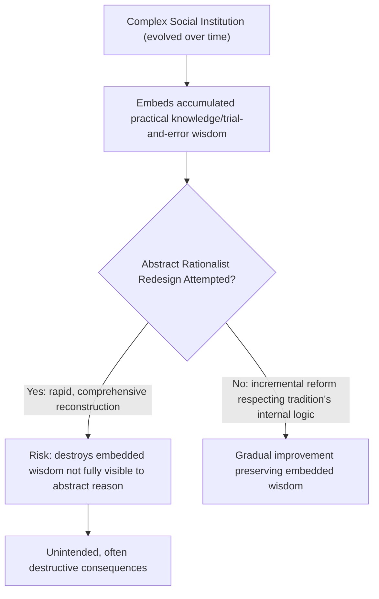

## Conservatism and Traditionalism

### Overview

Conservatism is a political ideology emphasizing the value of established institutions, traditions, and gradual, organic social change over abstract rationalist schemes for social reconstruction. Emerging as a self-conscious political tradition primarily in reaction to the French Revolution, conservatism resists reduction to a single fixed doctrine or program, instead constituting a disposition and set of recurring commitments—skepticism toward radical change, respect for inherited institutions, and emphasis on the limits of human reason in social design—that have been variously combined with differing substantive political and economic positions across its historical development.

### Burke and the Foundational Statement

Edmund Burke's *Reflections on the Revolution in France* (1790) is widely regarded as the founding text of modern conservatism, written as an immediate critique of the French Revolution's abstract rationalism and violent rupture with established institutions.

**Key Points**

- Burke argues society is a **partnership** not merely among the living but between the living, the dead, and those yet to be born—an intergenerational trust that should not be casually or violently discarded based on abstract, untested rationalist blueprints
- He distinguishes the **French Revolution** (grounded in abstract natural-rights rationalism, seeking to reconstruct society from first principles) unfavorably from the **English constitutional tradition** (evolving gradually through precedent, custom, and inherited liberties), favoring the latter's organic, empirically-tested development
- Burke's famous defense of **prejudice** (in the sense of inherited, pre-rational judgment accumulated through tradition) argues such inherited wisdom often encodes practical knowledge that abstract individual reason, operating in isolation from tradition, cannot readily reconstruct or improve upon
- He warns that revolutionary attempts at rapid, comprehensive social reconstruction, however well-intentioned, tend to produce **unintended destructive consequences**, since complex social institutions evolved through historical trial and error embody accumulated practical wisdom not fully transparent to abstract rationalist analysis

> "Society is indeed a contract... it is a partnership in all science; a partnership in all art; a partnership in every virtue, and in all perfection. As the ends of such a partnership cannot be obtained in many generations, it becomes a partnership not only between those who are living, but between those who are living, those who are dead, and those who are to be born."

### The Epistemological Core: Skepticism About Reason in Social Design

A recurring thread across conservative thought, from Burke through 20th-century figures like Michael Oakeshott, is epistemological: skepticism regarding the capacity of individual or even collective abstract reason to fully grasp the complexity of social institutions well enough to redesign them successfully from first principles.

**Key Points**

- Michael Oakeshott's essay **"Rationalism in Politics"** (1962) distinguishes **practical/traditional knowledge** (tacit, embedded in practice, transmitted through experience and apprenticeship) from **technical knowledge** (explicit, formalizable, rule-based), arguing the "Rationalist" error is treating political and social life as reducible to technical knowledge alone, ignoring the indispensable role of inherited practical wisdom
- Oakeshott's preferred metaphor for appropriate political conduct is **"the pursuit of intimations"**: modifying existing practices incrementally in directions consistent with a tradition's own internal logic, rather than imposing an externally-derived rationalist blueprint
- This epistemological caution underlies conservatism's characteristic preference for **incremental, empirically-tested reform** over comprehensive, abstractly-designed social reconstruction—not necessarily opposition to all change, but opposition to a particular *mode* of change

### Structural Diagram: The Conservative Epistemological Argument

### Historical Variants and Strands

Conservatism has manifested in substantially different substantive forms across historical and national contexts, complicating any single unified doctrinal definition.

| Strand | Core Emphasis | Key Figures/Examples |
| --- | --- | --- |
| **Traditionalist/Burkean conservatism** | Organic social order, inherited institutions, gradualism | Edmund Burke, Michael Oakeshott, Russell Kirk |
| **Continental/Throne-and-Altar conservatism** | Religious authority, monarchy, hierarchical social order | Joseph de Maistre, Louis de Bonald |
| **Fiscal/Economic conservatism** | Free markets, limited government, fiscal restraint | Often overlapping with classical liberalism (Hayek, Friedman) |
| **Social conservatism** | Traditional social/moral values, family structure, religious institutions | Varies substantially by national/religious context |
| **Neoconservatism** (20th c. U.S.) | Assertive foreign policy, skepticism of welfare-state overreach, originally reacting against 1960s New Left politics | Irving Kristol, later foreign-policy-focused figures |
| **National conservatism** (contemporary) | National sovereignty, cultural cohesion, skepticism of globalization/liberal internationalism | Contemporary and evolving; contested definitional boundaries |

**[Inference]** The degree of coherent overlap between fiscal/economic conservatism (often closely aligned with classical liberal free-market commitments) and traditionalist/social conservatism (emphasizing inherited moral and religious order, sometimes in tension with unrestrained market individualism) is a long-standing internal tension within conservative political coalitions, particularly in Anglo-American politics, rather than a straightforwardly unified doctrine.

### De Maistre and Continental Counter-Revolutionary Conservatism

Joseph de Maistre's *Considerations on France* (1797) represents a more thoroughgoing counter-revolutionary conservatism than Burke's, rooted explicitly in Catholic traditionalist authority rather than Burke's more secular constitutional gradualism.

**Key Points**

- De Maistre argues legitimate political authority requires a sacred, non-rational foundation (ultimately traceable to divine authority mediated through established religious and monarchical institutions), explicitly rejecting Enlightenment rationalist attempts to ground political legitimacy in abstract natural rights or social contract theory
- He offers a providentialist reading of the French Revolution itself, viewing its violence as a form of divine punishment for Enlightenment impiety—an example of the more theologically-grounded, authority-emphasizing strand of continental conservatism, contrasted with the more empiricist, constitutionalist Anglo-American Burkean tradition

### Conservatism and Change: Not Simple Opposition to All Reform

A frequent misconception treats conservatism as simple, blanket opposition to all social change. The more precise characterization, following Burke and later theorists, distinguishes:

**Key Points**

- Conservatism characteristically favors change that is **gradual, empirically tested, and consistent with a society's existing institutional and cultural logic**, over rapid, comprehensive, abstractly-designed transformation
- Burke himself explicitly endorsed the principle that **"a state without the means of some change is without the means of its conservation"**—reform, undertaken cautiously and incrementally, is sometimes necessary precisely to preserve a social order's core continuity and legitimacy against more radical pressures for wholesale transformation
- This distinguishes conservatism analytically from pure **reaction** (which seeks to restore a prior social order, actively reversing existing change) and from **status quo bias** (simple resistance to any change from the present arrangement), though these positions frequently overlap in practice and the boundaries are contested among theorists

### Comparative Table: Conservatism vs. Adjacent Ideologies

| Dimension | Conservatism | Classical Liberalism | Reactionary Politics |
| --- | --- | --- | --- |
| View of tradition | Valuable repository of practical wisdom | Often secondary to individual rights/reason | Idealized; seeks restoration of a prior order |
| View of change | Gradual, incremental, tradition-consistent | Often favors rationalist reform toward liberty/markets | Opposes/reverses existing change |
| Epistemological stance | Skeptical of abstract reason's capacity for social design | Generally confident in reason's capacity to identify optimal individual liberty arrangements | Often appeals to a mythologized past rather than institutional continuity |
| View of authority | Respects inherited hierarchical/institutional authority | Emphasizes individual consent and limited government | Often emphasizes restoring strong traditional/hierarchical authority |

### 20th-Century American Conservatism: Fusionism

Mid-20th-century American conservatism, particularly associated with the intellectual project around *National Review* (founded by William F. Buckley Jr.) and theorized by Frank Meyer, developed **fusionism**: an attempt to synthesize traditionalist/social conservatism with libertarian/classical-liberal economic and limited-government commitments into a coherent political coalition, alongside strong anti-communism during the Cold War era.

**[Inference]** Whether fusionism represents a philosophically coherent synthesis or primarily a pragmatic electoral coalition papering over deep tensions between traditionalist and libertarian premises (e.g., regarding the proper role of the state in enforcing traditional social/moral order versus maximizing individual economic liberty) remains a matter of ongoing debate among historians and theorists of American conservatism.

### Oakeshott's Civil Association vs. Enterprise Association

Michael Oakeshott's later work, particularly *On Human Conduct* (1975), offers an influential conceptual distinction relevant to conservative political theory:

- **Civil association** (*societas*): a form of political association in which the state provides a general framework of rules (law) within which individuals pursue their own diverse, self-chosen purposes, without the state itself directing citizens toward any single collective substantive goal
- **Enterprise association** (*universitas*): a form of political association in which the state actively directs the population toward a specific, substantive collective purpose or goal (economic development, moral improvement, national greatness)

Oakeshott's conservative preference favors **civil association** as protecting individual freedom and the diversity of purposes within a shared, minimal legal framework, critiquing both socialist planning and certain strands of purposive, goal-directed conservatism/nationalism as tending toward the more coercive **enterprise association** model.

### Major Critiques of Conservatism

- **Naturalization of existing hierarchy critique**: Critics (from liberal, socialist, and critical theory perspectives) argue conservative deference to "tradition" and inherited institutions can function to naturalize and legitimate existing unjust hierarchies (of class, race, gender) as though they were simply organic, tested wisdom rather than historically contingent and potentially unjust arrangements
- **The "which tradition" problem**: Critics note that societies typically contain multiple, sometimes conflicting traditions and inherited institutions, raising the question of which traditions conservatism selects for preservation and on what non-arbitrary basis, given that appeal to "tradition" alone does not specify a determinate political program
- **Coherence critique**: Given conservatism's programmatic variation across historical periods and national contexts (economic liberalism, religious traditionalism, nationalism, aristocratic hierarchy all having been associated with "conservative" politics at various points), some theorists question whether "conservatism" names a coherent ideological position or primarily a relational disposition (whatever opposes contemporaneous radical/progressive change), with correspondingly variable substantive content
- **Static vs. dynamic society objection**: Progressive and Marxist critics argue conservative gradualism can function, whether intended or not, as an indefinite deferral mechanism blocking necessary and urgent redress of significant existing injustices, under the guise of epistemic caution

**[Unverified]** Whether conservatism is best characterized as a substantive ideology with consistent core commitments (as Burkean and Oakeshottian theorists tend to argue) or as a primarily relational/positional disposition lacking fixed content across historical contexts is a genuinely contested question in the theoretical literature on ideology, rather than a matter with a single settled scholarly answer.

### Related Topics

- Burke's *Reflections on the Revolution in France* and the critique of rationalist revolution
- Oakeshott's "Rationalism in Politics" and civil vs. enterprise association
- De Maistre and continental counter-revolutionary thought
- Fusionism and mid-20th-century American conservative coalition politics
- Classical liberalism as a related and sometimes overlapping tradition
- Neoconservatism and post-Cold War foreign policy debates
- National conservatism and contemporary sovereignty/globalization debates
- Reactionary political thought as a distinct, contrasted category