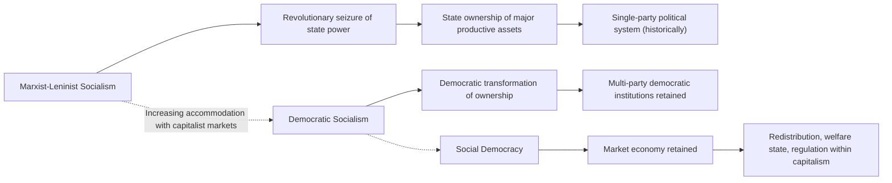

## Socialism and Democratic Socialism

### Overview

Socialism is a political and economic ideology centered on collective or social ownership and democratic control of the means of production, distribution, and exchange, developed in explicit reaction against the perceived exploitation, inequality, and instability of industrial capitalism. The tradition encompasses substantial internal diversity, ranging from revolutionary Marxist-Leninist strands to gradualist, parliamentary **democratic socialism** and the closely related but distinct tradition of **social democracy**, which retains a substantially capitalist market economy while pursuing redistributive and regulatory correction through democratic institutions.

### Foundational Diagnosis: Capitalism's Core Problems

Socialist thought, across its varied strands, converges on a shared critical diagnosis of capitalism, most systematically articulated by Karl Marx and Friedrich Engels.

**Key Points**

- **Exploitation**: capitalist profit derives from **surplus value**—the value created by workers' labor beyond what is returned to them as wages, appropriated by capital owners rather than by the workers who produced it
- **Alienation**: workers under capitalism are estranged from the products of their labor, from the labor process itself, from their own creative human potential ("species-being"), and from other workers, reduced to interchangeable sellers of labor-power in a market relation
- **Class conflict**: capitalist society is structured by an inherent antagonism between the **bourgeoisie** (owners of capital/means of production) and the **proletariat** (those who must sell their labor to survive), a conflict Marx and Engels regarded as the primary engine of historical change under capitalism
- **Systemic instability**: socialists (particularly Marxist strands) argue capitalism is prone to recurring crises of overproduction, unemployment, and instability, rooted in contradictions internal to capitalist accumulation

### Major Strands of Socialist Thought

#### Revolutionary/Marxist Socialism

Following Marx and Engels, revolutionary socialism holds that capitalism's contradictions cannot be adequately reformed through gradual, parliamentary means, but require **revolutionary transformation**—the proletariat seizing state power (potentially through a transitional "dictatorship of the proletariat") to abolish private ownership of the means of production and establish collective/social ownership, ultimately progressing toward a classless, stateless communist society.

**Key Points**

- **Leninism** (developed by Vladimir Lenin) adds the theory of the **vanguard party**: a disciplined, ideologically committed revolutionary party leading the proletariat, deemed necessary given Lenin's assessment that spontaneous working-class consciousness tends toward mere "trade-union consciousness" rather than full revolutionary class consciousness
- Later Marxist-Leninist states (Soviet Union, People's Republic of China under Mao, and others) implemented centrally planned economies with state ownership of major productive assets, single-party political systems, and varying degrees of departure from and adaptation of original Marxist theory
- **Trotskyism** (Leon Trotsky) diverged from Stalinist Soviet development, particularly regarding the theory of **"permanent revolution"** (rejecting the possibility of building "socialism in one country" in isolation) and offering a sustained internal critique of Soviet bureaucratic degeneration

#### Democratic Socialism

**Democratic socialism** holds that socialist transformation—genuine social/collective ownership and democratic control of major productive resources—should be pursued through, and remain fully compatible with, democratic political institutions: free elections, multi-party competition, civil liberties, and the rule of law, explicitly rejecting the revolutionary vanguardism and single-party rule associated with Marxist-Leninist states.

**Key Points**

- Democratic socialists typically envision a more thoroughgoing transformation of ownership structures than social democrats (see below)—genuine socialization or democratization of ownership over major productive assets—while insisting this transformation must itself occur through, and remain subject to, ongoing democratic accountability rather than revolutionary imposition
- Key historical and contemporary figures/movements include the British **Independent Labour Party** tradition, elements of the **Democratic Socialists of America (DSA)**, and various European democratic socialist parties, though the precise line between democratic socialism and more moderate social democracy is often contested and varies by context and speaker

#### Social Democracy

**Social democracy**, historically emerging substantially from the **revisionist** current within European Marxist parties (associated with Eduard Bernstein's *Evolutionary Socialism*, 1899), represents a more thoroughgoing accommodation with capitalist market economies, pursuing redistributive justice, robust welfare provision, and economic regulation *within* a fundamentally market-based economic system, rather than seeking to abolish private ownership of capital as such.

**Key Points**

- Bernstein's revisionism argued, against orthodox Marxist crisis theory, that capitalism was demonstrating greater adaptability and reformability than Marx had anticipated, and that socialists should pursue gradual, parliamentary reform (extending suffrage, labor protections, welfare provisions) rather than awaiting or fomenting revolutionary rupture
- Contemporary social democracy (exemplified by the Nordic model, and mainstream European center-left parties) is generally characterized by: robust progressive taxation, extensive public welfare provision (healthcare, education, unemployment insurance, pensions), strong labor protections and often significant trade union influence, and active macroeconomic management—while generally preserving private ownership of most productive enterprise and market-based resource allocation

### Structural Diagram: The Socialist Spectrum

### Comparative Table: Socialist Strands

| Dimension | Marxist-Leninist Socialism | Democratic Socialism | Social Democracy |
| --- | --- | --- | --- |
| Path to transformation | Revolutionary seizure of state power | Gradual, democratic transformation of ownership | Gradual reform within existing capitalist system |
| Ownership of means of production | State/collective ownership, centrally planned | Substantial socialization sought, democratically implemented | Predominantly private ownership retained |
| Political system | Historically single-party (vanguard party) | Multi-party democracy, civil liberties | Multi-party democracy, civil liberties |
| Relationship to markets | Largely replaced by central planning (historically) | Contested; varies by theorist/movement | Markets retained, regulated and taxed |
| Key figures | Marx, Lenin, Trotsky, Mao | Various; contested boundary with social democracy | Bernstein, and contemporary Nordic-model advocates |

### The Nordic Model as an Applied Case

The **Nordic model** (associated with Sweden, Denmark, Norway, Finland) is frequently cited as social democracy's most developed contemporary institutional expression, combining:

**Key Points**

- High levels of progressive taxation funding extensive universal welfare provision (healthcare, education, generous parental leave, unemployment support)
- Strong, often centralized collective bargaining arrangements between employer and labor union confederations, sometimes termed a "social partnership" or corporatist model
- Continued substantial reliance on open, competitive private markets, international trade, and private enterprise, distinguishing it clearly from centrally planned economies

**[Inference]** Whether the Nordic model constitutes an example of genuine "socialism" (as sometimes claimed in popular political discourse), a robust variant of regulated capitalism/social democracy, or a distinct hybrid category is a matter of significant definitional and political dispute; most academic political economists classify it as a highly developed social-democratic welfare capitalism rather than socialism in the sense of collective ownership of the means of production, though usage varies considerably in popular political discourse.

### Guild Socialism, Market Socialism, and Other Variants

Socialist thought encompasses several further distinct institutional models beyond the revolutionary/democratic-socialist/social-democratic spectrum:

- **Guild socialism** (early 20th-century British tradition, associated with G.D.H. Cole): emphasizes worker control of industry organized through occupational guilds, combining elements of syndicalism with parliamentary democratic institutions
- **Market socialism**: proposes combining social/collective ownership of enterprises (e.g., through worker cooperatives or public ownership) with continued reliance on market mechanisms for price-setting and resource allocation, seeking to combine socialist ownership with market efficiency—theorized variously by economists including Oskar Lange in the historical "socialist calculation debate" against Austrian economists (Mises, Hayek)
- **Anarcho-syndicalism**: emphasizes direct worker control through decentralized labor unions/syndicates, generally rejecting both centralized state ownership and parliamentary democratic gradualism in favor of direct workplace-based organization and, often, revolutionary general strikes

### The Socialist Calculation Debate

A significant historical debate within economic theory, relevant to socialism's institutional feasibility, occurred between socialist economists (notably Oskar Lange, Abba Lerner) and Austrian School economists (Ludwig von Mises, Friedrich Hayek) over whether a centrally planned economy could rationally allocate resources absent market price signals.

**Key Points**

- Mises's original 1920 argument held that without private ownership of capital goods and resulting market prices, a planned economy lacks the information needed for rational economic calculation
- Lange's response proposed a model of "market socialism" in which state-owned enterprises would operate under simulated market conditions, with central planners adjusting prices iteratively (a "trial and error" process) to approximate market-clearing equilibrium
- Hayek's later contribution shifted the critique toward the **knowledge problem**: emphasizing that the relevant economic knowledge is inherently dispersed, local, and often tacit, such that no central planning body—however sophisticated its calculation methods—could adequately aggregate and utilize it, a distinct argument from Mises's original calculation critique

**[Unverified]** The socialist calculation debate is generally regarded within mainstream economics as having significantly favored the Austrian critique regarding centrally planned economies, though the debate's implications for more decentralized market-socialist or cooperative-ownership models (which retain market price mechanisms while altering ownership structure) remain a distinct and less settled question, addressed by more recent market socialist theorizing.

### Major Critiques of Socialism

- **Incentive/information critiques** (from classical liberal/libertarian economists): centrally planned economies are argued to face severe incentive problems (absent profit-driven competition) and the knowledge/calculation problems noted above
- **Historical authoritarianism critique**: critics point to the association between historical Marxist-Leninist state implementations and severe political repression, arguing a causal or at least strong correlational link between comprehensive state ownership/planning and authoritarian political control—a claim democratic socialists explicitly contest by pointing to their rejection of vanguardist, single-party models
- **Empirical economic performance critiques**: comparative economic historians have extensively debated the relative economic performance and innovation capacity of centrally planned versus market economies, generally finding significant inefficiencies in comprehensive central planning, informing continued skepticism toward that specific institutional model even among some socialists favoring alternative (market socialist, cooperative) institutional forms

### Major Socialist Critiques of Capitalism and Rival Ideologies

- Socialists continue to argue that social democracy, while ameliorating capitalism's harshest effects, leaves the fundamental structure of capital ownership and the associated power imbalances between capital and labor substantially intact, arguing this limits the depth of achievable equality and worker empowerment absent more fundamental ownership transformation
- Democratic socialists specifically critique Marxist-Leninist historical practice for betraying core socialist commitments to democratic accountability and civil liberties, arguing genuine socialism requires, rather than merely tolerates, robust democratic institutions

### Related Topics

- Marx's theory of surplus value and exploitation
- Lenin's vanguard party theory and the theory of imperialism
- Bernstein's revisionism and the origins of social democracy
- The Nordic model and comparative welfare-state analysis
- The socialist calculation debate (Mises, Hayek, Lange)
- Market socialism and worker cooperative models
- Anarcho-syndicalism and guild socialism
- Historical materialism as socialism's underlying theoretical foundation