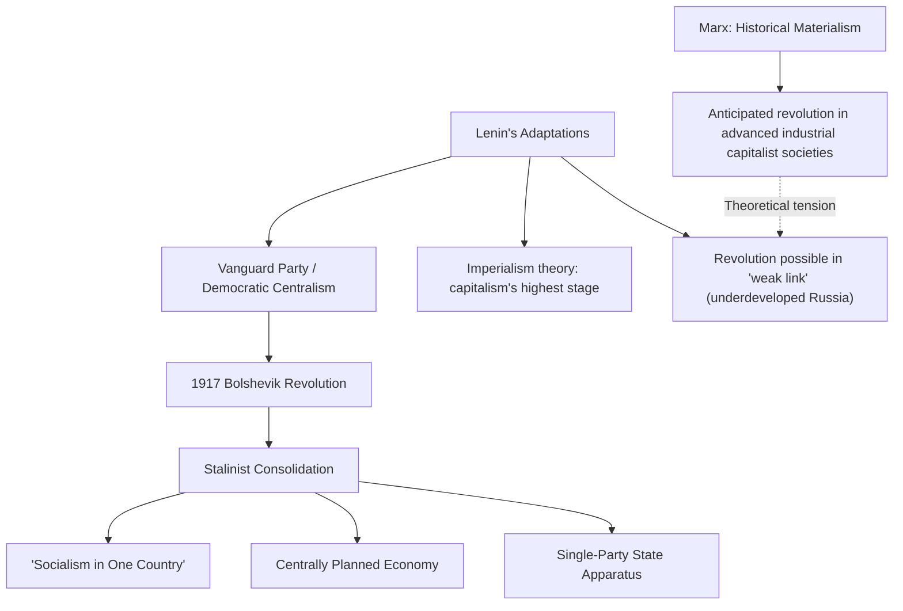

## Communism and Marxist-Leninist Thought

### Overview

Communism, as a political-theoretical endpoint, denotes a hypothesized classless, stateless society characterized by collective ownership of the means of production and the abolition of exploitative class relations. **Marxism-Leninism** denotes the specific theoretical and institutional synthesis—developed by Vladimir Lenin and later codified and modified by Joseph Stalin and subsequent Communist Party leaderships—that guided the political practice of 20th-century communist states, including the Soviet Union and, in variously adapted forms, the People's Republic of China, and other Marxist-Leninist governments. This entry addresses both Marx's original theoretical vision of communism and its substantial transformation through Leninist and Stalinist theoretical and institutional development.

### Marx's Vision of Communism

Marx and Engels offer relatively limited direct programmatic description of communist society, consistent with Marx's stated aversion to "writing recipes for the cook-shops of the future," but several core elements recur across their work.

**Key Points**

- **Abolition of private ownership of the means of production**: the *Communist Manifesto* (1848) summarizes communist theory as, in one formulation, expressible as **"the abolition of private property"**—specifically private ownership of productive capital (factories, land used for production), not personal possessions
- **Classless society**: with the abolition of private ownership of productive capital, the class antagonism between bourgeoisie and proletariat is resolved, eliminating the basis for class-based exploitation and conflict
- **Withering away of the state**: since Marx and Engels theorize the state as fundamentally an instrument of class rule, a genuinely classless society is expected to render the coercive state apparatus unnecessary, leading to its gradual "withering away" (a phrase more precisely associated with Engels's elaboration)
- **From each according to his ability, to each according to his needs**: Marx's *Critique of the Gotha Programme* (1875) distinguishes a lower-stage **socialism** (distribution according to labor contribution, retaining some inequality) from a higher-stage **communism** (distribution according to need, once productive abundance and transformed social consciousness make this feasible)

### Lenin's Theoretical Contributions

Vladimir Lenin substantially developed and adapted Marxist theory to address the specific conditions of early-20th-century Russia—a largely agrarian society lacking the fully developed industrial capitalism Marx's original framework presupposed as a precondition for proletarian revolution.

#### The Vanguard Party

Lenin's *What Is to Be Done?* (1902) argues that the working class, left to spontaneous development, tends toward mere **"trade-union consciousness"**—a focus on immediate economic grievances (wages, working conditions) rather than full revolutionary class consciousness capable of overthrowing the capitalist system as such.

**Key Points**

- Lenin argues revolutionary consciousness must be introduced to the working class **from outside**, by a disciplined **vanguard party** of professional revolutionaries possessing theoretical clarity (Marxist theory) unavailable to spontaneous working-class organization alone
- This vanguard party operates according to **democratic centralism**: internal party debate is permitted prior to decision, but once a decision is reached, all party members are bound to unified public support and implementation, without continued public dissent—a principle with significant implications for the subsequent suppression of internal political pluralism in Leninist state practice

#### Imperialism as the "Highest Stage of Capitalism"

Lenin's *Imperialism, the Highest Stage of Capitalism* (1917) extends Marxist theory to address capitalism's global expansion, arguing that advanced capitalist economies, facing declining domestic profit rates, are driven toward imperialist expansion, colonial exploitation, and inter-imperialist conflict (Lenin wrote substantially in the context of World War I) as a structural feature of capitalism's "highest," monopolistic stage—providing Marxist-Leninist theory with a framework for understanding global capitalism and anti-colonial revolutionary movements.

#### Revolution in a "Weak Link": Adapting Marxism to Russian Conditions

Since orthodox Marxist theory anticipated proletarian revolution emerging first in the most industrially advanced capitalist societies, Lenin's leadership of a successful revolution in comparatively underdeveloped, largely agrarian Russia (1917) required significant theoretical adaptation, including the argument that global capitalism's uneven development created "weak links" (like Tsarist Russia) where revolutionary rupture might occur first, even absent fully mature domestic industrial capitalism.

### Structural Diagram: From Marx to Marxism-Leninism

### Stalinist Consolidation and "Socialism in One Country"

Following Lenin's death (1924) and the subsequent power struggle (notably against Leon Trotsky), Joseph Stalin's leadership introduced significant further theoretical and institutional developments.

**Key Points**

- **"Socialism in one country"**: Stalin's doctrine that socialist construction could and should proceed within the Soviet Union alone, rather than depending on (or actively fomenting) imminent international proletarian revolution—directly opposing Trotsky's theory of **permanent revolution**, which held that socialism could not be securely established in a single, isolated state absent international revolutionary success
- **Centrally planned economy**: implementation of comprehensive state ownership of major industry and agriculture, coordinated through centralized state planning (Five-Year Plans beginning 1928), including forced agricultural collectivization
- **Single-party state apparatus**: consolidation of exclusive Communist Party political control, extensive state security apparatus, and, particularly during the Great Purge (1936–38), extensive political repression targeting perceived internal party and societal opposition

**[Inference]** Whether Stalinist practice represents a coherent, if brutal, extension of Leninist theoretical premises (particularly regarding vanguard party authority and democratic centralism) or a substantial betrayal/distortion of both Marxist and Leninist theory is a long-standing and unresolved debate within Marxist theoretical and historical scholarship, with Trotskyist and various other Marxist currents specifically arguing for the latter position.

### Trotskyism as Internal Critique

Leon Trotsky's subsequent theoretical work, developed in exile following his expulsion from the Soviet Union, offers a sustained internal Marxist critique of Stalinist development:

**Key Points**

- Trotsky's *The Revolution Betrayed* (1936) argues the Soviet Union under Stalin constituted a **"degenerated workers' state"**—retaining collectivized property relations achieved by the revolution but governed by a bureaucratic caste that had usurped genuine proletarian democratic control, rather than a genuinely socialist or communist society
- **Permanent revolution** theory holds that in economically underdeveloped countries, the bourgeois-democratic and socialist stages of revolution could and should be telescoped together, with the working class needing to press directly toward socialist transformation rather than pausing at a stable bourgeois-democratic stage, and that this transformation required international revolutionary solidarity to be secured against internal degeneration—directly opposing Stalin's "socialism in one country"

### Maoism and Adaptation to Agrarian Conditions

Mao Zedong's leadership of the Chinese Communist Party and subsequent theoretical development ("Mao Zedong Thought") represents a further significant adaptation of Marxist-Leninist theory to a predominantly agrarian, peasant-based society, in further tension with orthodox Marxist emphasis on urban industrial proletarian revolution.

**Key Points**

- Mao's theory emphasized the **peasantry**, rather than the urban industrial proletariat, as the primary revolutionary agent in conditions of a largely agrarian society—a significant theoretical departure from both orthodox Marxism and much of Leninist practice
- The **Cultural Revolution** (1966–1976) reflected Mao's theory of **continuous/permanent revolution** under socialism, holding that class struggle and the risk of capitalist restoration persist even after the initial socialist seizure of power, requiring ongoing mass ideological mobilization against emergent bureaucratic and "revisionist" tendencies within the party and society itself
- Maoist theory has substantially influenced various later revolutionary movements, particularly in agrarian developing-world contexts (various Maoist insurgent movements globally), distinct in emphasis from Soviet-derived Marxist-Leninist orthodoxy

### Comparative Table: Major Currents within Marxist-Leninist Thought

| Current | Key Distinguishing Theory | Key Figure |
| --- | --- | --- |
| Orthodox Leninism | Vanguard party, democratic centralism | Vladimir Lenin |
| Stalinism | Socialism in one country; centralized planning; single-party consolidation | Joseph Stalin |
| Trotskyism | Permanent revolution; critique of Stalinist bureaucratic degeneration | Leon Trotsky |
| Maoism | Peasant-centered revolution; continuous revolution under socialism | Mao Zedong |
| Eurocommunism (20th c.) | Rejection of Soviet-style authoritarianism; commitment to parliamentary democratic pluralism | Various Western European Communist Parties (Italy, Spain, France) |

### The State and the "Dictatorship of the Proletariat"

Marxist-Leninist theory retains Marx's concept of a transitional **"dictatorship of the proletariat"**—a period following revolutionary seizure of power during which the state, now controlled by and in the interests of the working class, actively suppresses residual bourgeois counter-revolutionary resistance and reorganizes economic relations toward socialism, prior to the eventual, more distant "withering away" of the state under full communism.

**[Inference]** Critics, including many outside the Marxist tradition and some dissenting Marxist currents themselves, argue that in practice, 20th-century Marxist-Leninist states' "dictatorship of the proletariat" evolved into durable, entrenched party-state authoritarian structures showing limited empirical movement toward the theorized eventual withering away of the state, raising significant questions about whether this transitional framework functioned as originally theorized or became a durable end-state in its own right—a matter of extensive historical and theoretical analysis rather than a settled point of consensus.

### Major Critiques of Marxism-Leninism

- **Democratic deficit critique**: critics (including democratic socialists and liberal theorists) argue vanguard-party theory and democratic centralism structurally concentrate political power in an unaccountable party elite, in tension with genuine working-class democratic self-governance, a central point of division between Marxist-Leninist and democratic socialist traditions
- **Historical human rights record**: the historical record of Marxist-Leninist states includes extensive documented political repression, including purges, forced collectivization with severe humanitarian consequences (e.g., the Soviet famine of 1932–33, the Great Leap Forward's catastrophic famine in China), and restrictions on civil liberties—facts widely documented in historical scholarship, though their precise theoretical relationship to Marxist-Leninist ideology as such (necessary consequence vs. contingent/circumstantial features) remains a matter of substantial scholarly and political debate
- **Economic performance critique**: comparative economic historians have extensively documented significant inefficiencies and eventual stagnation in centrally planned Marxist-Leninist economies relative to market economies over the latter 20th century, contributing to the analysis underlying the "socialist calculation debate"
- **Internal Marxist critiques**: various Marxist currents (Trotskyist, council communist, left-communist, and others) have offered sustained internal theoretical critiques arguing Marxist-Leninist state practice substantially departed from or betrayed core Marxist commitments to working-class self-emancipation and eventual statelessness

**[Unverified]** The relative weight that should be assigned to structural/theoretical features of Marxist-Leninist ideology versus specific historical, geopolitical, and leadership-contingent factors in explaining the authoritarian trajectory of 20th-century communist states remains an actively contested question across historical and political-theoretical scholarship, without a single settled disciplinary consensus.

### Related Topics

- Marx's historical materialism and the theory of surplus value
- Lenin's *What Is to Be Done?* and vanguard party theory
- Trotsky's theory of permanent revolution and critique of Stalinism
- Maoism and peasant-based revolutionary theory
- The socialist calculation debate (Mises, Hayek, Lange)
- Democratic socialism as a contrasting non-vanguardist tradition
- Eurocommunism and Western European communist party democratization
- Totalitarianism theory (Hannah Arendt) as a comparative analytical framework