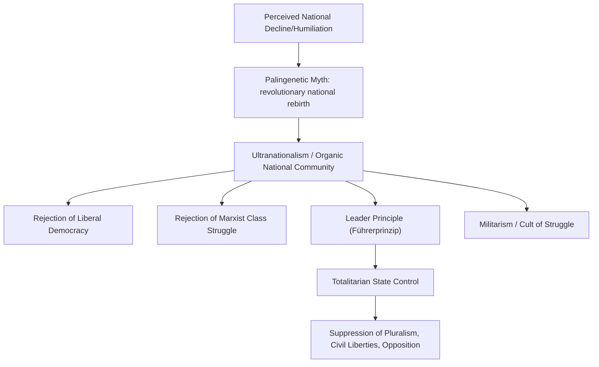

## Fascism and the Radical Right

### Overview

Fascism is a revolutionary ultranationalist political ideology that emerged in early-20th-century Europe, most prominently in Mussolini's Italy (from 1922) and Hitler's Germany (National Socialism, from 1933), characterized by totalitarian aspirations, militarism, the rejection of liberal democracy and Marxist class struggle alike, and the subordination of the individual to a mythologized, often racially or ethnically defined national or völkisch community under charismatic authoritarian leadership. This entry addresses classical fascism's core ideological features, its major historical variants, and its relationship to the broader contemporary category of the "radical right."

### The Difficulty of Definition

Fascism presents unusual definitional challenges relative to other major ideologies, since, unlike liberalism, socialism, or conservatism, it lacks a single foundational theoretical text or systematic philosophical canon comparable to Locke, Marx, or Burke, and different fascist movements (Italian Fascism, German National Socialism, and various other interwar movements) exhibited significant variation alongside core shared features.

**Key Points**

- Roger Griffin's influential scholarly definition characterizes fascism's ideological core as **"palingenetic ultranationalism"**—a revolutionary myth of national rebirth or rejuvenation (palingenesis) following a period of perceived decline, decadence, or humiliation, combined with extreme nationalist mobilization
- Fascism is frequently characterized as explicitly opposing both **liberal democracy** (viewed as decadent, individualistic, and productive of social fragmentation and weakness) and **Marxist socialism/communism** (viewed as promoting divisive class conflict rather than unified national community), positioning itself as a rejected "third way" transcending the left-right, capitalism-socialism divide as conventionally understood
- Umberto Eco's influential essay **"Ur-Fascism"** (1995) proposes a list of recurring family-resemblance features across fascist movements rather than a single strict definitional formula, given the ideology's syncretic, often internally inconsistent character

### Core Ideological Features

**Key Points**

- **Ultranationalism and the organic nation**: the nation (or, in Nazi ideology, the racially defined *Volk*) is conceived as an organic, unified whole with a collective destiny, transcending and subordinating individual interests, class divisions, and regional or political factionalism
- **Rejection of liberal individualism and parliamentary democracy**: fascism explicitly rejects liberal constraints on state power, individual rights as trumps against collective national interest, and pluralistic parliamentary competition, favoring instead unified, hierarchical, often single-party authoritarian rule
- **The leader principle (*Führerprinzip*)**: concentration of authority in a singular, charismatic leader claiming to embody and directly express the will of the nation/people, bypassing institutional checks and deliberative political processes
- **Militarism and the cult of violence/struggle**: fascism frequently glorifies struggle, war, and violence not merely as instrumentally necessary but as intrinsically regenerative and character-forming, reflecting influence from Social Darwinist and vitalist philosophical currents
- **Palingenetic mythology**: a narrative of national decline, humiliation, or decadence (frequently invoking specific historical grievances—Germany's Treaty of Versailles humiliation; Italy's "mutilated victory" after WWI) to be overcome through revolutionary national rebirth under the movement's leadership
- **Totalitarian aspiration**: fascist regimes characteristically sought extensive control over public and private life—education, culture, media, economic organization, family life—well beyond the more limited scope of traditional authoritarian regimes, aiming at the comprehensive ideological transformation of society and the individual

### Italian Fascism: Mussolini and the Corporate State

Benito Mussolini's Italian Fascist movement (National Fascist Party, ruling 1922–1943) provides fascism's namesake and, in important respects, its founding institutional model.

**Key Points**

- The **corporate state** (*stato corporativo*) proposed organizing economic and social life through state-supervised "corporations" representing employers and workers within each industry, ostensibly transcending class conflict through hierarchical, state-mediated cooperation—in practice, subordinating organized labor to state and business interests under fascist party control
- Mussolini's *The Doctrine of Fascism* (1932, largely ghostwritten with philosopher Giovanni Gentile) articulates fascism's totalitarian aspiration: **"Everything within the state, nothing outside the state, nothing against the state"**—an explicit rejection of liberal limitations on state authority
- Italian Fascism initially placed comparatively less emphasis on biological racial ideology than German National Socialism, though the regime later adopted increasingly explicit racial and antisemitic policies, particularly following closer alignment with Nazi Germany from the late 1930s

### German National Socialism: Racial Ideology and Totalitarian Extremity

Adolf Hitler's National Socialist German Workers' Party (NSDAP), ruling Germany 1933–1945, represents fascism's most extreme historical realization, distinguished significantly by its foundational and systematically genocidal racial ideology.

**Key Points**

- **Racial antisemitism** and a pseudo-scientific racial hierarchy (positing an "Aryan" racial community, the *Volksgemeinschaft*, as biologically and culturally superior) formed the ideological core of Nazi doctrine to a degree without direct parallel in Italian Fascism, culminating in the systematic genocide of the Holocaust
- **Lebensraum** ("living space") ideology combined racial ideology with expansionist territorial ambition, providing ideological justification for German eastward military expansion and the subjugation, displacement, and extermination of populations deemed racially inferior within conquered territories
- Nazi totalitarianism extended state and party control extensively into cultural, educational, scientific, and private social life, employing extensive propaganda (under Joseph Goebbels), a pervasive internal security and terror apparatus (the Gestapo, SS), and eventually the administrative machinery of industrialized genocide

### Structural Diagram: Core Ideological Architecture of Fascism

### Comparative Table: Fascism vs. Adjacent Authoritarian/Ideological Categories

| Dimension | Fascism | Traditional Authoritarianism | Communism (Marxist-Leninist) |
| --- | --- | --- | --- |
| Scope of state control | Totalitarian; comprehensive social/cultural transformation sought | Often limited to political control; less totalizing social ambition | Totalitarian; comprehensive economic/social transformation sought |
| Core mobilizing category | Nation/race | Order, stability, existing hierarchy | Class |
| View of the individual | Subordinated to national/racial collective | Subordinated to established order/authority | Subordinated to class interest/party |
| View of tradition | Selectively mythologized; revolutionary rather than restorationist | Generally more genuinely preservationist | Rejected in favor of revolutionary transformation |
| Economic organization | State-supervised capitalism (corporatism); varies by movement | Varies significantly | Centrally planned; collectivized ownership |

### Theoretical Frameworks for Analyzing Fascism

- **Hannah Arendt's *The Origins of Totalitarianism* (1951)** analyzes fascism (alongside Stalinism) within a broader category of **totalitarianism**, emphasizing totalitarian movements' reliance on atomized, isolated masses, ideological ("scientific"-seeming but ultimately fictive) worldviews providing total explanatory frameworks, and pervasive terror as a systemic tool of rule extending beyond mere instrumental repression
- **Marxist analyses** (various, including contemporaneous analyses by Trotsky and later theorists) tend to interpret fascism as a crisis response of capitalism, mobilized by threatened capitalist and petite-bourgeois class interests against the threat of proletarian revolution, using nationalist mass mobilization to defuse class conflict while preserving underlying capitalist property relations—a characterization contested by non-Marxist historians as insufficiently attentive to fascism's distinct ideological and mobilizational features
- **Roger Griffin's "new consensus"** in fascism studies (developed from the 1990s) emphasizes fascism's genuinely revolutionary, modernist, and mythic character (rather than treating it as merely reactive/reactionary or a simple tool of capitalist class interest), centering the palingenetic ultranationalist mythology as fascism's ideological core

### The Contemporary "Radical Right"

Contemporary political science generally distinguishes **historical fascism** (as a specific interwar phenomenon with the totalitarian, genocidal features described above) from the broader, more heterogeneous contemporary category of the **radical right** or **populist radical right**, associated particularly with the work of Cas Mudde.

**Key Points**

- Mudde's influential framework characterizes the contemporary **populist radical right** by three core features: **nativism** (a combination of nationalism and xenophobia, holding that states should be inhabited exclusively by members of the native group, with non-native elements considered fundamentally threatening), **authoritarianism** (a belief in a strictly ordered society with severe punishment for violations of that order), and **populism** (framing politics as a moral struggle between "the pure people" and "the corrupt elite")
- Crucially, most scholars distinguish contemporary populist radical right parties (which generally operate within, rather than seeking to overthrow, democratic constitutional structures, and typically reject fascism's totalitarian, single-party, and paramilitary features) from historical fascism proper, while acknowledging ideological lineages, rhetorical continuities, and points of historical and organizational overlap in specific cases
- A smaller, more explicitly self-identified **"extreme right"** or neo-fascist category, distinguished from the broader populist radical right by its explicit rejection of democratic constitutionalism itself (rather than working through, if straining against, existing democratic institutions), is generally treated as a more direct ideological successor to historical fascism

**[Inference]** The precise scholarly boundary between "populist radical right" (operating within democratic norms, per Mudde's framework) and movements more accurately termed neo-fascist or extreme-right (rejecting democratic constitutionalism) is actively and sometimes sharply contested in the fascism/radical-right studies literature, particularly regarding specific contemporary parties and movements, and application of these labels to specific contemporary political actors remains a matter of scholarly and political dispute rather than settled classification.

### Major Debates in Fascism Studies

- **Generic fascism vs. national particularism**: scholars debate whether "fascism" constitutes a coherent generic ideological category applicable across national contexts (Italian, German, and various smaller interwar movements) or whether national variations (particularly the centrality of racial antisemitism to Nazism specifically) are significant enough to caution against overly generalized "generic fascism" frameworks
- **Left-right classification debates**: while fascism is conventionally classified as a phenomenon of the political right, given its ultranationalism, hierarchy, and violent anti-communism, some scholars have noted fascism's syncretic borrowing from revolutionary syndicalist and even socialist rhetorical and organizational forms (particularly in its early Italian formation), complicating simple left-right placement—though the overwhelming scholarly consensus continues to situate fascism firmly within the radical right due to its ultranationalism, racial hierarchy, and anti-egalitarian core commitments
- **Explanatory debates**: extensive historical and social-scientific debate continues regarding the relative explanatory weight of economic crisis (Great Depression-era conditions), specific national historical grievances (Versailles Treaty resentment in Germany), institutional weaknesses of interwar democratic institutions, and ideological/cultural factors in explaining fascism's rise to power in specific national contexts

**[Unverified]** The relative causal weight of economic, institutional, and ideological/cultural factors in explaining fascism's specific historical emergence and successes remains a matter of ongoing, multi-causal historical debate rather than a matter with a single, settled monocausal scholarly explanation.

### Related Topics

- Mussolini's *The Doctrine of Fascism* and Italian corporatism
- Nazi racial ideology and the Holocaust
- Arendt's *The Origins of Totalitarianism*
- Roger Griffin's "palingenetic ultranationalism" framework
- Cas Mudde's populist radical right typology
- Comparative totalitarianism: fascism vs. Marxist-Leninist communism
- Social Darwinism and vitalist philosophy's influence on fascist ideology
- Contemporary right-wing populism and democratic backsliding studies