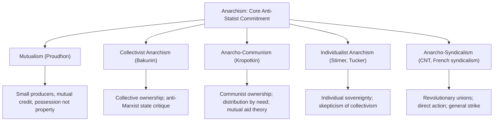

## Anarchism

### Overview

Anarchism is a political ideology and tradition holding that the state, as an inherently coercive and hierarchical institution, is illegitimate and should be abolished, along with other forms of unjustified hierarchy and domination (capitalist property relations, in most anarchist strands), in favor of voluntary, non-hierarchical forms of social organization based on free association, mutual aid, and direct democratic or consensus-based decision-making. Anarchism encompasses substantial internal diversity—ranging from individualist to communist variants—united primarily by rejection of the state's claimed legitimacy and a broader critique of hierarchical domination as such.

### Core Theoretical Commitments

**Key Points**

- **Anti-statism**: anarchists hold that the state's claimed monopoly on legitimate violence (in Weberian terms) and its hierarchical, coercive structure make it inherently illegitimate, regardless of its particular form (monarchical, democratic, or otherwise)—distinguishing anarchism from ideologies (including most socialist and liberal traditions) that seek to reform, capture, or democratically legitimate state power rather than abolish it outright
- **Critique of unjustified hierarchy**: while opposition to the state is anarchism's most defining feature, most anarchist theorists extend the critique to hierarchy and domination more broadly, including (in most strands) capitalist property and wage-labor relations, and (in many contemporary strands) other systems of domination including patriarchy and racial hierarchy
- **Voluntary association and mutual aid**: anarchists propose replacing coercive hierarchical institutions with voluntary cooperative arrangements—federated communes, worker cooperatives, mutual aid networks—coordinated through direct democratic or consensus-based decision-making rather than centralized authority
- **Prefigurative politics**: many anarchist traditions emphasize that political means must be consistent with desired ends—organizing and acting in ways that already embody the non-hierarchical, voluntary relations sought, rather than employing hierarchical or authoritarian means (including, notably, a centralized revolutionary vanguard party) even toward ostensibly liberatory goals

### Major Historical Strands

#### Proudhon and Mutualism

Pierre-Joseph Proudhon (1809–1865), the first self-described anarchist, is best known for his declaration in *What Is Property?* (1840):

> "Property is theft" (*La propriété, c'est le vol*).

**Key Points**

- Proudhon's critique targets specifically **property as a source of unearned income** (rent, interest, profit extracted without corresponding labor)—he distinguished this from **possession**, the legitimate right of individuals to control and use property through their own labor, which he did not oppose
- His constructive alternative, **mutualism**, envisioned a decentralized economy of small producers, worker cooperatives, and mutual credit associations (eliminating interest-bearing finance capital), coordinated through voluntary contract and federation rather than state direction or capitalist ownership concentration
- Proudhon's federalism—organizing society through voluntary, bottom-up federated associations rather than centralized authority—significantly influenced later anarchist organizational theory

#### Bakunin and Collectivist Anarchism

Mikhail Bakunin (1814–1876) developed **collectivist anarchism**, emphasizing collective (rather than purely individual) ownership of the means of production, and is historically significant for his sustained theoretical and organizational conflict with Marx within the First International (International Workingmen's Association).

**Key Points**

- Bakunin's central critique of Marx targeted the concept of a transitional **"dictatorship of the proletariat"** and the broader Marxist strategy of seizing and using state power (even temporarily) to achieve socialist transformation—Bakunin argued any such state apparatus, regardless of its proletarian or revolutionary origin, would inevitably generate a new ruling bureaucratic class, reproducing rather than eliminating domination
- Bakunin's famous prediction, made in explicit anticipation of what later Marxist-Leninist state practice would produce, warned that Marxist state-centered revolutionary strategy would result not in working-class liberation but in a new form of authoritarian rule by a party-bureaucratic elite claiming to act in the proletariat's name
- The Bakunin-Marx conflict resulted in the definitive organizational split of the First International (1872) and represents the foundational historical and theoretical division between anarchist and Marxist revolutionary socialist traditions

#### Kropotkin and Anarcho-Communism

Peter Kropotkin (1842–1921) developed **anarcho-communism**, synthesizing anarchist anti-statism with communist economic organization—advocating both the abolition of the state and of private property in the means of production, replaced by voluntary collective ownership and distribution according to need.

**Key Points**

- Kropotkin's *Mutual Aid: A Factor of Evolution* (1902) offers a biological and sociological argument, developed partly in explicit response to Social Darwinist interpretations of evolutionary theory, that cooperation and mutual aid, rather than purely competitive struggle, constitute a major and underappreciated evolutionary and social survival strategy across species and human societies—providing anarcho-communism with a naturalistic foundation for voluntary cooperative social organization
- Kropotkin's *The Conquest of Bread* (1892) offers a detailed constructive vision of anarcho-communist economic organization, emphasizing decentralized, federated production and free distribution according to need, organized through voluntary associations rather than centralized state planning or market exchange

#### Individualist Anarchism

A distinct strand, particularly influential in the American context (associated with figures like Benjamin Tucker and, more idiosyncratically, Max Stirner), emphasizes individual sovereignty and self-ownership as anarchism's foundational value, generally more skeptical of collectivist economic arrangements than Bakunin or Kropotkin's traditions.

**Key Points**

- Max Stirner's *The Ego and Its Own* (1844) offers an extreme individualist philosophical position, rejecting not only the state but all abstract collective claims on the individual (including nation, humanity, morality, and even revolutionary movements) as "spooks"—illegitimate abstractions demanding self-sacrifice from the sovereign individual ego
- Benjamin Tucker's individualist anarchism combined anti-statism with support for markets and property rights (distinguished from Proudhonian mutualism partly by degree and emphasis), representing an important historical precursor and point of theoretical contact with later anarcho-capitalist thought, though most contemporary anarchist traditions (which generally retain anti-capitalist commitments) do not regard anarcho-capitalism as belonging within the anarchist tradition proper—a definitional dispute addressed further below

#### Anarcho-Syndicalism

**Anarcho-syndicalism** emphasizes revolutionary trade unions (syndicates) as anarchism's primary organizational and strategic vehicle, seeking to build worker power through direct workplace organizing, culminating in a revolutionary general strike that would seize direct worker control of production, bypassing both state power and capitalist ownership simultaneously.

**Key Points**

- Historically significant in early-20th-century labor movements, particularly in France (the *Confédération Générale du Travail*) and, most prominently, Spain (the CNT, *Confederación Nacional del Trabajo*), which played a major organizational role during the Spanish Civil War (1936–39), implementing large-scale anarchist collectivization of industry and agriculture in Republican-controlled territories, particularly in Catalonia and Aragon
- Anarcho-syndicalism emphasizes **direct action** (strikes, sabotage, direct workplace organizing) over parliamentary or electoral political strategy, consistent with broader anarchist skepticism toward state-oriented political engagement

### Structural Diagram: Major Anarchist Strands

### Comparative Table: Anarchism vs. Marxism on the State

| Dimension | Anarchism | Marxism (orthodox/Leninist) |
| --- | --- | --- |
| View of the state | Inherently illegitimate; abolish immediately/directly | Instrument of class rule; seize and use transitionally ("dictatorship of the proletariat") |
| Revolutionary strategy | Direct action, prefigurative organizing, avoid state capture | Seize state power via revolutionary party, then transform society |
| Risk anticipated by critics of the other position | Marxist state-capture reproduces bureaucratic domination (Bakunin's critique) | Anarchist rejection of transitional state leaves counter-revolution unchecked (Marxist/Leninist critique) |
| View of hierarchy | Opposes hierarchy and domination broadly (state, capital, and often other structures) | Primary focus on class-based economic domination |
| Organizational model | Federated, decentralized, voluntary association | Centralized vanguard party, democratic centralism |

### The Anarcho-Capitalism Definitional Dispute

**Anarcho-capitalism**, associated particularly with Murray Rothbard, proposes the abolition of the state in favor of a stateless society coordinated entirely through private property rights, voluntary market exchange, and privately contracted security/legal services—combining anarchism's anti-statism with robust free-market capitalist economic organization.

**[Inference]** Whether anarcho-capitalism should be classified within the broader anarchist tradition is a matter of significant and largely unresolved dispute: most self-identified anarchists within the historical mutualist, collectivist, communist, and syndicalist traditions argue anarchism's core commitment extends beyond anti-statism to encompass opposition to capitalist property and wage-labor relations as themselves a form of illegitimate hierarchy, and thus regard anarcho-capitalism as a distinct (some argue incompatible) tradition sharing only the anti-statist component; anarcho-capitalists and some libertarian theorists dispute this exclusion, arguing consistent opposition to coercive hierarchy logically extends only to the state's specifically coercive, non-consensual character, not to voluntary market and property relations.

### Anarchist Praxis: Historical Applications

**Key Points**

- The **Spanish Revolution** (1936–1939), particularly in Catalonia and Aragon, represents anarchism's most significant historical large-scale practical implementation, with CNT-organized worker and peasant collectives managing significant portions of industrial and agricultural production during the Spanish Civil War, before ultimately being suppressed by both Francoist forces and, in some cases, by internal conflict with Communist Party-aligned Republican factions
- The **Paris Commune** (1871), while not exclusively anarchist in composition or ideology, is frequently invoked across both anarchist and Marxist traditions (with differing interpretive emphases) as an important historical example of decentralized, participatory revolutionary self-governance
- Contemporary anarchist-influenced organizing has significantly informed various social movements, including elements of the **Zapatista movement** in Chiapas, Mexico, various **anti-globalization** movement organizing (notably around the 1999 Seattle WTO protests), and elements of contemporary **mutual aid** networks and cooperative economic organizing

### Major Critiques of Anarchism

- **Coordination/scale critique**: critics (from Marxist, liberal, and other perspectives) question whether purely voluntary, decentralized, non-hierarchical organization can effectively coordinate complex modern economic and social systems (infrastructure, large-scale production, defense) without some form of centralized authority, particularly at scale beyond small communities
- **Marxist critique of anarchist strategy**: as noted above, Marxist theorists (following Marx and Lenin's own critiques of Bakunin) argue anarchism's rejection of any transitional revolutionary state leaves a revolutionary movement structurally vulnerable to counter-revolutionary reversal, lacking the coordinated coercive capacity Marxists argue is necessary to defend revolutionary gains
- **Human nature/incentive critique** (from conservative and some liberal perspectives): critics question whether voluntary cooperation and mutual aid can reliably substitute for coercive enforcement mechanisms in managing free-rider problems, conflict resolution, and defense against external aggression
- **Historical scale limitation**: critics note that anarchism's most significant historical practical implementations (Spanish collectives, Paris Commune) were relatively short-lived and localized, raising empirical questions—contested by anarchist theorists and historians—about longer-term viability at larger scale, though anarchist theorists and sympathetic historians often attribute these episodes' failure primarily to external military suppression rather than internal organizational failure

**[Unverified]** Whether the historical brevity of large-scale anarchist social experiments primarily reflects external suppression (as anarchist historians generally emphasize) or genuine internal coordination/scaling limitations (as critics often argue) remains a matter of substantial historical and theoretical dispute rather than a settled empirical conclusion.

### Related Topics

- Proudhon's *What Is Property?* and mutualist economic theory
- The Bakunin-Marx conflict and the split of the First International
- Kropotkin's *Mutual Aid* and cooperative evolutionary theory
- The Spanish Revolution and CNT worker collectivization (1936–39)
- Anarcho-syndicalism and revolutionary trade unionism
- The anarcho-capitalism definitional dispute (Rothbard and libertarian theory)
- Prefigurative politics and contemporary mutual aid organizing
- Marxist-Leninist vanguard party theory as anarchism's principal historical rival strategy