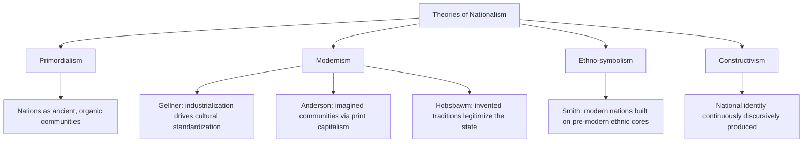

## Nationalism as Ideology

### Definition and Conceptual Overview

Nationalism is a political ideology and mass sentiment centered on the belief that the nation — a community of people bound by shared culture, language, history, ethnicity, or territory — constitutes the primary unit of political legitimacy and loyalty. It holds that each nation has the right to self-determination, typically expressed through the possession or pursuit of a sovereign state whose boundaries coincide with the boundaries of the nation.

Unlike thicker ideologies such as liberalism or socialism, nationalism is often described as a "thin-centered" ideology: it provides a core claim (the nation should govern itself) but attaches to other belief systems (liberal nationalism, socialist nationalism, ethnic nationalism, fascist nationalism) to generate a full political program.

**Key Points**

- The nation is treated as the fundamental source of political authority, above class, religion, or supranational bodies.
- Nationalism asserts a fit between political unit (the state) and cultural unit (the nation) — this is sometimes called the "nationalist principle" (Gellner).
- It functions simultaneously as an ideology, a form of identity, and a mobilizing sentiment.

### Historical Development

**Origins (Late 18th–19th Century)**

Nationalism emerged as a coherent political force during the Enlightenment and crystallized through the French Revolution (1789), which reconceived sovereignty as residing in the "nation" rather than the monarch. The Napoleonic Wars spread nationalist sentiment across Europe both by exporting revolutionary ideas and by provoking resistance nationalisms (notably in German-speaking and Spanish territories).

**Unification Movements (19th Century)**

The unification of Italy (Risorgimento, completed 1861–1871) and Germany (1871 under Bismarck) exemplified state-seeking nationalism, where political unification followed claims of pre-existing cultural nationhood.

**Age of Empire and Self-Determination (1900s–1945)**

Woodrow Wilson's Fourteen Points (1918) elevated "national self-determination" to an international principle, accelerating the collapse of the Austro-Hungarian and Ottoman empires and the creation of new nation-states in Central and Eastern Europe. This period also saw nationalism's darker mutation into ultranationalism and fascism in Italy and Germany, where the nation was fused with racial and expansionist doctrine.

**Decolonization (1945–1970s)**

Anti-colonial nationalism became the dominant vehicle for independence movements across Africa, Asia, and the Middle East, drawing on both Wilsonian self-determination and Marxist-inflected anti-imperialism.

**Post-Cold War Resurgence**

The collapse of the Soviet Union and Yugoslavia (1989–1992) triggered a wave of ethnic nationalism and secessionist conflict. Since the 2010s, scholars have noted a further resurgence tied to globalization backlash, immigration politics, and populist movements in established democracies.

### Theoretical Foundations

Political science offers competing accounts of what a "nation" is and why nationalism arises:

**Primordialism**

Holds that nations are ancient, natural, quasi-organic communities rooted in shared ancestry, language, or ethnicity that predate the modern state. Associated with early 20th-century thinkers and criticized by modernists as essentialist.

**Modernism**

Argues nations and nationalism are products of modernity — industrialization, print capitalism, mass education, and state bureaucracy — rather than ancient survivals.

- *Ernest Gellner*: Nationalism is generated by the functional needs of industrial society for a standardized, literate workforce sharing one culture.
- *Benedict Anderson*: Nations are "imagined communities" — constructed through print capitalism, which allowed large populations to conceive of themselves as a shared community despite never meeting.
- *Eric Hobsbawm*: Nations rely on "invented traditions" — deliberately constructed rituals and symbols presented as ancient to legitimize modern political arrangements.

**Ethno-symbolism**

Associated with *Anthony D. Smith*, this approach bridges primordialism and modernism, arguing that modern nations are built upon pre-existing ethnic cores ("ethnies") — their myths, symbols, and memories — even though the nation-state itself is a modern construct.

**Constructivism**

Emphasizes that national identity is continuously constructed and reconstructed through discourse, education, and political mobilization rather than fixed at any single origin point.

### Typologies of Nationalism

**Civic Nationalism**

Membership in the nation is defined by shared citizenship, political values, and voluntary allegiance to state institutions rather than ancestry. Often associated with the French Republican model and liberal-democratic states.

**Ethnic Nationalism**

Membership is defined by descent, language, or ethnicity, often exclusionary toward those outside the ethnic in-group even if they hold citizenship. Associated with much of Central and Eastern European nationalism.

**State-Seeking (Secessionist) Nationalism**

A nation without its own state seeks to create one, typically through separation from an existing state (e.g., Kurdish nationalism, Catalan independence movements).

**State-Framed (Nation-Building) Nationalism**

An existing state seeks to construct or reinforce a shared national identity among its population, often through education systems, national symbols, and shared narratives (e.g., post-colonial nation-building in Africa and Asia).

**Liberal Nationalism**

Reconciles nationalism with liberal-democratic values, holding that national self-determination is compatible with — and can support — individual rights, pluralism, and democratic governance. Associated with theorists like Yael Tamir and David Miller.

**Integral / Ultranationalism**

Subordinates the individual entirely to the nation, often glorifying national struggle, purity, and expansion; historically linked to fascist movements.

**Diaspora / Long-Distance Nationalism**

National identification and political engagement maintained by populations living outside the nation's territorial homeland, often facilitated by digital communication.

**Example**

A state-seeking movement (Scottish independence within the UK) differs from a state-framed project (India's post-1947 efforts to build a shared civic identity across linguistic and religious diversity) in that the former seeks a *new* sovereign boundary while the latter seeks to consolidate loyalty *within* an existing one.

### Core Components and Mechanisms

**Shared Symbols and Rituals**

Flags, anthems, national holidays, and monuments function to make an abstract community emotionally tangible — consistent with Anderson's "imagined community" thesis.

**National Historical Narrative**

A curated (and often selectively remembered or forgotten) shared history — Ernest Renan's 1882 formulation held that a nation is as much defined by collective forgetting as collective memory.

**Language and Education**

Standardized national language taught through mass public education is frequently identified (especially by Gellner) as the key mechanism binding populations into a shared cultural-political unit.

**Print and Mass Media**

Newspapers, and later broadcast and digital media, allow dispersed populations to simultaneously consume the same content, reinforcing a sense of synchronized, shared national experience.

**The "Other"**

Nationalist identity is frequently constructed relationally, defining the in-group partly through contrast with an external or internal "other" (rival states, minority groups, immigrants).

### Nationalism's Relationship to the State System

Nationalism is closely tied to the Westphalian nation-state model, in which sovereignty is territorially bounded and (ideally) congruent with a national community. Key related concepts:

- **Self-determination**: the principle, codified in the UN Charter (Article 1) and international law, that peoples have the right to determine their own political status.
- **Sovereignty**: nationalism typically demands that the nation exercise supreme authority within its territory, free from external interference.
- **Irredentism**: nationalist claims to territory outside current state boundaries on the grounds that it is inhabited by co-nationals or was historically part of the nation.
- **Secession**: nationalist movements within multi-national states often pursue formal separation when self-determination is denied through other means.

### Nationalism in Comparative and International Politics

**Domestic Politics**

Nationalism shapes party systems (nativist/nationalist parties), citizenship law (jus soli vs. jus sanguinis), immigration policy, and minority rights frameworks.

**International Relations**

Realist IR theory treats nationalism as a key driver of state behavior, reinforcing sovereignty norms and shaping conflict over contested territories. Nationalism is also implicated in:

- Arms races and security dilemmas when rival nationalisms perceive existential threats
- Alliance formation along ethnic/national lines
- Resistance to supranational integration (e.g., debates over EU sovereignty pooling)

**Populism and Nationalism**

Contemporary "national populism" combines nationalist appeals to sovereignty and cultural homogeneity with populist anti-elite rhetoric, a combination widely studied in relation to Brexit, and nationalist-populist parties across Europe, Asia, and the Americas. [Inference: the precise causal weight of economic vs. cultural drivers behind this resurgence remains actively debated among political scientists.]

### Critiques and Debates

**Liberal-Cosmopolitan Critique**

Critics (e.g., Martha Nussbaum) argue nationalism cultivates parochial loyalty that can undermine universal human rights commitments and global cooperation on issues like climate change and migration.

**Marxist Critique**

Classical Marxism viewed nationalism as a "false consciousness" that divides the international working class along national lines, obscuring shared class interests — though later Marxist thinkers (e.g., in anti-colonial contexts) adapted nationalism as a legitimate tool against imperialism.

**Feminist Critique**

Scholars such as Nira Yuval-Davis have examined how nationalist projects often instrumentalize women as biological and cultural reproducers of the nation, embedding gendered hierarchies into national identity.

**Postcolonial Critique**

Postcolonial theorists note that anti-colonial nationalism, while liberatory, often reproduced exclusionary logics (based on ethnicity, religion, or caste) within the newly independent state.

**Civic-Ethnic Distinction Debate**

Some scholars (e.g., Rogers Brubaker) argue the civic/ethnic dichotomy is too clean in practice, since most "civic" nationalisms retain ethnocultural undertones and vice versa. [Inference: this critique is influential but not universally accepted as displacing the civic/ethnic typology in comparative teaching.]

### Illustrative Diagram: Nationalism's Conceptual Structure

<svg xmlns="http://www.w3.org/2000/svg" viewBox="0 0 800 460" font-family="sans-serif">
<text x="400" y="30" text-anchor="middle" font-size="18" font-weight="bold" fill="#1a1a2e">Structure of Nationalist Ideology (svg_diagram)</text>
<circle cx="400" cy="230" r="80" fill="#3a5a9c" opacity="0.9" />
<text x="400" y="225" text-anchor="middle" font-size="16" fill="white" font-weight="bold">THE NATION</text>
<text x="400" y="245" text-anchor="middle" font-size="12" fill="white">(core political unit)</text>
<circle cx="180" cy="120" r="65" fill="#8c4a9c" opacity="0.85" />
<text x="180" y="115" text-anchor="middle" font-size="12" fill="white" font-weight="bold">Self-</text>
<text x="180" y="130" text-anchor="middle" font-size="12" fill="white" font-weight="bold">Determination</text>
<circle cx="620" cy="120" r="65" fill="#c9622a" opacity="0.85" />
<text x="620" y="115" text-anchor="middle" font-size="12" fill="white" font-weight="bold">Shared</text>
<text x="620" y="130" text-anchor="middle" font-size="12" fill="white" font-weight="bold">Symbols</text>
<circle cx="180" cy="350" r="65" fill="#2a8c6e" opacity="0.85" />
<text x="180" y="345" text-anchor="middle" font-size="12" fill="white" font-weight="bold">Cultural /</text>
<text x="180" y="360" text-anchor="middle" font-size="12" fill="white" font-weight="bold">Ethnic Bond</text>
<circle cx="620" cy="350" r="65" fill="#9c2a4a" opacity="0.85" />
<text x="620" y="345" text-anchor="middle" font-size="12" fill="white" font-weight="bold">Sovereignty /</text>
<text x="620" y="360" text-anchor="middle" font-size="12" fill="white" font-weight="bold">Statehood</text>
<line x1="330" y1="180" x2="240" y2="150" stroke="#555" stroke-width="2" />
<line x1="470" y1="180" x2="560" y2="150" stroke="#555" stroke-width="2" />
<line x1="330" y1="280" x2="240" y2="320" stroke="#555" stroke-width="2" />
<line x1="470" y1="280" x2="560" y2="320" stroke="#555" stroke-width="2" />
</svg>

### Contemporary Case Illustrations

**Civic Model — India**

India's post-independence nationalism explicitly rejected a single ethnic or religious basis for nationhood, instead constructing a civic-constitutional identity accommodating linguistic and religious pluralism through federalism.

**Ethnic Model — Historical German Nationalism**

19th and early 20th century German nationalism drew heavily on shared language and descent (*Volk*) as the basis of national membership, a framework later distorted to catastrophic ends under National Socialism.

**Secessionist Nationalism — Catalonia**

The Catalan independence movement illustrates state-seeking nationalism operating within an established liberal democracy (Spain), pursuing self-determination through referenda and political mobilization rather than armed conflict.

**Diaspora Nationalism — Digital Mobilization**

Diaspora communities increasingly use social media to sustain long-distance nationalist engagement with homeland politics, a phenomenon that has intensified political science interest in transnational nationalism since the 2010s.

### Related Topics

- Liberalism as Ideology
- Fascism and Ultranationalism
- Self-Determination and International Law
- Ethnic Conflict and Secessionist Movements
- Populism and Its Relationship to Nationalism
- Imagined Communities (Benedict Anderson)
- Post-Colonial State-Building
- Sovereignty in International Relations Theory
- Citizenship Models: Jus Soli vs. Jus Sanguinis
- Globalization and Nationalist Backlash