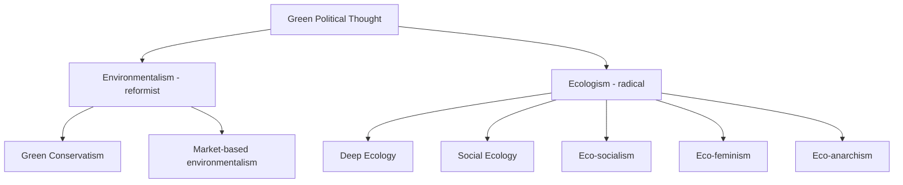

## Environmentalism and Green Political Thought

### Definition and Conceptual Overview

Environmentalism and Green political thought constitute an ideological family centered on the claim that ecological sustainability and the relationship between human society and the natural world should be a — or *the* — organizing principle of political life. Where classical ideologies (liberalism, socialism, conservatism) largely take continuous economic growth and human primacy over nature as given, Green political thought challenges these assumptions, arguing that ecological limits impose constraints on political and economic organization that existing ideologies inadequately address.

**Key Points**

- Green thought is often described as a "new" ideology (post-1970s) distinct from the traditional left-right spectrum, though it overlaps significantly with socialism, anarchism, and (less commonly) conservatism.
- It spans a spectrum from reformist "light green" positions (managing environmental problems within existing capitalist/liberal-democratic structures) to radical "dark green" positions (requiring fundamental transformation of political-economic systems).
- Central concepts include sustainability, intergenerational justice, ecological limits, and the intrinsic value of non-human nature.

### Historical Development

**Precursors (19th–early 20th Century)**

Romanticism (Wordsworth, Thoreau) cultivated reverence for nature as a reaction against industrialization. Early conservation movements (John Muir, the founding of national parks) established the idea of nature as worthy of protection, though largely on aesthetic or utilitarian grounds rather than ideological ones.

**Emergence of Modern Environmentalism (1960s–1970s)**

Rachel Carson's *Silent Spring* (1962) is widely credited with catalyzing modern environmental consciousness by documenting the ecological harms of pesticides. The Club of Rome's *Limits to Growth* report (1972) introduced systems-modeling arguments that continuous economic and population growth would collide with finite resource limits, providing an intellectual foundation for later Green political claims. The first UN Conference on the Human Environment (Stockholm, 1972) marked environmentalism's entry into formal international politics.

**Institutionalization and Green Parties (1970s–1990s)**

Green parties formed across Western democracies, beginning with the Values Party in New Zealand (1972) and followed prominently by Die Grünen in West Germany (founded 1980), which became the most electorally successful early Green party and helped define the "four pillars" platform (ecology, social justice, grassroots democracy, nonviolence). The Brundtland Report (1987) introduced the widely cited definition of sustainable development as development that meets present needs without compromising the ability of future generations to meet their own.

**Global Institutionalization (1990s–2000s)**

The Rio Earth Summit (1992) and the Kyoto Protocol (1997) embedded environmental concern into international law and diplomacy, shifting Green political thought from a domestic ideological current into a framework for global governance.

**Climate-Centered Politics (2000s–Present)**

Climate change has become the dominant organizing concern of Green political thought, reflected in the Paris Agreement (2015), the rise of youth climate movements (e.g., Fridays for Future), and growing attention to concepts like the Green New Deal, which link decarbonization to social and economic justice.

### Theoretical Foundations and Sub-Currents

**Ecologism vs. Environmentalism**

Political theorists (notably Andrew Dobson) distinguish *environmentalism* — a managerial approach seeking to address environmental problems without questioning existing political-economic structures — from *ecologism*, a more radical ideological position holding that a sustainable relationship with the natural world requires fundamentally rethinking human society, economics, and politics.

**Deep Ecology**

Associated with Norwegian philosopher Arne Naess (who coined the term in 1973), deep ecology holds that all living beings have intrinsic value independent of their usefulness to humans (biocentrism/ecocentrism), rejecting anthropocentrism as the root cause of ecological crisis. It calls for radical reductions in human population and consumption and a fundamental shift in human self-understanding as part of, not separate from, nature.

**Social Ecology**

Developed by Murray Bookchin, social ecology argues that ecological destruction stems from hierarchical social structures — domination of human over human (class, patriarchy, the state) precedes and causes domination of human over nature. Solutions therefore require dismantling social hierarchy, often through decentralized, directly democratic, and confederal forms of self-governance (libertarian municipalism).

**Eco-socialism**

Synthesizes Marxist political economy with ecological critique, arguing that capitalism's structural need for endless accumulation and growth is inherently incompatible with ecological limits. Eco-socialists (e.g., John Bellamy Foster) point to Marx's concept of the "metabolic rift" — the disruption of natural nutrient/material cycles caused by capitalist industrial agriculture — as an early ecological critique embedded within Marxism itself.

**Eco-feminism**

Argues that the domination of nature and the domination of women share a common conceptual and historical root in patriarchal, dualistic thinking (culture/nature, reason/emotion, male/female). Associated with thinkers like Vandana Shiva and Carolyn Merchant.

**Eco-anarchism**

Combines anarchist rejection of hierarchical state and capitalist power structures with ecological concern, often overlapping heavily with social ecology and advocating decentralized, bioregional forms of organization.

**Green Conservatism / Eco-conservatism**

A smaller but notable current arguing that conservative principles — stewardship, preservation of inherited institutions and landscapes, skepticism of disruptive change — are naturally compatible with environmental conservation, distinct from left-Green currents.

### Core Concepts

**Sustainability and Intergenerational Justice**

The obligation of the present generation not to deplete or degrade resources and ecosystems needed by future generations — a temporally extended concept of justice largely absent from classical political ideologies.

**Ecological Limits / Planetary Boundaries**

The idea that the Earth's biophysical systems impose hard limits on human economic activity. The "planetary boundaries" framework (Rockström et al., 2009) identifies nine Earth-system processes (climate change, biodiversity loss, nitrogen/phosphorus cycles, ocean acidification, etc.) with thresholds that, if crossed, risk destabilizing the conditions for human civilization.

**Anthropocentrism vs. Ecocentrism vs. Biocentrism**

- *Anthropocentrism*: humans and human interests are the primary or sole locus of moral value; nature is valued instrumentally.
- *Biocentrism*: all living organisms possess inherent moral worth.
- *Ecocentrism*: moral value extends to ecosystems and ecological processes as wholes, not just individual organisms.

**The Precautionary Principle**

Holds that when an action carries a plausible risk of serious or irreversible environmental harm, the burden of proof falls on demonstrating safety rather than on critics to prove harm — influential in EU environmental and chemical regulation.

**Degrowth**

A more recent and increasingly influential current arguing that continued economic growth in wealthy nations is ecologically unsustainable and that societies should deliberately shrink material and energy throughput while improving wellbeing through redistribution, shorter working hours, and reduced consumption — associated with thinkers like Serge Latouche and Giorgos Kallis.

**Just Transition**

The principle that the shift away from fossil-fuel-dependent economies must actively protect workers and communities economically dependent on those industries, linking climate policy to labor and distributive justice.

### Green Parties and Political Institutionalization

**Organizational Model**

Green parties historically distinguished themselves through internal grassroots democracy (rotating leadership, consensus decision-making) reflecting their "four pillars" ethos, though many have professionalized over time as they entered government coalitions.

**Electoral and Governing Record**

Die Grünen (Germany) has participated in federal coalition governments; Green parties have also held ministerial positions in France, Ireland, Finland, and other European states, generally as coalition partners rather than majority governments — reflecting the difficulty single-issue-adjacent parties face building broad electoral majorities under most electoral systems.

**Green New Deal**

A policy framework (prominently advanced in the US by Rep. Alexandria Ocasio-Cortez and Sen. Ed Markey in 2019, and echoed by the EU's European Green Deal) that links large-scale decarbonization infrastructure investment with social justice goals such as job creation, healthcare, and reducing inequality — reflecting the eco-socialist synthesis of ecological and distributive concerns.

**Example**

The European Green Deal (adopted 2019) illustrates state-framed Green policy at supranational scale: a package of EU-wide legal and regulatory measures targeting climate neutrality by 2050, covering energy, industry, agriculture, and biodiversity, showing how ecologist principles are translated into binding multi-state governance instruments. [Behavior of specific implementation targets and timelines may be subject to revision by ongoing EU legislative processes.]

### Green Political Thought in Comparative and International Politics

**Domestic Policy Instruments**

- Carbon pricing (carbon taxes, cap-and-trade systems)
- Renewable portfolio standards and subsidies for clean energy
- Environmental impact assessment requirements
- Biodiversity and land-use protections

**International Governance**

- UNFCCC (UN Framework Convention on Climate Change) and its Conference of the Parties (COP) process
- Paris Agreement (2015): nationally determined contributions (NDCs) as the core compliance mechanism
- Debates over climate justice between the Global North and Global South, centering on historical responsibility for emissions versus current mitigation burden-sharing

**Environmental Justice**

A domestic and international current within Green thought emphasizing that environmental harms (pollution, resource extraction, climate impacts) disproportionately burden marginalized, low-income, and racialized communities, and that environmental policy must address these distributive inequities directly.

### Critiques and Debates

**Growth-Compatibility Critique**

Market-oriented critics argue "green growth" — decoupling economic growth from environmental harm through efficiency and technological innovation — is achievable without radical economic restructuring, a position contested by degrowth theorists who argue decoupling has not occurred at sufficient scale or speed. [Inference: whether absolute decoupling at the pace required to meet climate targets is achievable remains an actively contested empirical question among economists and ecologists.]

**Eco-authoritarianism Concern**

Some critics worry that framing ecological crisis as existential can justify authoritarian curtailment of democratic processes and individual liberties in the name of environmental necessity — a tension explored by theorists like William Ophuls and contested by most mainstream Green theorists who explicitly prioritize participatory democracy.

**Justice and Equity Critiques from the Global South**

Scholars and movements from developing nations have criticized some Green frameworks (especially population-control-oriented strands of deep ecology) as displacing responsibility for ecological harm from historically high-emitting industrialized nations onto poorer, lower-emitting populations.

**Anthropocentrism Debate Within the Movement**

Deep ecologists criticize reformist environmentalism and even eco-socialism for retaining an underlying anthropocentric bias (valuing nature primarily for human benefit), while critics of deep ecology argue its biocentric egalitarianism is impractical as a basis for policy.

### Illustrative Diagram: Ecological Limits and Political Response

<svg xmlns="http://www.w3.org/2000/svg" viewBox="0 0 800 420" font-family="sans-serif">
<text x="400" y="30" text-anchor="middle" font-size="18" font-weight="bold" fill="#1a1a2e">Planetary Boundaries and Policy Response Spectrum (svg_diagram)</text>
<rect x="60" y="70" width="680" height="40" fill="#2a8c6e" opacity="0.85" rx="4" />
<text x="400" y="95" text-anchor="middle" font-size="13" fill="white" font-weight="bold">Safe Operating Space (within planetary boundaries)</text>
<rect x="60" y="120" width="680" height="40" fill="#c9a02a" opacity="0.85" rx="4" />
<text x="400" y="145" text-anchor="middle" font-size="13" fill="white" font-weight="bold">Zone of Uncertainty / Increasing Risk</text>
<rect x="60" y="170" width="680" height="40" fill="#9c2a2a" opacity="0.85" rx="4" />
<text x="400" y="195" text-anchor="middle" font-size="13" fill="white" font-weight="bold">Boundary Transgressed (high-risk zone)</text>
<line x1="150" y1="230" x2="150" y2="270" stroke="#333" stroke-width="2" marker-end="url(#arrow)" />
<line x1="400" y1="230" x2="400" y2="270" stroke="#333" stroke-width="2" marker-end="url(#arrow)" />
<line x1="650" y1="230" x2="650" y2="270" stroke="#333" stroke-width="2" marker-end="url(#arrow)" />
<rect x="60" y="280" width="160" height="90" fill="#3a5a9c" opacity="0.85" rx="6" />
<text x="140" y="315" text-anchor="middle" font-size="12" fill="white" font-weight="bold">Market</text>
<text x="140" y="332" text-anchor="middle" font-size="12" fill="white" font-weight="bold">Environmentalism</text>
<text x="140" y="350" text-anchor="middle" font-size="10" fill="white">(reformist)</text>
<rect x="320" y="280" width="160" height="90" fill="#8c4a9c" opacity="0.85" rx="6" />
<text x="400" y="315" text-anchor="middle" font-size="12" fill="white" font-weight="bold">Eco-socialism /</text>
<text x="400" y="332" text-anchor="middle" font-size="12" fill="white" font-weight="bold">Green New Deal</text>
<text x="400" y="350" text-anchor="middle" font-size="10" fill="white">(structural reform)</text>
<rect x="580" y="280" width="160" height="90" fill="#c9622a" opacity="0.85" rx="6" />
<text x="660" y="315" text-anchor="middle" font-size="12" fill="white" font-weight="bold">Deep Ecology /</text>
<text x="660" y="332" text-anchor="middle" font-size="12" fill="white" font-weight="bold">Degrowth</text>
<text x="660" y="350" text-anchor="middle" font-size="10" fill="white">(radical transformation)</text>
</svg>

### Related Topics

- Liberalism as Ideology
- Socialism and Marxist Political Economy
- Anarchism and Anti-Statist Thought
- Climate Justice and Global South Diplomacy
- International Environmental Governance (UNFCCC, Paris Agreement)
- Degrowth Economics
- Eco-feminist Theory
- Environmental Justice Movements
- Sustainable Development and the Brundtland Report
- Comparative Green Party Politics