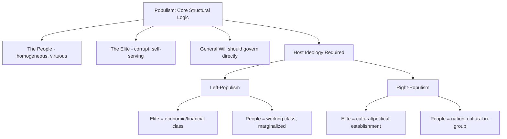

## Populism, Left and Right

### Definition and Conceptual Overview

Populism is a political logic — variously theorized as a "thin-centered" ideology, a discursive style, or a political strategy — organized around a fundamental antagonism between "the pure people" and "the corrupt elite," combined with the claim that politics should express the *volonté générale* (general will) of the people. Because populism lacks a comprehensive, self-contained program for organizing the economy, society, or the state, it typically attaches to a "host" ideology on the left (socialism, anti-imperialism) or right (nationalism, nativism), producing distinct left-populist and right-populist variants that share a structural logic but differ sharply in content.

**Key Points**

- The most widely used academic definition, from Cas Mudde, frames populism as a thin-centered ideology dividing society into two homogeneous, antagonistic groups — "the pure people" versus "the corrupt elite" — and asserting politics should be an expression of the people's general will.
- Populism is content-empty on its own: it requires a host ideology to specify who "the people" and "the elite" actually are.
- Populism can be left-wing, right-wing, or centrist/anti-establishment, and can be democratic (majoritarian) or exhibit illiberal, anti-pluralist tendencies.

### Theoretical Foundations

**Ideational Approach (Mudde, Kaltwasser)**

Treats populism as a set of ideas: a Manichean (good vs. evil) worldview separating a virtuous, unified people from a corrupt elite, combined with a demand for popular sovereignty to override institutional or elite mediation. This is the most widely used framework in contemporary comparative political science.

**Discursive/Performative Approach (Laclau, Mouffe)**

Ernesto Laclau's *On Populist Reason* (2005) theorizes populism not as a fixed ideology but as a logic of political discourse: disparate social grievances ("empty demands") are chained together into a unified "people" through a shared antagonism toward a common adversary, often crystallized around a charismatic leader or signifier. Chantal Mouffe extends this into a normative argument for "left populism" as a democratic strategy to reconstitute a progressive political frontier against neoliberal hegemony.

**Political-Strategic Approach (Weyland)**

Defines populism as a strategy through which a personalistic leader seeks or exercises power based on direct, unmediated, non-institutionalized support from large numbers of followers, bypassing established party and institutional structures.

**Socio-Cultural / Style Approach**

Emphasizes populism as a performative political style — a "low" register of politics (plain speech, transgression of elite norms, direct appeals to "common sense") deployed to construct a bond between leader and people (associated with Pierre Ostiguy, Benjamin Moffitt).

### Left Populism

**Core Framing**

Left populism defines "the people" primarily in socio-economic terms — typically as workers, the poor, or the "99%" — against an elite understood as concentrated economic and financial power (banks, corporations, oligarchs) and/or a technocratic political establishment perceived as serving those interests. It frequently draws on redistributive, anti-neoliberal, and anti-austerity politics.

**Key Themes**

- Anti-neoliberalism and opposition to austerity policy
- Redistribution and expansion of the welfare state
- Nationalization or stronger regulation of key economic sectors
- Suspicion of international financial institutions (IMF, EU fiscal rules) as instruments of elite/technocratic power

**Historical and Comparative Examples**

- *Latin American Populism*: A long historical tradition (Peronism in Argentina from the 1940s onward; more recent cases include Hugo Chávez's Bolivarianism in Venezuela and Evo Morales in Bolivia) combining economic redistribution, nationalist resource politics, and charismatic leadership.
- *European Left Populism (2010s)*: Podemos in Spain and SYRIZA in Greece emerged from anti-austerity mobilization following the 2008 financial crisis and the Eurozone debt crisis, explicitly drawing on Laclau/Mouffe-style theorization of constructing "the people" against an EU/domestic elite "caste" (*la casta*).
- *United States*: Bernie Sanders's 2016 and 2020 presidential campaigns are frequently analyzed as left-populist in their framing of a struggle between working people and a "billionaire class."

### Right Populism

**Core Framing**

Right populism typically fuses the people/elite antagonism with nativism and cultural nationalism, defining "the people" in ethno-cultural or nationalist terms and casting the elite as a cosmopolitan, culturally liberal establishment (political, media, academic) perceived as prioritizing immigrants, minorities, or international institutions over the "native" population.

**Key Themes**

- Nativism and restrictive immigration policy
- Euroscepticism / opposition to supranational governance
- Cultural traditionalism and opposition to progressive social change
- Framing of "elites" as culturally and geographically distant from "ordinary" or rural/heartland populations

**Historical and Comparative Examples**

- *European Radical Right Populism*: The National Rally (France), the Alternative for Germany (AfD), the Freedom Party (Austria), and Fidesz under Viktor Orbán in Hungary combine nativist and Eurosceptic positions with populist anti-elite rhetoric; Orbán's explicit self-description of "illiberal democracy" is frequently cited as an extreme case of populism combined with democratic backsliding.
- *United States*: Donald Trump's political movement is widely analyzed as combining right-populist elite/people antagonism ("drain the swamp") with nativist and nationalist positioning on trade and immigration.
- *Brexit*: The 2016 UK referendum campaign is frequently cited as a paradigmatic case of right-populist mobilization, framing the vote as "the people" reclaiming sovereignty from a distant, unaccountable Brussels-based elite.

**Example**

Comparing Podemos (left) and Vox (right) in Spain illustrates the shared structural grammar of populism operating on different ideological content: both claim to represent "the real Spanish people" against a corrupt establishment, but Podemos defines that establishment in socio-economic terms (*la casta*) while Vox defines it in nationalist/cultural terms tied to territorial unity and immigration.

### Distinguishing Populism From Related Concepts

| Concept | Distinction from Populism |
| --- | --- |
| Nationalism | Nationalism centers on the nation as the primary political unit; populism centers on the people/elite antagonism. Right-populism frequently combines both, but they are analytically separable — left-populism uses the people/elite frame without nationalist content. |
| Demagoguery | Demagoguery refers to rhetorical manipulation of mass emotion for power; it is a tactic that can appear in populist and non-populist politics alike, not a structural ideological claim. |
| Authoritarianism | Populism concerns *who* should rule (the people, unmediated); authoritarianism concerns *how* power is exercised (concentrated, unaccountable). The two frequently correlate in practice but are conceptually distinct — populism can be democratically revitalizing in some cases. |
| Anti-establishment politics | All populism is anti-establishment, but not all anti-establishment politics is populist (e.g., a single-issue reform party need not invoke a moralized "people vs. elite" antagonism). |

### Mechanisms and Effects on Democratic Politics

**Democratic Corrective Function**

Some scholars (e.g., Margaret Canovan) argue populism can function as a democratic "corrective," mobilizing excluded or unrepresented groups and forcing unresponsive elites to address neglected grievances.

**Threat to Liberal Democracy**

Mudde and Kaltwasser and others emphasize populism's tension with liberal democracy's pluralist and minority-protecting features: because populism claims to represent a singular, homogeneous "people," it can delegitimize opposition, minority rights, and independent institutions (courts, media, civil service) as obstacles to the people's will — a dynamic linked to democratic backsliding in cases such as Hungary and Venezuela. [Behavior and trajectory of specific populist governments may vary significantly by institutional context and are subject to ongoing political change.]

**Charismatic Leadership**

Both left- and right-populist movements frequently rely on a single charismatic leader who claims direct, unmediated representation of the people, often at the expense of party institutionalization — a pattern consistent with Weyland's strategic definition.

**Crisis and Populist Mobilization**

Comparative research links populist surges to periods of perceived crisis — economic (2008 financial crisis, austerity), representative (declining trust in mainstream parties), or cultural (immigration, rapid social change) — which create openings for anti-elite mobilization. [Inference: the relative causal weight of economic grievance versus cultural backlash in driving populist support remains contested in the empirical literature.]

### Illustrative Diagram: Left-Right Populist Axis

<svg xmlns="http://www.w3.org/2000/svg" viewBox="0 0 800 380" font-family="sans-serif">
<text x="400" y="30" text-anchor="middle" font-size="18" font-weight="bold" fill="#1a1a2e">Populism's Host-Ideology Spectrum (svg_diagram)</text>
<line x1="80" y1="200" x2="720" y2="200" stroke="#333" stroke-width="3" />
<polygon points="720,200 705,192 705,208" fill="#333" />
<polygon points="80,200 95,192 95,208" fill="#333" />

<text x="150" y="185" text-anchor="middle" font-size="13" font-weight="bold" fill="`#9c2a4a`">LEFT POPULISM</text>

<text x="650" y="185" text-anchor="middle" font-size="13" font-weight="bold" fill="`#2a4a9c`">RIGHT POPULISM</text>

<circle cx="150" cy="230" r="8" fill="#9c2a4a" />
<text x="150" y="255" text-anchor="middle" font-size="11" fill="#333">Podemos</text>
<text x="150" y="270" text-anchor="middle" font-size="11" fill="#333">(Spain)</text>
<circle cx="270" cy="230" r="8" fill="#9c2a4a" />
<text x="270" y="255" text-anchor="middle" font-size="11" fill="#333">SYRIZA</text>
<text x="270" y="270" text-anchor="middle" font-size="11" fill="#333">(Greece)</text>
<circle cx="390" cy="230" r="8" fill="#7a2a9c" />
<text x="390" y="255" text-anchor="middle" font-size="11" fill="#333">Peronism</text>
<text x="390" y="270" text-anchor="middle" font-size="11" fill="#333">(Argentina)</text>
<circle cx="530" cy="230" r="8" fill="#2a4a9c" />
<text x="530" y="255" text-anchor="middle" font-size="11" fill="#333">National Rally</text>
<text x="530" y="270" text-anchor="middle" font-size="11" fill="#333">(France)</text>
<circle cx="650" cy="230" r="8" fill="#2a4a9c" />
<text x="650" y="255" text-anchor="middle" font-size="11" fill="#333">Fidesz</text>
<text x="650" y="270" text-anchor="middle" font-size="11" fill="#333">(Hungary)</text>

<text x="400" y="320" text-anchor="middle" font-size="12" font-style="italic" fill="#555">Shared structural core: "the people" vs. "the corrupt elite"</text>

<text x="400" y="340" text-anchor="middle" font-size="12" font-style="italic" fill="#555">Content of "people" and "elite" determined by host ideology</text>

</svg>

### Critiques and Debates

**Conceptual Stretching**

Critics warn that "populism" is applied so broadly across ideologically disparate movements that it risks losing analytical precision, collapsing distinct phenomena (economic redistribution movements, ethnonationalist movements, personalist authoritarianism) into a single umbrella term.

**Normative Ambivalence**

Scholars disagree sharply on whether populism should be understood primarily as a democratic corrective or a democratic threat — Mouffe's left-populist theorization treats it as a necessary democratic strategy, while Mudde/Kaltwasser's framework, while analytically neutral, documents populism's frequent tension with liberal-pluralist norms in practice.

**Elite-Defined Category Problem**

Some critics note that "populism" is often a label applied by political and media elites to delegitimize movements they oppose, raising questions about whether the term functions descriptively or as a normatively loaded political weapon in scholarly and journalistic use. [Speculation: the extent to which this critique should shift standard academic usage of the term remains a matter of ongoing disciplinary debate rather than settled consensus.]

**Left-Right Convergence Debate**

Some scholars note structural overlaps between left- and right-populist economic positions (both often support protectionism, opposition to austerity, and skepticism of free-trade elites), prompting debate over whether the left-right axis fully captures contemporary populist alignments or whether a "populist vs. pluralist" axis better describes emerging party competition.

### Related Topics

- Nationalism as Ideology
- Liberalism as Ideology
- Authoritarianism and Democratic Backsliding
- Laclau and Mouffe's Discourse Theory
- Comparative Party Systems and Party System Change
- Euroscepticism and EU Integration Politics
- Charismatic Leadership in Political Theory
- Economic Voting and Crisis Politics
- Latin American Political History (Peronism, Bolivarianism)
- Media, Political Communication, and Populist Rhetoric