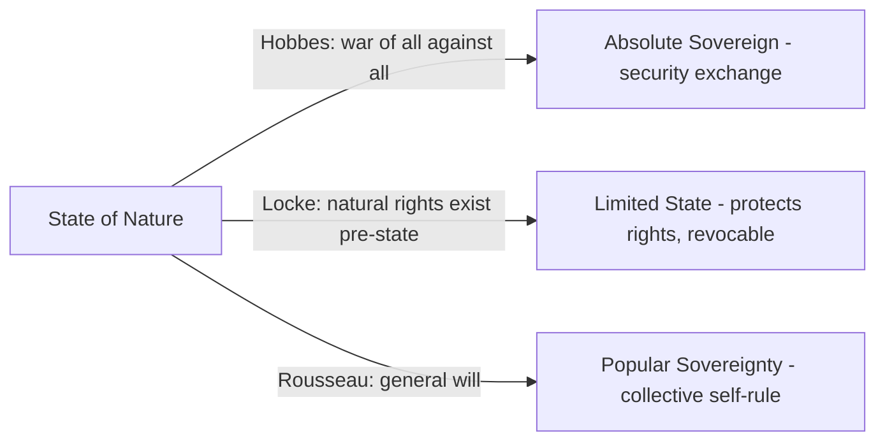

## Theories of State Formation

### Definition and Conceptual Overview

Theories of state formation address the fundamental question of how organized political authority — centralized, territorially bounded institutions claiming a monopoly on legitimate coercion — emerges from earlier, less centralized forms of social and political organization (bands, tribes, chiefdoms, or stateless societies). This body of theory spans political philosophy (normative accounts of why states *should* exist and how their authority is justified), political anthropology and archaeology (empirical accounts of how early states actually arose), and historical sociology (accounts of the modern nation-state's emergence in early modern Europe and its subsequent global diffusion).

**Key Points**

- State formation theories can be broadly grouped into (1) classical social contract theory, (2) conflict/coercion theories, (3) integration/functionalist theories, and (4) historical-sociological theories of the modern state.
- A state, per Max Weber's influential definition, is a political entity that successfully claims a monopoly on the legitimate use of physical force within a given territory.
- Distinguishing *why* states are normatively justified (contractarian tradition) from *how* states empirically arose (conflict, integration, and historical-institutional accounts) is essential to organizing this literature.

### Weber's Definition of the State

Max Weber's definition, articulated in *Politics as a Vocation* (1919), remains the foundational reference point in political science: a state is a human community that (successfully) claims the monopoly of the legitimate use of physical force within a given territory. Three elements are essential:

- **Territory**: a bounded geographic jurisdiction
- **Monopoly on legitimate violence**: the state alone may authorize coercive force (police, military) within its territory, and this authorization is broadly recognized as legitimate rather than merely imposed
- **Compulsory institutions**: the state's authority is territorially compulsory, not voluntary, for those within its jurisdiction

This definition underlies most subsequent political science treatments of state capacity, sovereignty, and state failure.

### Classical Social Contract Theories

Social contract theory offers a normative-hypothetical account: the state arises (or is justified) through an implicit or explicit agreement among individuals to exit a "state of nature" and submit to political authority in exchange for security and order.

**Thomas Hobbes (*Leviathan*, 1651)**

Describes the state of nature as a "war of all against all," where life is "solitary, poor, nasty, brutish, and short" absent a common power to enforce order. Individuals rationally consent to an absolute sovereign (the "Leviathan"), transferring their natural rights in exchange for security. Hobbes's account justifies a strong, largely unconstrained sovereign as the necessary alternative to chaos.

**John Locke (*Two Treatises of Government*, 1689)**

Offers a more optimistic state of nature governed by natural law and pre-existing natural rights (life, liberty, property). The state is formed by consent primarily to provide a neutral, impartial mechanism for adjudicating disputes and protecting these pre-existing rights; if the state violates this trust, Locke's framework justifies a right of revolution. This account underlies liberal constitutionalism and limited government.

**Jean-Jacques Rousseau (*The Social Contract*, 1762)**

Argues individuals surrender their individual will to a collectively constituted "general will," with legitimate political authority flowing from popular sovereignty rather than a transfer of power to a separate sovereign. Rousseau's account is foundational to democratic and republican theories of state legitimacy.

### Conflict and Coercion Theories

Conflict theories reject the voluntary-consent framing of social contract theory, arguing states emerge through coercion, conquest, and the consolidation of power by dominant groups rather than mutual agreement.

**Bellicist / "War Made the State" Thesis (Charles Tilly)**

Tilly's influential formulation — "war made the state, and the state made war" — argues that the modern European state emerged primarily from rulers' need to extract resources (taxation) to fund military competition with rival states. This extraction required building administrative and bureaucratic capacity (tax collection, record-keeping, conscription), which in turn produced the core institutional apparatus of the modern state. Tilly also famously compared state-building to organized crime, describing early state protection rackets that extracted resources in exchange for protection from threats the state itself often manufactured or exaggerated.

**Marxist Theories of the State**

Classical Marxism views the state as an instrument of class domination — arising historically alongside private property and class division to protect the interests of the economically dominant class and suppress class conflict. Friedrich Engels's *The Origin of the Family, Private Property and the State* (1884) traces state formation to the emergence of surplus production, private property, and resulting class antagonisms that required an institution of organized coercion to manage. Later Marxist theorists (e.g., Nicos Poulantzas) developed more structurally nuanced accounts of "relative autonomy," where the state is not simply a direct instrument of the ruling class but has independent institutional logics that nonetheless function to reproduce capitalist social relations overall.

**Predatory / Extractive State Theory**

Related to conflict theory, this strand (associated with economists like Douglass North and Mancur Olson) models early states as emerging when a "roving bandit" finds it more profitable to settle and become a "stationary bandit" — providing enough order and infrastructure to maximize long-term extractable surplus (taxation) rather than simply plundering and moving on.

### Integration and Functionalist Theories

Integration theories emphasize the functional benefits states provide — coordination, conflict resolution, resource management — as drivers of state formation, in contrast to conflict theory's emphasis on domination.

**Hydraulic / Irrigation Hypothesis (Karl Wittfogel)**

Wittfogel's *Oriental Despotism* (1957) argues that early states in arid regions (Mesopotamia, Egypt, China) arose from the functional need to coordinate large-scale irrigation infrastructure, which required centralized administrative authority to organize labor and manage water distribution — producing highly centralized "hydraulic" or "Asiatic" despotic states. [This hypothesis has been substantially qualified by subsequent archaeological research showing many early irrigation systems were managed at local/communal levels without centralized state coordination; treat as historically influential but empirically contested.]

**Circumscription Theory (Robert Carneiro)**

Carneiro's 1970 theory argues that state formation is likely where population growth occurs within geographically or socially circumscribed areas (bounded by mountains, deserts, or competing societies) that prevent easy migration when conflict arises over resources. Under these conditions, warfare over scarce, bounded resources leads to political consolidation, as defeated groups cannot simply flee and are instead subordinated into a growing centralized polity.

**Voluntaristic/Integration Theory**

Broader functionalist accounts (associated with earlier structural-functionalist anthropology) view the state as an institution that emerges to manage increasing social complexity — trade coordination, dispute resolution, defense — as societies grow in scale and specialization, without requiring coercion as the primary mechanism.

### Historical-Sociological Theories of the Modern State

**Patrimonialism to Bureaucracy (Weber)**

Weber's broader historical sociology traces a developmental arc from patrimonial authority (personal rule, where administrative apparatus is an extension of the ruler's household) to rational-legal bureaucratic authority (impersonal rules, merit-based administration, codified law) as the defining institutional shift of the modern state.

**Elias's Civilizing Process**

Norbert Elias's *The Civilizing Process* (1939) links state formation to long-term sociological transformations in manners, self-restraint, and the monopolization of violence by central authorities, arguing that the state's monopoly on force enabled broader societal shifts toward internalized self-control.

**World-Systems and Dependency Perspectives**

Immanuel Wallerstein's world-systems theory situates state formation within a global capitalist "world-system," where core, semi-periphery, and periphery states develop differently depending on their structural position in international trade and production — a framework particularly influential in explaining divergent post-colonial state trajectories.

**Institutionalist / Path-Dependency Approaches**

Contemporary historical institutionalism (e.g., work building on Douglass North) emphasizes how early institutional choices create path-dependent trajectories, with state capacity and institutional quality shaped by "critical junctures" (colonization patterns, independence settlements) that lock in particular administrative and extractive structures over long time horizons.

**Example**

Comparative colonial state formation illustrates institutionalist logic well: settler colonies with disease environments hospitable to European settlement (e.g., North America, Australia) tended to develop inclusive, property-protecting institutions, while extractive colonies in disease-heavy environments (much of Sub-Saharan Africa) tended to develop extractive institutions designed to maximize resource extraction rather than long-term development — a divergence with long-run effects on post-colonial state capacity, as argued by Acemoglu, Johnson, and Robinson (2001). [Inference: this "colonial origins" thesis is influential but contested; alternative explanations emphasizing geography, pre-colonial institutions, and other factors remain live debates in comparative political economy.]

### Comparative Table: Major Theoretical Traditions

| Theory | Primary Mechanism | Key Theorists | State Formed Through |
| --- | --- | --- | --- |
| Social Contract | Voluntary consent | Hobbes, Locke, Rousseau | Agreement to exit state of nature |
| Bellicist / Coercion | Military competition, extraction | Tilly | War-driven fiscal-administrative capacity building |
| Marxist | Class domination | Marx, Engels, Poulantzas | Emergence of private property and class conflict |
| Predatory/Stationary Bandit | Rational extraction-maximization | Olson, North | Bandit settling to maximize long-term surplus |
| Hydraulic | Functional coordination need | Wittfogel | Centralized irrigation management |
| Circumscription | Resource competition in bounded space | Carneiro | Conflict consolidation where flight is impossible |
| Historical-Institutionalist | Path-dependent critical junctures | North, Acemoglu/Johnson/Robinson | Colonial/early institutional choices |

### Illustrative Diagram: Comparative Drivers of State Formation

<svg xmlns="http://www.w3.org/2000/svg" viewBox="0 0 800 440" font-family="sans-serif">
<text x="400" y="30" text-anchor="middle" font-size="18" font-weight="bold" fill="#1a1a2e">Drivers of State Formation: Comparative Framework (svg_diagram)</text>
<rect x="60" y="70" width="200" height="100" fill="#3a5a9c" opacity="0.85" rx="6" />
<text x="160" y="105" text-anchor="middle" font-size="13" fill="white" font-weight="bold">Consent-Based</text>
<text x="160" y="125" text-anchor="middle" font-size="11" fill="white">Social contract</text>
<text x="160" y="142" text-anchor="middle" font-size="11" fill="white">Hobbes / Locke / Rousseau</text>
<rect x="300" y="70" width="200" height="100" fill="#9c2a4a" opacity="0.85" rx="6" />
<text x="400" y="105" text-anchor="middle" font-size="13" fill="white" font-weight="bold">Coercion-Based</text>
<text x="400" y="125" text-anchor="middle" font-size="11" fill="white">War / class domination</text>
<text x="400" y="142" text-anchor="middle" font-size="11" fill="white">Tilly / Marx / Olson</text>
<rect x="540" y="70" width="200" height="100" fill="#2a8c6e" opacity="0.85" rx="6" />
<text x="640" y="105" text-anchor="middle" font-size="13" fill="white" font-weight="bold">Functional-Integrative</text>
<text x="640" y="125" text-anchor="middle" font-size="11" fill="white">Coordination need</text>
<text x="640" y="142" text-anchor="middle" font-size="11" fill="white">Wittfogel / Carneiro</text>
<line x1="160" y1="170" x2="400" y2="260" stroke="#555" stroke-width="2" />
<line x1="400" y1="170" x2="400" y2="260" stroke="#555" stroke-width="2" />
<line x1="640" y1="170" x2="400" y2="260" stroke="#555" stroke-width="2" />
<rect x="250" y="260" width="300" height="80" fill="#8c4a9c" opacity="0.9" rx="6" />
<text x="400" y="290" text-anchor="middle" font-size="13" fill="white" font-weight="bold">Modern State</text>
<text x="400" y="310" text-anchor="middle" font-size="11" fill="white">Weberian monopoly on legitimate</text>
<text x="400" y="325" text-anchor="middle" font-size="11" fill="white">force within a bounded territory</text>
<line x1="400" y1="340" x2="400" y2="370" stroke="#555" stroke-width="2" marker-end="url(#arrow2)" />
<text x="400" y="395" text-anchor="middle" font-size="12" fill="#333" font-style="italic">Path-dependent institutional trajectory</text>
<text x="400" y="412" text-anchor="middle" font-size="11" fill="#333">(North / Acemoglu-Johnson-Robinson)</text>
</svg>

### Critiques and Debates

**Eurocentrism Critique**

Critics argue that much classical state formation theory (particularly Tilly's bellicist thesis) is derived almost exclusively from early modern European cases and generalizes poorly to state formation processes in Africa, Asia, and the Americas, where colonial imposition rather than endogenous war-driven consolidation was the primary mechanism.

**Anthropological Critique of Universal Sequences**

Contemporary archaeology and anthropology (e.g., work associated with David Graeber and David Wengrow's *The Dawn of Everything*, 2021) has challenged linear, stage-based narratives of state formation (band → tribe → chiefdom → state), presenting evidence of early large-scale societies that exhibited seasonal or reversible political centralization, complicating unilinear evolutionary models. [Inference: this body of revisionist archaeological scholarship remains actively debated and not yet fully integrated into mainstream political science state-formation theory.]

**Normative vs. Empirical Conflation Risk**

Scholars caution against conflating social contract theory's normative justificatory function (why state authority *ought* to be obeyed) with empirical claims about how states historically *actually* formed — the two literatures serve different purposes and are not straightforwardly substitutable as explanations of each other.

**Colonial Origins Thesis Contestation**

The influential Acemoglu-Johnson-Robinson "colonial origins" argument linking settler mortality, institutional choices, and long-run state capacity has faced methodological critiques regarding data reliability and alternative explanatory variables (geography, disease ecology, pre-colonial political complexity), making it an actively contested rather than settled framework.

### Related Topics

- Sovereignty in International Relations Theory
- Nationalism as Ideology
- Weberian Bureaucracy and Rational-Legal Authority
- Failed States and State Capacity
- Colonialism and Post-Colonial State-Building
- Social Contract Theory in Depth
- Comparative Historical Institutionalism
- Marxist Theory of the State
- World-Systems Theory
- Political Anthropology of Early Complex Societies