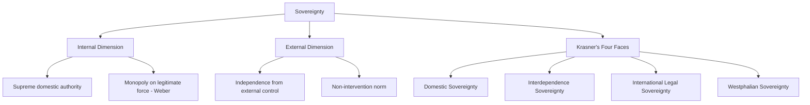

## Sovereignty in Theory and Practice

### Definition and Conceptual Overview

Sovereignty refers to the supreme, final, and (traditionally) indivisible authority within a political system — the capacity to make and enforce binding decisions without being subject to a higher external or internal authority. It operates simultaneously as a legal concept (recognized authority under domestic and international law), a political concept (actual capacity to exercise control), and a normative concept (the claimed source of legitimate rule). Sovereignty is foundational to the modern state system, defining both a state's internal supremacy over its territory and population and its external independence from other states.

**Key Points**

- Sovereignty has at least two core dimensions: *internal sovereignty* (supreme authority within a territory) and *external sovereignty* (independence and non-interference in relation to other states).
- The modern conception of state sovereignty is conventionally traced to the Peace of Westphalia (1648), which established mutual recognition of territorial states as the basic units of the European (later global) political order.
- Contemporary scholarship (notably Stephen Krasner) distinguishes multiple, empirically distinct "faces" of sovereignty that do not always align in practice — sovereignty as a legal claim is frequently violated or compromised as a practical matter.

### Historical Development

**Pre-Modern Antecedents**

Medieval Europe lacked a single locus of supreme authority; political power was fragmented among overlapping claims from the Holy Roman Empire, the Papacy, kings, and feudal lords, with no single actor holding unchallenged supremacy within a bounded territory.

**Bodin and Early Theorization (16th Century)**

Jean Bodin's *Six Books of the Commonwealth* (1576) is widely credited with providing the first systematic theorization of sovereignty as *absolute and perpetual power* within a commonwealth — a single, indivisible, and legally unlimited authority necessary to prevent civil disorder, though Bodin held this authority remained bound by divine and natural law.

**Peace of Westphalia (1648)**

The treaties ending the Thirty Years' War established the principle that rulers held supreme authority within their own territories, free from external (particularly papal or imperial) interference — commonly treated as the founding moment of the modern state-sovereignty system, though historians note the "Westphalian myth" simplifies a more gradual, contested historical process.

**Hobbes and Absolute Sovereignty**

Thomas Hobbes's *Leviathan* (1651) reinforced the theorization of sovereignty as an absolute, unified, and non-divisible authority created through the social contract to escape the state of nature — sovereignty here is instrumentally justified by the order and security it provides.

**Popular Sovereignty (Enlightenment)**

Rousseau's *Social Contract* (1762) relocated the locus of sovereignty from the person of the ruler to the collective body of the people themselves (the "general will"), establishing the theoretical foundation for democratic and republican claims that legitimate sovereign authority derives from and remains vested in the people.

**20th–21st Century Erosion and Contestation**

The rise of international law, human rights regimes, supranational organizations (the UN, EU), globalization, and transnational governance has generated extensive debate about whether traditional Westphalian sovereignty is being eroded, "pooled," or fundamentally reconfigured in the contemporary era.

### Theoretical Dimensions of Sovereignty

**Internal Sovereignty**

The state's supreme authority over all individuals and groups within its territory — the exclusive right to make, interpret, and enforce law, and (per Weber) the monopoly on legitimate violence within that territory.

**External Sovereignty**

The state's independence from external control and its formal legal equality with other sovereign states in the international system — the right to conduct foreign policy, enter treaties, and be free from external interference in domestic affairs (the principle of non-intervention).

**Popular Sovereignty**

The doctrine that ultimate political authority resides in the people, who may delegate governing authority to representatives or institutions but retain the underlying source of legitimacy — foundational to democratic theory and constitutionalism.

**Parliamentary/Legislative Sovereignty**

A specific institutional doctrine (most associated with the UK constitutional tradition, per A.V. Dicey) holding that the legislature possesses supreme, unlimited law-making authority not subject to override by courts or prior parliaments — contrasted with systems featuring constitutional judicial review that can invalidate legislative acts.

**Krasner's Four Faces of Sovereignty**

Stephen Krasner's influential 1999 work *Sovereignty: Organized Hypocrisy* disaggregates sovereignty into four analytically distinct dimensions that are often only loosely correlated in practice:

1. *Domestic sovereignty*: the organization and effectiveness of authority within the state and its capacity to control activities within its borders.
2. *Interdependence sovereignty*: the capacity to control movement across borders (people, goods, capital, information).
3. *International legal sovereignty*: formal mutual recognition of states as legal equals by other states and international bodies.
4. *Westphalian sovereignty*: the exclusion of external actors from domestic authority structures (non-intervention).

Krasner's central argument — captured in the term "organized hypocrisy" — is that international legal sovereignty is frequently formally maintained even as Westphalian and domestic sovereignty are routinely and openly violated in practice (e.g., through conditional aid, intervention, or extraterritorial legal regimes), without this undermining the norm's continued rhetorical force.

### Sovereignty in International Relations Theory

**Realism**

Treats sovereign states as the primary, rational, unitary actors in an anarchic international system with no higher authority above them — sovereignty is the foundational assumption underpinning realist analysis of state behavior, security competition, and the balance of power.

**Liberal Institutionalism**

Accepts state sovereignty as foundational but emphasizes how states voluntarily pool or delegate elements of sovereign authority to international institutions and regimes (trade bodies, security alliances, environmental treaties) to achieve mutual gains through cooperation, without necessarily undermining underlying sovereign equality.

**Constructivism**

Views sovereignty not as a fixed, natural fact but as a socially constructed norm whose meaning and practice have evolved historically and vary across contexts — sovereignty is "what states make of it," shaped by intersubjective understanding rather than a static legal fact.

**Critical and Post-Colonial Perspectives**

Critical IR scholars argue the Westphalian sovereignty norm was historically applied unevenly, with European powers exercising sovereignty while denying it to colonized peoples, and note that formal post-colonial sovereignty has often coexisted with substantial informal economic and political dependency ("neo-colonialism").

### Sovereignty and Supranational Integration: The EU Case

The European Union represents the most developed real-world case of sovereignty "pooling," where member states voluntarily transfer specific competencies (trade policy, monetary policy for Eurozone members, elements of regulatory authority) to supranational institutions while formally retaining underlying sovereign statehood. This arrangement has generated sustained political and legal debate:

- **Pooled sovereignty view**: EU integration represents states rationally exercising sovereignty by choosing to cooperate for mutual benefit, not a loss of sovereignty per se.
- **Sovereignty erosion view**: Critics (prominently articulated in Euroscepticism and events like Brexit) argue EU membership constitutes a genuine and problematic transfer of final decision-making authority away from national democratic institutions to unelected supranational bodies.

**Example**

The Brexit referendum (2016) and subsequent withdrawal illustrate contested sovereignty claims directly: Leave campaigners framed EU membership as a loss of parliamentary sovereignty and border control (interdependence sovereignty in Krasner's terms), while Remain campaigners argued sovereignty was better exercised collectively through pooled EU decision-making power on trade and regulatory scale.

### Sovereignty and Human Rights / Humanitarian Intervention

**Tension with Non-Intervention**

The classical Westphalian non-intervention norm conflicts with the post-1990s development of international human rights and humanitarian intervention norms, which assert that egregious internal human rights violations (genocide, ethnic cleansing, crimes against humanity) can justify external intervention, qualifying absolute internal sovereignty.

**Responsibility to Protect (R2P)**

Adopted at the 2005 UN World Summit, R2P reframes sovereignty as entailing a *responsibility* to protect a state's population from mass atrocities; if a state fails to do so, the international community may bear a residual responsibility to act, including through intervention authorized by the UN Security Council. R2P remains contested in practice, with disputes over its selective application and tension with sovereign non-intervention norms persisting. [Behavioral application of R2P in specific crises is subject to UN Security Council politics and has varied significantly by case.]

**International Criminal Law**

Institutions such as the International Criminal Court (ICC) represent further qualification of absolute sovereignty, asserting jurisdiction over individuals (including heads of state) for specific international crimes, a development contested by states asserting sovereign immunity and non-interference.

### Sovereignty and Globalization

**Economic Globalization**

Global financial markets, multinational corporations, and international trade/investment regimes (WTO rules, bilateral investment treaties) are frequently argued to constrain states' effective *interdependence sovereignty* — their capacity to control economic activity within and across their borders — even where formal legal sovereignty remains intact.

**Digital and Information Sovereignty**

The transnational nature of the internet and digital platforms has generated a newer debate over "digital sovereignty" or "data sovereignty" — states' capacity to regulate data flows, platforms, and information within their jurisdiction in an environment where infrastructure and services are often controlled by foreign corporations. [Inference: this is an evolving and comparatively under-theorized dimension of sovereignty relative to the classical territorial/legal dimensions.]

**Sovereignty and Migration**

Border control and migration policy remain a core site where states assert interdependence sovereignty (the right to control who crosses and remains within their territory), generating ongoing political conflict between sovereigntist and rights-based (asylum, refugee protection) framings.

### Illustrative Diagram: Sovereignty Under Pressure — Traditional vs. Contemporary Constraints

<svg xmlns="http://www.w3.org/2000/svg" viewBox="0 0 800 420" font-family="sans-serif">
<text x="400" y="30" text-anchor="middle" font-size="18" font-weight="bold" fill="#1a1a2e">Sovereignty: Classical Claim vs. Contemporary Constraints (svg_diagram)</text>
<circle cx="400" cy="180" r="90" fill="#3a5a9c" opacity="0.9" />
<text x="400" y="175" text-anchor="middle" font-size="14" fill="white" font-weight="bold">Westphalian</text>
<text x="400" y="193" text-anchor="middle" font-size="14" fill="white" font-weight="bold">Sovereignty</text>
<text x="400" y="211" text-anchor="middle" font-size="10" fill="white">(supreme, exclusive authority)</text>
<rect x="40" y="290" width="160" height="80" fill="#9c2a4a" opacity="0.85" rx="6" />
<text x="120" y="320" text-anchor="middle" font-size="11" fill="white" font-weight="bold">Human Rights /</text>
<text x="120" y="336" text-anchor="middle" font-size="11" fill="white" font-weight="bold">R2P Intervention</text>
<rect x="230" y="290" width="160" height="80" fill="#c9622a" opacity="0.85" rx="6" />
<text x="310" y="320" text-anchor="middle" font-size="11" fill="white" font-weight="bold">Supranational</text>
<text x="310" y="336" text-anchor="middle" font-size="11" fill="white" font-weight="bold">Integration (EU)</text>
<rect x="420" y="290" width="160" height="80" fill="#2a8c6e" opacity="0.85" rx="6" />
<text x="500" y="320" text-anchor="middle" font-size="11" fill="white" font-weight="bold">Economic</text>
<text x="500" y="336" text-anchor="middle" font-size="11" fill="white" font-weight="bold">Globalization</text>
<rect x="610" y="290" width="160" height="80" fill="#8c4a9c" opacity="0.85" rx="6" />
<text x="690" y="320" text-anchor="middle" font-size="11" fill="white" font-weight="bold">Digital / Data</text>
<text x="690" y="336" text-anchor="middle" font-size="11" fill="white" font-weight="bold">Sovereignty</text>
<line x1="120" y1="290" x2="350" y2="250" stroke="#555" stroke-width="1.5" stroke-dasharray="4,3" />
<line x1="310" y1="290" x2="380" y2="260" stroke="#555" stroke-width="1.5" stroke-dasharray="4,3" />
<line x1="500" y1="290" x2="420" y2="260" stroke="#555" stroke-width="1.5" stroke-dasharray="4,3" />
<line x1="690" y1="290" x2="450" y2="250" stroke="#555" stroke-width="1.5" stroke-dasharray="4,3" />
</svg>

### Critiques and Debates

**"Organized Hypocrisy" Critique (Krasner)**

Krasner's own analysis functions as a critique of sovereignty discourse itself: international legal sovereignty is treated as an inviolable norm rhetorically, even as Westphalian and domestic sovereignty are routinely compromised through great-power intervention, conditionality, and unequal treaties — suggesting sovereignty functions partly as a legitimating fiction rather than a consistently applied rule.

**Post-Colonial Critique**

Scholars note that sovereignty was historically denied to colonized peoples under European international law while being asserted as inviolable among European powers, and that many post-colonial states inherited sovereign statehood without the corresponding domestic institutional capacity ("juridical" vs. "empirical" statehood, per Robert Jackson's distinction) — producing so-called "quasi-states" with formal international recognition but weak effective internal control.

**Sovereignty Erosion vs. Transformation Debate**

Scholars disagree on whether globalization and supranational governance represent a genuine *erosion* of sovereignty or merely its *transformation* — states arguably remain the primary legal and political units even as they exercise authority differently, through pooling, delegation, and networked governance rather than unilateral control. [Inference: this remains a live and unresolved theoretical debate rather than a settled empirical finding.]

**Absolute vs. Relative Sovereignty**

Contemporary theorists increasingly reject Bodin/Hobbes-style absolute, indivisible sovereignty in favor of understanding sovereignty as inherently relative, contested, and continuously renegotiated through practice rather than a fixed legal endowment.

### Related Topics

- Theories of State Formation
- Nationalism as Ideology
- International Law and the United Nations System
- Realism, Liberalism, and Constructivism in IR Theory
- Humanitarian Intervention and Responsibility to Protect
- European Union Integration and Euroscepticism
- Post-Colonial Statehood and Quasi-States
- Globalization and the Nation-State
- Weberian Theory of Legitimate Authority
- Federalism and Divided Sovereignty