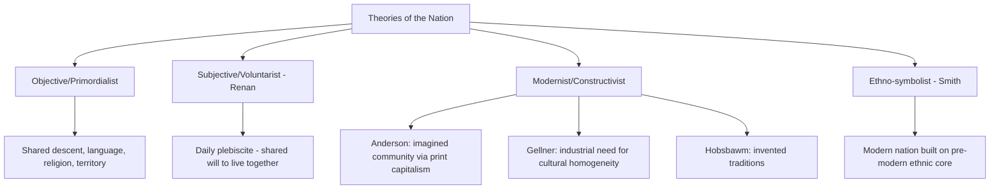

## The Nation and National Identity

### Definition and Conceptual Overview

The nation is a community bound together by a shared sense of collective identity — typically grounded in some combination of common history, culture, language, ethnicity, religion, territory, or political aspiration — that understands itself as a distinct "people" with a claim to self-governance. National identity refers to the subjective psychological and social dimension of this community: the sense of belonging, shared meaning, and collective self-understanding that individuals hold as members of the nation. The nation is conceptually and historically distinct from both the *state* (the formal political-legal apparatus governing a territory) and *ethnicity* (a narrower category based on presumed common descent or cultural markers), though these categories frequently overlap and are often conflated in political discourse.

**Key Points**

- A nation need not possess its own state (a "stateless nation," e.g., the Kurds or the Basques); a state need not correspond to a single nation (a "multinational state," e.g., historically the UK or Spain).
- National identity is best understood as a socially and historically constructed category rather than a fixed, natural given — though it is experienced by individuals as deeply real and often primordial.
- The nation/state distinction underlies the analytical difference between nationalism (the ideology) and the nation (the community that ideology claims to represent) and sovereignty (the political-legal authority claimed on the nation's behalf).

### Distinguishing the Nation From Related Concepts

| Concept | Core Basis | Relationship to Nation |
| --- | --- | --- |
| State | Formal political-legal authority over a territory | May or may not correspond to a single nation |
| Ethnicity | Presumed shared descent, language, or cultural markers | Often a component of national identity, but narrower and can exist without national political aspiration |
| Nation-state | Congruence of nation and state | The idealized (and historically rare in pure form) fusion the nationalist principle aspires to |
| Country | Geographic/territorial designation | A geographic and often political unit, not necessarily tied to a single cultural community |
| Citizenship | Legal status conferring rights/duties within a state | A formal-legal relationship to the state, distinct from cultural or ethnic national identity |

**Example**

The United Kingdom illustrates the nation/state distinction directly: it is a single sovereign state encompassing multiple national identities (English, Scottish, Welsh, and Northern Irish/British), each with distinct historical, cultural, and in some cases linguistic markers, alongside an overarching British civic-state identity — demonstrating that state and nation need not be coextensive.

### Theoretical Approaches to Defining the Nation

**Objective/Primordialist Criteria**

Early and popular conceptions define the nation by ostensibly objective shared traits — common language, ethnicity, religion, territory, and historical descent — treating the nation as a natural, pre-political community that predates and grounds claims to statehood.

**Subjective/Voluntarist Criteria**

Ernest Renan's influential 1882 lecture "What Is a Nation?" rejected purely objective criteria (race, language, religion, geography, shared interest) as insufficient, arguing instead that a nation is constituted by a shared will to live together — famously described as a "daily plebiscite" — grounded in a shared inheritance of memories *and* a shared willingness to continue that legacy. Renan also emphasized that nations are built as much on collective *forgetting* (of internal conflicts, conquests, and violence) as on collective remembering.

**Modernist/Constructivist Approaches**

- *Benedict Anderson*: nations are "imagined communities" — imagined because members will never know most of their fellow members yet hold in their minds a shared image of communion, made possible by print capitalism's standardization of language and simultaneous circulation of texts across a population.
- *Ernest Gellner*: nations and nationalism are products of industrial modernity's functional need for a culturally homogeneous, literate workforce educated in a standardized national language.
- *Eric Hobsbawm*: much of the content of national identity (traditions, symbols, rituals presented as ancient) is in fact "invented" relatively recently to serve modern political purposes of legitimation and cohesion.

**Ethno-symbolist Approaches**

Anthony D. Smith critiques purely modernist accounts for underestimating continuity, arguing modern nations are typically built upon pre-existing "ethnies" — communities with shared myths of common ancestry, historical memories, and symbolic culture — even though the nation-state as a political form is a modern innovation. National identity, in this view, draws real symbolic and emotional power from pre-modern cultural material even as it is politically reorganized in the modern era.

### Civic vs. Ethnic National Identity

**Civic National Identity**

Defines membership in the nation through shared citizenship, adherence to common political values and institutions, and voluntary allegiance — in principle open to individuals regardless of ethnic origin who accept the political community's civic values. Often associated with the French Republican tradition and the United States' civic-founding narrative.

**Ethnic National Identity**

Defines membership through descent, language, and shared cultural/ethnic heritage, often treating national belonging as an inherited status not readily accessible to outsiders regardless of formal citizenship — historically associated with German *Volk*-based national conceptions and much of Central/Eastern European nationalism (Hans Kohn's classic East/West distinction, though now considered by many scholars to oversimplify).

**Critique of the Dichotomy**

Rogers Brubaker and others argue the civic/ethnic distinction, while analytically useful, is too clean in practice: most "civic" nations retain ethnocultural undertones (a dominant historical culture, language, or religious heritage shaping the "neutral" civic framework), and most "ethnic" nations incorporate civic-institutional elements. The distinction is best treated as a spectrum or set of overlapping logics rather than a strict binary. [Inference: this critique is widely cited in current scholarship but has not fully displaced the civic/ethnic framework's continued pedagogical and analytical use.]

### Mechanisms of National Identity Formation and Reproduction

**Education Systems**

Mass public education, particularly the standardization of a national language and a shared historical curriculum, is frequently identified (especially in Gellner's account) as the central institutional mechanism producing and reproducing national identity across generations.

**National Symbols and Rituals**

Flags, anthems, national holidays, war memorials, and public ceremonies function to make an abstract imagined community emotionally and experientially concrete, reinforcing collective identification through repeated ritual practice.

**Historical Narrative and Collective Memory**

Nations construct and continuously revise shared historical narratives — selectively emphasizing unifying events and downplaying or reframing divisive ones (Renan's "collective forgetting") — often institutionalized through museums, monuments, and commemorative practices.

**Media and Communication**

Anderson's print-capitalism thesis extended to broadcast and digital media: shared national media consumption (news, television, and increasingly digital platforms) reinforces synchronized national experience and discourse.

**The Constitutive "Other"**

National identity is frequently constructed relationally, defined partly in contrast to external rivals or internal minority groups — a boundary-drawing process central to how in-group/out-group distinctions are maintained and reinforced.

### National Identity and the State: Nation-Building

**State-Framed Nation-Building**

Many post-colonial and multi-ethnic states have pursued deliberate "nation-building" projects — using education, language policy, national symbols, and civic institutions to construct a shared national identity among culturally and linguistically diverse populations inherited from often arbitrary colonial borders.

**Example**

Indonesia's post-independence adoption of Bahasa Indonesia (rather than the more widely spoken Javanese) as the unifying national language illustrates deliberate state-framed nation-building: a relatively neutral, minority first-language choice was selected specifically to avoid privileging any single major ethnic group and to foster a shared civic-national identity across the archipelago's hundreds of distinct ethnic and linguistic communities.

**Minority Nationalism and Multinational States**

States containing multiple distinct national identities (Spain with Catalan and Basque identities, Canada with Québécois identity, the UK with its constituent nations) must manage competing claims to national recognition, often through federalism, devolution, or asymmetric constitutional arrangements that grant minority nations varying degrees of self-governance short of full independence.

### National Identity in Comparative and Contemporary Politics

**Immigration and National Identity**

Debates over immigration policy frequently center on contested conceptions of national identity — whether national membership should be extended readily to newcomers (civic-inclusive framing) or is fundamentally tied to inherited cultural/ethnic membership (ethnic-exclusive framing) — a central axis of contemporary right-populist and nativist politics.

**Diaspora and Transnational National Identity**

Globalization and digital communication have enabled diaspora populations to maintain strong national identification and political engagement with a homeland despite physical distance, generating growing scholarly interest in transnational and "long-distance" nationalism.

**Supranational and Post-National Identity**

The EU's promotion of a shared "European identity" alongside (not replacing) national identities represents an attempt to construct a supranational layer of collective identity, with mixed and unevenly distributed success across member states — a case frequently used to test whether national identity can coexist with, be layered under, or be gradually superseded by post-national forms of belonging. [Inference: the durability and depth of a genuinely post-national European identity relative to persistent national identities remains an open empirical question in comparative EU studies.]

### Illustrative Diagram: Layers of National Identity Construction

<svg xmlns="http://www.w3.org/2000/svg" viewBox="0 0 800 420" font-family="sans-serif">
<text x="400" y="30" text-anchor="middle" font-size="18" font-weight="bold" fill="#1a1a2e">How National Identity Is Constructed and Reproduced (svg_diagram)</text>
<circle cx="400" cy="220" r="75" fill="#3a5a9c" opacity="0.9" />
<text x="400" y="215" text-anchor="middle" font-size="14" fill="white" font-weight="bold">National</text>
<text x="400" y="233" text-anchor="middle" font-size="14" fill="white" font-weight="bold">Identity</text>
<rect x="50" y="90" width="150" height="70" fill="#8c4a9c" opacity="0.85" rx="6" />
<text x="125" y="120" text-anchor="middle" font-size="11" fill="white" font-weight="bold">Education &amp;</text>
<text x="125" y="136" text-anchor="middle" font-size="11" fill="white" font-weight="bold">Language Policy</text>
<rect x="600" y="90" width="150" height="70" fill="#c9622a" opacity="0.85" rx="6" />
<text x="675" y="120" text-anchor="middle" font-size="11" fill="white" font-weight="bold">Symbols &amp;</text>
<text x="675" y="136" text-anchor="middle" font-size="11" fill="white" font-weight="bold">Rituals</text>
<rect x="50" y="290" width="150" height="70" fill="#2a8c6e" opacity="0.85" rx="6" />
<text x="125" y="320" text-anchor="middle" font-size="11" fill="white" font-weight="bold">Media &amp;</text>
<text x="125" y="336" text-anchor="middle" font-size="11" fill="white" font-weight="bold">Communication</text>
<rect x="600" y="290" width="150" height="70" fill="#9c2a4a" opacity="0.85" rx="6" />
<text x="675" y="320" text-anchor="middle" font-size="11" fill="white" font-weight="bold">Historical Narrative</text>
<text x="675" y="336" text-anchor="middle" font-size="11" fill="white" font-weight="bold">&amp; Collective Memory</text>
<line x1="200" y1="130" x2="335" y2="195" stroke="#555" stroke-width="2" />
<line x1="600" y1="130" x2="465" y2="195" stroke="#555" stroke-width="2" />
<line x1="200" y1="320" x2="335" y2="245" stroke="#555" stroke-width="2" />
<line x1="600" y1="320" x2="465" y2="245" stroke="#555" stroke-width="2" />
</svg>

### Critiques and Debates

**Essentialism Critique**

Constructivist and modernist scholars critique primordialist and popular ethnic-nationalist accounts for treating national identity as a fixed, natural essence rather than a historically contingent and continuously reconstructed social process.

**Instrumentalist Critique**

Some scholars argue elites deliberately construct and mobilize national identity for instrumental political purposes (legitimating rule, mobilizing support, justifying territorial claims) rather than national identity arising organically from genuine shared culture — a critique in tension with ethno-symbolist emphasis on the real emotional and historical depth of national attachment.

**Exclusionary Potential**

Critics note that national identity, particularly in ethnic or culturally exclusive forms, can function to marginalize minority populations, immigrants, and indigenous groups who do not fit the dominant national narrative, raising ongoing normative debates about how inclusive civic-national frameworks can or should be constructed.

**Post-National and Cosmopolitan Critique**

Some political theorists (in the cosmopolitan liberal tradition) question whether bounded national identity remains an appropriate primary basis for political community and moral obligation in an interdependent, globalized world, though this position remains a minority view relative to the continued empirical strength of national identification globally. [Speculation: predictions of national identity's long-term decline relative to post-national or cosmopolitan identity have recurred across decades of scholarship without clear empirical confirmation of a sustained global trend.]

### Related Topics

- Nationalism as Ideology
- Theories of State Formation
- Sovereignty in Theory and Practice
- Ethnicity, Ethnic Conflict, and Minority Rights
- Citizenship Models: Civic vs. Ethnic Membership
- Federalism and Devolution in Multinational States
- Populism, Left and Right
- Post-Colonial Nation-Building
- Imagined Communities (Benedict Anderson)
- European Identity and Supranational Belonging