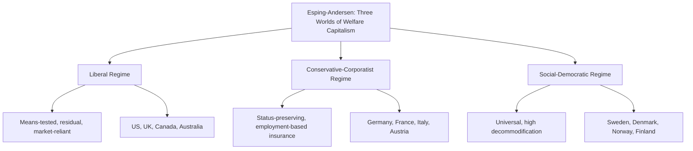

## The Welfare State

### Definition and Conceptual Overview

The welfare state refers to a form of governance in which the state assumes primary institutional responsibility for citizens' social and economic welfare — providing protection against major life risks (illness, unemployment, old age, disability, poverty) through a combination of social insurance, direct provision of services, and redistributive taxation. It represents a specific historical resolution of the relationship between capitalism and democracy: the state intervenes in market outcomes to guarantee a baseline of social security and reduce inequality, without (in most variants) abolishing market economies or private property.

**Key Points**

- The welfare state combines three core mechanisms: social insurance (contribution-based protection against risk), social assistance (means-tested support for those in need), and universal public services (education, healthcare).
- Gøsta Esping-Andersen's typology of "three worlds of welfare capitalism" (1990) remains the dominant comparative framework, classifying welfare states as liberal, conservative-corporatist, or social-democratic based on their institutional logic.
- The welfare state emerged from the historical convergence of industrialization's social risks, working-class political mobilization, and elite strategic responses to social instability.

### Historical Development

**Early Precedents (Late 19th Century)**

Otto von Bismarck's Germany introduced the first modern social insurance systems — health insurance (1883), accident insurance (1884), and old-age/disability pensions (1889) — largely as a strategic response to contain the growing political appeal of socialism among the industrial working class rather than as a purely humanitarian initiative.

**Liberal Reformism (Early 20th Century)**

The UK's Liberal welfare reforms (1906–1914), including old-age pensions and national insurance, extended limited state social protection within a broadly liberal framework, influenced by concerns over poverty, public health, and imperial military fitness.

**The Beveridge Report and Post-War Consolidation (1942–1950s)**

William Beveridge's 1942 report, *Social Insurance and Allied Services*, is the foundational document of the modern comprehensive welfare state, identifying "five giant evils" — Want, Disease, Ignorance, Squalor, and Idleness — and proposing a unified, universal social insurance system alongside a National Health Service and full-employment policy. The UK's post-war Labour government (1945–1951) implemented much of this vision, and comparable welfare state expansions occurred across Western Europe during the post-war "Golden Age" of Keynesian economic management and sustained economic growth.

**Nordic Social-Democratic Expansion (1950s–1970s)**

Scandinavian countries developed the most extensive, universalist welfare states, combining generous, high-quality universal public services with strong labor market institutions and high female labor force participation, financed through high taxation and underpinned by strong social-democratic party dominance and centralized wage bargaining.

**Crisis and Retrenchment Debates (1970s–1990s)**

The 1970s oil shocks, stagflation, and the breakdown of Keynesian economic management prompted a sustained ideological and policy challenge to welfare state expansion, associated with neoliberal and monetarist critiques (Hayek, Friedman) and implemented through policies associated with Thatcherism (UK) and Reaganism (US) — emphasizing spending restraint, means-testing over universalism, privatization, and market-oriented reform ("new public management").

**Post-1990s Restructuring**

Subsequent decades saw further reform across "third way" social-democratic recalibration (activation policies, workfare, emphasis on employability), continued retrenchment pressures from globalization and demographic aging, and renewed debate following the 2008 financial crisis and COVID-19 pandemic over the welfare state's role in economic stabilization and crisis response.

### Esping-Andersen's Three Worlds of Welfare Capitalism

Gøsta Esping-Andersen's comparative typology, from *The Three Worlds of Welfare Capitalism* (1990), classifies welfare states based on the concept of "decommodification" — the degree to which social policy allows individuals to maintain a livelihood independent of market participation — and the structure of social stratification each regime produces.

**Liberal Welfare Regime**

Characterized by modest, means-tested social assistance, strict eligibility rules, and reliance on the market to meet most welfare needs, with the state acting as a residual safety net rather than a universal provider. Produces relatively low decommodification and a dualistic stratification between a stigmatized welfare-dependent minority and a market-reliant majority. Examples: United States, and to a lesser extent the UK, Canada, and Australia.

**Conservative-Corporatist Welfare Regime**

Organized around social insurance schemes tied to employment status and occupational category (often historically linked to Bismarckian origins), preserving existing status differentials rather than redistributing broadly. Traditionally shaped by Catholic social doctrine's emphasis on subsidiarity, often assuming a traditional male-breadwinner family model with limited support for female labor force participation. Examples: Germany, France, Italy, Austria.

**Social-Democratic Welfare Regime**

Provides universal, generous, high-quality benefits and services to all citizens regardless of market status or need, funded through high progressive taxation, achieving the highest degree of decommodification and actively promoting gender equality and universal labor market participation (including extensive public childcare enabling dual-earner households). Examples: Sweden, Denmark, Norway, Finland.

**Critiques of the Typology**

Feminist scholars (e.g., Ann Orloff, Diane Sainsbury) argue Esping-Andersen's original framework underweighted gender, particularly the unpaid care work absorbed by families (predominantly women) in liberal and conservative regimes, proposing "defamilization" (the degree to which welfare policy reduces individuals' dependence on family for welfare) as a necessary complementary dimension. Other scholars have proposed additional regime types, including a "Mediterranean" or "Southern European" model (Italy, Spain, Greece, Portugal) characterized by fragmented insurance provision and strong reliance on family-based welfare, and debate continues over whether East Asian welfare states (Japan, South Korea) fit any of the three original categories. [Inference: whether these additional categories constitute genuinely distinct "worlds" or variations within Esping-Andersen's original three remains actively debated in comparative welfare state scholarship.]

### Core Institutional Components

**Social Insurance**

Contribution-financed programs (typically via payroll taxes) providing benefits tied to prior employment and contribution history — pensions, unemployment insurance, sickness/disability benefits — reflecting an insurance logic of pooled risk among contributors.

**Social Assistance**

Means-tested, tax-financed support targeted at those who fall outside or below social insurance coverage, functioning as a residual safety net (e.g., means-tested cash assistance, food assistance programs).

**Universal Public Services**

Services provided to the entire population as a social right regardless of income or contribution history, most prominently public education and, in many countries, universal healthcare systems (e.g., the UK's National Health Service, funded through general taxation rather than insurance contributions).

**Active Labor Market Policy**

Programs aimed at facilitating employment (retraining, job placement, childcare support, wage subsidies) rather than solely providing passive income replacement — increasingly emphasized in "activation" and "flexicurity" models (notably in Denmark and the Netherlands) that combine flexible labor markets with strong income security and active employment support.

**Family Policy**

Parental leave, child benefits, and childcare provision, varying substantially across regime types in generosity and in the underlying assumptions about gender roles and family structure they embed.

### Theoretical Explanations for Welfare State Development

**Industrialization/Logic of Industrialism**

Argues welfare states emerge functionally from the social risks and dislocations generated by industrialization and urbanization (unemployment, workplace injury, urban poverty) regardless of specific political configurations — a largely functionalist account increasingly seen as insufficient on its own.

**Power Resources Theory**

Associated with Walter Korpi and John D. Stephens, this approach explains cross-national variation in welfare state generosity primarily through the relative political and organizational strength of labor movements and social-democratic parties: stronger, more unified labor movements able to sustain long periods in government (as in Scandinavia) produce more extensive, universalist welfare states.

**Christian Democracy and Employer Coordination**

Explains conservative-corporatist welfare states through the historical influence of Christian Democratic parties (shaped by Catholic social doctrine's subsidiarity principle) and coordinated market economies where employers themselves have incentives to support occupationally segmented social insurance that preserves skilled-worker attachment to firms.

**Varieties of Capitalism**

Peter Hall and David Soskice's framework links welfare state design to broader national production regimes — liberal market economies (flexible labor markets, general skills, residual welfare) versus coordinated market economies (specific/firm-based skills, employment protection, more generous social insurance) — arguing welfare institutions and economic coordination mechanisms are functionally complementary.

**Historical-Institutionalist and Path Dependency Accounts**

Emphasize that once welfare institutions are established, they generate their own political constituencies (beneficiaries, administrators) and institutional lock-in effects that make radical restructuring politically difficult even amid ideological or economic pressure for reform — a dynamic Paul Pierson termed the "new politics of the welfare state," where retrenchment politics differ fundamentally from the expansionary politics that built these systems.

### Comparative Table: Welfare Regime Characteristics

| Dimension | Liberal | Conservative-Corporatist | Social-Democratic |
| --- | --- | --- | --- |
| Benefit basis | Means-tested | Employment/occupation-based | Universal citizenship-based |
| Decommodification | Low | Medium | High |
| Redistribution | Limited, targeted | Limited, status-preserving | Extensive |
| Gender model | Market-reliant, weak defamilization | Male-breadwinner assumption | Dual-earner, strong defamilization |
| Financing | General taxation, targeted | Payroll/social contributions | High progressive taxation |
| Example states | US, UK, Australia | Germany, France, Austria | Sweden, Denmark, Norway |

### Contemporary Pressures and Debates

**Globalization and Fiscal Competition**

Concerns that international capital mobility and tax competition pressure states to reduce corporate and high-income taxation, potentially constraining the fiscal base for generous welfare provision — though comparative evidence on the magnitude of this "race to the bottom" effect remains mixed and contested among political economists.

**Demographic Aging**

Rising old-age dependency ratios across advanced industrial democracies place sustained fiscal pressure on pension and healthcare systems designed under more favorable demographic conditions, prompting reforms such as raising retirement ages and shifting toward funded (rather than pay-as-you-go) pension elements in some countries.

**Post-Industrial Labor Markets and New Social Risks**

The shift from industrial to service and knowledge economies has generated "new social risks" (precarious/non-standard employment, work-family reconciliation difficulties, skills obsolescence) that traditional male-breadwinner, industrial-era welfare architectures were not originally designed to address, prompting debate over adequate policy responses (e.g., universal basic income proposals, expanded parental leave and childcare).

**Universal Basic Income Debate**

UBI — an unconditional, regular cash payment to all citizens regardless of employment status — has gained renewed attention as a potential response to automation-driven labor market disruption and welfare system complexity, tested in various pilot programs, though it remains contested regarding fiscal feasibility, labor market effects, and whether it should replace or supplement existing welfare institutions. [Inference: evidence from UBI pilot programs on long-term labor supply and wellbeing effects remains limited and context-dependent, and is not conclusive regarding effects at full national scale.]

**Welfare Chauvinism**

The increasing linkage (especially by right-populist parties) of welfare state generosity to restrictive immigration and citizenship criteria — arguing welfare benefits should be reserved for "native" citizens — reflecting the intersection of welfare state politics with nationalism and populism discussed elsewhere in this chapter's material.

### Illustrative Diagram: Welfare State Financing and Provision Flow

<svg xmlns="http://www.w3.org/2000/svg" viewBox="0 0 800 400" font-family="sans-serif">
<text x="400" y="30" text-anchor="middle" font-size="18" font-weight="bold" fill="#1a1a2e">Welfare State: Financing and Provision Mechanisms (svg_diagram)</text>
<rect x="60" y="80" width="180" height="60" fill="#3a5a9c" opacity="0.85" rx="6" />
<text x="150" y="105" text-anchor="middle" font-size="12" fill="white" font-weight="bold">General Taxation</text>
<text x="150" y="122" text-anchor="middle" font-size="10" fill="white">(progressive income tax)</text>
<rect x="310" y="80" width="180" height="60" fill="#c9622a" opacity="0.85" rx="6" />
<text x="400" y="105" text-anchor="middle" font-size="12" fill="white" font-weight="bold">Payroll Contributions</text>
<text x="400" y="122" text-anchor="middle" font-size="10" fill="white">(social insurance)</text>
<rect x="560" y="80" width="180" height="60" fill="#2a8c6e" opacity="0.85" rx="6" />
<text x="650" y="105" text-anchor="middle" font-size="12" fill="white" font-weight="bold">Employer Contributions</text>
<text x="650" y="122" text-anchor="middle" font-size="10" fill="white">(corporatist model)</text>
<line x1="150" y1="140" x2="400" y2="220" stroke="#555" stroke-width="2" />
<line x1="400" y1="140" x2="400" y2="220" stroke="#555" stroke-width="2" />
<line x1="650" y1="140" x2="400" y2="220" stroke="#555" stroke-width="2" />
<rect x="270" y="220" width="260" height="60" fill="#8c4a9c" opacity="0.9" rx="6" />
<text x="400" y="255" text-anchor="middle" font-size="13" fill="white" font-weight="bold">Redistributive Pooling</text>
<line x1="330" y1="280" x2="200" y2="330" stroke="#555" stroke-width="2" />
<line x1="400" y1="280" x2="400" y2="330" stroke="#555" stroke-width="2" />
<line x1="470" y1="280" x2="600" y2="330" stroke="#555" stroke-width="2" />

<text x="200" y="350" text-anchor="middle" font-size="11" fill="#333" font-weight="bold">Social Insurance</text>

<text x="200" y="365" text-anchor="middle" font-size="10" fill="#333">(pensions, unemployment)</text>

<text x="400" y="350" text-anchor="middle" font-size="11" fill="#333" font-weight="bold">Social Assistance</text>

<text x="400" y="365" text-anchor="middle" font-size="10" fill="#333">(means-tested)</text>

<text x="600" y="350" text-anchor="middle" font-size="11" fill="#333" font-weight="bold">Universal Services</text>

<text x="600" y="365" text-anchor="middle" font-size="10" fill="#333">(education, healthcare)</text>

</svg>

### Critiques and Debates

**Neoliberal/Market Critique**

Argues extensive welfare provision creates work disincentives, fiscal unsustainability, and inefficient state monopolies over service provision, advocating instead for market mechanisms, means-testing, and reduced state scope (Hayek, Friedman, and subsequent public choice theorists).

**Social-Democratic Defense**

Argues generous, universal welfare provision is both intrinsically just (guaranteeing social citizenship and equal dignity) and economically efficient over the long run, citing evidence that Nordic social-democratic welfare states have historically combined high social spending with strong competitiveness and low poverty rates, challenging claims of an inherent efficiency-equity trade-off. [Inference: cross-national comparative evidence on this relationship is contested and sensitive to measurement choices and time period; it does not constitute unambiguous proof of causality in either direction.]

**Feminist Critique**

Highlights how traditional welfare state design (particularly liberal and conservative-corporatist regimes) has historically relied on unpaid female care labor within families, and argues genuine gender equality requires "defamilizing" policies (public childcare, elder care, parental leave) that reduce dependence on unpaid family-based care provision.

**Racial and Ethnic Stratification Critique**

Scholars examining welfare states in racially and ethnically diverse societies (particularly the US) have documented how welfare program design and public support have historically been shaped by racialized perceptions of deservingness, producing more residual and stigmatized programs in more diverse polities compared to more homogeneous Nordic contexts — a contested but influential strand of comparative welfare state scholarship.

### Related Topics

- Liberalism as Ideology
- Populism, Left and Right
- Sovereignty in Theory and Practice
- Varieties of Capitalism and Comparative Political Economy
- Gender and the Welfare State
- Universal Basic Income Proposals
- Keynesian Economic Policy
- Immigration Policy and Welfare Chauvinism
- Comparative Pension System Design
- Neoliberalism and Retrenchment Politics